# JVM

## 概述

无可避免地，我们都需要用到多线程的一天。单纯地使用多线程的参数设置，比如-Xms、-Xmx、-Xss等，还不足够，我们还要学会如何分析JVM里面的线程状况。

在进行java程序问题定位时，内存问题定位是很关键的，jvm自带的命令可以方便的在生产监控和打印堆栈的日志信息帮忙我们来定位问题！虽然jvm调优成熟的工具已经有很多：jconsole、大名鼎鼎的VisualVM，IBM的Memory Analyzer等等，但是在生产环境出现问题的时候，工具的使用会有所限制。所有的工具几乎都是依赖于jdk的接口和底层的这些命令，研究和掌握这些命令的使用也让我们更能了解jvm构成和特性。

Sun JDK监控JVM命令有：

- jps  JVM Process Status Tool，显示指定系统内所有的HotSpot虚拟机进程；
- jstat 提供Java垃圾回收以及类加载信息；

故障排除命令有

- jcmd 打印一个Java进程的类、线程以及虚拟机信息
- jinfo 访问JVM系统属性，同事可以动态修改这些属性
- jhat  帮助分析内存堆存储
- jmap 提供JVM内存使用信息
- jstack Java堆栈跟踪工具

## 监控JVM命令

### jps

JVM Process Status Tool，显示指定系统内所有的HotSpot虚拟机进程。

#### 命令格式

```
jps [options] [hostid]
```

#### options参数

```bash
-l：输出主类全名或jar路径
-q：抑制类名的输出，JAR文件名和传递给main方法的参数，仅生成本地JVM标识符列表
-m：输出JVM启动时传递给main()的参数
-v：输出JVM启动时显示指定的JVM参数
```

#### 示例

```bash
$ jps -l -m
  28920 org.apache.catalina.startup.Bootstrap start
  11589 org.apache.catalina.startup.Bootstrap start
  25816 sun.tools.jps.Jps -l -m
```

### jstat

jstat(JVM statistics Monitoring)是用于监视虚拟机运行时状态信息的命令，它可以显示出虚拟机进程中的类装载、内存、垃圾收集、JIT编译等运行数据。

#### 命令格式

```bash
jstat [option] LVMID [interval] [count]
```

#### options参数

```bash
[option]：操作参数
LVMID：本地虚拟机进程ID
[interval]：连续输出的时间间隔
[count]：连续输出的次数
```

option参数总览：

| option           | 描述                                                     |
| ---------------- | -------------------------------------------------------- |
| class            | class loader的行为统计                                   |
| compiler         | HotSpot JIT编译器行为统计                                |
| gc               | 垃圾回收堆的行为统计                                     |
| gccapacity       | 各个垃圾回收代容量(young，old，perm)和他们相应的空间统计 |
| gcnew            | 新生代行为统计                                           |
| gcnewcapacity    | 新生代与其相应的内存空间的统计                           |
| gcold            | 年老代和永生代行为统计                                   |
| gcoldcapacity    | 年老代行为统计                                           |
| gcpermcapacity   | 永生代行为统计                                           |
| printcompilation | HotSpot编译方法统计                                      |

#### 示例

##### -class

 监视类装载、卸载数量、总空间以及耗费的时间

```bash
[root@cdh1 ~]# jstat -class 348534
Loaded Bytes Unloaded Bytes   Time  
9099   18284.4    32  46.4   13.85

Loaded：加载class的数量
Bytes：class字节大小
Unloaded：未加载class的数量
Bytes：未加载class的字节大小
Time：加载时间
```

##### -compiler

输出JIT编译过的方法数量耗时等

```bash
[root@cdh2 ~]# jstat -compiler 348534
Compiled Failed Invalid  Time  FailedType FailedMethod  
23470       1      0     234.19     1     sun/misc/URLClassPath$JarLoader getResource

Compiled：编译数量
Failed：编译失败数量
Invalid：无效数量
Time：编译耗时
FailedType：失败类型
FailedMethod：失败方法的全限定名
```

##### -gc

 垃圾回收堆的行为统计

```bash
[root@cdh2 ~]# jstat -gc 348534
S0C    S1C    S0U    S1U   EC        EU        OC         OU        MC    MU      CCSC    CCSU   YGC   YGCT   FGC   FGCT   GCT 
4096.0 4096.0 3616.1 0.0  3486720.0 2576053.9 6990848.0 6040397.9 62848.0 61320.9 6784.0 6381.8 16264 962.293  3   6.332  968.625

C即Capacity总容量，U即Used已使用的容量

S0C：survivor0区的总容量
S1C：survivor1区的总容量
S0U：survivor0区已使用的容量
S1U：survivor1区已使用的容量
EC：Eden区的总容量
EU：Eden区已使用的容量
OC：Old区的总容量
OU：Old区已使用的容量
MC：方法区的总容量
MU: 方法区已使用的容量
CCSC：压缩类的总容量
CCSU：压缩类已使用的容量
YGC：新生代垃圾回收次数
YGCT：新生代垃圾回收时间
FGC：老年代垃圾回收次数
FGCT：老年代垃圾回收时间
GCT：垃圾回收总消耗时间
```

注：之前的PC和PU被MC、MU取代了（永久代）

```bash
[root@cdh2 ~]# jstat -gc 348534 2000 10
```

这个命令意思就是每隔2000ms输出348534的gc情况，一共输出10次

##### -gccapacity

同-gc，不过还会输出Java堆各区域使用到的最大、最小空间

```bash
[root@hscluster2 yangjianqiu]# jstat -gccapacity 348534
NGCMN      NGCMX     NGC      S0C    S1C    EC        OGCMN     OGCMX     OGC       OC         MCMN   MCMX      MC   CCSMN  CCSMX     CCSC   YGC   FGC
3494912.0 3494912.0 3494912.0 4608.0 4608.0 3485696.0 6990848.0 6990848.0 6990848.0 6990848.0  0.0  1105920.0 62848.0 0.0  1048576.0  6784.0 16277  3

NGCMN：新生代占用的最小容量
NGCMX：新生代占用的最大容量
NGC：当前新生代容量
S0C：surivivor0区的容量
S1C：surivivor1区的容量
EC：伊甸园区的大小
OGCMN：老年代占用的最小容量
OGCMX：老年代占用的最大容量
OGC：当前老年代的容量（KB）
OC：当前老年代的空间（KB）
MCMN：最小元数据容量
MCMX：最大元数据容量
MC：当前元数据空间大小
CCSMN：最小压缩类空间大小
CCSMX：最大压缩类空间大小
CCSC：当前压缩类空间大小
YGC：年轻代gc次数
FGC：老年代GC次数
```

##### -gcutil

同-gc，不过输出的是已使用空间占总空间的百分比

```bash
[root@cdh2 ~]# jstat -gcutil 348534
S0   S1    E     O     M     CCS   YGC   YGCT    FGC  FGCT   GCT
0.00 83.13 39.56 87.70 97.59 94.07 16737 996.073  3  6.332  1002.406

S0：surivivor0区
S1：surivivor1区
E：伊甸园区
O：老年代
M：元数据
CCS：压缩类
YGC：年轻代gc次数
YGCT：新生代垃圾回收时间
FGC：老年代GC次数
FGCT：老年代垃圾回收时间
GCT：垃圾回收总消耗时间
```

##### -gccause

垃圾收集统计概述（同-gcutil），附加最近两次垃圾回收事件的原因。

```bash
[root@cdh2 ~]# jstat -gccause 348534
S0   S1    E     O     M     CCS   YGC   YGCT    FGC  FGCT  GCT     LGCC                GCC
0.00 60.07 67.49 87.74 97.59 94.07 16753 997.315  3  6.332 1003.647 Allocation Failure  No GC

LGCC：最近垃圾回收的原因
GCC：当前垃圾回收的原因
```

##### -gcnew

统计新生代的行为

```bash
[root@cdh2 ~]
# jstat -gcnew 348534
S0C    S1C    S0U    S1U  TT MTT DSS   EC        EU        YGC   YGCT 
5120.0 5120.0 3872.1 0.0  15 15 5120.0 3484672.0 2025220.0 16828 1003.157

TT：Tenuring threshold（提升阀值）
MTT：最大的tenuring threshold
DSS：survivor区域大小（KB）
```

##### -gcnewcapacity

新生代与其相应的内存空间的统计

```bash
[root@cdh2 ~]# jstat -gcnewcapacity 348534
NGCMN     NGCMX     NGC       S0CMX     S0C    S1CMX      S1C    ECMX      EC        YGC  FGC
3494912.0 3494912.0 3494912.0 1164800.0 5120.0 1164800.0  5120.0 3493888.0 3484672.0 16837 3

NGC：当前年轻代的容量（KB）
S0CMX：最大的S0空间（KB）
S0C：当前S0空间（KB）
ECMX：最大eden空间（KB）
```

##### -gcold

统计老年代的行为

```bash
[root@cdh2 ~]
# jstat -gcold 348534
MC      MU       CCSC    CCSU    OC         OU        YGC   FGC  FGCT   GCT
62848.0 61330.8  6784.0  6381.8  6990848.0  6169097.4 16842  3  6.332 1010.295　
```

##### -gcoldcapacity

统计老年代的大小和空间

```bash
[root@cdh2 ~]# jstat -gcoldcapacity 348534
OGCMN      OGCMX      OGC        OC        YGC   FGC  FGCT   GCT
6990848.0  6990848.0  6990848.0  6990848.0 16844  3  6.332  1010.395
```

##### -gcmetacapacity

元数据的大小和空间

```bash
[root@cdh2 ~]# jstat -gcmetacapacity 348534
MCMN   MCMX     MC      CCSMN   CCSMX     CCSC     YGC  FGC  FGCT   GCT 
0.0  1105920.0  62848.0  0.0   1048576.0  6784.0  16846  3  6.332 1010.522　
```

##### -printcompilation

hotspot编译方法统计

```bash
[root@cdh2 ~]# jstat -printcompilation 348534
Compiled Size Type Method
23495    366  1    org/apache/hadoop/hdfs/server/namenode/FSImageFormatProtobuf$Saver commitSection

Compiled：被执行的编译任务的数量
Size：方法字节码的字节数
Type：编译类型
Method：编译方法的类名和方法名。类名使用“/”代替“，”作为空间分隔符.方法名是给出类的方法名.格式是一致于HotSpot -XX:+PrintComplation选项
```

## 故障处理命令

### jcmd 

由于调优参数非常繁多，需要借助JVM命令行和JVM调优参数来使用。使用command_line命令可以获得命令行中指定的调优参数，flags命令可以获得通过命令设置的调优参数和JVM设置的调优参数。

通过jcmd命令可以获得一个运行中JVM内生效的调优参数。jcmd是JDK1.7之后出现的，jcmd的常见用法：

1. 堆直方图查看：查看系统中类统计信息GC.class_histogram
2. 堆转储：导出堆信息GC.heap_dump
3. 获取系统Properties内容VM.system_properties
4. 获取启动参数VM.flags
5. 获取所有性能相关数据PerfCounter.print
6. 查看原生内存信息：jcmd process_id VM.native_memory summary
7. 查看CompressedClassSpace大小：jcmd pid GC.head_info

#### 命令格式

```bash
jcmd process_id [option]
```

#### options参数

| option               | 描述                                                         |
| -------------------- | ------------------------------------------------------------ |
| -l                   | 列出所有JVM虚拟机                                            |
| help                 | 帮助                                                         |
| VM.uptime            | 查看虚拟机启动时间VM.uptime                                  |
| Thread.print         | 打印线程栈信息                                               |
| GC.class_histogram   | 查看系统中类统计信息                                         |
| GC.heap_dump         | 导出堆栈信息                                                 |
| VM.system_properties | 获取系统Properties内容                                       |
| VM.flags             | 获取启动参数                                                 |
| PerfCounter.print    | 获取所有性能相关数据                                         |
| VM.native_memory     | 查看原生内存信息 summary/detail/baseline/summary.diff/detail.diff/shutdown |

### jinfo 

jinfo（JVM Configuration info）这个命令作用是实时查看和调整虚拟机运行参数。jps -v命令只能查看到显示指定的参数，如果想要查看未被显示指定的参数的值就要使用jinfo命令。

#### 命令格式

```bash
jinfo [option] [args] LVMID
```

#### option参数

```bash
-flag：输出指定args参数的值
-flags：不需要args参数，输出所有JVM参数的值
-sysprops：输出系统属性，等同于System.getProperties()
```

#### 示例

```bash
[root@cdh2 ~]# jinfo -flags 21341
Attaching to process ID 21341, please wait...
Debugger attached successfully.
Server compiler detected.
JVM version is 25.112-b15
Non-default VM flags: -XX:CICompilerCount=15 -XX:InitialHeapSize=10737418240 -XX:MaxHeapSize=10737418240 -XX:MaxNewSize=4294967296 -XX:MinHeapDeltaBytes=524288 -XX:NewSize=4294967296 -XX:OldSize=6442450944 -XX:+UseCompressedClassPointers -XX:+UseCompressedOops -XX:+UseFastUnorderedTimeStamps -XX:+UseParallelGC
Command line: -Dproc_rangeradmin -XX:MaxPermSize=256m -Xmx10240m -Xms10240m -Xmn4096m -Duser.timezone=UTC -Duser=root -Dhostname=cdh2 -Dservername=rangeradmin -Dlogdir=/home/hypergalaxy/rangeradmin/ews/logs -Dcatalina.base=/home/hypergalaxy/rangeradmin/ews
```

### jmap

jmap（JVM Memory Map）命令用于生成heap dump文件，如果不使用这个命令，还可以使用-XX:+HeapDumpOnOutOfMemoryError参数来让虚拟机出现OOM的时候，自动生成dump文件。jmap不仅能生成dump文件，还可以查询finalize执行队列、Java堆和永久代的详细信息，如当前使用率、当前使用的是哪种收集器等。

#### 命令格式

```bash
jmap [option] LVMID
```

#### option参数

```bash
dump：生成堆转储快照
finalizerinfo：显示在F-Queue队列等待Finalizer线程执行finalizer方法的对象
heap：显示Java堆详细信息
histo：显示堆中对象的统计信息
permstat：to print permanent generation statistic
F：当-dump没有响应时，强制生成dump快照
```

#### 示例

##### -dump

常用格式

```bash
-dump::live, format=b, file=<filename> pid dump
```

dump堆到文件，format指定输出格式，live指明是活着的对象，file指定文件名

```bash
$ jmap -dump:live, format=b, file=dump.hprof 28920
Dumping heap to /home/xxx/dump.hprof ...
  Heap dump file created
```

dump.hprof这个后缀是为了后续可以直接用MAT（Memory Anlysis Tool）打开。

##### -finalizerinfo

打印等待回收对象的信息

```bash
$ jmap -finalizerinfo 24314
Attaching to process ID 28920, please wait...
Debugger attached successfully.
Server compiler detected.
JVM version is 24.71-b01
Number of objects pending for finalization: 0
```

可以看到当前F-QUEUE队列中并没有等待Finalizer线程执行finalizer方法的对象。

##### -heap

打印heap的概要信息，GC使用的算法，heap的配置以及wist heap的使用情况，可以用此来判断内存目前的使用情况以及垃圾回收情况

```bash
$ jmap -heap 28920
  Attaching to process ID 28920, please wait...
  Debugger attached successfully.
  Server compiler detected.
  JVM version is 24.71-b01 
 
  using thread-local object allocation.
  Parallel GC with 4 thread(s)//GC 方式 
 
  Heap Configuration: //堆内存初始化配置
     MinHeapFreeRatio = 0 //对应jvm启动参数-XX:MinHeapFreeRatio设置JVM堆最小空闲比率(default 40)
     MaxHeapFreeRatio = 100 //对应jvm启动参数 -XX:MaxHeapFreeRatio设置JVM堆最大空闲比率(default 70)
     MaxHeapSize      = 2082471936 (1986.0MB) //对应jvm启动参数-XX:MaxHeapSize=设置JVM堆的最大大小
     NewSize          = 1310720 (1.25MB)//对应jvm启动参数-XX:NewSize=设置JVM堆的‘新生代’的默认大小
     MaxNewSize       = 17592186044415 MB//对应jvm启动参数-XX:MaxNewSize=设置JVM堆的‘新生代’的最大大小
     OldSize          = 5439488 (5.1875MB)//对应jvm启动参数-XX:OldSize=<value>:设置JVM堆的‘老生代’的大小
     NewRatio         = 2 //对应jvm启动参数-XX:NewRatio=:‘新生代’和‘老生代’的大小比率
     SurvivorRatio    = 8 //对应jvm启动参数-XX:SurvivorRatio=设置年轻代中Eden区与Survivor区的大小比值
     PermSize         = 21757952 (20.75MB)  //对应jvm启动参数-XX:PermSize=<value>:设置JVM堆的‘永生代’的初始大小
     MaxPermSize      = 85983232 (82.0MB)//对应jvm启动参数-XX:MaxPermSize=<value>:设置JVM堆的‘永生代’的最大大小
     G1HeapRegionSize = 0 (0.0MB) 
 
  Heap Usage://堆内存使用情况
  PS Young Generation
  Eden Space://Eden区内存分布
     capacity = 33030144 (31.5MB)//Eden区总容量
     used     = 1524040 (1.4534378051757812MB)  //Eden区已使用
     free     = 31506104 (30.04656219482422MB)  //Eden区剩余容量
     4.614088270399305% used //Eden区使用比率
  From Space:  //其中一个Survivor区的内存分布
     capacity = 5242880 (5.0MB)
     used     = 0 (0.0MB)
     free     = 5242880 (5.0MB)
     0.0% used
  To Space:  //另一个Survivor区的内存分布
     capacity = 5242880 (5.0MB)
     used     = 0 (0.0MB)
     free     = 5242880 (5.0MB)
     0.0% used
  PS Old Generation //当前的Old区内存分布
     capacity = 86507520 (82.5MB)
     used     = 0 (0.0MB)
     free     = 86507520 (82.5MB)
     0.0% used
  PS Perm Generation//当前的 “永生代” 内存分布
     capacity = 22020096 (21.0MB)
     used     = 2496528 (2.3808746337890625MB)
     free     = 19523568 (18.619125366210938MB)
     11.337498256138392% used 
 
  670 interned Strings occupying 43720 bytes.
```

可以很清楚的看到Java堆中各个区域目前的情况

##### -histo

打印堆的对象统计，包括对象数、内存大小等等（因为在dump:live前会进行full gc，如果带上live则只统计活对象，因此不加live的堆大小要大于加live堆的大小）

```bash
$ jmap -histo:live 28920 | more
 num     #instances         #bytes  class name
----------------------------------------------
   1:         83613       12012248  <constMethodKlass>
   2:         23868       11450280  [B
   3:         83613       10716064  <methodKlass>
   4:         76287       10412128  [C
   5:          8227        9021176  <constantPoolKlass>
   6:          8227        5830256  <instanceKlassKlass>
   7:          7031        5156480  <constantPoolCacheKlass>
   8:         73627        1767048  java.lang.String
   9:          2260        1348848  <methodDataKlass>
  10:          8856         849296  java.lang.Class
  ....
```

仅仅打印了前10行

xml class name是对象类型，说明如下：

```bash
B  byte
C  char
D  double
F  float
I  int
J  long
Z  boolean
[  数组，如[I表示int[]
[L+类名 其他对象
```

##### -permstat

打印java堆内存的永久保存区域的类加载器的智能统计信息。对于每个类加载器而言，它的名称、活跃度、地址、父类加载器、它所加载的类的数量和大小都会被打印。此外，包含的字符串数量和大小也会被打印。

```bash
$ jmap -permstat 28920
  Attaching to process ID 28920, please wait...
  Debugger attached successfully.
  Server compiler detected.
  JVM version is 24.71-b01
  finding class loader instances ..done.
  computing per loader stat ..done.
  please wait.. computing liveness.liveness analysis may be inaccurate ...
 
  class_loader            classes bytes   parent_loader           alive?  type 
  <bootstrap>             3111    18154296          null          live    <internal>
  0x0000000600905cf8      1       1888    0x0000000600087f08      dead    sun/reflect/DelegatingClassLoader@0x00000007800500a0
  0x00000006008fcb48      1       1888    0x0000000600087f08      dead    sun/reflect/DelegatingClassLoader@0x00000007800500a0
  0x00000006016db798      0       0       0x00000006008d3fc0      dead    java/util/ResourceBundle$RBClassLoader@0x0000000780626ec0
  0x00000006008d6810      1       3056      null          dead    sun/reflect/DelegatingClassLoader@0x00000007800500a0
```

##### -F

强制模式。如果指定的pid没有响应，请使用jmap -dump或jmap -histo选项。此模式下，不支持live子选项。

### 3.4 jhat

jhat（JVM Heap Analysis Tool）命令是与jmap搭配使用，用来分析jmap生成的dump，jhat内置了一个微型的HTTP/HTML服务器，生成dump的分析结果后，可以在浏览器中查看。在此要注意，一般不会直接在服务器上进行分析，因为jhat是一个耗时并且耗费硬件资源的过程，一般把服务器生成的dump文件复制到本地或其他机器上进行分析。

#### 命令格式

```bash
jhat [dumpfile]
```

#### option参数

```bash
-stack false | true：关闭对象分配调用栈跟踪(tracking object allocation call stack)。如果分配位置信息在堆栈转储中不可用。则必须将此标志设置为false，默认值为true；
-refs false | true：关闭对象引用跟踪（tracking of references to objects）。默认值为true。默认情况下，返回的指针是指向其他特定对象的对象，如反向链接或输入引用（referrers or incoming references），会统计/计算堆中的所有对象。
-port port-number：设置jhat HTTP server的端口号，默认值 7000；
-exclude exclude-file 指定对象查询时需要排除的数据成员列表文件。例如，如果文件列列出了java.lang.String.value，那么当从某个特定对象Object o 计算可达的对象列表时，引用路径涉及java.lang.String.value的都会被排除。
-baseline exclude-file：指定一个基准堆转储（baseline heap dump）。在两个heap dumps中有相同object ID的对象会被标记为不是新的.其他对象被标记为新的，在比较两个不同的堆转储时很有用。
-debug int：设置debug级别。0表示不输出调试信息。值越大则表示输出更详细的debug信息。
-version：启动后只显示版本信息就退出
-J <flag>：因为jhat命令实际上会启动一个JVM来执行，通过-J可以在启动JVM时传入一些启动参数。例如，-J-Xmx512m则指定运行jhat的Java虚拟机使用的最大堆内存为512MB。如果需要使用多个JVM启动参数，则传入多个-Jxxxxxx.
```

#### 示例

```bash
$ jhat -J-Xmx512m dump.hprof
  eading from dump.hprof...
  Dump file created Fri Mar 11 17:13:42 CST 2016
  Snapshot read, resolving...
  Resolving 271678 objects...
  Chasing references, expect 54 dots......................................................
  Eliminating duplicate references......................................................
  Snapshot resolved.
  Started HTTP server on port 7000
  Server is ready.
```

中间的-J-Xmx512m是在dump快照很大的情况下分配512M内存去启动HTTP服务器，运行完之后就可在浏览器打开http://localhost:7000进行快照分析。堆快照分析主要在最后面的Heap Histogram里，里面根据class列出了dump的时候所有存活对象。

分析同样一个dump快照，MAT需要的额外内存比jhat要小的多的多，所以建议使用MAT来进行分析，当然也看个人偏好。

#### 分析

打开浏览器http://localhost:7000，该页面提供了几个查询功能可供使用：

```bash
All classes including platform
Show all members of the rootset
Show instance counts for all classes (including platform)
Show instance counts for all classes (excluding platform)
Show heap histogram
Show finalizer summary
Execute Object Query Language (OQL) query
```

一般查看堆异常情况主要看你这两个部分：Show instance counts for all classes （excluding platform），平台外的所有对象信息。

Show heap histogram 以树状图形式展示堆情况。

具体排查时需要结合代码，观察是否大量应该被回收的对象在一直被引用或者是否有占有内存特别大的对象无法被回收。一般情况，会down到客户端用工具来分析。

### jstack

jstack用于生成java虚拟机当前时刻的线程快照。线程快照是当前java虚拟机内每一条线程正在执行的方法堆栈的集合，生成线程快照的主要目的是定位线程出现长时间停顿的原因，如线程间死锁、死循环、请求外部资源导致的长时间等待等。线程出现停顿的时候通过jstack来查看各个线程的调用堆栈，就可以知道没有响应的线程到底在后台做什么事情，或者等待什么资源。如果java程序崩溃生成core文件，jstack工具可以用来获得core文件的java stack和native stack的信息，从而可以轻松地知道java程序是如何崩溃和在程序何处发生问题。另外，jstack工具还可以附属到正在运行的java程序中，看到当时运行的java程序的java stack和native stack的信息，如果现在运行的java程序呈现hung的状态，jstack是非常有用的。

#### 命令格式

```bash
jstack [option] LVMID
```

#### option参数

```bash
-F：当正常输出请求不被响应时，强制输出线程堆栈``-l：除堆栈外，显示关于锁的附加信息``-m：如果调用到本地方法的话，可以显示C``/C``++的堆栈
```

#### 示例

```bash
$ jstack -l 11494|more
2016-07-28 13:40:04
Full thread dump Java HotSpot(TM) 64-Bit Server VM (24.71-b01 mixed mode):
 
"Attach Listener" daemon prio=10 tid=0x00007febb0002000 nid=0x6b6f waiting on condition [0x0000000000000000]
   java.lang.Thread.State: RUNNABLE
 
   Locked ownable synchronizers:
        - None
 
"http-bio-8005-exec-2" daemon prio=10 tid=0x00007feb94028000 nid=0x7b8c waiting on condition [0x00007fea8f56e000]
   java.lang.Thread.State: WAITING (parking)
        at sun.misc.Unsafe.park(Native Method)
        - parking to wait for  <0x00000000cae09b80> (a java.util.concurrent.locks.AbstractQueuedSynchronizer$ConditionObject)
        at java.util.concurrent.locks.LockSupport.park(LockSupport.java:186)
        at java.util.concurrent.locks.AbstractQueuedSynchronizer$ConditionObject.await(AbstractQueuedSynchronizer.java:2043)
        at java.util.concurrent.LinkedBlockingQueue.take(LinkedBlockingQueue.java:442)
        at org.apache.tomcat.util.threads.TaskQueue.take(TaskQueue.java:104)
        at org.apache.tomcat.util.threads.TaskQueue.take(TaskQueue.java:32)
        at java.util.concurrent.ThreadPoolExecutor.getTask(ThreadPoolExecutor.java:1068)
        at java.util.concurrent.ThreadPoolExecutor.runWorker(ThreadPoolExecutor.java:1130)
        at java.util.concurrent.ThreadPoolExecutor$Worker.run(ThreadPoolExecutor.java:615)
        at org.apache.tomcat.util.threads.TaskThread$WrappingRunnable.run(TaskThread.java:61)
        at java.lang.Thread.run(Thread.java:745)
 
   Locked ownable synchronizers:
        - None
      .....
```

## JVM详解

### 前言

如果在文中用词或者理解方面出现问题，欢迎指出。此文旨在提及而不深究，但会尽量效率地把知识点都抛出来

### JVM的基本介绍

JVM 是 Java Virtual Machine 的缩写，它是一个虚构出来的计算机，一种规范。通过在实际的计算机上仿真模拟各类计算机功能实现···

好，其实抛开这么专业的句子不说，就知道JVM其实就类似于一台小电脑运行在windows或者linux这些操作系统环境下即可。它直接和操作系统进行交互，与硬件不直接交互，可操作系统可以帮我们完成和硬件进行交互的工作。
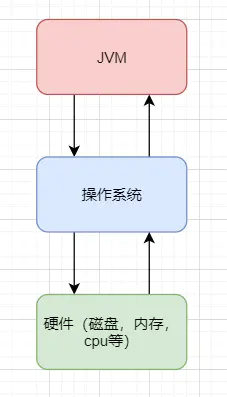

#### Java文件是如何被运行的

比如我们现在写了一个 HelloWorld.java 好了，那这个 HelloWorld.java 抛开所有东西不谈，那是不是就类似于一个文本文件，只是这个文本文件它写的都是英文，而且有一定的缩进而已。

那我们的 **JVM** 是不认识文本文件的，所以它需要一个 **编译** ，让其成为一个它会读二进制文件的 **HelloWorld.class**

##### ① 类加载器

如果 **JVM** 想要执行这个 **.class** 文件，我们需要将其装进一个 **类加载器** 中，它就像一个搬运工一样，会把所有的 **.class** 文件全部搬进JVM里面来。


##### ② 方法区

**方法区** 是用于存放类似于元数据信息方面的数据的，比如类信息，常量，静态变量，编译后代码···等

类加载器将 .class 文件搬过来就是先丢到这一块上

##### ③ 堆

**堆** 主要放了一些存储的数据，比如对象实例，数组···等，它和方法区都同属于 **线程共享区域** 。也就是说它们都是 **线程不安全** 的

##### ④ 栈

**栈** 这是我们的代码运行空间。我们编写的每一个方法都会放到 **栈** 里面运行。

我们会听说过 本地方法栈 或者 本地方法接口 这两个名词，不过我们基本不会涉及这两块的内容，它俩底层是使用C来进行工作的，和Java没有太大的关系。

##### ⑤ 程序计数器

主要就是完成一个加载工作，类似于一个指针一样的，指向下一行我们需要执行的代码。和栈一样，都是 **线程独享** 的，就是说每一个线程都会有自己对应的一块区域而不会存在并发和多线程的问题。
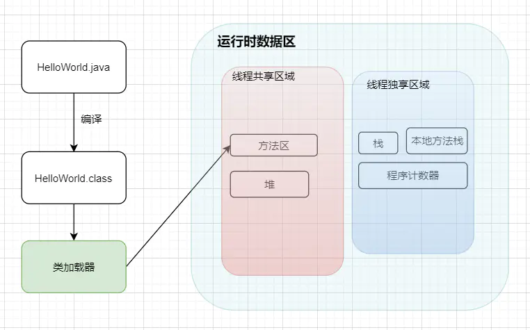

##### 小总结

1. Java文件经过编译后变成 .class 字节码文件
2. 字节码文件通过类加载器被搬运到 JVM 虚拟机中
3. 虚拟机主要的5大块：方法区，堆都为线程共享区域，有线程安全问题，栈和本地方法栈和计数器都是独享区域，不存在线程安全问题，而 JVM 的调优主要就是围绕堆，栈两大块进行

#### 简单的代码例子

一个简单的学生类
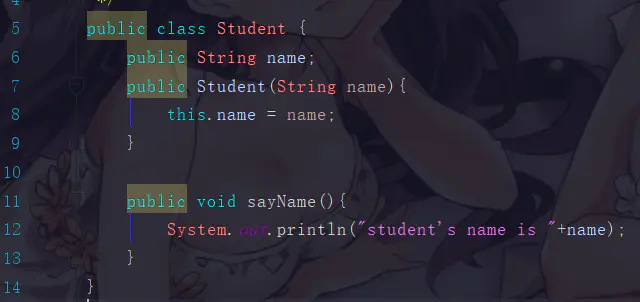

一个main方法
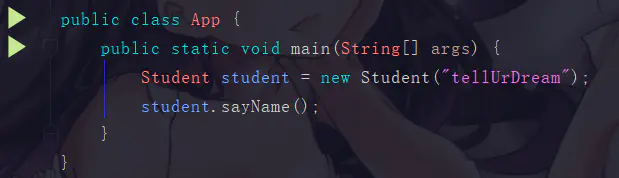

执行main方法的步骤如下:

1. 编译好 App.java 后得到 App.class 后，执行 App.class，系统会启动一个 JVM 进程，从 classpath 路径中找到一个名为 App.class 的二进制文件，将 App 的类信息加载到运行时数据区的方法区内，这个过程叫做 App 类的加载
2. JVM 找到 App 的主程序入口，执行main方法
3. 这个main中的第一条语句为 Student student = new Student("tellUrDream") ，就是让 JVM 创建一个Student对象，但是这个时候方法区中是没有 Student 类的信息的，所以 JVM 马上加载 Student 类，把 Student 类的信息放到方法区中
4. 加载完 Student 类后，JVM 在堆中为一个新的 Student 实例分配内存，然后调用构造函数初始化 Student 实例，这个 Student 实例持有 **指向方法区中的 Student 类的类型信息** 的引用
5. 执行student.sayName();时，JVM 根据 student 的引用找到 student 对象，然后根据 student 对象持有的引用定位到方法区中 student 类的类型信息的方法表，获得 sayName() 的字节码地址。
6. 执行sayName()

其实也不用管太多，只需要知道对象实例初始化时会去方法区中找类信息，完成后再到栈那里去运行方法。找方法就在方法表中找。

### 类加载器的介绍

之前也提到了它是负责加载.class文件的，它们在文件开头会有特定的文件标示，将class文件字节码内容加载到内存中，并将这些内容转换成方法区中的运行时数据结构，并且ClassLoader只负责class文件的加载，而是否能够运行则由 Execution Engine 来决定

#### 类加载器的流程

从类被加载到虚拟机内存中开始，到释放内存总共有7个步骤：加载，验证，准备，解析，初始化，使用，卸载。其中**验证，准备，解析三个部分统称为连接**

##### 加载

1. 将class文件加载到内存
2. 将静态数据结构转化成方法区中运行时的数据结构
3. 在堆中生成一个代表这个类的 java.lang.Class对象作为数据访问的入口

##### 连接

1. 验证：确保加载的类符合 JVM 规范和安全，保证被校验类的方法在运行时不会做出危害虚拟机的事件，其实就是一个安全检查
2. 准备：为static变量在方法区中分配内存空间，设置变量的初始值，例如 static int a = 3 （注意：准备阶段只设置类中的静态变量（方法区中），不包括实例变量（堆内存中），实例变量是对象初始化时赋值的）
3. 解析：虚拟机将常量池内的符号引用替换为直接引用的过程（符号引用比如我现在import java.util.ArrayList这就算符号引用，直接引用就是指针或者对象地址，注意引用对象一定是在内存进行）

##### 初始化

初始化其实就是一个赋值的操作，它会执行一个类构造器的()方法。由编译器自动收集类中所有变量的赋值动作，此时准备阶段时的那个 static int a = 3 的例子，在这个时候就正式赋值为3

##### 卸载

GC将无用对象从内存中卸载

#### 类加载器的加载顺序

加载一个Class类的顺序也是有优先级的，类加载器从最底层开始往上的顺序是这样的

1. BootStrap ClassLoader：rt.jar
2. Extention ClassLoader: 加载扩展的jar包
3. App ClassLoader：指定的classpath下面的jar包
4. Custom ClassLoader：自定义的类加载器

#### 双亲委派机制

当一个类收到了加载请求时，它是不会先自己去尝试加载的，而是委派给父类去完成，比如我现在要new一个Person，这个Person是我们自定义的类，如果我们要加载它，就会先委派App ClassLoader，只有当父类加载器都反馈自己无法完成这个请求（也就是父类加载器都没有找到加载所需的Class）时，子类加载器才会自行尝试加载

这样做的好处是，加载位于rt.jar包中的类时不管是哪个加载器加载，最终都会委托到BootStrap ClassLoader进行加载，这样保证了使用不同的类加载器得到的都是同一个结果。

其实这个也是一个隔离的作用，避免了我们的代码影响了JDK的代码，比如我现在要来一个

```java
public class String(){
    public static void main(){sout;}
}
```

这种时候，我们的代码肯定会报错，因为在加载的时候其实是找到了rt.jar中的String.class，然后发现这也没有main方法

### 运行时数据区

#### 本地方法栈和程序计数器

比如说我们现在点开Thread类的源码，会看到它的start0方法带有一个native关键字修饰，而且不存在方法体，这种用native修饰的方法就是本地方法，这是使用C来实现的，然后一般这些方法都会放到一个叫做本地方法栈的区域。

程序计数器其实就是一个指针，它指向了我们程序中下一句需要执行的指令，它也是内存区域中唯一一个不会出现OutOfMemoryError的区域，而且占用内存空间小到基本可以忽略不计。这个内存仅代表当前线程所执行的字节码的行号指示器，字节码解析器通过改变这个计数器的值选取下一条需要执行的字节码指令。

如果执行的是native方法，那这个指针就不工作了。

#### 方法区

方法区主要的作用技术存放类的元数据信息，常量和静态变量···等。当它存储的信息过大时，会在无法满足内存分配时报错。

#### 虚拟机栈和虚拟机堆

一句话便是：栈管运行，堆管存储。则虚拟机栈负责运行代码，而虚拟机堆负责存储数据。

##### 虚拟机栈的概念

它是Java方法执行的内存模型。里面会对局部变量，动态链表，方法出口，栈的操作（入栈和出栈）进行存储，且线程独享。同时如果我们听到局部变量表，那也是在说虚拟机栈

```java
public class Person{
    int a = 1;

    public void doSomething(){
        int b = 2;
    }
}
```

##### 虚拟机栈存在的异常

如果线程请求的栈的深度大于虚拟机栈的最大深度，就会报 **StackOverflowError** （这种错误经常出现在递归中）。Java虚拟机也可以动态扩展，但随着扩展会不断地申请内存，当无法申请足够内存时就会报错 **OutOfMemoryError**。

##### 虚拟机栈的生命周期

对于栈来说，不存在垃圾回收。只要程序运行结束，栈的空间自然就会释放了。栈的生命周期和所处的线程是一致的。

这里补充一句：8种基本类型的变量+对象的引用变量+实例方法都是在栈里面分配内存。

##### 虚拟机栈的执行

我们经常说的栈帧数据，说白了在JVM中叫栈帧，放到Java中其实就是方法，它也是存放在栈中的。

栈中的数据都是以栈帧的格式存在，它是一个关于方法和运行期数据的数据集。比如我们执行一个方法a，就会对应产生一个栈帧A1，然后A1会被压入栈中。同理方法b会有一个B1，方法c会有一个C1，等到这个线程执行完毕后，栈会先弹出C1，后B1,A1。它是一个先进后出，后进先出原则。

##### 局部变量的复用

局部变量表用于存放方法参数和方法内部所定义的局部变量。它的容量是以Slot为最小单位，一个slot可以存放32位以内的数据类型。

虚拟机通过索引定位的方式使用局部变量表，范围为[0,局部变量表的slot的数量]。方法中的参数就会按一定顺序排列在这个局部变量表中，至于怎么排的我们可以先不关心。而为了节省栈帧空间，这些slot是可以复用的，当方法执行位置超过了某个变量，那么这个变量的slot可以被其它变量复用。当然如果需要复用，那我们的垃圾回收自然就不会去动这些内存。

##### 虚拟机堆的概念

JVM内存会划分为堆内存和非堆内存，堆内存中也会划分为**年轻代**和**老年代**，而非堆内存则为**永久代**。年轻代又会分为**Eden**和**Survivor**区。Survivor也会分为**FromPlace**和**ToPlace**，toPlace的survivor区域是空的。Eden，FromPlace和ToPlace的默认占比为 **8:1:1**。当然这个东西其实也可以通过一个 -XX:+UsePSAdaptiveSurvivorSizePolicy 参数来根据生成对象的速率动态调整

堆内存中存放的是对象，垃圾收集就是收集这些对象然后交给GC算法进行回收。非堆内存其实我们已经说过了，就是方法区。在1.8中已经移除永久代，替代品是一个元空间(MetaSpace)，最大区别是metaSpace是不存在于JVM中的，它使用的是本地内存。并有两个参数

```
MetaspaceSize：初始化元空间大小，控制发生GC
MaxMetaspaceSize：限制元空间大小上限，防止占用过多物理内存。
```

移除的原因可以大致了解一下：融合HotSpot JVM和JRockit VM而做出的改变，因为JRockit是没有永久代的，不过这也间接性地解决了永久代的OOM问题。

##### Eden年轻代的介绍

当我们new一个对象后，会先放到Eden划分出来的一块作为存储空间的内存，但是我们知道对堆内存是线程共享的，所以有可能会出现两个对象共用一个内存的情况。这里JVM的处理是每个线程都会预先申请好一块连续的内存空间并规定了对象存放的位置，而如果空间不足会再申请多块内存空间。这个操作我们会称作TLAB，有兴趣可以了解一下。

当Eden空间满了之后，会触发一个叫做Minor GC（就是一个发生在年轻代的GC）的操作，存活下来的对象移动到Survivor0区。Survivor0区满后触发 Minor GC，就会将存活对象移动到Survivor1区，此时还会把from和to两个指针交换，这样保证了一段时间内总有一个survivor区为空且to所指向的survivor区为空。经过多次的 Minor GC后仍然存活的对象（**这里的存活判断是15次，对应到虚拟机参数为 -XX:MaxTenuringThreshold 。为什么是15，因为HotSpot会在对象投中的标记字段里记录年龄，分配到的空间仅有4位，所以最多只能记录到15**）会移动到老年代。老年代是存储长期存活的对象的，占满时就会触发我们最常听说的Full GC，期间会停止所有线程等待GC的完成。所以对于响应要求高的应用应该尽量去减少发生Full GC从而避免响应超时的问题。

而且当老年区执行了full gc之后仍然无法进行对象保存的操作，就会产生OOM，这时候就是虚拟机中的堆内存不足，原因可能会是堆内存设置的大小过小，这个可以通过参数-Xms、-Xmx来调整。也可能是代码中创建的对象大且多，而且它们一直在被引用从而长时间垃圾收集无法收集它们。
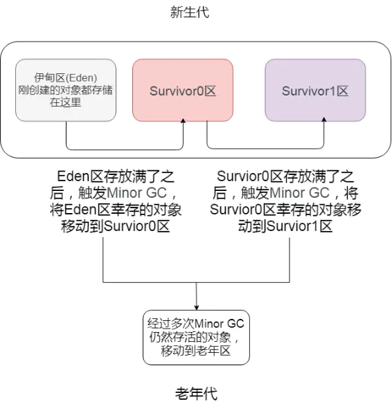

##### 如何判断一个对象需要被干掉

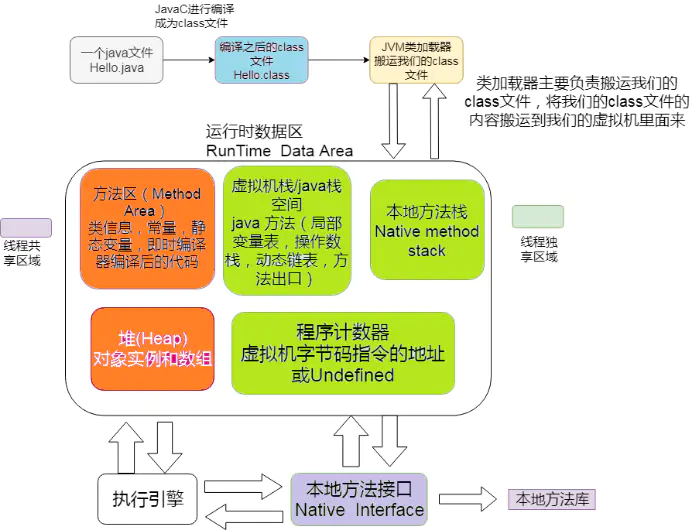

图中程序计数器、虚拟机栈、本地方法栈，3个区域随着线程的生存而生存的。内存分配和回收都是确定的。随着线程的结束内存自然就被回收了，因此不需要考虑垃圾回收的问题。而Java堆和方法区则不一样，各线程共享，内存的分配和回收都是动态的。因此垃圾收集器所关注的都是堆和方法这部分内存。

在进行回收前就要判断哪些对象还存活，哪些已经死去。下面介绍两个基础的计算方法

1.引用计数器计算：给对象添加一个引用计数器，每次引用这个对象时计数器加一，引用失效时减一，计数器等于0时就是不会再次使用的。不过这个方法有一种情况就是出现对象的循环引用时GC没法回收。

2.可达性分析计算：这是一种类似于二叉树的实现，将一系列的GC ROOTS作为起始的存活对象集，从这个节点往下搜索，搜索所走过的路径成为引用链，把能被该集合引用到的对象加入到集合中。搜索当一个对象到GC Roots没有使用任何引用链时，则说明该对象是不可用的。主流的商用程序语言，例如Java，C#等都是靠这招去判定对象是否存活的。

（了解一下即可）在Java语言汇总能作为GC Roots的对象分为以下几种：

1. 虚拟机栈（栈帧中的本地方法表）中引用的对象（局部变量）
2. 方法区中静态变量所引用的对象（静态变量）
3. 方法区中常量引用的对象
4. 本地方法栈（即native修饰的方法）中JNI引用的对象（JNI是Java虚拟机调用对应的C函数的方式，通过JNI函数也可以创建新的Java对象。且JNI对于对象的局部引用或者全局引用都会把它们指向的对象都标记为不可回收）
5. 已启动的且未终止的Java线程

这种方法的优点是能够解决循环引用的问题，可它的实现需要耗费大量资源和时间，也需要GC（它的分析过程引用关系不能发生变化，所以需要停止所有进程）

##### 如何宣告一个对象的真正死亡

首先必须要提到的是一个名叫 **finalize()** 的方法

finalize()是Object类的一个方法、一个对象的finalize()方法只会被系统自动调用一次，经过finalize()方法逃脱死亡的对象，第二次不会再调用。

补充一句：并不提倡在程序中调用finalize()来进行自救。建议忘掉Java程序中该方法的存在。因为它执行的时间不确定，甚至是否被执行也不确定（Java程序的不正常退出），而且运行代价高昂，无法保证各个对象的调用顺序（甚至有不同线程中调用）。在Java9中已经被标记为 **deprecated** ，且java.lang.ref.Cleaner（也就是强、软、弱、幻象引用的那一套）中已经逐步替换掉它，会比finalize来的更加的轻量及可靠。

判断一个对象的死亡至少需要两次标记

1. 如果对象进行可达性分析之后没发现与GC Roots相连的引用链，那它将会第一次标记并且进行一次筛选。判断的条件是决定这个对象是否有必要执行finalize()方法。如果对象有必要执行finalize()方法，则被放入F-Queue队列中。
2. GC对F-Queue队列中的对象进行二次标记。如果对象在finalize()方法中重新与引用链上的任何一个对象建立了关联，那么二次标记时则会将它移出“即将回收”集合。如果此时对象还没成功逃脱，那么只能被回收了。

如果确定对象已经死亡，我们又该如何回收这些垃圾呢

#### 垃圾回收算法

不会非常详细的展开，常用的有标记清除，复制，标记整理和分代收集算法

##### 标记清除算法

标记清除算法就是分为“标记”和“清除”两个阶段。标记出所有需要回收的对象，标记结束后统一回收。这个套路很简单，也存在不足，后续的算法都是根据这个基础来加以改进的。

其实它就是把已死亡的对象标记为空闲内存，然后记录在一个空闲列表中，当我们需要new一个对象时，内存管理模块会从空闲列表中寻找空闲的内存来分给新的对象。

不足的方面就是标记和清除的效率比较低下。且这种做法会让内存中的碎片非常多。这个导致了如果我们需要使用到较大的内存块时，无法分配到足够的连续内存。比如下图
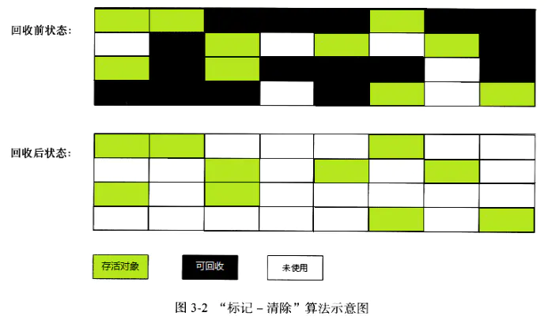

此时可使用的内存块都是零零散散的，导致了刚刚提到的大内存对象问题

##### 复制算法

为了解决效率问题，复制算法就出现了。它将可用内存按容量划分成两等分，每次只使用其中的一块。和survivor一样也是用from和to两个指针这样的玩法。fromPlace存满了，就把存活的对象copy到另一块toPlace上，然后交换指针的内容。这样就解决了碎片的问题。

这个算法的代价就是把内存缩水了，这样堆内存的使用效率就会变得十分低下了
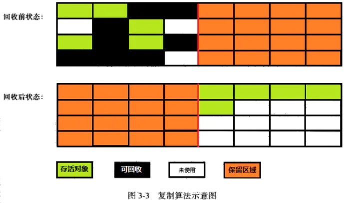

不过它们分配的时候也不是按照1:1这样进行分配的，就类似于Eden和Survivor也不是等价分配是一个道理。

##### 标记整理算法

复制算法在对象存活率高的时候会有一定的效率问题，标记过程仍然与“标记-清除”算法一样，但后续步骤不是直接对可回收对象进行清理，而是让所有存活的对象都向一端移动，然后直接清理掉边界以外的内存
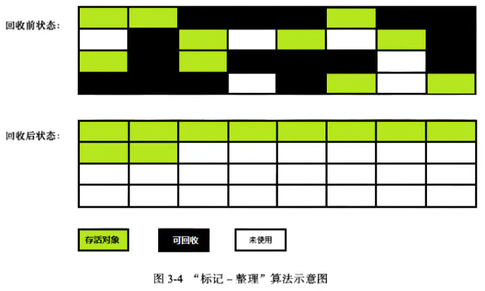

##### 分代收集算法

这种算法并没有什么新的思想，只是根据对象存活周期的不同将内存划分为几块。一般是把Java堆分为新生代和老年代，这样就可以根据各个年代的特点采用最适当的收集算法。在新生代中，每次垃圾收集时都发现有大批对象死去，只有少量存活，那就选用复制算法，只需要付出少量存活对象的复制成本就可以完成收集。而老年代中因为对象存活率高、没有额外空间对它进行分配担保，就必须使用“标记-清理”或者“标记-整理”算法来进行回收。

说白了就是八仙过海各显神通，具体问题具体分析了而已。

#### 各种各样的垃圾回收器

HotSpot VM中的垃圾回收器，以及适用场景
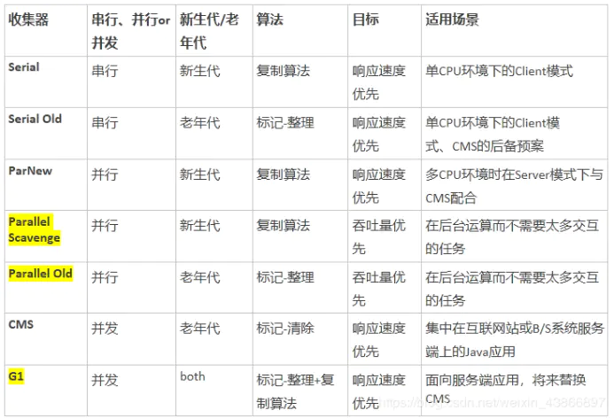

到jdk8为止，默认的垃圾收集器是Parallel Scavenge 和 Parallel Old

从jdk9开始，G1收集器成为默认的垃圾收集器
目前来看，G1回收器停顿时间最短而且没有明显缺点，非常适合Web应用。在jdk8中测试Web应用，堆内存6G，新生代4.5G的情况下，Parallel Scavenge 回收新生代停顿长达1.5秒。G1回收器回收同样大小的新生代只停顿0.2秒。

#### JVM的常用参数

JVM的参数非常之多，这里只列举比较重要的几个，通过各种各样的搜索引擎也可以得知这些信息。

| 参数名称                   | 含义                                                       | 默认值               | 说明                                                         |
| -------------------------- | ---------------------------------------------------------- | -------------------- | ------------------------------------------------------------ |
| -Xms                       | 初始堆大小                                                 | 物理内存的1/64(<1GB) | 默认(MinHeapFreeRatio参数可以调整)空余堆内存小于40%时，JVM就会增大堆直到-Xmx的最大限制. |
| -Xmx                       | 最大堆大小                                                 | 物理内存的1/4(<1GB)  | 默认(MaxHeapFreeRatio参数可以调整)空余堆内存大于70%时，JVM会减少堆直到 -Xms的最小限制 |
| -Xmn                       | 年轻代大小(1.4or lator)                                    |                      | 注意：此处的大小是（eden+ 2 survivor space).与jmap -heap中显示的New gen是不同的。整个堆大小=年轻代大小 + 老年代大小 + 持久代（永久代）大小.增大年轻代后,将会减小年老代大小.此值对系统性能影响较大,Sun官方推荐配置为整个堆的3/8 |
| -XX:NewSize                | 设置年轻代大小(for 1.3/1.4)                                |                      |                                                              |
| -XX:MaxNewSize             | 年轻代最大值(for 1.3/1.4)                                  |                      |                                                              |
| -XX:PermSize               | 设置持久代(perm gen)初始值                                 | 物理内存的1/64       |                                                              |
| -XX:MaxPermSize            | 设置持久代最大值                                           | 物理内存的1/4        |                                                              |
| -Xss                       | 每个线程的堆栈大小                                         |                      | JDK5.0以后每个线程堆栈大小为1M,以前每个线程堆栈大小为256K.更具应用的线程所需内存大小进行 调整.在相同物理内存下,减小这个值能生成更多的线程.但是操作系统对一个进程内的线程数还是有限制的,不能无限生成,经验值在3000~5000左右一般小的应用， 如果栈不是很深， 应该是128k够用的 大的应用建议使用256k。这个选项对性能影响比较大，需要严格的测试。（校长）和threadstacksize选项解释很类似,官方文档似乎没有解释,在论坛中有这样一句话:-Xss is translated in a VM flag named ThreadStackSize”一般设置这个值就可以了 |
| -XX:NewRatio               | 年轻代(包括Eden和两个Survivor区)与年老代的比值(除去持久代) |                      | -XX:NewRatio=4表示年轻代与年老代所占比值为1:4,年轻代占整个堆栈的1/5Xms=Xmx并且设置了Xmn的情况下，该参数不需要进行设置。 |
| -XX:SurvivorRatio          | Eden区与Survivor区的大小比值                               |                      | 设置为8,则两个Survivor区与一个Eden区的比值为2:8,一个Survivor区占整个年轻代的1/10 |
| -XX:+DisableExplicitGC     | 关闭System.gc()                                            |                      | 这个参数需要严格的测试                                       |
| -XX:PretenureSizeThreshold | 对象超过多大是直接在旧生代分配                             | 0                    | 单位字节 新生代采用Parallel ScavengeGC时无效另一种直接在旧生代分配的情况是大的数组对象,且数组中无外部引用对象. |
| -XX:ParallelGCThreads      | 并行收集器的线程数                                         |                      | 此值最好配置与处理器数目相等 同样适用于CMS                   |
| -XX:MaxGCPauseMillis       | 每次年轻代垃圾回收的最长时间(最大暂停时间)                 |                      | 如果无法满足此时间,JVM会自动调整年轻代大小,以满足此值.       |

其实还有一些打印及CMS方面的参数，这里就不以一一列举了

### 关于JVM调优的一些方面

根据刚刚涉及的jvm的知识点，我们可以尝试对JVM进行调优，主要就是堆内存那块

所有线程共享数据区大小=新生代大小 + 年老代大小 + 持久代大小。持久代一般固定大小为64m。所以java堆中增大年轻代后，将会减小年老代大小（因为老年代的清理是使用fullgc，所以老年代过小的话反而是会增多fullgc的）。此值对系统性能影响较大，Sun官方推荐配置为java堆的3/8。

#### 调整最大堆内存和最小堆内存

-Xmx –Xms：指定java堆最大值（默认值是物理内存的1/4(<1GB)）和初始java堆最小值（默认值是物理内存的1/64(<1GB))

默认(MinHeapFreeRatio参数可以调整)空余堆内存小于40%时，JVM就会增大堆直到-Xmx的最大限制.，默认(MaxHeapFreeRatio参数可以调整)空余堆内存大于70%时，JVM会减少堆直到 -Xms的最小限制。简单点来说，你不停地往堆内存里面丢数据，等它剩余大小小于40%了，JVM就会动态申请内存空间不过会小于-Xmx，如果剩余大小大于70%，又会动态缩小不过不会小于–Xms。就这么简单

开发过程中，通常会将 -Xms 与 -Xmx两个参数的配置相同的值，其目的是为了能够在java垃圾回收机制清理完堆区后不需要重新分隔计算堆区的大小而浪费资源。

我们执行下面的代码

```java
System.out.println("Xmx=" + Runtime.getRuntime().maxMemory() / 1024.0 / 1024 + "M");    //系统的最大空间
System.out.println("free mem=" + Runtime.getRuntime().freeMemory() / 1024.0 / 1024 + "M");  //系统的空闲空间
System.out.println("total mem=" + Runtime.getRuntime().totalMemory() / 1024.0 / 1024 + "M");  //当前可用的总空间
```

注意：此处设置的是Java堆大小，也就是新生代大小 + 老年代大小
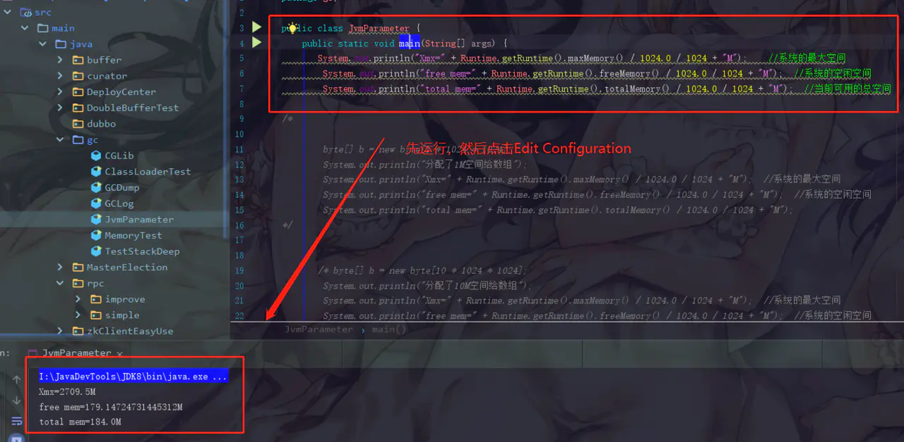

设置一个VM options的参数

```
-Xmx20m -Xms5m -XX:+PrintGCDetails
```

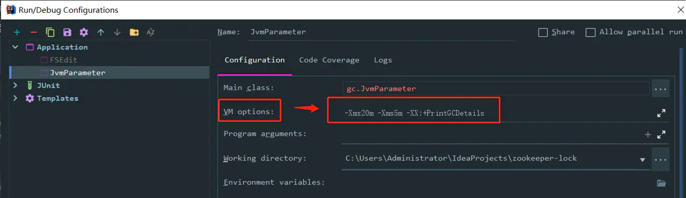

再次启动main方法
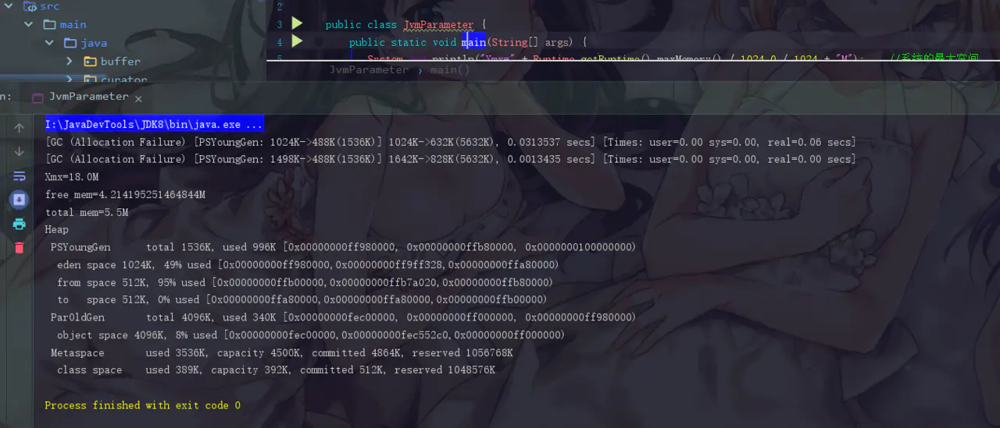

这里GC弹出了一个Allocation Failure分配失败，这个事情发生在PSYoungGen，也就是年轻代中

这时候申请到的内存为18M，空闲内存为4.214195251464844M

我们此时创建一个字节数组看看，执行下面的代码

```java
byte[] b = new byte[1 * 1024 * 1024];System.out.println("分配了1M空间给数组");
System.out.println("Xmx=" + Runtime.getRuntime().maxMemory() / 1024.0 / 1024 + "M");  //系统的最大空间
System.out.println("free mem=" + Runtime.getRuntime().freeMemory() / 1024.0 / 1024 + "M");  //系统的空闲空间
System.out.println("total mem=" + Runtime.getRuntime().totalMemory() / 1024.0 / 1024 + "M");
```

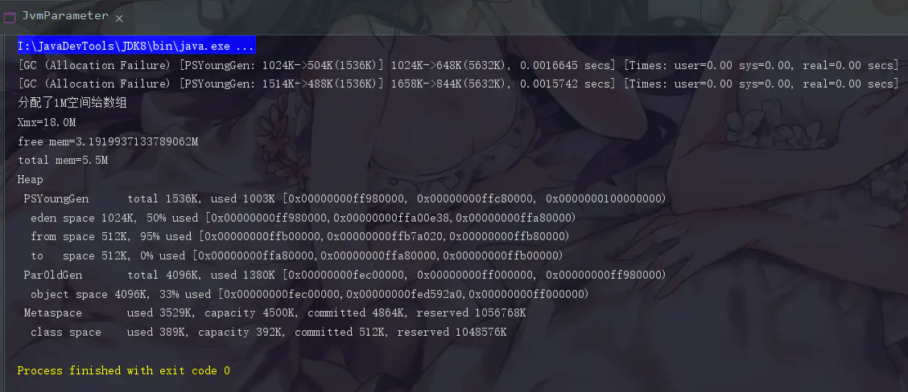

此时free memory就又缩水了，不过total memory是没有变化的。Java会尽可能将total mem的值维持在最小堆内存大小

```java
byte[] b = new byte[10 * 1024 * 1024];System.out.println("分配了10M空间给数组");
System.out.println("Xmx=" + Runtime.getRuntime().maxMemory() / 1024.0 / 1024 + "M");  //系统的最大空间
System.out.println("free mem=" + Runtime.getRuntime().freeMemory() / 1024.0 / 1024 + "M");  //系统的空闲空间
System.out.println("total mem=" + Runtime.getRuntime().totalMemory() / 1024.0 / 1024 + "M");  //当前可用的总空间
```

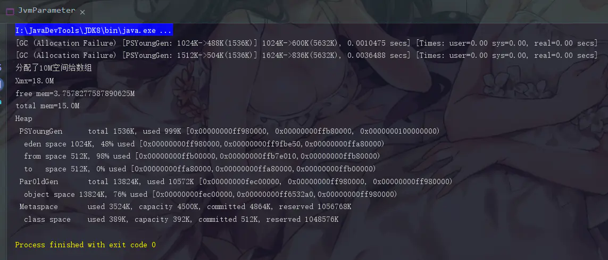

这时候我们创建了一个10M的字节数据，这时候最小堆内存是顶不住的。我们会发现现在的total memory已经变成了15M，这就是已经申请了一次内存的结果。

此时我们再跑一下这个代码

```java
System.gc();
System.out.println("Xmx=" + Runtime.getRuntime().maxMemory() / 1024.0 / 1024 + "M");    //系统的最大空间
System.out.println("free mem=" + Runtime.getRuntime().freeMemory() / 1024.0 / 1024 + "M");  //系统的空闲空间
System.out.println("total mem=" + Runtime.getRuntime().totalMemory() / 1024.0 / 1024 + "M");  //当前可用的总空间
```

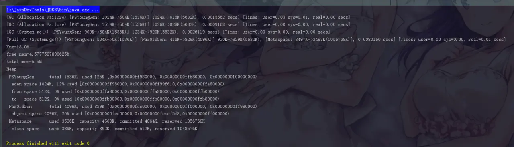

此时我们手动执行了一次fullgc，此时total memory的内存空间又变回5.5M了，此时又是把申请的内存释放掉的结果。

#### 调整新生代和老年代的比值

-XX:NewRatio --- 新生代（eden+2*Survivor）和老年代（不包含永久区）的比值

例如：-XX:NewRatio=4，表示新生代:老年代=1:4，即新生代占整个堆的1/5。在Xms=Xmx并且设置了Xmn的情况下，该参数不需要进行设置。

#### 调整Survivor区和Eden区的比值

-XX:SurvivorRatio（幸存代）--- 设置两个Survivor区和eden的比值

例如：8，表示两个Survivor:eden=2:8，即一个Survivor占年轻代的1/10

#### 设置年轻代和老年代的大小

-XX:NewSize --- 设置年轻代大小

-XX:MaxNewSize --- 设置年轻代最大值

可以通过设置不同参数来测试不同的情况，反正最优解当然就是官方的Eden和Survivor的占比为8:1:1，然后在刚刚介绍这些参数的时候都已经附带了一些说明，感兴趣的也可以看看。反正最大堆内存和最小堆内存如果数值不同会导致多次的gc，需要注意。

#### 小总结

根据实际事情调整新生代和幸存代的大小，官方推荐新生代占java堆的3/8，幸存代占新生代的1/10

在OOM时，记得Dump出堆，确保可以排查现场问题，通过下面命令你可以输出一个.dump文件，这个文件可以使用VisualVM或者Java自带的Java VisualVM工具。

```
-Xmx20m -Xms5m -XX:+HeapDumpOnOutOfMemoryError -XX:HeapDumpPath=你要输出的日志路径
```

一般我们也可以通过编写脚本的方式来让OOM出现时给我们报个信，可以通过发送邮件或者重启程序等来解决。

#### 永久区的设置

```
-XX:PermSize -XX:MaxPermSize
```

初始空间（默认为物理内存的1/64）和最大空间（默认为物理内存的1/4）。也就是说，jvm启动时，永久区一开始就占用了PermSize大小的空间，如果空间还不够，可以继续扩展，但是不能超过MaxPermSize，否则会OOM。

tips：如果堆空间没有用完也抛出了OOM，有可能是永久区导致的。堆空间实际占用非常少，但是永久区溢出 一样抛出OOM。

#### JVM的栈参数调优

##### 调整每个线程栈空间的大小

可以通过-Xss：调整每个线程栈空间的大小

JDK5.0以后每个线程堆栈大小为1M，以前每个线程堆栈大小为256K。在相同物理内存下,减小这个值能生成更多的线程。但是操作系统对一个进程内的线程数还是有限制的，不能无限生成，经验值在3000~5000左右

##### 设置线程栈的大小

```
-XXThreadStackSize：    设置线程栈的大小(0 means use default stack size)
```

这些参数都是可以通过自己编写程序去简单测试的，这里碍于篇幅问题就不再提供demo了

#### JVM其他参数介绍

形形色色的参数很多，就不会说把所有都扯个遍了，因为大家其实也不会说一定要去深究到底。

##### 设置内存页的大小

```
-XXThreadStackSize：    设置内存页的大小，不可设置过大，会影响Perm的大小复制代码
```

##### 设置原始类型的快速优化

```
-XX:+UseFastAccessorMethods：    设置原始类型的快速优化
```

##### 设置关闭手动GC

```
-XX:+DisableExplicitGC：    设置关闭System.gc()(这个参数需要严格的测试)
```

##### 设置垃圾最大年龄

```
-XX:MaxTenuringThreshold
    设置垃圾最大年龄。如果设置为0的话,则年轻代对象不经过Survivor区,直接进入年老代.
    对于年老代比较多的应用,可以提高效率。如果将此值设置为一个较大值,
    则年轻代对象会在Survivor区进行多次复制,这样可以增加对象再年轻代的存活时间,
    增加在年轻代即被回收的概率。该参数只有在串行GC时才有效.
```

##### 加快编译速度

```
-XX:+AggressiveOpts
```

加快编译速度

##### 改善锁机制性能

```
-XX:+UseBiasedLocking
```

##### 禁用垃圾回收

```
-Xnoclassgc
```

##### 设置堆空间存活时间

```
-XX:SoftRefLRUPolicyMSPerMB    设置每兆堆空闲空间中SoftReference的存活时间，默认值是1s。
```

##### 设置对象直接分配在老年代

```
-XX:PretenureSizeThreshold    设置对象超过多大时直接在老年代分配，默认值是0。
```

##### 设置TLAB占eden区的比例

```
-XX:TLABWasteTargetPercent    设置TLAB占eden区的百分比，默认值是1% 。
```

##### 设置是否优先YGC

```
-XX:+CollectGen0First    设置FullGC时是否先YGC，默认值是false。
```
