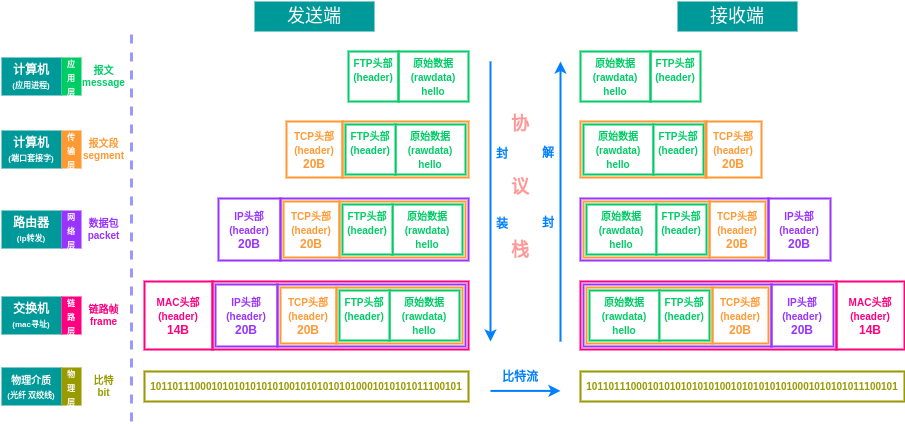
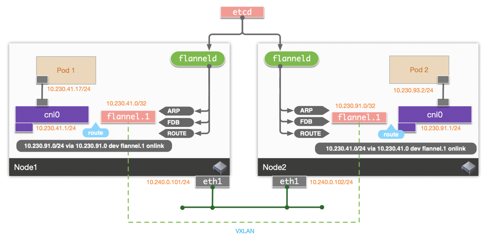
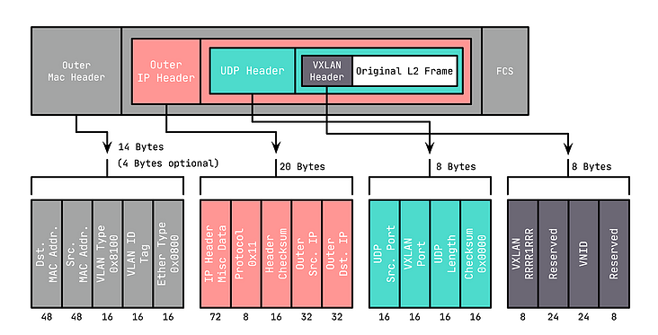
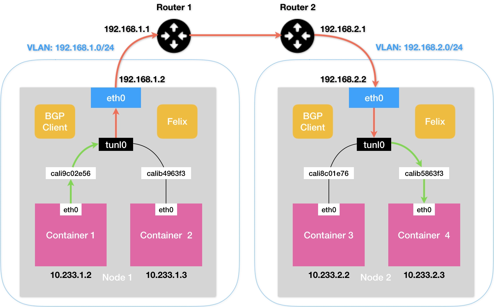
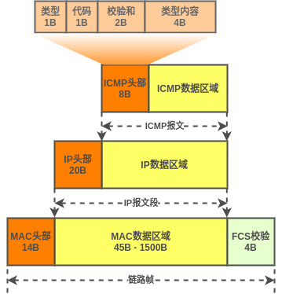
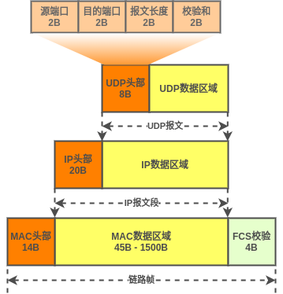

# Kubernetes网络MTU测试报告

 ## 概述

Kubernetes集群容器网络是以网络插件(主流基于CNI标准)的方式实现的, 各网络插件实现跨主机Pod通信的方式多种多样, 主要分为Underlay和Overlay两种, 前者的代表为Flannel插件的host-gw模式和Calico插件的bgp模式, 后者主要有Flannel插件的vxlan模式, Calico插件的ipip模式以及Weave插件的sleeve和fastpath模式.

Underlay网络是现实的物理基础层网络架构, 而Overlay网络则是基于物理网络之上构建的逻辑网络, Overlay网络中传输的数据包在物理基础网络协议栈的基础上作了额外的封装, 占用额外的字节. 因此同样的包大小能携带的数据量(Payload)会更小, 不同网络插件的网络模式所占用的额外字节数也不同, 如果不能根据实际网络模式配置每个包携带数据量的上限, 将可能导致数据包在传输过程中被丢弃, 网络通信失败.

## 网络基础

### 网络模型

互联网的实现, 逻辑上分成好几层, 每一层都有自己的特定功能并提供抽象良好的接口, 这种层级关系构成网络互联的标准框架. 工业上将其分为四层, 称为TCP/IP模型, 国际标准化组织进一步细化为七层, 称为OSI模型, 通常为了便于理解, 结合两种模型也有五层模型的说法, 即**应用层, 传输层, 网络层, 链路层和物理层**.

数据通过以太网从一个端点发送到另一个端点的过程简单来说分为三个阶段:

- 发送端封装: 数据在发送端应用程序产生后由协议栈经过层层封装, 形成最终的比特串等待通过物理网络设备发送
- 比特流传输: 数据比特串在发送端网络设备通过传输介质(光纤,双绞线,电磁波)传输到接收端网络设备
- 接收端解封: 数据到达接收端网络设备后经过接收端协议栈层层解封, 最终传递到相应的应用程序




发送端和接收端均需支持完整的互联网协议栈, 除物理层外, 每层协议封装时都会**以上层数据为Payload(或Data)**并在此基础上添加一个该层协议的协议头, 最终以比特流的形式通过物理介质进行传输. 常用协议所在层及其协议头长度如下:

| 协议层 | 协议   | 描述               | 头部字节 |
| ------ | ------ | ------------------ | -------- |
| 应用层 | HTTP   | 超文本传输协议     | -        |
| 应用层 | FTP    | 文件传输协议       | -        |
| 应用层 | SMTP   | 简单邮件传输协议   | -        |
| 应用层 | DHCP   | 动态主机配置协议   | -        |
| 应用层 | RIP    | 路由信息协议       | -        |
| 应用层 | NFS    | 网络文件系统协议   | -        |
| 应用层 | DNS    | 域名解析协议       | -        |
| 应用层 | TELNET | 远程终端协议       | -        |
| 应用层 | SNMP   | 简单网络管理协议   | -        |
| 传输层 | TCP    | 传输控制协议       | 20       |
| 传输层 | UDP    | 用户数据报协议     | 8        |
| 网络层 | IP     | 网际互联协议       | 20       |
| 网络层 | ICMP   | 互联网控制信息协议 | 8        |
| 网络层 | IGMP   | 互联网组管理协议   | 8        |
| 网络层 | ARP    | 地址解析协议       | 28       |
| 链路层 | MAC    | 多路访问控制       | 14       |

> 表格采用五层模型, ARP协议在ISO七层模型中属于链路层
>
> 应用层协议头部长度通常是不固定的
>
> ICMP和IGMP协议需要经IP协议进一步封装才能达到链路层
>
> ARP协议无需经IP协议封装, 其头部会携带源目的IP, 源目的MAC, 但达到链路层后仍需MAC协议封装

### MTU和MSS

#### MTU

以太网(Ethernet)是最流行的局域网通信技术标准, 是当今互联网的基石, 在以太网标准中, **链路层帧的最大长度是1518字节, 其中帧头部占用14字节, 帧尾CRC校验(FCS)占用4字节, 剩下的承载上层协议的地方也就是Payload最大就只剩1500字节.这个值就称为MTU**. MTU的全称是maximum transmission unit(最大传输单元), MTU可以认为是网络层能够传输的最大IP包. 

**IP协议发现其上层传递来的数据超过MTU大小时, 将对数据进行分片(fragment)**, 每个分片均单独封装IP头部并通过头部的同id不同fragment offset两个字段关联起来. 分片后只有第一个分片会在IP层Payload中包含上层头部(如tcp, udp, icmp头部).

每一个网络接口(通常是网卡)都会被设置一个MTU值, 通常是默认的1500字节, 该值可以通过查看网络接口属性的命令查看(如`ip addr`或者`ifconfig`). 当同一个网络上的两台主机互相进行通信时, 如需通过多个网络, 则每个网络的链路层可能有不同的MTU, **整个传输路径中所有网络接口的最小MTU称为PMTU(路径MTU)**. 不同的路由路径选择会影响PMTU值, 一旦链路帧所携带的Data的大小大于任何途经网络设备的MTU值, 则该帧被该设备解封为IP数据包的时候会被重新分片, 将额外耗费性能和带宽. 

网络设备通常支持链路的PMTU发现机制, 该机制是利用**将IP数据包头部的DF位置为1声明不允许分片**, 一旦路径上某个设备MTU小于该IP包大小, 则丢弃该包并回传一个携带了自身MTU值的ICMP错误给其发送端, 发送端将据此MTU重新计算并重传. Linux上PMTU发现机制是默认开启的, 关闭方式为`echo 1 > /proc/sys/net/ipv4/ip_no_pmtu_disc`.

#### MSS

**MSS即Maximum Segment Size, 是传输层TCP协议的概念, 是TCP协议提交给IP层最大分段的大小, 不包含TCP Header, 只包含TCP Payload , MSS是TCP用来限制应用层最大的发送字节数**, 与IP协议的分片类似, **TCP协议在上层传递下来的数据大于MSS值时会对报文作分段(segment)**. 在TCP三次握手过程中, 双方会在**发送SYN报文的阶段通过TCP首部的Option字段携带自身的MSS值**以便双方发送数据时合理设置每个TCP报文段携带的Payload的大小. **UDP协议不会对报文作分段处理**, 因此不存在MSS的概念.

MSS值是通过MTU计算得到的, 按照协议栈的分层关系可知, **MSS = MTU - 20(IP头部) - 20(TCP头部)**. MTU值则是在网络接口上直接设置的. 

基于以上描述, 对于一个以太网帧, MTU和MSS的关联和区别如下:


**TCP协议基于MSS对报文进行分段, IP协议基于MTU对报文段进行分片**.

在IP协议支持分片的情况下, TCP协议还要进行报文分段的原因在于TCP是通过失败重传机制实现可靠传输的, 一旦发生传输错误TCP进行重传, 如果不作分段, 则每次将重传完整报文, 重传量大且可能需要IP协议再次分片, 但如果TCP协议根据MSS进行分段后, 则重传时仅需传输出错的分段, IP层也不需要再作分片.

## Overlay网络

Kubernetes众多的网络插件中, Underlay模式由于不存在额外的网络封装, 其MTU和MSS通常保持默认值(1500和1460), 但Overlay模式则因封装方式的不同, 均会额外占用一定的字节数, 为了保证从容器中发出经宿主机虚拟网卡封装后的链路帧不超过宿主机出口网卡的MTU限制, 需相应调整容器内虚拟网卡的MTU值.

Kubernetes集群中容器创建时会自动调用网络插件为容器和宿主机上该容器的veth pair创建虚拟网卡并设置网卡的IP地址, MTU, Mac地址等相关属性, 其中MTU的配置位于网络插件的配置文件中.

### Flannel-VXLAN

Flannel网络插件的vxlan模式是典型的Overlay网络, 大致架构如下:



Pod 1访问Pod 2时, 从Pod 1中发出的链路层帧经其网关cni0解封为IP层数据包后根据路由规则再次封包为链路层帧直接路由到宿主机的flannel.1虚拟网卡上, 此虚拟网卡在原链路层帧的基础上进行vxlan封装, 将其封装为携带vxlan头部的UDP数据报后继续封装为完整的链路层帧, 由宿主机网卡eth1发往目的节点, 由目的节点flannel.1进行解封后路由到Pod2中.

经vxlan封装后的完整链路层帧结构如下:



可以看到, 相比原始的链路层帧, 封装后的链路层帧多了一个VXLAN头部, 一个UDP头部, 一个IP头部和一个Mac头部, 加起来一共多了50个字节.

因此对于容器内虚拟网卡而言, 为了保证封装后的帧不超过默认MTU 1500字节, 容器内发出的原始帧应当限制在1500-50=1450字节, 即容器虚拟网卡的MTU应设置为1450字节, 相应的, 容器内发出TCP报文段的MSS为1450-40=1410字节. 

### Calico-IPIP

Calico网络插件的ipip模式也是一种常见的Overlay网络, 与vxlan网络不同的是, ipip模式是一种IP隧道, 它将一个IP数据包封装在另一个IP数据包中, 被封装的并不是一个完整的链路层帧.



Container 1 访问Container4时, 从Container 1中发出的链路层帧经其网关cali9c02e56(其实是代答)解封为IP层数据包后根据路由规则再次封包为链路层帧直接路由到宿主机的tunl0虚拟网卡上, 此虚拟网卡将原链路层帧解封为IP数据包后进行ipip封装, 在此IP数据包的基础上封装外层IP和MAC头部, 由宿主机网卡eth0发往目的节点, 由目的节点tunl0进行解封后路由到Container 4中.

经ipip封装后的完整链路层帧结构如下:


可见相比原始的链路层帧, 封装后的链路层帧仅多了一个IP头部, 即20字节.

因此对于容器内虚拟网卡而言, 为了保证封装后的帧不超过默认MTU 1500字节, 容器内发出的原始帧应当限制在1500-20=1480字节, 即容器虚拟网卡的MTU应设置为1480字节, 相应的, 容器内发出TCP报文段的MSS为1480-40=1440字节. 

## 测试

当前金山kubernetes集群采用canal网络, 为flannel和calico网络的结合, 跨主机通信仍然是利用flannel网络的vxlan封装实现的, calico接管的是容器和宿主机的通信. 容器内虚拟网卡和宿主机上的veth pair网卡的MTU均为1450.

开阳kubernetes集群采用calico网络的ipip模式, 正常来说容器内虚拟网卡和宿主机上的veth pair网卡的MTU应该配置为1480, 但实际上他们设置为了1440.

现在需要确认金山kubernetes集群中的pod和开阳kubernetes集群中的pod互相通信时, 是否会出现通信失败(即数据包丢失)的情况, 是否需要调整开阳kubernetes集群calico网络的MTU默认值.

### ICMP

我们将通过ping命令发送ICMP包测试连通性, ICMP是网络层协议, 其报文结构为:



ICMP报文不包括传输层内容(不与具体进程关联), 除链路层帧外, ICMP和IP协议头部一共占用20 + 8 = 28字节, 一个ICMP报文的数据区域内容最大值Data = MTU - IPHeader - ICMPHeader, 即1472字节(MTU取标准值1500).

### UDP

对于kubernetes集群外部对集群内容器的访问, 需要通过端口映射和转发实现, 因此此种情况的连通性测试需要利用传输层协议完成, 这里采用UDP数据报协议, 其报文结构为:



UDP数据报封装在IP数据包中, 其头部也是8字节, 因此一个UDP数据报的数据区域内容最大值Data = MTU - IPHeader - UDPHeader, 即1472字节(MTU取标准值1500).

### 工具

`ip`命令可以查看和修改网卡接口的MTU值. 具体命令为:

```sh
ip a         # 查看网卡信息
ip r         # 查看路由信息
ip link set <dev> mtu 1450   # 设置网卡mtu值
```

`ping`命令可指定发送ICMP报文的数据区域大小, 并可指定IP数据包头部的DF位从而不允许数据包分片. 具体命令为:

```sh
ping -M do -c 1 -s 1472 <remote-ip> # -M 限制分片 -s 指定数据区域大小(不包括头部)
```

`tracepath`命令可以探测到网络路径上PMTU的大小. 具体命令为:

```sh
tracepath -l 1500 <remote-ip>       # -l 初始数据包长度(包括头部)
```

`tcpdump`命令可以抓取网络通信过程中经过各网卡接口的数据包信息. 具体命令为:

```sh
tcpdump -i <dev> icmp and host <ip> -nn -vvv
```

`mut.py`脚本通过UDP server和client收发dgram数据报测试跨集群环境(依赖NodePort)网络连通性(UDP数据报头部也是8字节). 具体脚本为:

```python
#!/usr/bin/python2

import IN, sys, getopt, socket


def server(length, endpoint):
    localIP = "0.0.0.0"
    localPort = 6666 if endpoint == "" else int(endpoint)
    bufferSize = 5120 if length == 0 else length

    # Create a datagram socket
    UDPServerSocket = socket.socket(family=socket.AF_INET, type=socket.SOCK_DGRAM)

    # Bind to address and ip
    UDPServerSocket.bind((localIP, localPort))
    print("UDP server up and listening at {}:{}".format(localIP, localPort))

    # Listen for incoming datagrams
    while (True):
        bytesAddressPair = UDPServerSocket.recvfrom(bufferSize)

        clientAddr = "Client IP Address: {}".format(bytesAddressPair[1])
        clientMsg = "Message from Client: {}".format(bytesAddressPair[0])

        print(clientAddr)
        print(clientMsg)

        # Sending a reply to client
        bytesToSend = str.encode("Received {} Bytes".format(len(bytesAddressPair[0])))
        UDPServerSocket.sendto(bytesToSend, bytesAddressPair[1])


def client(length, endpoint, df):
    # IN.IP_MTU = 14
    # IN.IP_PMTUDISC_DONT = 0     # disable PMTU discover
    # IN.IP_PMTUDISC_WANT = 1     # fragment if data > PMTU
    # IN.IP_PMTUDISC_DO = 2       # return error if data > PMTU
    # IN.IP_MTU_DISCOVER = 10

    IP_MTU = 14

    serverAddr = "127.0.0.1:6666" if endpoint == "" else endpoint
    serverIP, serverPort = tuple(serverAddr.split(':'))
    serverPort = int(serverPort)

    # udp
    dataSize = 1472 if length == 0 else length
    # Create a datagram socket
    UDPClientSocket = socket.socket(socket.AF_INET, socket.SOCK_DGRAM)

    # tcp
    # dataSize = 1472 if length == 0 else length
    # UDPClientSocket = socket.socket(socket.AF_INET, socket.SOCK_STREAM)

    # Bind to address and ip
    UDPClientSocket.connect((serverIP, serverPort))

    if df:
        # DF bit is set in this packet (default)
        UDPClientSocket.setsockopt(socket.IPPROTO_IP, IN.IP_MTU_DISCOVER, IN.IP_PMTUDISC_DO)
    else:
        # DF bit is cleared in this packet
        UDPClientSocket.setsockopt(socket.IPPROTO_IP, IN.IP_MTU_DISCOVER, IN.IP_PMTUDISC_DONT)
    mtu = UDPClientSocket.getsockopt(socket.IPPROTO_IP, IP_MTU)

    print("Path MTU: {}".format(mtu))
    try:
        UDPClientSocket.send('.' * dataSize)
    #except socket.error:
    except Exception as err:
        print(err)
    else:
        bytesAddressPair = UDPClientSocket.recvfrom(dataSize * 3)
        serverAddr = "Server IP Address: {}".format(bytesAddressPair[1])
        serverMsg = "Message from Server: {}".format(bytesAddressPair[0])
        print(serverAddr)
        print(serverMsg)


def main(argv):
    mode = "client"
    datasize = 0
    endpoint = ""
    df = False
    try:
        opts, args = getopt.getopt(argv, "hdsl:e:", ["length=", "endpoint="])
    except getopt.GetoptError:
        print("test.py -s -l <datalength> -e <endpoint>")
        sys.exit(2)
    for opt, arg in opts:
        if opt == "-h":
            print("test.py -s -l <datalength> -e <endpoint>")
            sys.exit()
        elif opt == "-s":
            mode = "server"
        elif opt == "-d":
            df = True
        elif opt in ("-l", "--length"):
            datasize = int(arg)
        elif opt in ("-e", "--endpoint"):
            endpoint = arg

    if mode == "server":
        server(datasize, endpoint)
    else:
        client(datasize, endpoint, df)


if __name__ == "__main__":
    main(sys.argv[1:])
```

### 场景

测试场景说明如下:

- 各场景中使用`ip`命令设置各网卡MTU的过程略过
- 主机上网卡分为主机物理网卡和容器虚拟网卡
- 虚拟网卡包括overlay网卡flannel.1/tunl0和veth-pair网卡(主机上calixxxx@if3, 容器内eth0@ifxxx)
- 同一主机下所有虚拟网卡MTU是一致的, 不一致的情况下已确认会存在通信失败
- 下述场景环境表格中网卡IP列表示宿主机主网卡IP地址和容器内部虚拟网卡IP地址, 
- 下述场景环境表格中网卡MTU列表示宿主机主网卡MTU和所有虚拟网卡MTU(开阳Calico环境除外)
- 开阳Calico环境下仅宿主机上tunl0虚拟网卡MTU为1440, 其他虚拟网卡(包括宿主机和容器内)均为1500

#### 宿主机内部容器通信

##### 容器 <--> 宿主机

###### flannel/canal环境vxlan

| 集群 | 端点    | 网卡IP        | 网卡MTU |
| :--- | :------ | :------------ | :------ |
| 金山 | 宿主机A | 10.210.33.107 | 1500    |
| 金山 | 容器A   | 10.244.24.63  | 1450    |

1. 从容器A发送不同大小的ICMP包到宿主机A

   ```sh
   # 容器A执行
   tracepath 10.210.33.107
   ping -c 1 -s <数据大小> 10.210.33.107        # 可分片
   ping -c 1 -s <数据大小> -M do 10.210.33.107  # 不可分片
   ```

   | 数据大小 | 包大小 | 是否分片 | 连通性 |
   | -------- | ------ | -------- | ------ |
   | 1421     | 1449   | NO       | YES    |
   | 1422     | 1450   | NO       | YES    |
   | 1423     | 1451   | YES      | YES    |
   | 1471     | 1499   | YES      | YES    |
   | 1472     | 1500   | YES      | YES    |
   | 1473     | 1501   | YES      | YES    |

2. 从宿主机A发送不同大小的ICMP包到容器A

   ```sh
   # 宿主机A执行
   tracepath 1.0.244.24.63
   ping -c 1 -s <数据大小> 10.244.24.63        # 可分片
   ping -c 1 -s <数据大小> -M do 10.244.24.63  # 不可分片
   ```
   
   | 数据大小 | 包大小 | 是否分片 | 连通性 |
   | -------- | ------ | -------- | ------ |
   | 1421     | 1449   | NO       | YES    |
   | 1422     | 1450   | NO       | YES    |
   | 1423     | 1451   | YES      | YES    |
   | 1471     | 1499   | YES      | YES    |
   | 1472     | 1500   | YES      | YES    |
   | 1473     | 1501   | YES      | YES    |

###### calico环境ipip

| 集群 | 端点    | 网卡IP        | 网卡MTU |
| :--- | :------ | :------------ | :------ |
| 开阳 | 宿主机A | 10.210.10.136 | 1500    |
| 开阳 | 容器A   | 200.20.234.11 | 1440    |

1. 从容器A发送不同大小的ICMP包到宿主机A

   ```sh
   # 容器A执行
   tracepath 10.210.10.136
   ping -c 1 -s <数据大小> 10.210.10.136        # 可分片
   ping -c 1 -s <数据大小> -M do 10.210.10.136  # 不可分片
   ```

   | 数据大小 | 包大小 | 是否分片 | 连通性 |
   | -------- | ------ | -------- | ------ |
   | 1411     | 1439   | NO       | YES    |
   | 1412     | 1440   | NO       | YES    |
   | 1413     | 1441   | NO       | YES    |
   | 1471     | 1499   | NO       | YES    |
   | 1472     | 1500   | NO       | YES    |
   | 1473     | 1501   | YES      | YES    |

2. 从宿主机A发送不同大小的ICMP包到容器A

   ```sh
   # 宿主机A执行
   tracepath 200.20.234.11
   ping -c 1 -s <数据大小> 200.20.234.11        # 可分片
   ping -c 1 -s <数据大小> -M do 200.20.234.11  # 不可分片
   ```
   
   | 数据大小 | 包大小 | 是否分片 | 连通性 |
   | -------- | ------ | -------- | ------ |
   | 1411     | 1439   | NO       | YES    |
   | 1412     | 1440   | NO       | YES    |
   | 1413     | 1441   | NO       | YES    |
   | 1471     | 1499   | NO       | YES    |
   | 1472     | 1500   | NO       | YES    |
   | 1473     | 1501   | YES      | YES    |

##### 容器 <--> 容器

###### flannel/canal环境vxlan

| 集群 | 端点    | 网卡IP        | 网卡MTU |
| :--- | :------ | :------------ | :------ |
| 金山 | 宿主机A | 10.210.33.107 | 1500    |
| 金山 | 容器A   | 10.244.24.63  | 1450    |
| 金山 | 容器B   | 10.244.24.64  | 1450    |

1. 从容器A发送不同大小的ICMP包到容器B

   ```sh
   # 容器A执行
   tracepath 10.244.24.64
   ping -c 1 -s <数据大小> 10.244.24.64        # 可分片
   ping -c 1 -s <数据大小> -M do 10.244.24.64  # 不可分片
   ```
   
   | 数据大小 | 包大小 | 是否分片 | 连通性 |
   | -------- | ------ | -------- | ------ |
   | 1421     | 1449   | NO       | YES    |
   | 1422     | 1450   | NO       | YES    |
   | 1423     | 1451   | YES      | YES    |
   | 1471     | 1499   | YES      | YES    |
   | 1472     | 1500   | YES      | YES    |
   | 1473     | 1501   | YES      | YES    |

###### calico环境ipip

| 集群 | 端点   | 网卡IP        | 网卡MTU |
| :--- | :----- | :------------ | :------ |
| 开阳 | 宿主机 | 10.210.10.136 | 1500    |
| 开阳 | 容器A  | 200.20.234.11 | 1440    |
| 开阳 | 容器B  | 200.20.234.12 | 1440    |

1. 从容器A发送不同大小的ICMP包到容器B

   ```sh
   # 容器A执行
   tracepath 200.20.234.12
   ping -c 1 -s <数据大小> 200.20.234.12        # 可分片
   ping -c 1 -s <数据大小> -M do 200.20.234.12  # 不可分片
   ```
   
   | 数据大小 | 包大小 | 是否分片 | 连通性 |
   | -------- | ------ | -------- | ------ |
   | 1411     | 1439   | NO       | YES    |
   | 1412     | 1440   | NO       | YES    |
   | 1413     | 1441   | NO       | YES    |
   | 1471     | 1499   | NO       | YES    |
   | 1472     | 1500   | NO       | YES    |
   | 1473     | 1501   | YES      | YES    |

#### 集群内跨宿主机容器通信

##### 容器 <--> 其他宿主机

###### flannel/canal环境vxlan

| 集群 | 端点    | 网卡IP        | 网卡MTU |
| :--- | :------ | :------------ | :------ |
| 金山 | 宿主机A | 10.210.33.107 | 1500    |
| 金山 | 容器A   | 10.244.24.63  | 1450    |
| 金山 | 宿主机B | 10.210.33.106 | 1500    |

1. 从容器A发送不同大小的ICMP包到宿主机B

   ```sh
   # 容器A执行
   tracepath 10.210.33.106
   ping -c 1 -s <数据大小> 10.210.33.106        # 可分片
   ping -c 1 -s <数据大小> -M do 10.210.33.106  # 不可分片
   ```

   | 数据大小 | 包大小 | 是否分片 | 连通性 |
   | -------- | ------ | -------- | ------ |
   | 1421     | 1449   | NO       | YES    |
   | 1422     | 1450   | NO       | YES    |
   | 1423     | 1451   | YES      | YES    |
   | 1471     | 1499   | YES      | YES    |
   | 1472     | 1500   | YES      | YES    |
   | 1473     | 1501   | YES      | YES    |

2. 从宿主机B发送不同大小的ICMP包到容器A

   ```sh
   # 宿主机B执行
   tracepath 10.244.24.63
   ping -c 1 -s <数据大小> 10.244.24.63        # 可分片
   ping -c 1 -s <数据大小> -M do 10.244.24.63  # 不可分片
   ```
   
   | 数据大小 | 包大小 | 是否分片 | 连通性 |
   | -------- | ------ | -------- | ------ |
   | 1421     | 1449   | NO       | YES    |
   | 1422     | 1450   | NO       | YES    |
   | 1423     | 1451   | YES      | YES    |
   | 1471     | 1499   | YES      | YES    |
   | 1472     | 1500   | YES      | YES    |
   | 1473     | 1501   | YES      | YES    |

###### calico环境ipip

| 集群 | 端点    | 网卡IP        | 网卡MTU |
| :--- | :------ | :------------ | :------ |
| 开阳 | 宿主机A | 10.210.10.136 | 1500    |
| 开阳 | 容器A   | 200.20.234.11 | 1440    |
| 开阳 | 宿主机B | 10.210.10.84  | 1500    |

1. 从容器A发送不同大小的ICMP包到宿主机B

   ```sh
   # 容器A执行
   tracepath 10.210.10.84
   ping -c 1 -s <数据大小> 10.210.10.84        # 可分片
   ping -c 1 -s <数据大小> -M do 10.210.10.84  # 不可分片
   ```

   | 数据大小 | 包大小 | 是否分片 | 连通性 |
   | -------- | ------ | -------- | ------ |
   | 1411     | 1439   | NO       | YES    |
   | 1412     | 1440   | NO       | YES    |
   | 1413     | 1441   | NO       | YES    |
   | 1471     | 1499   | NO       | YES    |
   | 1472     | 1500   | NO       | YES    |
   | 1473     | 1501   | YES      | YES    |

2. 从宿主机B发送不同大小的ICMP包到容器A

   ```sh
   # 宿主机B执行
   tracepath 200.20.234.11
   ping -c 1 -s <数据大小> 200.20.234.11        # 可分片
   ping -c 1 -s <数据大小> -M do 200.20.234.11  # 不可分片
   ```
   
   | 数据大小 | 包大小 | 是否分片 | 连通性 |
   | -------- | ------ | -------- | ------ |
   | 1411     | 1439   | NO       | YES    |
   | 1412     | 1440   | YES      | YES    |
   | 1413     | 1441   | YES      | YES    |
   | 1471     | 1499   | YES      | YES    |
   | 1472     | 1500   | YES      | YES    |
   | 1473     | 1501   | YES      | YES    |

##### 容器 <--> 其他宿主机容器

###### flannel/canal环境vxlan

| 集群 | 端点    | 网卡IP        | 网卡MTU |
| :--- | :------ | :------------ | :------ |
| 金山 | 宿主机A | 10.210.33.107 | 1500    |
| 金山 | 容器A   | 10.244.24.63  | 1450    |
| 金山 | 宿主机B | 10.210.33.106 | 1500    |
| 金山 | 容器B   | 10.244.2.134  | 1450    |

1. 从容器A发送不同大小的ICMP包到容器B

   ```sh
   # 容器A执行
   tracepath 10.222.2.134
   ping -c 1 -s <数据大小> 10.244.2.134        # 可分片
   ping -c 1 -s <数据大小> -M do 10.244.2.134  # 不可分片
   ```
   
   | 数据大小 | 包大小 | 是否分片 | 连通性 |
   | -------- | ------ | -------- | ------ |
   | 1421     | 1449   | NO       | YES    |
   | 1422     | 1450   | NO       | YES    |
   | 1423     | 1451   | YES      | YES    |
   | 1471     | 1499   | YES      | YES    |
   | 1472     | 1500   | YES      | YES    |
   | 1473     | 1501   | YES      | YES    |

###### calico环境ipip

| 集群 | 端点    | 网卡IP        | 网卡MTU |
| :--- | :------ | :------------ | :------ |
| 开阳 | 宿主机A | 10.210.10.136 | 1500    |
| 开阳 | 容器A   | 200.20.234.11 | 1440    |
| 开阳 | 宿主机B | 10.210.10.84  | 1500    |
| 开阳 | 容器B   | 200.20.172.14 | 1440    |

1. 从容器A发送不同大小的ICMP包到容器B

   ```sh
   # 容器A执行
   tracepath 200.20.172.14
   ping -c 1 -s <数据大小> 200.20.172.14        # 可分片
   ping -c 1 -s <数据大小> -M do 200.20.172.14  # 不可分片
   ```
   
   | 数据大小 | 包大小 | 是否分片 | 连通性 |
   | -------- | ------ | -------- | ------ |
   | 1411     | 1439   | NO       | YES    |
   | 1412     | 1440   | NO       | YES    |
   | 1413     | 1441   | YES      | YES    |
   | 1471     | 1499   | YES      | YES    |
   | 1472     | 1500   | YES      | YES    |
   | 1473     | 1501   | YES      | YES    |

#### 跨集群容器通信

##### 容器 <--> 其他集群宿主机

###### flannel/canal环境vxlan

| 集群 | 端点    | 网卡IP        | 网卡MTU |
| :--- | :------ | :------------ | :------ |
| 金山 | 宿主机A | 10.210.33.107 | 1500    |
| 金山 | 容器A   | 10.244.24.63  | 1450    |
| 开阳 | 宿主机B | 10.210.10.136 | 1500    |

1. 从容器A发送不同大小的ICMP包到宿主机B

   ```sh
   # 容器A执行
   tracepath 10.210.10.136
   ping -c 1 -s <数据大小> 10.210.10.136        # 可分片
   ping -c 1 -s <数据大小> -M do 10.210.10.136  # 不可分片
   ```

   | 数据大小 | 包大小 | 是否分片 | 连通性 |
   | -------- | ------ | -------- | ------ |
   | 1421     | 1449   | NO       | YES    |
   | 1422     | 1450   | NO       | YES    |
   | 1423     | 1451   | YES      | YES    |
   | 1471     | 1499   | YES      | YES    |
   | 1472     | 1500   | YES      | YES    |
   | 1473     | 1501   | YES      | YES    |

2. 从宿主机B发送不同大小的UDP数据报到容器A

   ```sh
   # 前提: 容器A关联了NodePort类型或者LoadBalancer类型的service
   
   # 容器A执行
   python mtu.py -s  # 在默认的6666端口启动udp server
   
   # 宿主机B执行
   # 通过nodeport或者loadbalancer发送udp数据报到容器A中的udp server
   python mtu.py -l <数据大小> 10.210.33.107:31829     # 可分片
   python mtu.py -d -l <数据大小> 10.210.33.107:31829  # 不可分片
   ```

   | 数据大小 | 包大小 | 是否分片 | 连通性 |
   | -------- | ------ | -------- | ------ |
   | 1421     | 1439   | NO       | YES    |
   | 1422     | 1440   | NO       | YES    |
   | 1423     | 1441   | YES      | YES    |
   | 1471     | 1499   | YES      | YES    |
   | 1472     | 1500   | YES      | YES    |
   | 1473     | 1501   | YES      | YES    |

###### calico环境ipip

| 集群 | 端点    | 网卡IP        | 网卡MTU |
| :--- | :------ | :------------ | :------ |
| 开阳 | 宿主机A | 10.210.10.136 | 1500    |
| 开阳 | 容器A   | 200.20.234.11  | 1440    |
| 金山 | 宿主机B | 10.210.33.107 | 1500    |

1. 从容器A发送不同大小的ICMP包到宿主机B

   ```sh
   # 容器A执行
   tracepath 10.210.33.107
   ping -c 1 -s <数据大小> 10.210.33.107        # 可分片
   ping -c 1 -s <数据大小> -M do 10.210.33.107  # 不可分片
   ```

   | 数据大小 | 包大小 | 是否分片 | 连通性 |
   | -------- | ------ | -------- | ------ |
   | 1411     | 1439   | NO       | YES    |
   | 1412     | 1440   | NO       | YES    |
   | 1413     | 1441   | NO       | YES    |
   | 1471     | 1499   | NO       | YES    |
   | 1472     | 1500   | NO       | YES    |
   | 1473     | 1501   | YES      | YES    |

2. 从宿主机B发送不同大小的UDP数据报到容器A

   ```sh
   # 前提: 容器A关联了NodePort类型或者LoadBalancer类型的service
   
   # 容器A执行
   python mtu.py -s  # 在默认的6666端口启动udp server
   
   # 宿主机B执行
   # 通过nodeport或者loadbalancer发送udp数据报到容器A中的udp server
   python mtu.py -l <数据大小> -e 10.210.10.136:30681     # 可分片
   python mtu.py -d -l <数据大小> -e 10.210.10.136:30681  # 不可分片
   ```

   | 数据大小 | 包大小 | 是否分片 | 连通性 |
   | -------- | ------ | -------- | ------ |
   | 1411     | 1439   | NO       | YES    |
   | 1412     | 1440   | NO       | YES    |
   | 1413     | 1441   | YES      | YES    |
   | 1471     | 1499   | YES      | YES    |
   | 1472     | 1500   | YES      | YES    |
   | 1473     | 1501   | YES      | YES    |

##### 容器 <--> 其他集群容器

###### flannel/canal环境vxlan与calico环境ipip

| 集群 | 端点    | 网卡IP        | 网卡MTU |
| :--- | :------ | :------------ | :------ |
| 金山 | 宿主机A | 10.210.33.107 | 1500    |
| 金山 | 容器A   | 10.244.24.63  | 1450    |
| 开阳 | 宿主机B | 10.210.10.136 | 1500    |
| 开阳 | 容器B   | 200.20.234.11 | 1440    |

1. 从容器A发送不同大小的UDP数据报到容器B

   ```sh
   # 前提: 容器B关联了NodePort类型或者LoadBalancer类型的service
   
   # 容器B执行
   python mtu.py -s  # 在默认的6666端口启动udp server
   
   # 容器A执行
   # 通过nodeport或者loadbalancer发送udp数据报到容器B中的udp server
   python mtu.py -l <数据大小> -e 10.210.10.136:30681     # 可分片
   python mtu.py -d -l <数据大小> -e 10.210.10.136:30681  # 不可分片
   ```

   | 数据大小 | 包大小 | 是否分片 | 连通性 |
   | -------- | ------ | -------- | ------ |
   | 1411     | 1439   | NO       | YES    |
   | 1412     | 1440   | NO       | YES    |
   | 1413     | 1441   | YES      | YES    |
   | 1421     | 1449   | YES      | YES    |
   | 1422     | 1450   | YES      | YES    |
   | 1423     | 1451   | YES      | YES    |
   | 1471     | 1499   | YES      | YES    |
   | 1472     | 1500   | YES      | YES    |
   | 1473     | 1501   | YES      | YES    |


2. 从容器B发送不同大小的UDP数据报到容器A

   ```sh
   # 前提: 容器A关联了NodePort类型或者LoadBalancer类型的service
   
   # 容器A执行
   python mtu.py -s  # 在默认的6666端口启动udp server
   
   # 容器B执行
   # 通过nodeport或者loadbalancer发送udp数据报到容器B中的udp server
   python mtu.py -l <数据大小> -e 10.210.33.107:31829     # 可分片
   python mtu.py -d -l <数据大小> -e 10.210.33.107:31829  # 不可分片
   ```

   | 数据大小 | 包大小 | 是否分片 | 连通性 |
   | -------- | ------ | -------- | ------ |
   | 1411     | 1439   | NO       | YES    |
   | 1412     | 1440   | NO       | YES    |
   | 1413     | 1441   | NO       | YES    |
   | 1421     | 1449   | NO       | YES    |
   | 1422     | 1450   | NO       | YES    |
   | 1423     | 1451   | YES      | YES    |
   | 1471     | 1499   | YES      | YES    |
   | 1472     | 1500   | YES      | YES    |
   | 1473     | 1501   | YES      | YES    |

### 结论

从以上多个场景的测试结果可知, 金山集群(canal-vxlan方案)和开阳集群(calico-ipip方案)在正确设置MTU且允许packet自动分片的情况下容器均能够正常提供网络服务, 金山集群容器和开阳集群容器间也可正常通信. 但如果设置packet不允许分片时, 部分场景下会由于packet大小超过PMTU而通信失败.

金山与开阳集群网络插件设置的MTU的不一致不会导致双方容器间相互访问失败.
