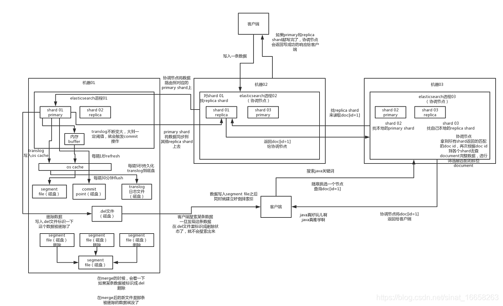
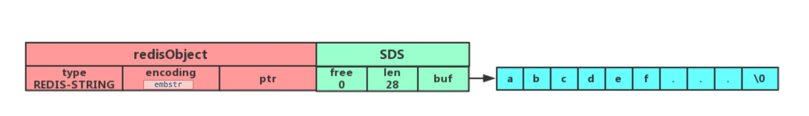
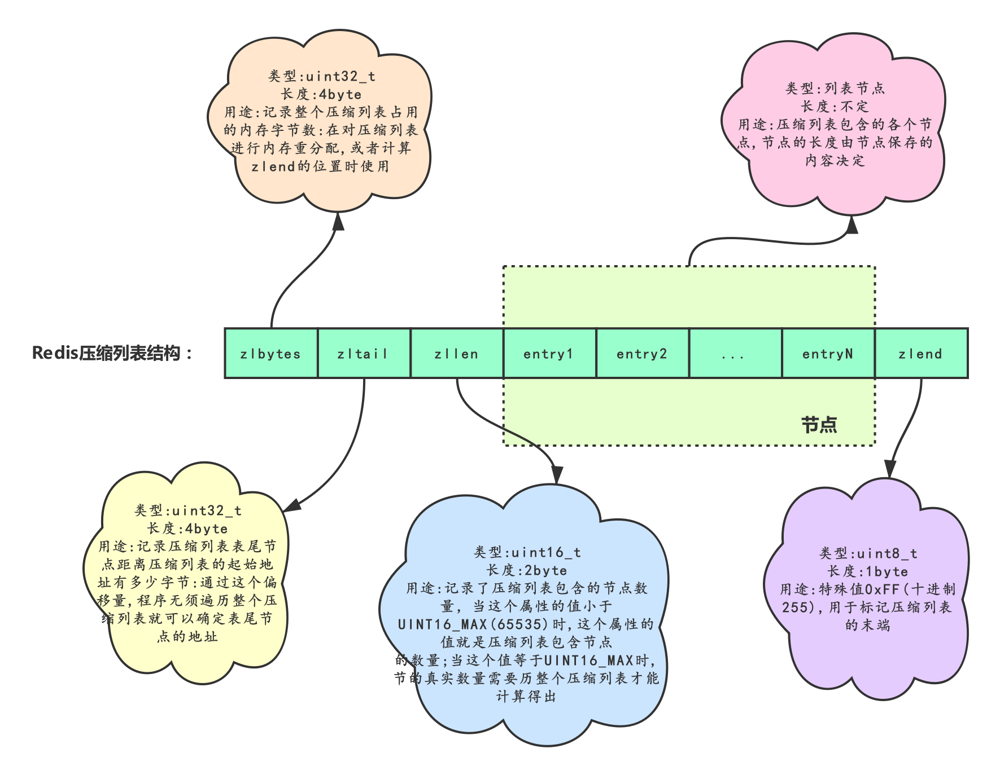
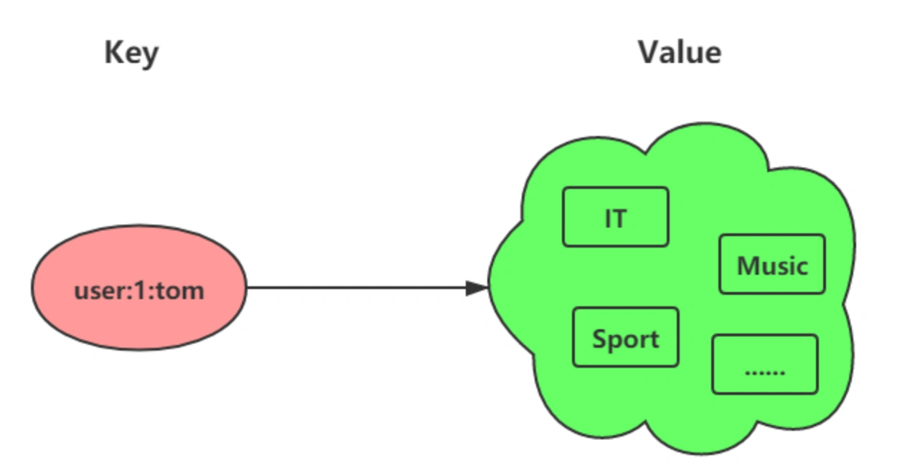
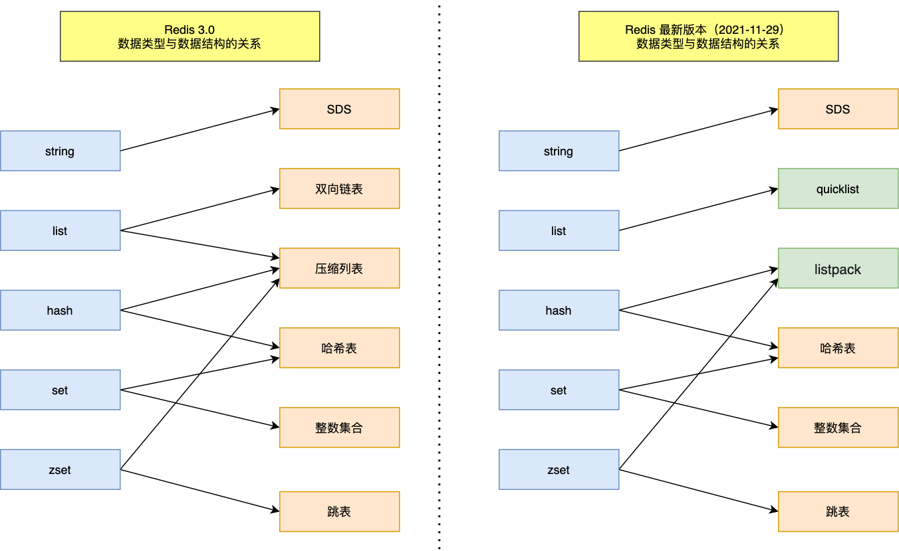
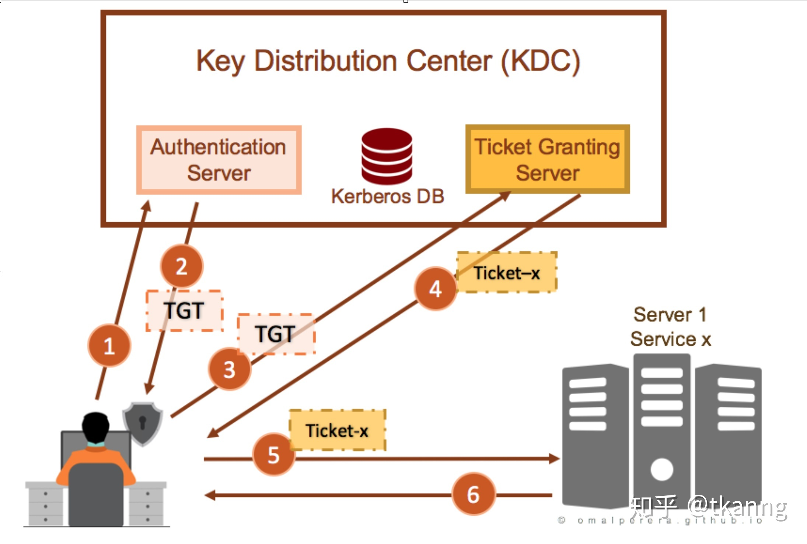

## 运维命令

### 进程信息

```sh
# 查看进程基本信息
ps -fp <pid>
ps aux | grep <pid>

# 进程跟踪
strace -p <pid>
gdb -p <pid>

# 查看进程打开文件
lsof -p <pid>

# 查看进程中线程资源占用
ps -mp <pid> -o THREAD,tid,time  # jstack <pid> > log
printf "%x" <tid>

# 查看进程cpu用量
pidstat -p <pid> -u 1

# 查看进程内存用量
pidsta -p <pid> -r 1

# 查看进程磁盘用量
pidsta -p <pid> -d 1
```

### 系统信息

```sh
# 查看cpu
top -n 1
vmstat -n 2 3
mpstat -P ALL 2

# 查看内存
free -h

# 查看磁盘读写性能
iostat -d -x -k 1 1

# 查看网络
ifconfig
ifstat 1
ip a
ip r

# 查看目录下大文件
find ./ -type f -size +1G -print0|xargs -0 du -sh

# 查看系统日志
cat /var/log/messages
journalctl -b

# 查看内核日志
dmesg -T
journalctl -k 

# 按服务/进程/用户查看日志
journalctl --no-pager # 不分页
journalctl -n 20 # 近20条
journalctl -f # 持续监控日志输出
journalctl -u httpd -o  json-pretty # 指定输出格式
journalctl -u httpd.service --since yesterday
journalctl _UID=33 httpd.service --since "20 min ago"
journalctl _PID=8088 httpd.service --since 09:00 --until "1 hour ago"

# 查看dns服务器域名
dig @dnsserver -t AXFR <domain>

# 查看日志文件中指定时间段内容
sed -n "/2021-08-12 10:20:01/,/2021-08-12 10:30:01/p" <logfile>

# 使用nmon进行系统监控和分析
nmon -f result.nmon -t -s 30 -c 100  # 可以使用nmon analyzer或者nmon visualizer对文件可视化分析
```

### 网络信息

```sh
# 跟踪网络
traceroute google.com
mtr -r -c 50 google.com

# 域名解析
host baidu.com
nslookup -type=mx baidu.com 8.8.8.8
dig @8.8.8.8 baidu.com CNAME
dig -p 5533 @8.8.8.8 baidu.com # 指定dnsserver端口
dig baidu.com +trace # 跟踪解析
dig -x 8.8.8.8 # 反向解析
dig baidu.com +short # 简化输出

# 主机探测
ping <ip>
nc -zv -w 1 <ip> <port>
echo -e '\035\nquit' | telnet <ip> <port>
nmap -p <port-range> <ip> # 端口扫描
nmap -vv <ip> # 详细输出
namp -sP <ip> # ping扫描
nmap -traceroute <ip> # 路由跟踪
nmap -sP 192.168.0.1/24 # 地址段扫描
nmap -O <ip> # 操作系统探测
nmap -A <ip> # 万能开关扫描

# api检测
 curl -ksvIL http://<ip>:<port>/<path>

# 查看tcp连接概览
netstat -nat |awk '{print $6}'|sort|uniq -c|sort -rn
netstat -n | awk '/^tcp/ {++S[$NF]};END {for(a in S) print a, S[a]}'
netstat -n | awk '/^tcp/ {++state[$NF]}; END {for(key in state) print key,"\t",state[key]}'
netstat -n | awk '/^tcp/ {++arr[$NF]};END {for(k in arr) print k,"\t",arr[k]}'
netstat -n |awk '/^tcp/ {print $NF}'|sort|uniq -c|sort -rn 
netstat -ant | awk '{print $NF}' | grep -v '[a-z]' | sort | uniq -c

# 查找较多time_wait连接
netstat -n|grep TIME_WAIT|awk '{print $5}'|sort|uniq -c|sort -rn|head -n20

# 找查较多的SYN连接
netstat -an | grep SYN | awk '{print $5}' | awk -F: '{print $1}' | sort | uniq -c | sort -nr | more

# 查找请求数前20的IP
netstat -anlp|grep 80|grep tcp|awk '{print $5}'|awk -F: '{print $1}'|sort|uniq -c|sort -nr|head -n20
netstat -ant |awk '/:80/{split($5,ip,":");++A[ip[1]]}END{for(i in A) print A[i],i}' |sort -rn|head -n20
tcpdump -i eth0 -tnn dst port 80 -c 1000 | awk -F"." '{print $1"."$2"."$3"."$4}' | sort | uniq -c | sort -nr |head -20

# 根据端口列出进程
netstat -ntlp | grep 80 | awk '{print $7}' | cut -d/ -f1

# ss命令
ss -t -a # tcp连接
ss -u -a # udp连接
ss -s # socket摘要
ss -l # 打开的端口
ss -pl # 进程端口
ss -o state established '( dport = :smtp or sport = :smtp )'  # 建立的smtp连接
ss -o state established '( dport = :http or sport = :http )'  # 建立的http连接
ss -4 state <state> # 指定状态的ipv4连接(established,syn-sent,syn-recv,fin-wait-1,fin-wait-2,time-wait,closed,close-wait,last-ack,listen,closing
ss dst <ip>:<protocal> # 过滤连接(dst,src)
ss dst 192.168.1.5
ss dst 192.168.119.113:http 
ss dst 192.168.119.113:smtp 
ss dst 192.168.119.113:443
```

### 日志分析

```sh
# 获得访问前10位的ip地址
cat access.log|awk '{print $1}'|sort|uniq -c|sort -nr|head -10
cat access.log|awk '{counts[$(11)]+=1}; END {for(url in counts) print counts[url], url}'

# 访问次数最多的文件或页面,取前20
cat access.log|awk '{print $11}'|sort|uniq -c|sort -nr|head -20

# 列出传输最大的几个exe文件（分析下载站的时候常用）
cat access.log |awk '($7~/\.exe/){print $10 " " $1 " " $4 " " $7}'|sort -nr|head -20

# 列出输出大于200000byte(约200kb)的exe文件以及对应文件发生次数
cat access.log |awk '($10 > 200000 && $7~/\.exe/){print $7}'|sort -n|uniq -c|sort -nr|head -100

# 如果日志最后一列记录的是页面文件传输时间，则有列出到客户端最耗时的页面
cat access.log |awk  '($7~/\.php/){print $NF " " $1 " " $4 " " $7}'|sort -nr|head -100

# 列出最最耗时的页面(超过60秒的)的以及对应页面发生次数
cat access.log |awk '($NF > 60 && $7~/\.php/){print $7}'|sort -n|uniq -c|sort -nr|head -100

# 列出传输时间超过 30 秒的文件
cat access.log |awk '($NF > 30){print $7}'|sort -n|uniq -c|sort -nr|head -20

# 统计网站流量（G)
cat access.log |awk '{sum+=$10} END {print sum/1024/1024/1024}'

# 统计404的连接
awk '($9 ~/404/)' access.log | awk '{print $9,$7}' | sort

# 统计http status.
cat access.log |awk '{counts[$(9)]+=1}; END {for(code in counts) print code, counts[code]}'
cat access.log |awk '{print $9}'|sort|uniq -c|sort -rn

# 蜘蛛分析查看是哪些蜘蛛在抓取内容
tcpdump -i eth0 -l -s 0 -w - dst port 80 | strings | grep -i user-agent | grep -i -E 'bot|crawler|slurp|spider'

# 按域统计流量
zcat squid_access.log.tar.gz| awk '{print $10,$7}' |awk 'BEGIN{FS="[ /]"}{trfc[$4]+=$1}END{for(domain in trfc){printf "%s\t%d\n",domain,trfc[domain]}}'
```

### 抓包分析

```sh
tcpdump -i any
tcpdump net 192.168.1.0/24
tcpdump -i eth0 -vnn host 172.16.1.122
tcpdump -i eth0 -vnn net 172.16.1.0/24
tcpdump -i eth0 -vnn portrange 22-50
tcpdump -i eth0 -vnn  udp
tcpdump -i eth0 -vnn icmp
tcpdump -i eth0 -vnn arp
tcpdump -i eth0 -vnn ip
tcpdump -i any -nn "ip[16] == 10"
tcpdump -i any -nn "ip[16] == 192 and ip[17] == 168 and ip[18] == 1 and ip[19] > 9 and ip[19] < 101"
tcpdump -i eth0 -vnn src host 172.16.1.122
tcpdump -i eth0 -vnn dst host 172.16.1.122
tcpdump -i eth0 -vnn src port 22
tcpdump -i eth0 -vnn src host 172.16.1.253 and dst port 22
tcpdump -i eth0 -vnn src host 172.16.1.122 or port 22
tcpdump -i eth0 -vnn src host 172.16.1.122 and not port 22
tcpdump -i  eth0 -vnn "src host 172.16.1.59 and dst port 22" or  " src host 172.16.1.68 and dst port 80 "
tcpdump –i eth0 -vnn -w  /tmp/fill.cap -c 100
tcpdump –i eth0 -vnn -r  /tmp/fill.cap tcp
tcpdump –i eth0 -vnn -r  /tmp/fill.cap host  172.16.1.58
# tcpdump -i eth0 "((tcp) and (port 80) and ((dst host 10.10.1.254) or (dst host 10.10.1.200)))"
tcpdump -i eth0 -vn dst host foo.bar
tcpdump -i eth0 host foo.bar and not port 80 and not port 25
tcpdump -i eth0 "tcp[(tcp[12]>>2):4] = 0x47455420"
tcpdump -i eth0 "tcp[20:2]=0x4745 or tcp[20:2]=0x4854"
tcpdump -s 0 -A "tcp dst port 80 and tcp[((tcp[12:1] & 0xf0) >> 2):4] = 0x47455420"
tcpdump -s 0 -A "tcp dst port 443 and (tcp[((tcp[12:1] & 0xf0) >> 2):4] = 0x504f5354)"
tcpdump -i any -s 0 -A "tcp dst port 80 or tcp dst port 443 and tcp[((tcp[12:1] & 0xf0) >> 2):4] = 0x47455420 or tcp[((tcp[12:1] & 0xf0) >> 2):4] = 0x504F5354" and host 192.168.10.1
tcpdump -i any -s 0 -nnvvvXS -A "tcp dst port 8000 and tcp[((tcp[12:1] & 0xf0) >> 2):4] = 0x47455420"
tcpdump -i eth0 "tcp[(tcp[12]>>2):4] = 0x5353482D"
tcpdump -i eth0 "tcp[((tcp[12:1] & 0xf0) >> 2):4] = 0x48545450 && tcp[((tcp[12:1] & 0xf0) >> 2) + 4:2] = 0x2f31 && tcp[((tcp[12:1] & 0xf0) >> 2) + 6:1] = 0x2e"
tcpdump -i eth0 udp dst port 53
tcpdump -i eth0 tcp
tcpdump -i eth0 "ip[2:2] > 600"
tcpdump -i eth0 "tcp[0:2] > 1024"
tcpdump -i eth0 "tcp[tcpflags] & (tcp-syn|tcp-ack) != 0"
tcpdump -i any -s 0 -v -n -l | egrep -i "POST / | GET / | Host:"
tcpdump -i any -s 0 -A -n -l | egrep -i "POST /|pwd=|passwd=|password=|Host:"
tcpdump -i any -nn -A -s0 -l | egrep -i "Set-Cookie|Host:|Cookie:"
tcpdump -vvAls0 | grep "User-Agent:"
time tcpdump -nn -i eth0 "tcp[tcpflags] = tcp-syn" -c 10000 > /dev/null
tcpdump -i any -nn -c 10000 port 443 > tcpdump.log
cat tcpdump.log | awk "{print $3}" | awk -F "." "{print $1"."$2"."$3"."$4}" | sort | uniq -c | sort -rn
nohup tcpdump -i eth0 port 22 -s0 -G 3600 -Z root -w ssh22_%Y_%m%d_%H%M_%S.pcap &
```

### 数据库分析

```sh
# 查看数据库执行的sql
/usr/sbin/tcpdump -i eth0 -s 0 -l -w - dst port 3306 | strings | egrep -i 'SELECT|UPDATE|DELETE|INSERT|SET|COMMIT|ROLLBACK|CREATE|DROP|ALTER|CALL'
```

### 容器分析

```sh
# 查看docker信息
docker info

# 查看镜像构建
docker history --no-trunc <mid>

# 查看容器信息
docker inspect <cid>
docker inspect --format='{{.LogPath}}' <cid> # 指定查看的内容
docker inspect --format='{{range .NetworkSettings.Networks}}{{.MacAddress}}{{end}}' <cid> # 指定查看的内容

# 查看容器资源占用
docker top <cid>

# 查看容器内进程资源占用
docker stats <cid>

# 查看docker资源占用
docker system df -v

# 查看容器内大文件
find /var/lib/docker/overlay2/ -type f -size +1G -print0|xargs -0 du -sh
```

### JVM分析

```sh
# 查看当前机器上所有运行的java进程及参数信息
jps -lvm

# 查看指定的jvm进程所有的属性设置和配置参数
jinfo <pid>

# 查看某个pid进程对应的应用程序内存占用情况
jmap -heap <pid>                         # 获取堆概要信息
jmap -histo <pid>                        # 打印堆内类实例统计信息
jcmd <pid> -all GC.class_histogram       # 等同上条
jmap -histo:live <pid>                   # 只打印类实例存活对象
jcmd <pid> GC.class_histogram            # 等同上条
jmap -F -dump:format=b,file=<filepath>   # dump堆信息到指定文件
jcmd <pid> GC.heap_dump -all <filepath>  # 等同上条
jmap -dump:live,format=b,file=<filepath> # 只dump存活对象
jcmd <pid> GC.heap_dump <filepath>       # 等同上条

# 查看进程所包含所有线程的Java堆栈信息
jstak -l <pid>  # 打印锁信息
jcmd <pid> Thread.print -l # 等同上条
jstack -F <pid> # 强制打印到标准输出

# 实时监测系统资源占用与jvm运行情况
jstat -class -t <pid> 1000 5  # 类加载
jstat -gc -t <pid> 1000 5     # 垃圾回收
jstat -gcutil -t <pid> 1000 5 # 垃圾回收

# 以GUI的方式更直观化呈现jvm进程的实时情况
jconsole
```


## 运维工具

### Ansible

**基于python的无agent自动化运维工具**

#### 基本用法

##### 安装相关

```bash
yum -y install epel-release
yum list all *ansible*
yum info ansible
yum -y install ansible    
# 使用帮助
ansible-doc -l                # 列出ansible所有的模块
ansible-doc -s MODULE_NAME    # 查看指定模块具体适用
# 免密配置
ssh-keygen -t rsa 
ssh-copy-id -i /root/.ssh/id_rsa.pub root@192.168.10.149
ssh-copy-id -i /root/.ssh/id_rsa.pub root@192.168.10.113
ssh-copy-id -i /root/.ssh/id_rsa.pub root@127.0.0.1
```

##### 配置文件

```bash
/etc/ansible/ansible.cfg    # 主配置文件
/etc/ansible/hosts          # Inventory主机清单(与主配置格式相同)
/usr/bin/ansible-doc        # 帮助文件
/usr/bin/ansible-playbook   # 指定运行任务文件
```

- ansible.cfg参数
    ```sh
    # 一般连接
    ansible_ssh_host     # 用于指定被管理的主机的真实IP
    ansible_ssh_port     # 用于指定连接到被管理主机的ssh端口号, 默认是22
    ansible_ssh_user     # ssh连接时默认使用的用户名
    
    # 特定ssh连接
    ansible_connection     # ssh连接的类型: local, ssh, paramiko, 在ansible 1.2之前默认是paramiko, 后来智能选择, 优先使用基于ControlPersist的ssh
    ansible_ssh_pass       # ssh连接时的密码
    ansible_ssh_private_key_file  # 秘钥文件路径, 如果不想使用ssh-agent管理秘钥文件时可以使用此选项
    ansible_ssh_executable  # 如果ssh指令不在默认路径当中, 可以使用该变量来定义其路径
    
    # 特权升级
    ansible_become      # 相当于ansible_sudo或者ansible_su, 允许强制特权升级
    ansible_become_user # 通过特权升级到的用户, 相当于ansible_sudo_user或者ansible_su_user
    ansible_become_pass # 提升特权时, 如果需要密码的话, 可以通过该变量指定, 相当于ansible_sudo_pass或者ansible_su_pass
    ansible_sudo_exec   # 如果sudo命令不在默认路径, 需要指定sudo命令路径
    
    # 远程主机环境参数
    ansible_shell_executable       # 设置目标机上使用的shell, 默认为/bin/sh
    ansible_python_interpreter     # 用来指定python解释器的路径, 默认为/usr/bin/python同样可以指定ruby 、perl的路径
    ansible_*_interpreter          # 其他解释器路径, 用法与ansible_python_interpreter类似, 这里"*"可以是ruby或才perl等其他语言
    ```

- Inventory主机清单配置 

  - INI格式

    ```bash
    # 给服务器分组, 组名只能用 [a-zA-Z0-9_]
    # 直接指定登录凭证
    [database]
    10.1.1.1 ansible_ssh_port=22 ansible_ssh_user="root" ansible_ssh_pass="redhat"
    10.1.1.2 ansible_ssh_port=22 ansible_ssh_user="root" ansible_ssh_pass="redhat"

    [clusterA]
    # 指定一个数字范围
    192.168.1.1[01:50]

    [clusterB]
    # 指定一个字母表范围
    worker[01:30].k8s.local
    worker-[a:h].k8s.local

    # 主机组嵌套
    [kubernetes:children]
    clusterA
    clusterB

    # kubernetes组的公用参数
    [kubernetes:vars]
    ntp_server=ntp.svc.local
    proxy=proxy.svc.local
    foo=bar                          # 变量名foo, 值bar, 由组内成员共享
    ansible_connection=network_cli   # 2.5版本后推出新的连接方式, 代替provider
    ansible_network_os=ios           # 告知ansible是基于ios的系统
    ansible_ssh_port=22              # ssh端口
    ansible_ssh_user=root            # ssh用户
    ansible_ssh_pass="cisco"         # ssh密码

    [app]
    # 给服务器指定别名（git）, 通过关键字参数指定其他参数
    git ansible_host=git.svc.local ansible_port=225  ansible_ssh_private_key_file=<path/to/git-server-ssh>
    # 使用指定的账号密码（危险！）
    tester ansible_host=tester.svc.local ansible_user=root ansible_password=xxx
    ```

  - YAML模式

      ```yaml
      ---
      database:
        hosts: 192.168.1.1[01:50]
      
      k8s_cluster:
        hosts: # 没有别名的服务器
          worker[01:30].k8s.local:
          worker-[a:h].k8s.local:
        vars:  # 公共的参数
          ntp_server: ntp.svc.local
          proxy: proxy.svc.local
      app:
        hosts:
          git:  # 服务器别名
            ansible_host: git.svc.local  # 如果未定义, 默认以别名为host.(即git)
            ansible_port: 225
            ansible_ssh_private_key_file: <path/to/git-server-ssh>
          tester:
              ansible_host: tester.svc.local
              ansible_user: root
              ansible_password: xxx  # 危险!尽量不要写明文密码
      ```

##### 命令说明

```bash
  语法: ansible <host-pattern> [arguments] [-f forks] [-m module_name] [-a args]
  
  <host-pattern>  这次命令对哪些主机生效的
    inventory group name
    ip
    all
  
  <arguments>
    -a MODULE_ARGS, --args=MODULE_ARGS    
        # module arguments
        # 指定执行模块使用的参数  
    --ask-vault-pass      
        # ask for vault password
        # 加密playbook文件时提示输入密码
    -B SECONDS, --background=SECONDS
        # run asynchronously, failing after X seconds(default=N/A)
        # 后台运行超时时间, 异步运行, X秒之后失败
    -C, --check           
        # don't make any changes; instead, try to predict some of the changes that may occur
        # 模拟执行, 不会真正在机器上执行(查看执行会产生什么变化)
    -D, --diff            
        # when changing (small) files and templates, show the differences in those files; works great with --check
        # 当更新的文件数及内容较少时, 该选项可显示这些文件不同的地方, 该选项结合-C用会有较好的效果
    -e EXTRA_VARS, --extra-vars=EXTRA_VARS
        # set additional variables as key=value or YAML/JSON
        # 执行命令时添加额外参数变量
    -f FORKS, --forks=FORKS
        # specify number of parallel processes to use(default=5)
        # 并行任务数. FORKS被指定为一个整数, 默认是5
    -h, --help            
        # show this help message and exit
        # 打开帮助文档API
    -i INVENTORY, --inventory-file=INVENTORY
        # specify inventory host path(default=/etc/ansible/hosts) or comma separated host list.
        # 指定要读取的Inventory文件
    -l SUBSET, --limit=SUBSET
        # further limit selected hosts to an additional pattern
        # 限定执行的主机范围
    --list-hosts          
        # outputs a list of matching hosts; does not execute anything else
        # 列出执行匹配到的主机, 但并不会执行
    -m MODULE_NAME, --module-name=MODULE_NAME
        # module name to execute (default=command)
        # 指定执行使用的模块, 默认使用 command
    -M MODULE_PATH, --module-path=MODULE_PATH
        # specify path(s) to module library (default=None)
        # 要执行的模块的路径
    --new-vault-password-file=NEW_VAULT_PASSWORD_FILE
        # new vault password file for rekey
        # 新vault密码文件
    -o, --one-line        
        # condense output
        #压缩输出, 摘要输出. 尝试一切都在一行上输出
    --output=OUTPUT_FILE  
        #output file name for encrypt or decrypt; use - for stdout
        # 输出文件
    -P POLL_INTERVAL, --poll=POLL_INTERVAL
        # set the poll interval if using -B (default=15)
        # 设置轮询间隔, 每隔数秒. 需要- B
    --syntax-check        
        # perform a syntax check on the playbook, but do not execute it
        # 检查Playbook中的语法书写
    -t TREE, --tree=TREE  
        # log output to this directory
        # 将日志内容保存在该输出目录,结果保存在一个文件中在每台主机上
    --vault-password-file=VAULT_PASSWORD_FILE
        # vault password file
        # vault密码文件
    -v, --verbose         
        # verbose mode (-vvv for more, -vvvv to enable connection debugging)
        # 执行详细输出
    --version             
        # show program's version number and exit
        # 显示版本
  
    Connection Options:
      control as whom and how to connect to hosts
  
      -k, --ask-pass      
          # ask for connection password
          # 要求输入连接密码
      --private-key=PRIVATE_KEY_FILE, --key-file=PRIVATE_KEY_FILE
          # use this file to authenticate the connection
          # ssh连接私钥文件
      -u REMOTE_USER, --user=REMOTE_USER
          # connect as this user (default=None)
          # 指定远程主机以USERNAME运行命令
      -c CONNECTION, --connection=CONNECTION
          # connection type to use (default=smart)
          # 指定连接方式, 可用选项paramiko (SSH)、ssh、local, local方式常用于crontab和kickstarts
      -T TIMEOUT, --timeout=TIMEOUT
          # override the connection timeout in seconds(default=10)
          # ssh连接超时时间设定, 默认10s
      --ssh-common-args=SSH_COMMON_ARGS
          # specify common arguments to pass to sftp/scp/ssh (e.g.ProxyCommand)
          # ssh通用参数
      --sftp-extra-args=SFTP_EXTRA_ARGS
          # specify extra arguments to pass to sftp only (e.g. -f, -l)
          # sftp额外参数
      --scp-extra-args=SCP_EXTRA_ARGS
          #specify extra arguments to pass to scp only (e.g. -l)
          # scp额外参数
      --ssh-extra-args=SSH_EXTRA_ARGS
          # specify extra arguments to pass to ssh only (e.g. -R)
          # ssh额外参数
  
    Privilege Escalation Options:
      control how and which user you become as on target hosts
  
      -s, --sudo          
          # run operations with sudo (nopasswd) (deprecated, use become)
          # 相当于Linux系统下的sudo命令
      -U SUDO_USER, --sudo-user=SUDO_USER
          # desired sudo user (default=root) (deprecated, use become)
          # 使用sudo, 相当于Linux下的sudo命令
      -S, --su            
          # run operations with su (deprecated, use become)
          # su模式运行(过时, 请使用become)
      -R SU_USER, --su-user=SU_USER
          # run operations with su as this user (default=root) (deprecated, use become)
          # su模式使用的用户(过时, 使用become)
     -b, --become        
          # run operations with become (does not imply password prompting)
          # su模式运行
      --become-method=BECOME_METHOD
          # privilege escalation method to use (default=sudo),valid choices: [ sudo | su | pbrun | pfexec | doas |dzdo | ksu | runas ]
          # su模式方法
      --become-user=BECOME_USER
          # run operations as this user (default=root)
          # su模式使用的用户
      --ask-sudo-pass     
          # ask for sudo password (deprecated, use become)
          # 要求输入sudo密码
      --ask-su-pass       
          # ask for su password (deprecated, use become)
          # 要求输入su密码(过时, 使用become)
      -K, --ask-become-pass
          # ask for privilege escalation password
          # 要求输入su密码
  
  <modules>
    ping: 检查指定节点机器是否还能连通
    raw: 执行原始的命令, 而不是通过模块子系统
    yum: RedHat和CentOS的软件包安装和管理工具
    apt: Ubuntu/Debian的软件包安装和管理工具
    pip : 用于管理Python库依赖项, 为了使用pip模块, 必须提供参数name或者requirements
    synchronize: 使用rsync同步文件, 将主控方目录推送到指定节点的目录下
    template: 基于模板方式生成一个文件复制到远程主机进行文档内变量的替换的模块
    copy: 在远程主机执行复制操作文件
    user 与 group: 请求useradd, userdel, usermod, groupadd, groupdel, groupmod
    service 或 systemd: 用于管理远程主机的服务
    get_url: 该模块主要用于从http、ftp、https服务器上下载文件(类似于wget)
    fetch: 它用于从远程机器获取文件, 并将其本地存储在由主机名组织的文件树中
    file: 主要用于远程主机上的文件操作
    lineinfile: 远程主机上的文件编辑模块
    unarchive模块: 用于解压文件
    command: 用于在各被管理节点运行指定的命令, 不支持特殊字符
    shell: 用于在各被管理节点运行指定的命令, 支持特殊字符
    hostname: 修改远程主机名的模块
    script: 在远程主机上执行主控端的脚本, 相当于scp+shell组合
    stat: 获取远程文件的状态信息, 包括atime,ctime,mtime,md5,uid,gid等信息
    cron: 远程主机crontab配置
    mount: 挂载文件系统
    find: 帮助在被管理主机中查找符合条件的文件, 就像 find 命令一样
    selinux: 远程管理受控节点的selinux的模块
  
  <samples>
    ansible 192.168.10.113 -m ping
    ansible -i hosts webserver -m command -a 'date'
    ansible all -m copy -a 'src=/root/foo dest=/root/bar'
```

- 常用模块用法

```bash
command     命令模块(默认模块)用于在远程主机执行命令, 不能使用变量, 管道等
    # ansible all -a 'date'
cron        计划任务    
    month   指定月份
    minute  指定分钟
    job     指定任务
    day     表示那一天
    hour    指定小时
    weekday 表示周几
    state   表示是添加还是删除
        present: 安装
        absent: 移除
    # ansible webserver -m cron -a 'minute="*/10" job="/bin/echo hello" name="test cron job"'   #不写默认都是*, 每个任务都必须有一个名字 
    # ansible webserver -a 'crontab -l'
    # ansible webserver -m cron -a 'minute="*/10" job="/bin/echo hello" name="test cron job" state=absent'  #移除任务
user    用户账号管理
    name    用户名
    uid     uid
    state   状态  
    group   属于哪个组
    groups  附加组
    home    家目录
    createhome  是否创建家目录
    comment 注释信息
    system  是否是系统用户
    
    # ansible all -m user -a 'name="user1"'
    # ansible all -m user -a 'name="user1" state=absent'
group   组管理
    gid     gid      
    name    组名               
    state   状态           
    system  是否是系统组
    # ansible webserver -m group -a 'name=mysql gid=306 system=yes'
    # ansible webserver -m user -a 'name=mysql uid=306 system=yes group=mysql'
copy    复制文件(复制本地文件到远程主机的指定位置)
    src     定义本地源文件路径
    dest    定义远程目录文件路径(绝对路径)
    owner   属主
    group   属组
    mode    权限
    content 取代src=,表示直接用此处的信息生成为文件内容
    # yum -y install libselinux-python
    # ansible all -m copy -a 'src=/etc/fstab dest=/tmp/fstab.ansible owner=root mode=640'
    # ansible all -m copy -a 'content="hello ansible\nHi ansible" dest=/tmp/test.ansible' 
file    设置文件的属性
    path|dest|name  对那个文件做设定
    
    创建文件的符号链接: 
        src:     指定源文件
        path:    指明符号链接文件路径
    # ansible all -m file -a 'owner=mysql group=mysql mode=644 path=/tmp/fstab.ansible'
    # ansible all -m file -a 'path=/tmp/fstab.link src=/tmp/fstab.ansible state=link'
ping    测试指定主机是否能连接
    # ansible all -m ping 
service 管理服务运行状态
    enabled 是否开机自动启动
    name    指定服务名
    state   指定服务状态
        started     启动服务
        stoped      停止服务
        restarted   重启服务
    arguments   服务的参数
    # ansible webserver -m service -a 'enabled=true name=httpd state=started'
shell   在远程主机上运行命令
    尤其是用到管道变量等功能的复杂命令
    # ansible all -m shell -a 'echo magedu | passwd --stdin user1'
script  将本地脚本复制到远程主机并运行之
    # ansible all -m script -a '/tmp/test.sh'
yum     安装程序包
    name    程序包名称(不指定版本就安装最新的版本latest)
    state   present,latest表示安装, absent表示卸载
    # ansible webserver -m yum -a 'name=httpd'
    # ansible all -m yum -a 'name=ntpdate'  #默认就是安装
    # ansible all -m yum -a 'name=ntpdate state=absent'
setup   收集远程主机的facts
    每个被管理节点在接受并运行管理命令之前, 会将自己主机相关信息, 如操作系统版本, IP地址等报告给远程的ansible主机 
    # ansible all -m setup
```

#### 高级用法

##### yaml

1. YAML介绍

YAML是一个可读性高的用来表达资料序列的格式.  YAML参考了其它多种语言, 包括: XML、C语言、Python、Perl以及电子邮件格式RFC2822等.  ClarkEvans在2001年首次发表了这种语言, 另外Ingy dot Net与Oren Ben-Kiki也是这语言的共同设计者  

YAML Ain't Markup Language,即YAML不是XML, 不过, 在开发这种语言时, YAML的意思其实是: "Yet Another Markup Language"(仍是一种标记语言), 其特性: 

- YAML的可读性好
- YAML和脚本语言的交互性好
- YAML使用实现语言的数据类型
- YAML有一个一致的信息模型
- YAML易于实现
- YAML可以基于流来处理
- YAML表达能力强, 扩展性好

> 更多的内容及规范参见[http://www.yaml.org](https://www.oschina.net/action/GoToLink?url=http%3A%2F%2Fwww.yaml.org)

2. YAML语法

YAML的语法和其他高阶语言类似, 并且可以简单表达清单、散列表、标量等数据结构, 其结构(structure)通过空格来展示, 序列(sequence)里的项用"-"来表示, Map里面的键值对用":"分割, 下面是一个示例

```
name: john smith
age: 41
gender: male
spouse:
    name:jane smith
    age:37
    gender: female
children:
    -   name:jimmy smith
        age:17
        gender: male
    -   name:jenny smith
        age: 13
        gender: female
```

YAML文件扩展名通常为.yaml, 如example.yaml

**list**

列表的所有元素均使用"-"打头, 例如: 

```
# A list of testy fruits
- Apple
- Orange
- Strawberry
- Mango
```

**dictionary**

字典通过key与value进行标识, 例如: 

```
---
# An employee record
name: Example Developer
job: Developer
skill: Elite
```

也可以将key:value放置于{}中进行表示, 例如: 

```
---
#An exmloyee record
{name: Example Developer, job: Developer, skill: Elite}
```

##### 基础元素

###### 变量

1. 变量命名

   变量名仅能由字母、数字和下划线组成, 且只能以字母开头

2. facts

   facts是由正在通信的远程目标主机发回的信息, 这些信息被保存在ansible变量中.  要获取指定的远程主机所支持的所有facts, 可使用如下命令进行: 

   ```bash
   ansible hostname -m setup
   ```

3. register

   把任务的输出定义为变量, 然后用于其他任务, 实例如下:

   ```yaml
   tasks:
       - shell: /usr/bin/foo
         register: foo_result
         ignore_errors: True
   ```

4. 通过命令行传递变量

   在运行playbook的时候也可以传递一些变量供playbook使用, 示例如下: 

   ```bash
   ansible-playbook test.yml --extra-vars "hosts=www user=mageedu"
   ```

5. 通过roles传递变量

   当给一个主机应用角色的时候可以传递变量, 然后在角色内使用这些变量, 示例如下: 

   ```yaml
   - hosts: webserver
     roles:
       - common
       - {role: foo_app_instance, dir: '/web/htdocs/a.com', port: 8080}
   ```

###### Inventory

ansible的主要功用在于批量主机操作, 为了便捷的使用其中的部分主机, 可以在inventory file中将其分组命名, 默认的inventory file为`/etc/ansible/hosts`

inventory file可以有多个, 且也可以通过Dynamic Inventory来动态生成

1. inventory文件格式

   inventory文件遵循INI文件风格, 中括号中的字符为组名.  可以将同一个主机同时归并到多个不同的组中；此外, 当如若目标主机使用非默认的SSH端口, 还可以在主机名称之后使用冒号加端口号来表明

   ```ini
   ntp.magedu.com
   
   [webserver]
   www1.magedu.com:2222
   www2.magedu.com
   
   [dbserver]
   db1.magedu.com
   db2.magedu.com
   db3.magedu.com
   
   如果主机名遵循相似的命名模式, 还可使用列表的方式标识个主机, 例如: 
   [webserver]
   www[01:50].example.com
   
   [databases]
   db-[a:f].example.com
   ```

2. 主机变量

   可以在inventory中定义主机时为其添加主机变量以便于在playbook中使用, 例如: 

   ```ini
   [webserver]
   www1.magedu.com http_port=80 maxRequestsPerChild=808
   www2.magedu.com http_port=8080 maxRequestsPerChild=909
   ```

3. 组变量

   组变量是指赋予给指定组内所有主机上的在playbook中可用的变量.  例如: 

   ```ini
   [webserver]
   www1.magedu.com
   www2.magedu.com
   
   [webserver:vars]
   ntp_server=ntp.magedu.com
   nfs_server=nfs.magedu.com
   ```

4. 组嵌套

   inventory中, 组还可以包含其它的组, 并且也可以向组中的主机指定变量.  不过, 这些变量只能在ansible-playbook中使用, 而ansible不支持.  例如: 

   ```ini
   [apache]
   httpd1.magedu.com
   httpd2.magedu.com
   
   [nginx]
   ngx1.magedu.com
   ngx2.magedu.com
   
   [webserver:children]    #固定格式
   apache
   nginx
   
   [webserver:vars]
   ntp_server=ntp.magedu.com
   ```

5. inventory参数

   ansible基于ssh连接inventory中指定的远程主机时, 还可以通过参数指定其交互方式, 这些参数如下所示: 

   ```bash
   ansible_ssh_host
   ansible_ssh_port
   ansible_ssh_user
   ansible_ssh_pass
   ansible_sudo_pass
   ansible_connection
   ansible_ssh_private_key_file
   ansible_shell_type
   ansible_python_interpreter
   ```

###### 条件测试

如果需要根据变量、facts或此前任务的执行结果来做为某task执行与否的前提时要用到条件测试.  

1. when语句

   在task后添加when字句即可使用条件测试；when语句支持jinja2表达式语句, 例如: 

   ```yaml
   tasks:
     - name: 'shutdown debian flavored system"
       command: /sbin/shutdown -h now
       when: ansible_os_family == "Debian"
   ```

   when语句中还可以使用jinja2的大多"filter",例如果忽略此前某语句的错误并基于其结果(failed或success)运行后面指定的语句, 可使用类似如下形式:

   ```yaml
   tasks:
     - command:/bin/false
       register: result
       ignore_errors: True
     - command: /bin/something
       when: result|failed
     - command: /bin/something_else
       when: result|success
     - command: /bin/still/something_else
       when: result|skipped
   ```

   此外, when语句中还可以使用facts或playbook中定义的变量

   ```yaml
   # cat cond.yml 
   - hosts: all
     remote_user: root
     vars:
     - username: user10
     tasks:
     - name: create {{ username }} user
       user: name={{ username }} 
       when: ansible_fqdn == "node1.exercise.com"
   ```

###### 迭代

当有需要重复性执行的任务时, 可以使用迭代机制.  其使用格式为将需要迭代的内容定义为item变量引用, 并通过with_items语句来指明迭代的元素列表即可.  例如: 

```
- name: add server user
  user: name={{ item }} state=persent groups=wheel
  with_items:
    - testuser1
    - testuser2
```

上面语句的功能等同于下面的语句: 

```
- name: add user testuser1
  user: name=testuser1 state=present group=wheel
- name: add user testuser2
  user: name=testuser2 state=present group=wheel
```

事实上, with_items中可以使用元素还可为hashes, 例如: 

```
- name: add several users
  user: name={{ item.name}} state=present groups={{ item.groups }}
  with_items:
    - { name: 'testuser1', groups: 'wheel'}
    - { name: 'testuser2', groups: 'root'}
```

> Ansible的循环机制还有更多的高级功能, 具体请参考官方文档[http://docs.ansible.com/playbooks_loops.html](https://www.oschina.net/action/GoToLink?url=http%3A%2F%2Fdocs.ansible.com%2Fplaybooks_loops.html)

###### 模板示例

```
# grep '{{' conf/httpd.conf 
MaxClients       {{ maxClients }}
Listen {{ httpd_port }}

# cat /etc/ansible/hosts
[webserver]
127.0.0.1 httpd_port=80 maxClients=100
192.168.10.149 httpd_port=8080 maxClients=200

# cat apache.yml 
- hosts: webserver
  remote_user: root
  vars:
  - package: httpd
  - service: httpd
  tasks:
  - name: install httpd package
    yum: name={{ package }} state=latest
  - name: install configuration file for httpd
    template: src=/root/conf/httpd.conf dest=/etc/httpd/conf/httpd.conf
    notify: 
    - restart httpd
  - name: start httpd service
    service: enabled=true name={{ service }} state=started
  
  handlers:
  - name: restart httpd
    service: name=httpd state=restarted
```

##### playbook

playbook是由一个或多个"play"组成的列表.  play的主要功能在于将事先归并为一组的主机装扮成事先通过ansible中的task定义好的角色.  从根本上来讲, 所有task无非是调用ansible的一个module.  将多个play组织在一个playbook中, 即可以让他们连同起来按事先编排的机制同唱一台大戏

###### 命令说明

```bash
# 查看脚本影响到的hosts
ansible-playbook -i inventory/hosts.yml playbook.yml --list-hosts
# 查看输出细节
ansible-playbook playbook.yml  --verbose
# 并行执行脚本
ansible-playbook playbook.yml -f 10
# 输入密码
ansible-playbook playbook.yml --ask-become-pass
# dry-run
ansible-playbook playbook.yml --check
```

###### 组成结构

```
inventory       # 以下操作应用的主机
modules         # 调用哪些模块做什么样的操作
ad hoc commands # 在这些主机上运行哪些命令
playbooks   
    tasks       # 任务, 即调用模块完成的某操作
    variable    # 变量
    templates   # 模板
    handlers    # 处理器, 由某事件触发执行的操作
    roles       # 角色
```

示例:

```
- hosts: webserver
  vars:
    http_port: 80
    max_clients: 256
  remote_user: root
  tasks:
  - name: ensure apache is at the latest version
    yum: name=httpd state=latest
  - name: ensure apache is running
    service: name=httpd state=started
  handlers:
    - name: restart apache
      service: name=httpd state=restarted
```

###### 基础组件

1. Hosts和Users

   playbook中的每一个play的目的都是为了让某个或某些主机以某个指定的用户身份执行任务.  hosts用于指定要执行指定任务的主机, 其可以使一个或多个由冒号分隔主机组；remote_user则用于指定远程主机的执行任务的用户

    ```
    - hosts: webserver
      remote_user: root
    ```

    不过, remote_user也可用于各task中, 也可以通过指定其通过sudo的方式在远程主机上执行任务, 其可用于play全局或其任务；此外, 甚至可以在sudo时使用sudo_user指定sudo时切换的用户

    ```
    - hosts: webserver
      remote_user: magedu
      tasks:
       - name: test connection
         ping:
         remote_user: magedu
         sudo: yes
    ```

2. 任务列表和action

   play的主题部分是task list.  task list中的各任务按次序逐个在hosts中指定的所有主机上执行, 即在所有主机上完成第一个任务后再开始第二个.  在运行自上而下某playbook时, 如果中途发生错误, 所有已执行任务都可能回滚, 在更正playbook后重新执行一次即可

   taks的目的是使用指定的参数执行模块, 而在模块参数中可以使用变量.  模块执行是幂等的.  这意味着多次执行是安全的, 因为其结果均一致

   每个task都应该有其name, 用于playbook的执行结果输出, 建议其内容尽可能清晰地描述任务执行步骤, 如果为提供name, 则action的结果将用于输出

   定义task可以使用"action: module options"或”module: options“的格式推荐使用后者以实现向后兼容.  如果action一行的内容过多, 也中使用在行首使用几个空白字符进行换行

    ```
    tasks:
      - name:make sure apache is running
        service: name=httpd state=started
    ```

    在众多的模块中, 只有command和shell模块仅需要给定一个列表而无需使用"key=value"格式, 例如: 

    ```
    tasks:
      - name: disable selinux
        command: /sbin/setenforce 0
    ```

    如果命令或脚本的退出码不为零, 可以使用如下方式替代: 

    ```
    tasks:
      - name: run this command and ignore the result
        shell: /usr/bin/somecommand || /bin/true
    ```

    或者使用ignore_errors来忽略错误信息: 

    ```
    tasks:
      - name: run this command and ignore the result
        shell: /usr/bin/somecommand
        ignore_errors: True
    ```

3. handlers

    用于当关注的资源发生变化时采取一定的操作

    "notify"这个action可用于在每个play的最后被触发, 这样可以避免多次有改变发生时每次都执行执行的操作, 取而代之, 仅在所有的变化发生完成后一次性地执行指定操作, 在notify中列出的操作称为handlers, 也即notify中调用handlers中定义的操作

    ```
    - name: template configuration file
      template: src=template.j2 dest=/etc/foo.conf
      notify:
        - restart memcached
        - restart apache
    ```

    handlers是task列表, 这些task与前述的task并没有本质上的不同

    ```
    handlers: 
      - name: restart memcached
        service: name=memcached state=restarted
      - name: restart apache
        service: name=apache state=restarted
    ```

###### 简单示例

- 示例1

    ```
    # cat nginx.yml 
    - hosts: webserver
      remote_user: root
      tasks:
      - name: create nginxn group
        group: name=nginx system=yes gid=208
      - name: create nginx user
        user: name=nginx uid=208 group=nginx system=yes

    - hosts: dbserver
      remote_user: root
      tasks:
      - name: copy file to dbserver
        copy: src=/etc/inittab dest=/tmp/inittab.ans

    # ansible-playbook nginx.yml 
    ```

- 示例2

    ```
    # cat apache.yml 
    - hosts: webserver
      remote_user: root
      tasks:
      - name: install httpd package
        yum: name=httpd state=latest
      - name: install configuration file for httpd
        copy: src=/root/conf/httpd.conf dest=/etc/httpd/conf/httpd.conf
      - name: start httpd service
        service: enabled=true name=httpd state=started

    # ansible-playbook apache.yml 
    ```

- 示例3

    ```
    # cat apache.yml 
    - hosts: webserver
      remote_user: root
      tasks:
      - name: install httpd package
        yum: name=httpd state=latest
      - name: install configuration file for httpd
        copy: src=/root/conf/httpd.conf dest=/etc/httpd/conf/httpd.conf
        notify: 
        - restart httpd
      - name: start httpd service
        service: enabled=true name=httpd state=started

      handlers:
      - name: restart httpd
        service: name=httpd state=restarted

    #  ansible-playbook apache.yml 
    ```

- 示例4

    ```
    # cat apache.yml 
    - hosts: webserver
      remote_user: root
      vars:
      - package: httpd
      - service: httpd
      tasks:
      - name: install httpd package
        yum: name={{ package }} state=latest
      - name: install configuration file for httpd
        copy: src=/root/conf/httpd.conf dest=/etc/httpd/conf/httpd.conf
        notify: 
        - restart httpd
      - name: start httpd service
        service: enabled=true name={{ service }} state=started

      handlers:
      - name: restart httpd
        service: name=httpd state=restarted
    ```

- 示例5

    ```
    # cat facts.yml 
    - hosts: webserver
      remote_user: root
      tasks:
      - name: copy file
        copy: content="{{ ansible_all_ipv4_addresses }} " dest=/tmp/vars.ans
    ```

###### roles

ansible自1.2版本引入的新特性, 用于层次性、结构化地组织playbook.  roles能够根据层次型结构自动转载变量文件、tasks以及handlers等.  要使用roles只需要在playbook中使用include指令即可.  简单来讲, roles就是通过分别将变量、文件、任务、模板以及处理器放置于单独的目录中, 并可以便捷地include他们的一种机制.  角色一般用于基于主机构建服务的场景中, 但也可以使用于构建守护进程的场景中

一个roles的案例如下所示: 

```
site.yml
webserver.yml
fooserver.yml
roles/
    common/
        files/
        templates/
        tasks/
        handlers/
        vars/
        meta/
    webserver/
        files/
        templates/
        tasks/
        handlers/
        vars/
        meta/
```

而在playbook中, 可以这样使用roles

```
- hosts: webserver
  roles:
    - common  
    - webserver
```

也可以向roles传递参数, 例如: 

```
- hosts: webserver
  roles:
    - common
    - { role: foo_app_instance, dir:'/opt/a',port:5000}
    - { role: foo_app_instance, dir:'/opt/b',port:5001}
```

甚至也可以条件式地使用roles, 例如: 

```
- hosts: webserver
  roles:
    - { role: some_role, when: "ansible_so_family == 'RedHat" }  
```

1. 创建role的步骤
   1. 创建以roles命名的目录
   2. 在roles目录中分别创建以各角色命名的目录, 如webserver等
   3. 在每个角色命名的目录中分别创建files、handlers、meta、tasks、templates和vars目录；用不到的目录可以创建为空目录, 也可以不创建
   4. 在playbook文件中, 调用各角色

2. role内各目录中可应用的文件
   - task目录: 至少应该包含一个为main.yml的文件, 其定义了此角色的任务列表；此文件可以使用include包含其它的位于此目录中的task文件
   - file目录: 存放由copy或script等模板块调用的文件
   - template目录: template模块会自动在此目录中寻找jinja2模板文件
   - handlers目录: 此目录中应当包含一个main.yml文件, 用于定义此角色用到的各handlers, 在handler中使用inclnude包含的其它的handlers文件也应该位于此目录中
   - vars目录: 应当包含一个main.yml文件, 用于定义此角色用到的变量
   - meta目录: 应当包含一个main.yml文件, 用于定义此角色的特殊设定及其依赖关系ansible1.3及其以后的版本才支持
   - default目录: 应当包含一个main.yml文件,用于为当前角色设定默认变量时使用此目录

    ```
    # mkdir -pv ansible_playbooks/roles/{webserver,dbserver}/{tasks,files,templates,meta,handlers,vars} 
    # cp /etc/httpd/conf/httpd.conf files/  
    # pwd
    /root/ansible_playbooks/roles/webserver 
    # cat tasks/main.yml 
    - name: install httpd package
      yum: name=httpd state=present
    - name: install configuretion file
      copy: src=httpd.conf dest=/etc/httpd/conf/httpd.conf
      tags:
      - conf
      notify:
      - restart httpd
    - name: start httpd
      service: name=httpd state=started
   
    # cat handlers/main.yml 
    - name: restart httpd
      service: name=httpd state=restarted
   
    # pwd;ls
    /root/ansible_playbooks
    roles  site.yml 
    
    # cat site.yml 
    - hosts: webserver
      remote_user: root
      roles:
      - webserver
   
    # ansible-playbook site.yml 
    ```

###### tags

tags用于让用户选择运行或跳过playbook中的部分代码.  ansible具有幂等性, 因此会自动跳过没有变化的部分, 即便如此, 有些代码为测试其确实没有发生变化的时间依然会非常的长.  此时, 如果确信其没有变化, 就可以通过tags跳过此些代码片段

tags: 在playbook可以为某个或某些任务定义一个"标签", 在执行此playbook时, 通过为ansible-playbook命令使用--tags选项能耐实现仅运行指定的tasks而非所有的

```
# cat apache.yml 
- hosts: webserver
  remote_user: root
  vars:
  - package: httpd
  - service: httpd
  tasks:
  - name: install httpd package
    yum: name={{ package }} state=latest
  - name: install configuration file for httpd
    template: src=/root/conf/httpd.conf dest=/etc/httpd/conf/httpd.conf
    tags:
    - conf
    notify: 
    - restart httpd
  - name: start httpd service
    service: enabled=true name={{ service }} state=started
  
  handlers:
  - name: restart httpd
    service: name=httpd state=restarted

# ansible-playbook apache.yml --tags='conf'
```

> 特殊tags: always         # 无论如何都会运行

###### 变量

1. 变量的定义方式

   - 通过vars关键字定义

     ```yaml
     - name： use vars define invrionmemnt
       hosts: test
       user: ansible
       vars: 
         http_port: 80
         server_name: localhost
         conf_file: /etc/nginx/conf/default.conf
     ```

   - 通过vars_files关键字引入变量文件

     ```yaml
     - hosts: all
       remote_user: root
       vars:
         favcolor: blue
       vars_files:
         - vars/external_vars.yml
         - vars/user_vars.yml
     
     # vars/user_vars.yml示例：
     
     users:
       bjones:
         first_name: Bob
         last_name: Jones
         home_dirs: /users/bjones
       acook:
         first_name: Anne
         last_name: Cook
         home_dirs: /users/acook
     ```

     > 变量的定义格式是成键值对出现的, 键值对之间可以嵌套, 最终形成一个大字典

   - 在playbook中通过host_vars和group_vars目录定义变量

     下面这是一个项目的playbook目录结构. 这个项目中, 包含一个ansible.cfg文件, 一个inventory文件, 一个playbook.yml文件, 一个`group_vars`目录和一个`host_vars`目录:

     ```bash
     # tree /etc/ansible/playbooks/project
     /etc/ansible/playbooks/project
     ├── ansible.cfg
     ├── group_vars
     │   ├── datacenter1
     │   ├── datacenter2
     │   └── datacenters
     ├── host_vars
     │   ├── demo1.example.com
     │   ├── demo2.example.com
     │   ├── demo3.example.com
     │   └── demo4.example.com
     ├── inventory
     └── playbook.yml
     ```

     其中inventory文件的示例如下:

     ```ini
     [datacenter1]
     demo1.example.com
     demo2.example.com
     
     [datacenter2]
     demo3.example.com
     demo4.example.com
     
     [datacenters:children]
     datacenter1
     datacenter2
     ```

     可以看到group_vars目录中, 定义了三个文件, 分别以inventory文件中的三个主机组命名, 所以这三个文件中定义的就分别是这三个组可以使用的变量

     ```bash
     # cat datacenter1
     package: httpd
     
     # cat datacenter2 
     package: apache
     
     # cat datacenters 
     package: httpd
     ```

     在host_vars目录中, 定义了三个文件, 分别以inventory文件中的四个主机命名, 所以这四个文件中定义的就分别是这四个主机可以使用的变量

     ```bash
     # cat demo1.example.com 
     package: httpd
     
     # cat demo2.example.com 
     package: apache
     
     # cat demo3.example.com 
     package: mariadb-server
     
     # cat demo4.example.com 
     package: mysql-server
     ```

     > 需要说明的是, 如果主机组定义的变量与主机冲突, 主机变量优先级最高

2. 注册变量

   在有些时候, 可能需要将某一条任务执行的结果保存下来, 以便在接下的任务中调用或者做些判断. 可以通过register关键字来实现将某一任务结果保存为一个变量

   下面是个简单的例子, 将whoami命令执行的结果注册到变量login：

   ```yaml
   - name: register variables
     hosts: test
     tasks:
       - name: capture output of whoami command
         command: whoami
         register: login
   ```

   注册变量的应用场景：

   - 在一台远端的服务器获取一个目录下的一列表的文件, 然后下载这些文件
   - 在handler执行之前,发现前面一个task发生了changed,然后执行一个指定的task
   - 获取远端服务器的ssh key的内容,构建出known_hosts文件

3. 通过命令行设置变量

   示例如下:

   ```yaml
   ---
   - hosts: '{{ hosts }}'
     remote_user: '{{ user }}'
     tasks:
        - ...
        
   ansible-playbook release.yml --extra-vars "hosts=vipers user=starbuck"
   ```

   也可以写成类似如下方式:

   ```yaml
   --extra-vars '{"hosts":"vipers","user":"starbuck"}'
   ```

4. 使用与调试变量

   我们通过以上5种方式在playbook中定义了各种变量. 说到底, 最终的目的, 还是为了方便使用. 下面我们就看一看具体如何使用这些变量

   - 变量的引用

     下面是一个变量的基本使用示例:

     ```yaml
     - name: use vars define variables
       hosts: test
       vars: 
         http_port: 80
         server_name: localhost
         conf_file: /etc/nginx/conf/default.conf
         
       tasks:
         - name: print variables
           shell: echo "{{ http_port }} {{ server_name }} {{ conf_file }}"  > /tmp/text.txt
     ```

     我们通过`vars_files`引用了一个文件`user_vars.yml`, 在该文件中定义了一个稍微复杂的字典变量, 现在我想要获取`users`中`bjones`用户的`first_name`和`acook`用户的`home_dirs`, 可以使用如下方法:

     ```yaml
     {{ users.bjones.first_name }}
     {{ users.acook.home_dirs }}
     ```

     或者如下写法:

     ```yaml
     {{ users['bjones']['first_name'] }}
     {{ users['acook']['home_dirs'] }}
     ```

   - 变量的调试输出

     有些时候, 我们在引用变量的时候, 可能需要知道变量中包含哪些信息, 以方便在执行过程中, 对变量做些处理. ansible提供一个debug模块用于调试变量输出:

     ```yaml
     - name: register variables
       hosts: test
       tasks:
         - name: capture output of whoami command
           command: whoami
           register: login
         - debug: var=login
     ```

     执行后输出如下:

     ```bash
     # ansible-playbook register.yml 
     
     PLAY [register variables] ***************************************************************************************************************************************************
     
     TASK [Gathering Facts] ******************************************************************************************************************************************************
     ok: [192.168.0.187]
     
     TASK [capture output of whoami command] *************************************************************************************************************************************
     changed: [192.168.0.187]
     
     TASK [debug] ****************************************************************************************************************************************************************
     ok: [192.168.0.187] => {
         "login": {
             "changed": true,
             "cmd": [
                 "whoami"
             ],
             "delta": "0:00:00.004279",
             "end": "2019-05-24 00:41:43.710398",
             "failed": false,
             "rc": 0,
             "start": "2019-05-24 00:41:43.706119",
             "stderr": "",
             "stderr_lines": [],
             "stdout": "root",
             "stdout_lines": [
                 "root"
             ]
         }
     }
     
     PLAY RECAP ******************************************************************************************************************************************************************
     192.168.0.187                : ok=3    changed=1    unreachable=0    failed=0    skipped=0    rescued=0    ignored=0 
     ```

     关于输出的debug部分重点说明如下:

     - login: 变量名, 其值为一个字典
     - changed: ansible基于此来判断是否发生了状态改变
     - cmd: 被调用的命令
     - failed: 是否运行失败
     - rc: 返回值, 0代表正常, 非0代表异常
     - stderr: 如果出现异常, 会在这里显示错误输出
     - stderr_lines: 按行分割的错误输出
     - stdout: 如果指令正常运行, 则在这里输出返回结果
     - stdout: 按行分割的返回结果

     > 需要说明的是, 通过register注册的变量的结果并不是一成不变的, 在不确定返回值的情况下, 尽量调试看看输出结果

     关于debug的更多用法说明:

     调试模块, 用于在调试中输出信息
     常用参数:

     - msg: 调试输出的消息
     - var: 将某个变量传递给debug模块, debug会直接将其打印输出
     - verbosity: debug的级别

     示例:

     ```yaml
     # Example that prints the loopback address and gateway for each host
     - debug: msg="System {{ inventory_hostname }} has uuid {{ ansible_product_uuid }}"
     
     - debug: msg="System {{ inventory_hostname }} has gateway {{ ansible_default_ipv4.gateway }}"
       when: ansible_default_ipv4.gateway is defined
     
     - shell: /usr/bin/uptime
       register: result
     
     - debug: var=result verbosity=2    #直接将上一条指令的结果作为变量传递给var, 由debug打印出result的值
     
     - name: Display all variables/facts known for a host
       debug: var=hostvars[inventory_hostname] verbosity=4
     ```

#### 文章推荐

- [官方文档](https://docs.ansible.com/)

## 运维服务

### Zookeeper

**分布式数据一致性解决方案**

#### 基本概念

- **顺序一致性**: 顺序一致性](https://www.jianshu.com/p/59ea658a1313) 系统中的所有进程, 看到的操作顺序, 都与全局时钟下的顺序一致
- **线性一致性**: 除满足顺序一致性外, 还要求任何一次读都能读到某个数据的最近一次写的数据. 顺序一致性和线性一致性都是强一致性, 因果一致性和最终一致性是弱一致性
- **Leader**: Leader服务器在整个集群正常运行期间有且仅有一台,集群会通过选举的方式选举出Leader服务器, 由它统一处理集群的事务性请求以及集群内各服务器的调度
- **Follower**: 集群中可以有多台Follower服务器, Follower服务器参与Leader选举投票和事务请求(写请求)Proposal的投票, 可以处理客户端非事务请求(读请求), 并会将事务请求(写请求)转发给Leader服务器
- **Observer**: 弱化版的Follower, 其像Follower一样能够处理非事务也就是读请求,并转发事务请求给Leader服务器, 但是其不参与任何形式的投票, 不管是Leader选举投票还是事务请求Proposal的投票. 引入这个角色主要是为了在不影响集群事务处理能力的前提下提升集群的非事务处理的吞吐量
- **Znode**: Zookeeper将数据存储于内存中,具体而言, Znode是存储数据的最小单元. 而Znode被以层次化的结构进行组织, 形容一棵树. 其对外提供的视图类似于Unix文件系统. 树的根Znode节点相当于Unix文件系统的根路径. 正如Unix中目录下可以有子目录一样, Znode结点下也可以挂载子结点
  - 持久结点(PERSISTENT)
    最常见的Znode类型, 一旦创建将一直存在于服务端,除非客户端通过删除操作进行删除. 持久结点下可以创建子结点
  - 持久顺序结点(PERSISTENT_SEQUENTIAL)
    在具有持久结点基本特性的基础上,会通过在结点路径后缀一串序号来区分多个子结点创建的先后顺序. 这工作由Zookeeper服务端自动给我们做, 只要在创建Znode时指定结点类型为该类型
  - 临时结点(EPHEMERAL)
    临时结点的生命周期和客户端会话保持一致. 客户端段会话存在的话临时结点也存在, 客户端会话断开则临时结点会自动被服务端删除. 临时结点下不能创建子结点
  - 临时顺序结点(EPHEMERAL_SEQUENTIAL)
    具有临时结点的基本特性, 又有顺序性

#### 架构特性

1. 集群架构

   

   

2. 数据模型

   

3. 请求流

   

   

   1. 所有的事务请求都交由集群的Leader服务器来处理, Leader服务器会将一个事务请求转换成一个Proposal(提议), 并为其生成一个全局递增的唯一ID, 这个ID就是事务ID(即ZXID), Leader服务器对Proposal是按其ZXID的先后顺序来进行排序和处理的

   2. 之后Leader服务器会将Proposal放入每个Follower对应的队列中(Leader会为每个Follower分配一个单独的队列), 并以FIFO的方式发送给Follower服务器

   3. Follower服务器接收到事务Proposal后, 首先以事务日志的方式写入本地磁盘, 并且在成功后返回Leader服务器一个ACK响应

   4. Leader服务器只要收到过半Follower的ACK响应, 就会广播一个Commit消息给Follower以通知其进行Proposal的提交, 同时Leader自身也会完成Proposal的提交

4. 读写请求

   Zookeeper数据以Znode为最小单位组成一颗树, 内存中存储了整棵树的全量内容, 包括所有的节点路径、节点数据、ACL信息. Zookeeper会定时将这个数据存储到磁盘上

   Zookeeper的Zab一致性协议实现写操作的线性一致性和读操作的顺序一致性. 整体遵循顺序一致性.

   Zookeeper的所有写操作都通过主节点进行, 从节点复制修改操作, 这样所有节点的更新顺序都和主节点相同, 不会出现某个节点的更新顺序与其它节点不同的情况.

   Zookeeper允许客户端从从节点读取数据, 因此如果客户端在读取过程中连接了不同的节点, 则顺序一致性就得不到保证了.

5. session与监听

   zookeeper会为每个客户端分配一个session, 类似于web服务器一样, 用来标识客户端的身份. Server和客户端都可以主动断开session, session断开后临时ZNode会被删除. 客户端会自动利用其他server重建session.

   Watcher(事件监听器)是Zookeeper提供的一种发布/订阅的机制. Zookeeper允许用户在指定ZNode上注册一些Watcher, 并且在一些特定事件触发的时候, Zookeeper服务端会将事件通知给订阅的客户端. Zookeeper的监听器是一次性的, 触发一次后如果希望继续监听, 需要重新注册Watcher.

6. 应用场景

   名字服务, 配置管理, 集群管理, 集群选举, 分布式锁, 队列管理, 消息订阅
#### 配置文件

- **$ZOOKEEPER_HOME/conf/zoo.cfg**:  核心配置文件

```ini
# ZooKeeper中使用的基本时间单元, 以毫秒为单位, 默认值是2000. 它用来调节心跳和超时. 例如默认的会话超时时间是两倍的tickTime
ticketTime=2000
# 用于配置允许followers连接并同步到leader的最大时间. 如果ZooKeeper管理的数据量很大的话可以增加这个值. 默认值是10, 即tickTime属性值的10倍
initLimit=10
# 用于配置leader和followers间进行心跳检测的最大延迟时间. 如果在设置的时间内followers无法与leader进行通信, 那么followers将会被丢弃. 默认值是5, 即tickTime属性值的5倍
syncLimit=5
# 服务器监听客户端连接的端口. 也即客户端尝试连接的端口. 默认值是2181
clientPort=2181
# ZooKeeper用来存储内存数据库快照的目录, 并且除非指定其它目录, 否则数据库更新的事务日志也将会存储在该目录下
dataDir=/opt/zookeeper/data
# Zookeeper用来存储服务日志的目录
dataLogDir=/opt/zookeeper/logs
# 在socket级别限制单个客户端与单台服务器之前的并发连接数量, 可以通过IP地址来区分不同的客户端. 它用来防止某种类型的DoS攻击, 包括文件描述符耗尽. 默认值是60. 将其设置为0将完全移除并发连接数的限制
maxClientCnxns=0
# 自动清理配置. 配置ZooKeeper在自动清理的时候需要保留的数据文件快照的数量和对应的事务日志文件, 默认值是3
autopurge.snapRetainCount=3
# 和参数autopurge.snapRetainCount配套使用, 用于配置ZooKeeper自动清理文件的频率, 默认值是1, 即默认开启自动清理功能, 设置为0则表示禁用自动清理功能
autopurge.purgeInterval=1
# zookeeper server成员列表(地址:内部通信端口:选举端口)
server.1=master:2888:3888
server.2=slave01:2888:3888
server.3=slave02:2888:3888
```

#### 运维命令

1. 服务起停

   ```bash
   zkServer.sh start
   zkServer.sh stop
   ```

2. 状态查看

   ```bash
   zkServer.sh status
   ```

3. 交互模式

   ```bash
   zkCli.sh -server localhost:2181 << EOF
   ls        # 查看当前znode数据
   ls2       # 查看当前znode数据并能看到更新次数等数据
   create    # 创建一个znode
   get       # 得到一个znode包含数据和更新次数等数据
   set       # 修改znode
   delete    # 删除一个znode
   quit      # 退出交互模式
   EOF
   ```

4. 输出server相关信息

   ```bash
   echo <命令> | nc localhost 2181
   ```

   命令列表:

   | 命令 | 描述                                                       |
   | ---- | ---------------------------------------------------------- |
   | conf | zk服务配置的详细信息                                       |
   | stat | 查看服务状态(包括选举信息)                                 |
   | srvr | zk服务的详细信息                                           |
   | cons | 客户端与zk连接的详细信息                                   |
   | mntr | zk服务目前的性能状况                                       |
   | dump | 列出未经处理的会话和临时节点                               |
   | envi | 输出关于服务环境的详细信息                                 |
   | reqs | 列出未经处理的请求                                         |
   | ruok | 测试服务是否启动                                           |
   | kill | 关闭服务                                                   |
   | wchs | watch的简要信息                                            |
   | wchc | watch的详细信息. 客户端 -> watch的映射(线上环境要小心使用) |
   | wchp | watch的详细信息. znode -> 客户端的映射(线上环境要小心使用) |

#### 常用API

#### 相关工具

- 性能压测 [https://github.com/phunt/zk-smoketest](https://link.zhihu.com/?target=https%3A//github.com/phunt/zk-smoketest)
- watch性能压测 [https://github.com/kevinlynx/zk-benchmark](https://link.zhihu.com/?target=https%3A//github.com/kevinlynx/zk-benchmark)
- 性能监控 [https://github.com/phunt/zktop](https://link.zhihu.com/?target=https%3A//github.com/phunt/zktop)
- cli工具 [https://github.com/let-us-go/zkcli](https://link.zhihu.com/?target=https%3A//github.com/let-us-go/zkcli)
- 抓包工具 [https://github.com/pyinx/zk-sniffer](https://link.zhihu.com/?target=https%3A//github.com/pyinx/zk-sniffer)
- 数据同步 [https://github.com/ksprojects/zkcopy](https://link.zhihu.com/?target=https%3A//github.com/ksprojects/zkcopy)
- proxy [https://github.com/pyinx/zk-proxy](https://link.zhihu.com/?target=https%3A//github.com/pyinx/zk-proxy)

#### 文章推荐

- [官方文档](https://zookeeper.apache.org/doc/r3.7.0/index.html)
- [Zookeeper系列文章](https://link.zhihu.com/?target=https%3A//blog.51cto.com/nileader/1068033)
- https://www.cnblogs.com/takumicx/p/9508706.html
- [Zookeeper原理与优化](https://link.zhihu.com/?target=https%3A//yuzhouwan.com/posts/31915/)
- [几句话了解Zookeeper工作原理](https://kknews.cc/code/6oeqlnl.html)

#### 排障经验

> 1. 数据大小不超过500M
>
>    风险: 数据过大会导致集群恢复时间过长、GC加重、客户端超时增多
>
> 2. 单机连接数不超过2w
>
>    风险: 连接数过高会导致集群恢复时间过长(zookeeper在选举之前会主动关闭所有的连接, 如果这时候不断有新的连接进来会导致zookeeper一直在关闭连接, 无法进行选举)
>
> 3. watch数不超过100w
>
>    风险: watch数过高会影响集群的写入性能
>
> 4. 不要维护一个超大集群
>
>    风险: 稳定性风险高、故障影响面大、运维不可控

### Kafka

**分布式流处理系统/消息队列**

#### 基本概念

- **Broker**: 部署了Kafka实例的服务器节点, 各节点地位相同, 通过metadata API管理Broker之间的负载均衡, 增减集群Broker时需要手动进行分区副本重分配
- **Topic**: 区分不同类型信息的主题, 每个主题都是同一类别消息记录(record)的集合
- **Partition**: 每个topic可以有一个或多个partition(分区). 分区是在物理层面上的, 不同的分区对应着不同的数据文件. 分区可以分布在不同的服务器(broker)上. 同一主题下的不同分区包含的消息是不同的, 分区在存储层面可以看作一个可追加的日志(Log)文件, 消息在被追加到分区日志文件的时候都会分配一个特定的偏移量(offset). offset是消息在分区中的唯一标识, Kafka通过它来保证消息在分区内的顺序性, 不过offset并不跨越分区, 也就是说, Kafka保证的是分区有序而不是主题有序
- **Replica**: 分区引入了多副本(Replica)机制, 通过增加副本数量可以提升容灾能力. 同一分区的不同副本中保存的是相同的消息(在同一时刻, 副本之间并非完全一样), 副本之间是"一主多从"的关系, 其中leader副本负责处理读写请求, follower副本只负责与leader副本的消息同步. 副本处于不同的broker中, 当leader副本出现故障时, 从follower副本中重新选举新的leader副本对外提供服务
- **Record**: 实际写入Kafka中并可以被读取的消息记录. 每个record包含了key、value和timestamp
- **Producer**: 生产者. 用来向Kafka中发送数据(record), 将消息发送到特定的主题
- **Consumer**: 消费者. 用来读取Kafka中的数据(record), 订阅主题并进行消费
- **Consumer Group**: 消费者组是逻辑上的订阅者, 一个消费者组可以包含一个或多个消费者, 消费者组内每个消费者负责消费不同分区的数据. 使用多分区+多消费者方式可以极大提高数据下游的处理速度
- **Rebalance**: Rebalance本质上是一种协议, 规定了一个Consumer Group下的所有Consumer如何达成一致, 来分配订阅Topic的每个Partition. 分区的分配的过程就叫Rebalance. 当出现Consumer Group成员数发生变更, 订阅Topic数发生变更或订阅Topic的Partiton数发生变更时都会触发Rebalance, Rebalance期间所有Consumer实例都会停止消费, 性能影响较大, 应尽量避免产生Rebalance
- **Coordinator**: Coordinator一般指的是运行在每个Broker上的Group Coordinator进程, 每个Broker启动的时候, 都会创建Group Coordinator实例, 用于管理Consumer Group中的各个成员, 主要用于offset位移管理和Rebalance. 一个Coordinator可以同时管理多个消费者组. 此外每个Consumer实例化时, 同时实例化一个Consumer Coordinator对象, 负责同一个消费组下各个消费者和服务端Group Coordinator之前的通信(心跳)
- **Zookeeper**: 分布式一致性协调器, 负责集群元数据的管理、控制器的选举等操作

#### 架构特性

1. 集群架构

   

2. 数据模型

   

   

   

   

3. 读写请求

   消息数据的读写只发生在Leader上. 

   生产者向某Topic写入数据时, 自行决定向Topic下的哪个Partition写入(可以通过算法进行均衡负载), 确定Partition后从集群获取分区Leader, 将消息发送到Leader, 该分区的Follower主动从Leader拉取(pull)消息进行同步. 生产者通过push的方式向Topic下的Partition顺序追加消息数据, 所有分区的数据会顺序持久化到磁盘, 磁盘写入效率高

   消息队列通信的两种模式是**点对点模式**和**发布订阅**模式, kafka采用的是点对点模式. 消费者主动向Kafka集群拉取消息, 消费者自行决定向Topic下的哪个Partition拉取消息(只会向Leader拉取), Kafka不关心消息是否被消费, 消费通过Partition ID和自行维护的偏移量(offset)进行消息消费(消费者的消费offset可以自动或手动提交, 维护在kafka集群的__consumer_offsets Topic中, 早期维护在zookeeper集群中)

   多个消费者可以组成一个消费者组(consumer group), 每个消费者组都有一个组id. 同一个消费组者的消费者可以消费同一Topic下不同分区的数据, 但是不会组内多个消费者消费同一分区的数据

4. 复制机制

   Kafka在Partition层面采用副本机制实现数据的高可用, 每个Partition都是一主多从的架构(可配置副本数为零到多), Follower不对外提供服务, 所有的读写都发生在Leader上, Follower拉取Leader的消息数据维护数据一致性. Kafka引入In-sync Replicas(副本同步列表)机制, ISR中的都是与Leader数据同步的副本, 而OSR中的都是尚未与Leader完成数据同步的副本, 当Leader不可用时, 只有ISR中的副本能够被选举为新的Leader(可配置), ISR和OSR中的副本是根据副本的同步状态动态转移的

   Leader接收Producer的消息后, 将消息写入本地Log, 并通知ISR的Follower, ISR的Follower从Leader中pull消息, 写入本地Log后向Leader发送ACK, Leader收到所有ISR中的Follower的ACK后, 增加HW并向Producer发生ACK, 表示消息写入成功. 对于ISR中的Follower的消息复制是同步的, 对于OSR中的Follower的消息复制是异步的

5. 存储策略

   Kafka会以顺序写入的方式将消息持久化到本地文件系统中, Kafka会长期保留消息(可以自定义消息有效期), 以便消费者能够重复消费消息. 默认会基于时间和大小自动删除旧数据, Kafka读取特定消息的时间复杂度是O(1), 所以这里删除过期的文件并不会提高Kafka的性能

   Kafka中的Partition是以目录的形式存在于文件系统中的, 目录下会存在多组segment文件, 每组segment包含.log, .index和.timeindex三个文件. log文件就是实际存储消息的地方. 存储在log文件中的消息主要包含消息体、消息大小、offset、压缩类型……等等. index和timeindex文件为索引文件, 用于检索消息


6. 应用场景

   日志收集, 消息系统, 流量削峰, 流式处理, 事件源, 运营指标, 活动跟踪

#### 配置文件

- **$ZOOKEEPER_HOME/config/server.properties**: 服务端全局配置

  ```properties
  # 每一个broker在集群中的唯一表示, 要求是正数, kafka及其根据id来识别broker机器.  当该服务器的IP地址发生改变时, broker.id没有变化, 则不会影响consumers的消息情况
  broker.id =0
  
  # kafka数据的存放地址, 多个地址的话用逗号分割/kafka/kafka-logs-1, /kafka/kafka-logs-2
  log.dirs=/kafka/kafka-logs
  
  # broker server服务端口
  port =9092
  
  # 表示消息体的最大大小, 单位是字节
  message.max.bytes =6525000
  
  # broker处理消息的最大线程数, 一般情况下不需要去修改
  num.network.threads =4
  
  # broker处理磁盘IO的线程数, 数值应该大于你的硬盘数
  num.io.threads =8
  
  # 一些后台任务处理的线程数, 例如过期消息文件的删除等, 一般情况下不需要去做修改
  background.threads =4
  
  # 等待IO线程处理的请求队列最大数, 若是等待IO的请求超过这个数值, 那么会停止接受外部消息, 应该是一种自我保护机制
  queued.max.requests =500
  
  # broker的主机地址, 若是设置了, 那么会绑定到这个地址上, 若是没有, 会绑定到所有的接口上, 并将其中之一发送到ZK, 一般不设置
  host.name
  
  # socket的发送缓冲区, socket的调优参数SO_SNDBUFF
  socket.send.buffer.bytes=100*1024
  
  # socket的接受缓冲区, socket的调优参数SO_RCVBUFF
  socket.receive.buffer.bytes =100*1024
  
  # socket请求的最大数值, 防止serverOOM, message.max.bytes必然要小于socket.request.max.bytes, 会被topic创建时的指定参数覆盖
  socket.request.max.bytes =100*1024*1024
  
  ##Kafka中log日志的参数配置
  
  # topic的分区是以一堆segment文件存储的, 这个控制每个segment的大小, 会被topic创建时的指定参数覆盖
  log.segment.bytes =1024*1024*1024
  
  # 这个参数会在日志segment没有达到log.segment.bytes设置的大小, 也会强制新建一个segment, 会被 topic创建时的指定参数覆盖
  log.roll.hours =24*7
  
  # 日志清理策略选择有: delete和compact主要针对过期数据的处理, 或是日志文件达到限制的额度, 会被 topic创建时的指定参数覆盖
  log.cleanup.policy = delete
  
  # 数据存储的最大时间超过这个时间会根据log.cleanup.policy设置的策略处理数据, 也就是消费端能够多久去消费数据
  # log.retention.bytes和log.retention.minutes任意一个达到要求, 都会执行删除, 会被topic创建时的指定参数覆盖
  log.retention.minutes=3days
  
  # topic每个分区的最大文件大小, 一个topic的大小限制 =分区数*log.retention.bytes.  -1没有大小限log.retention.bytes和log.retention.minutes任意一个达到要求, 都会执行删除, 会被topic创建时的指定参数覆盖
  log.retention.bytes=-1
  
  # 文件大小检查的周期时间, 是否触发 log.cleanup.policy中设置的策略
  log.retention.check.interval.ms=5minutes
  
  # 是否开启日志压缩
  log.cleaner.enable=false
  
  # 日志压缩运行的线程数
  log.cleaner.threads = 2
  
  # 日志压缩时候处理的最大大小
  log.cleaner.io.max.bytes.per.second=None
  
  # 日志压缩去重时候的缓存空间, 在空间允许的情况下, 越大越好
  log.cleaner.dedupe.buffer.size=500*1024*1024
  
  # 日志清理时候用到的IO块大小一般不需要修改
  log.cleaner.io.buffer.size=512*1024
  
  # 检查是否触发日志清理的间隔
  log.cleaner.backoff.ms =15000
  
  # 日志清理的频率控制, 越大意味着更高效的清理, 同时会存在一些空间上的浪费, 会被topic创建时的指定参数覆盖
  log.cleaner.min.cleanable.ratio=0.5
  
  # 对于压缩的日志保留的最长时间, 也是客户端消费消息的最长时间, 同log.retention.minutes的区别在于一个控制未压缩数据, 一个控制压缩后的数据.  会被topic创建时的指定参数覆盖
  log.cleaner.delete.retention.ms =1day
  
  # 对于segment日志的索引文件大小限制, 会被topic创建时的指定参数覆盖
  log.index.size.max.bytes =10*1024*1024
  
  # 当执行一个fetch操作后, 需要一定的空间来扫描最近的offset大小, 设置越大, 代表扫描速度越快, 但是也更好内存, 一般情况下不需要搭理这个参数
  log.index.interval.bytes =4096
  
  # log文件”sync”到磁盘之前累积的消息条数,因为磁盘IO操作是一个慢操作,但又是一个”数据可靠性"的必要手段,所以此参数的设置,需要在"数据可靠性"与"性能"之间做必要的权衡.如果此值过大,将会导致每次"fsync"的时间较长(IO阻塞),如果此值过小,将会导致"fsync"的次数较多,这也意味着整体的client请求有一定的延迟.物理server故障,将会导致没有fsync的消息丢失
  log.flush.interval.messages=None
  
  # 检查是否需要固化到硬盘的时间间隔
  log.flush.scheduler.interval.ms =3000
  
  # 仅仅通过interval来控制消息的磁盘写入时机,是不足的.此参数用于控制"fsync"的时间间隔,如果消息量始终没有达到阀值,但是离上一次磁盘同步的时间间隔达到阀值,也将触发
  log.flush.interval.ms = None
  
  # 文件在索引中清除后保留的时间一般不需要去修改
  log.delete.delay.ms =60000
  
  # 控制上次固化硬盘的时间点, 以便于数据恢复一般不需要去修改
  log.flush.offset.checkpoint.interval.ms =60000
  
  # 是否允许自动创建topic, 若是false, 就需要通过命令创建topic
  auto.create.topics.enable =true
  
  # kafka保存消息的副本数
  default.replication.factor =1
  
  # 每个topic的分区个数, 若是在topic创建时候没有指定的话会被topic创建时的指定参数覆盖
  num.partitions =1
  
  ## Kafka中leader、replicas参数配置
  
  # partition leader与replicas之间通讯时,socket的超时时间
  controller.socket.timeout.ms =30000
  
  # partition leader与replicas数据同步时,消息的队列尺寸
  controller.message.queue.size=10
  
  # replicas响应partition leader的最长等待时间, 若是超过这个时间, 就将replicas列入ISR(in-sync replicas), 并认为它是死的, 不会再加入管理中
  replica.lag.time.max.ms =10000
  
  # 如果follower落后与leader太多,将会认为此follower[或者说partition relicas]已经失效
  # 通常,在follower与leader通讯时,因为网络延迟或者链接断开,总会导致replicas中消息同步滞后, 如果消息之后太多,leader将认为此follower网络延迟较大或者消息吞吐能力有限,将会把此replicas迁移到其他follower中. 在broker数量较少,或者网络不足的环境中,建议提高此值
  replica.lag.max.messages =4000
  
  # follower与leader之间的socket超时时间
  replica.socket.timeout.ms=30*1000
  
  # leader复制时候的socket缓存大小
  replica.socket.receive.buffer.bytes=64*1024
  
  # replicas每次获取数据的最大大小
  replica.fetch.max.bytes =1024*1024
  
  # replicas同leader之间通信的最大等待时间, 失败了会重试
  replica.fetch.wait.max.ms =500
  
  # fetch的最小数据尺寸,如果leader中尚未同步的数据不足此值,将会阻塞,直到满足条件
  replica.fetch.min.bytes =1
  
  # leader进行复制的线程数, 增大这个数值会增加follower的IO
  num.replica.fetchers=1
  
  # 每个replica检查是否将最高水位进行固化的频率
  replica.high.watermark.checkpoint.interval.ms =5000
  
  # 是否允许控制器关闭broker ,若是设置为true,会关闭所有在这个broker上的leader, 并转移到其他broker
  controlled.shutdown.enable =false
  
  # 控制器关闭的尝试次数
  controlled.shutdown.max.retries =3
  
  # 每次关闭尝试的时间间隔
  controlled.shutdown.retry.backoff.ms =5000
  
  # leader的不平衡比例, 若是超过这个数值, 会对分区进行重新的平衡
  leader.imbalance.per.broker.percentage =10
  
  # 检查leader是否不平衡的时间间隔
  leader.imbalance.check.interval.seconds =300
  
  # 客户端保留offset信息的最大空间大小
  offset.metadata.max.bytes
  
  ## kafka中zookeeper的参数配置
  
  # 必须配置项: : : zookeeper集群的地址, 可以是多个, 多个之间用逗号分割, 一般端口都为2181；hostname1:port1,hostname2:port2,hostname3:port3
  zookeeper.connect = localhost:2181
  
  # ZooKeeper的最大超时时间, 就是心跳的间隔, 若是没有反映, 那么认为已经死了, 不易过大
  zookeeper.session.timeout.ms=6000
  
  # ZooKeeper的连接超时时间
  zookeeper.connection.timeout.ms =6000
  
  # ZooKeeper集群中leader和follower之间的同步时间
  zookeeper.sync.time.ms =2000
  ```

- **producer.properties**: 生产者配置文件

  ```properties
  # 指定节点列表  
  metadata.broker.list=kafka1:9092,kafka2:9092,kafka3:9092    
    
  # 指定分区处理类.  默认kafka.producer.DefaultPartitioner  
  partitioner.class=kafka.producer.DefaultPartitioner  
    
  # 是否压缩,0代表不压缩,1代表用gzip压缩,2代表用snappy压缩  
  compression.codec=0  
    
  # 指定序列化处理类  
  serializer.class=kafka.serializer.DefaultEncoder    
    
  # 如果要压缩消息, 这里指定哪些topic要压缩消息, 默认是empty, 表示不压缩  
  compressed.topics=  
    
  # 设置发送数据是否需要服务端的反馈, 有三个值0, 1, -1  
  # 0:producer不会等待broker发送ack  
  # 1:当leader接收到消息后发送ack  
  # -1:当所有的follower都同步消息成功后发送ack  
  request.required.acks=0  
    
  # 在向producer发送ack之前, broker均需等待的最大时间  
  request.timeout.ms=10000  
    
  # sync同步（默认）, async异步可以提高发送吞吐量  
  producer.type=async  
    
  # 在async模式下, 当message缓存超时后, 将会批量发送给broker,默认5000ms  
  queue.buffering.max.ms=5000  
    
  # 在async模式下, Producer端允许buffer的最大消息量  
  queue.buffering.max.messages=20000  
    
  # 在async模式下, 指定每次批量发送的数据量, 默认200  
  batch.num.messages=500  
  
  # 当消息在producer端沉积的条数达到“queue.buffering.max.messages"后  
  # 阻塞一定时间后, 队列仍然没有enqueue（producer仍然没有发送出任何消息）  
  # 此时producer可以继续阻塞, 或者将消息抛弃  
  # -1: 无阻塞超时限制, 消息不会被抛弃  
  # 0 : 立即清空队列, 消息被抛弃  
  queue.enqueue.timeout.ms=-1
  ```

- **consumer.properties**: 消费者配置文件

  ```properties
  # Consumer归属的组ID, broker是根据group.id来判断是队列模式还是发布订阅模式, 非常重要
  group.id
   
  # 消费者的ID, 若是没有设置的话, 会自增
  consumer.id
   
  # 一个用于跟踪调查的ID , 最好同group.id相同
  client.id = group id value
   
  # 对于zookeeper集群的指定, 可以是多个 hostname1:port1,hostname2:port2,hostname3:port3 必须和broker使用同样的zk配置
  zookeeper.connect=localhost:2182
   
  # zookeeper的心跳超时时间, 查过这个时间就认为是dead消费者
  zookeeper.session.timeout.ms =6000
   
  # zookeeper的等待连接时间
  zookeeper.connection.timeout.ms =6000
   
  # zookeeper的follower同leader的同步时间
  zookeeper.sync.time.ms =2000
   
  # 当zookeeper中没有初始的offset时候的处理方式 .  smallest : 重置为最小值 largest:重置为最大值 anythingelse: 抛出异常
  auto.offset.reset = largest
   
  # socket的超时时间, 实际的超时时间是: max.fetch.wait + socket.timeout.ms.
  socket.timeout.ms=30*1000
   
  # socket的接受缓存空间大小
  socket.receive.buffer.bytes=64*1024
   
  #从每个分区获取的消息大小限制
  fetch.message.max.bytes =1024*1024
   
  # 是否在消费消息后将offset同步到zookeeper, 当Consumer失败后就能从zookeeper获取最新的offset
  auto.commit.enable =true 
   
  # 自动提交的时间间隔
  auto.commit.interval.ms =60*1000
   
  # 用来处理消费消息的块, 每个块可以等同于fetch.message.max.bytes中数值
  queued.max.message.chunks =10
   
  # 当有新的consumer加入到group时,将会reblance,此后将会有partitions的消费端迁移到新
  # 的consumer上,如果一个consumer获得了某个partition的消费权限,那么它将会向zk注册
  #"Partition Owner registry"节点信息,但是有可能此时旧的consumer尚没有释放此节点,
  # 此值用于控制,注册节点的重试次数.
  rebalance.max.retries =4
   
  # 每次再平衡的时间间隔
  rebalance.backoff.ms =2000
   
  # 每次重新选举leader的时间
  refresh.leader.backoff.ms
   
  # server发送到消费端的最小数据, 若是不满足这个数值则会等待, 知道满足数值要求
  fetch.min.bytes =1
   
  # 若是不满足最小大小(fetch.min.bytes)的话, 等待消费端请求的最长等待时间
  fetch.wait.max.ms =100
   
  # 指定时间内没有消息到达就抛出异常, 一般不需要改
  consumer.timeout.ms = -1
  ```

#### 运维命令

> kafka相关运维命令中, 低版本使用`--zookeeper localhost:2181`的地方在高版本中统一用`--bootstrap-server localhost:9092`代替

1. 服务启停

     ```bash
     # zookeeper启停
     sh bin/zookeeper-server-start.sh -daemon config/zookeeper.properties
     sh bin/zookeeper-server-stop.sh
     # kafka启停
     sh bin/kafka-server-start.sh config/server.properties
     sh bin/kafka-server-stop.sh
     ```
     
2. 配置管理

     ```bash
     # 查看配置
     ## 在zookeeper上查看
     ## 节点目录一般是 /config/entityType/entityName
     ## entityType可以是brokers、topics、users、clients
     ## entityName表示具体的名称, 比如broker的id, topic的名称
     sh bin/zookeeper-shell.sh <<EOF
       get /kafka/config/brokers/0  # /kafka 是命名空间
     EOF
     
     ## 列出某个entityType的entityName的全部配置项
     sh bin/kafka-configs.sh --describe --all --bootstrap-server localhost:9092 --entity-type topics --entity-name test
     
     # broker配置
     ## 将0号broker的配置 log.cleaner.backoff.ms修改成1000,flush.ms 也修改成1000
     ## --alter 表示要修改配置项
     ## --add-config 后面跟着要修改的配置项
     sh bin/kafka-configs.sh --alert --bootstrap-server localhost:9092 --entity-type brokers --entity-name 0 --add-config log.cleaner.backoff.ms=1000,flush.ms=1000
     ## 删除0号broker 对 log.cleaner.backoff.ms的配置
     sh bin/kafka-configs.sh --alert --bootstrap-server localhost:9092 --entity-type brokers --entity-name 0 --delete-config log.cleaner.backoff.ms
     ## 列出0号broker修改过的配置项
     sh bin/kafka-configs.sh --describe --bootstrap-server localhost:9092 --entity-type brokers --entity-name 0
     
     # topic配置
     ## 将test这个topic的 delete.retention.ms修改成1000,flush.ms 也修改成1000
     sh bin/kafka-configs.sh --alter --bootstrap-server localhost:9092 --entity-type topics --entity-name test --add-config delete.retention.ms=1000,flush.ms=1000
     ## 删除test这个topic的 delete.retention.ms和flush.ms配置项
     sh bin/kafka-configs.sh --alert --bootstrap-server localhost:9092 --entity-type topics --entity-name test --delete-config delete.retention.ms,flush.ms
     ## 列出test这个topic修改过的配置项
     sh bin/kafka-configs.sh --describe --bootstrap-server localhost:9092 --entity-type topics --entity-name test
     
     # client配置
     ## 设置客户端id为test的producer_byte_rate和consumer_byte_rate为1024
     sh bin/kafka-configs.sh --alter --bootstrap-server localhost:9092 --add-config 'producer_byte_rate=1024,consumer_byte_rate=1024' --entity-type clients --entity-name test
     ```

3. topic管理

     ```bash
     # 创建topic
     sh bin/kafka-topics.sh --create --zookeeper localhost:2181 --replication-factor 1 --partitions 1 --topic test
     # 列出topic
     sh bin/kafka-topics.sh --list --zookeeper localhost:2181
     # 描述topic信息
     sh bin/kafka-topics.sh --describe --zookeeper localhost:2181 --topic test
     # 修改topic
     sh bin/kafka-topics.sh --alert --zookeeper localhost:2181 --topic test --partitions 2
     # 删除topic
     sh bin/kafka-topics.sh --delete --zookeeper localhost:2181 --topic test
     # 查询topic最小偏移量(最大和最小偏移量相减是topic消息总量)
     sh bin/kafka-run-class.sh kafka.tools.GetOffsetShell --broker-list localhost:9092 -topic test --time -2
     # 查询topic最大偏移量
     sh bin/kafka-run-class.sh kafka.tools.GetOffsetShell --broker-list localhost:9092 -topic test --time -1
     ```

4. 消费组管理

     ```bash
     # 查询消费组(使用--bootstrap-server时可能需要--new-consumer参数)
     sh bin/kafka-consumer-groups.sh --list --bootstrap-server localhost:9092
     # 查询消费组信息
     sh bin/kafka-consumer-groups.sh --describe --bootstrap-server localhost:9292 --group grp
     # 查看消费组成员信息
     sh bin/kafka-consumer-groups.sh --describe --members --bootstrap-server localhost:9092 --group grp --verbose
     # 删除消费组
     sh bin/kafka-consumer-groups.sh --delete --bootstrap-server localhost:9092  --group grp --group grp1
     # 设置消费组的offset为最旧
     sh bin/kafka-consumer-groups.sh --reset-offsets --bootstrap-server localhost:9092 --group grp --topic test --to-earliest --execute
     # 设置消费组的offset为最新
     sh bin/kafka-consumer-groups.sh --reset-offsets --bootstrap-server localhost:9092  --group grp --topic test --to-latest
     ```

5. 消息管理

     ```bash
     # 产生消息
     sh bin/kafka-console-producer.sh --broker-list localhost:9092 --topic test
     # 消费消息
     sh bin/kafka-console-consumer.sh --bootstrap-server localhost:9092 --topic test --from-beginning
     # 查询消费信息
     sh bin/kafka-run-class.sh kafka.tools.ConsumerOffsetChecker --zookeeper localhost:2181 --group grp --topic test
     # 删除消息
     sh bin/kafka-delete-records.sh --bootstrap-server localhost:9092 --offset-json-file delete.json
     ## delete.json
     {
       "partitions": [
         {
           "topic": "test",
           "partition": 0,
           "offset": 24
         }
       ],
       "version": 1
     }
     ```

6. 分区副本重分配

     ```json
     # gen.json (自动重分配gen文件)
     {
       "topics": [
         {
           "topic": "foo"
         }
       ],
       "version": 1
     }
     
     # assign.json (可通过自动重分配生成)
     {
       "partitions": [
         {
           "topic": "test",
           "partition": 1,
           "replicas": [
             1002,
             1003
           ]
         },
         {
           "topic": "test",
           "partition": 2,
           "replicas": [
             1003,
             1002
           ]
         }
       ],
       "version": 1
     }
     ```

     ```bash
     # 自动生成分区副本重分配文件
     # --generate 表示生成重分配的json文件
     # --topics-to-move-json-file 指定要重分配哪些topic
     # --broker-list 表示要分配到哪些broker上去
     sh bin/kafka-reassign-partitions.sh --generate --zookeeper localhost:2181 --topics-to-move-json-file gen.json --broker-list 1001,1002,1003
     # 执行分区副本重分配
     sh bin/kafka-reassign-partitions.sh --execute --zookeeper localhost:2181 --reassignment-json-file assign.json
     # 查看分区副本重分配执行状态
     sh bin/kafka-reassign-partitions.sh --verify --zookeeper localhost:2181 --reassignment-json-file assign.json 
     ```

7. 其他命令

     ```bash
     # 生产性能测试(acks=-1)
     sh bin/kafka-producer-perf-test.sh --broker-list localhost:9092 --batch-size 1 --message-size 1024 --messages 10000 --sync --topics test
     # 消费性能测试
     sh bin/kafka-consumer-perf-test.sh --topic-list localhost:9092 --message-size 200 --messages 50000 --topic test
     # 查看消息元数据
     sh bin/kafka-run-class.sh kafka.tools.DumpLogSegments --files /dfs5/kafka/data/secLog-2/00000000000110325000.log --print-data-log --deep-iteration > secLog.log
     # 集群镜像
     sh bin/kafka-mirror-maker.sh --consumer.config config/consumer.properties --producer.config config/producer.properties --new.consumer -num.streams=2 --whitelist ".*"
     # 客户端限流
     sh bin/kafka-configs.sh --alter --zookeeper localhost:2181 --add-config 'producer_byte_rate=1024,consumer_byte_rate=2048' --entity-name ClientA --entity-type clients
     # 用户限流
     sh bin/kafka-configs.sh --alert --zookeeper localhost:2181 --add-config 'producer_byte_rate=1024,consumer_byte_rate=2048,request_percentage=200' --entity-type users --entity-name user1
     # 查看限流
     sh bin/kafka-configs.sh --describe --zookeeper localhost:2181 --entity-type users --entity-name user1 --entity-type clients --entity-name clientA
     # 查看broker限流配置
     sh bin/kafka-configs.sh --describe --zookeeper localhost:2181 --entity-type brokers
     # 查看限流的副本
     sh bin/kafka-configs.sh --describe --zookeeper localhost:2181 --entity-type topics
     # 查询 __consumer_offsets topic 所有内容
     sh bin/kafka-console-consumer.sh --formatter --topic __consumer_offsets --bootstrap-server localhost:9092 "kafka.coordinator.group.GroupMetadataManager\$OffsetsMessageFormatter" --consumer.config /soft/kafka/config/consumer.properties --from-beginning
     # 分区选举
     sh bin/kafka-preferred-replica-election.sh --zookeeper localhost:2181 --path-to-json-file prefered.json
     # prefered.json
     {
       "partitions": [
         {
           "topic": "test",
           "partition": 0
         }
       ]
     }
     ```

#### 常用API

#### 相关工具

- 集群管理 https://github.com/yahoo/CMAK
- kafka客户端 https://github.com/edenhill/kafkacat
- kafka运维管理 https://github.com/goops-top/gokafka

#### 文章推荐

- [官方文档](https://kafka.apachecn.org/)
- [kafka快速入门系列](https://blog.51cto.com/9291927/2493953)
- [kafka常用工具](https://blog.csdn.net/weichuangxxb/article/details/106983504)
- [kafka底层原理剖析](https://www.cnblogs.com/itlz/p/14292104.html)
- [一文看懂kafka消息队列](https://www.cnblogs.com/flaming/p/11304278.html)
- [kafka消息丢失问题](https://zhuanlan.zhihu.com/p/354772550)
- [消息队列系列](https://zhuanlan.zhihu.com/p/60288391)
- [kafka实战宝典](https://cloud.tencent.com/developer/article/1632139)
- [Awesome Kafka](https://github.com/infoslack/awesome-kafka)

#### 排障经验

### ElasticSearch

**分布式搜索分析引擎**

#### 基本概念

- **NRT**: Near Realtime近实时. 基于es执行搜索和分析可以达到秒级, 但从写入数据到数据可以被搜索到有一个小延迟(大概1秒)
- **Cluster**: ElasticSearch集群通过集群名称区分, 默认名称为elasticsearch. ElasticSearch集群是介于p2p和master-slave的自发现分布式系统, 支持高可用性和可扩展性
- **Node**: 节点就是ElasticSearch实例, 每个节点都会生成一个随机ID作为节点名称, 节点默认会去加入一个名称为"elasticsearch"的集群(可配置), 若干节点会自动组成集群. 集群中的节点可以有多种角色, 集群会根据节点连通性自动将节点加入集群或从集群删除
- **Index**: 索引可以理解为一个数据库(这个索引的概念不同于数据库索引的含义), 是具有相同结构的文档集合, 索引以名称作为标识, 每个集群中都可以有多个索引
- **Type**: 类型相当于关系数据库中的表, 每个索引里都可以有一个或多个type, type是index中的一个逻辑数据分类, 一个type下的document, 都有相同的field. type是index和document之间的逻辑细分, 但是实际环境中一个索引下的文档不一定具有相同的结构, 自6.0.0版本开始每个索引下仅允许有一个type(默认为_doc), 7.0.0版本已不建议使用, 8.0.0版本将不再支持
- **Document**: 文档相当于关系数据库中表中的行, 它是能够被索引的最小数据单元, 通常是结构化json数据, 同一索引下的文档结构并不要求相同. 文档中除了原始的json数据(_source)外, 还包括一些额外的元数据字段
- **Field**: 字段相当于关系数据库中表的字段, 对于结构化的document, 每一层嵌套的key都是一个字段
- **Shard**: 分片是对索引数据的切分, ElasticSearch可以将一个索引中的数据切分为多个分片, 分布在多台服务器上存储. 有了shard就可以横向扩展, 存储更多数据, 让搜索和分析等操作分布到多台服务器上去执行, 提升吞吐量和性能. 每个shard都是一个lucene index
- **Replica**: 每个分片可以有多个replica副本. replica可以在shard故障时提供备用服务, 保证数据不丢失, 多个replica还可以提升搜索操作的吞吐量和性能. 建立索引时可以指定primary shard主分片数量和replica shard副本分片数量, 主分片后续不允许修改, 但副本分片数量可以随时修改, 一个索引的主分片和副本分片不能存在于同一个节点上. 旧版本默认每个索引5个主分片, 每个主分片1个副本分片, 一共10个shard, 新版本后每个索引默认1个主分片
- **Allocation**: 分配是指将分片分配给某个节点的过程, 包括分配主分片或者副本. 如果是副本, 还包含从主分片复制数据的过程. Allocation操作发生在故障恢复, 副本分配, Rebalancing, 节点的新增和删除等场景, master节点的主要职责就是决定分片分配到哪一个节点, 并且做分片的迁移来平衡集群
- **Rebalancing**: 再平衡是在集群的不同节点之间移动分片的过程. 默认情况下, Elasticsearch会自动尝试把分片和副本在集群中均衡分布, 也允许用户进行手动再平衡控制
- **Lucene**: Lucene是一个开源的全文检索引擎工具包, ElasticSearch是以Lucene为核心的封装
- **Analyzer**: ElasticSearch借助各种类型的分词器来对文档内容进行分词处理, 以便于创建倒排索引, 这是搜索的核心. 同时也对搜索内容进行分词处理, 用以在倒排索引中索引文档. ElasticSearch内置一些简单的分词器, 也支持以插件的形式安装外部分词器
- **Segment**:  lucene内部的数据是由一个个segment组成的, 写入lucene的数据并不直接落盘, 而是先写在内存中, 经过了refresh间隔, lucene才将该时间段写入的全部数据refresh成一个segment, segment多了之后会进行merge成更大的segment. lucene查询时会遍历每个segment完成. 由于lucene写入的数据是在内存中完成, 所以写入效率非常高.
- **Translog**: lucene内存写入的特性虽然效率高, 但是也存在丢失数据的风险, 所以ElasticSearch基于此问题实现了translog预写日志机制, translog会在数据写入内存的同时进行落盘, 只有在segment数据落盘后, ElasticSearch才会删除对应的translog
- **Term**: term是lucene中索引的最小单位, 某个field对应的内容如果是全文检索类型, 会将内容进行分词, 分词的结果就是由term组成的. 如果是不分词的字段, 那么该字段的内容就是一个term
- **InvertedIndex**: 倒排索引是一种反向索引, 实现了term到doc list的映射(doc list即正排数据), 包含单词词典和倒排列表两部分. 区别于正排索引(ForwardIndex), 倒排索引不是通过文档ID去检索内容, 而是根据检索的内容找到对应的文档ID. 倒排索引广泛应用于搜索引擎中
- **Docvalues**: ElasticSearch中的列式存储的名称, ElasticSearch除了存储原始存储、倒排索引, 还存储了一份docvalues, 用作分析和排序.  
- **FullTextSearch**: 为了提高对非结构化数据的检索速度, 将非结构化数据中的一部分信息提取出来, 重新组织, 使其变得有一定结构, 然后对此有一定结构的数据进行搜索. 这部分从非结构化数据中提取出的然后重新组织的信息, 称之为索引. 全文检索是一种先建立索引, 再对索引进行搜索的检索过程. 

#### 架构特性

1. 集群架构

   

   

   

   

2. 数据模型

      

      

      
      
      

3. 读写请求

   ElasticSearch是一个 P2P 类型(使用 gossip 协议)的分布式系统, 除了集群状态管理以外, 其他所有的请求都可以发送到集群内任意一台节点上, 这个节点可以自己找到需要转发给哪些节点, 并且直接跟这些节点通信

   集群中会有一个master负责当leader进行协调, 当leader宕机的时候会重现选举一个新的master. 宕机节点上如果存在主分片, 则其他正常节点上的副本分片将自动升级为主分片, 宕机节点恢复后, 其上的主分片将自动降级为副本分片

   


   - 数据写入流程:

     ElasticSearch在写入数据的时候, 采用内存buff+文件系统缓存+磁盘三级结构, 确保写入的数据能够近实时的被检索到, 大致过程如下:

     1. 数据首先写入到 `Index buffer`(内存) 和 `Transaction log`(落盘) 中, 即便内存数据丢失, 也可读取磁盘中的 `Transaction log`, 此时数据是检索不到的
     2. 默认 1s 一次的 `refresh` 操作将 `Index buffer` 中的数据写入文件系统缓存 `segments`(os cache), 清空`Indexbuffer`数据, 此时数据可检索到
     3. 默认每隔30分钟或者`Transaction log` 满(默认512M)会执行一次的 `flush` 操作, 首先将commit point写入磁盘文件, 标识这个commit point对应的所有的segment file, 同时强行将os cache中目前所有的数据都fsync到磁盘文件, 同时清空 `Transaction log`, 重启一个translog, 此时commit操作完成
     4. `merge` 操作, 定期合并 `segment`

     

     ElasticSearch 中的每个索引操作首先使用路由解析到一个副本组, 通常基于文档ID. 一旦确定了副本组, 操作将在内部转发到组的当前主分片. 主分片负责验证数据格式并将其转发到其他副本

     由于副本可以由主分片异步复制, 所以不需要主副本复制到所有副本. 相反, ElasticSearch 维护一个应该接收操作的副本分片列表. 这个列表称为同步副本, 由主节点维护. 顾名思义, 这些是一组保证处理了所有已向用户确认的索引操作和删除操作的分片副本. 主分片负责维护, 因此必须将所有操作复制到这个集合中的每个副本分片
     
     主分片遵循以下基本流程: 
     
     - 验证传入操作并在结构无效时拒绝它(例如:插入时字段格式与 mapping 不匹配)
     - 在本地执行操作, 即索引或删除相关文档. 将验证字段的内容, 并在需要时拒绝(例如:关键字值太长, 无法在Lucene中进行索引)
     - 将操作转发到当前同步复制集中的每个副本分片. 如果有多个副本分片, 则并行执行
     
     - 一旦所有同步复制集的副本分片都成功地执行了操作并响应了主分片, 主副本就会向客户端确认请求成功完成
   - 数据读取流程:

     ElasticSearch分片使用主备模型. 主备份模型的一个优点是, 主分片和其所有副本分片存有相同的数据. 因此, 一个同步副本就足以满足读请求

     ElasticSearch中的读取可以直接使用 document ID, 也可以是非常复杂的搜索, 包含复杂的聚合, 这个操作会占用大量CPU资源

     当节点接收到读请求时, 该节点负责将其转发给包含相关分片的节点、整合所有分片的返回值并响应客户端(类似于一个MapReduce), 我们将该节点称为请求的协调节点. 基本流程如下:

     - 将读请求解析到相关分片. 由于大多数搜索将被发送到一个或多个索引, 因此它们通常需要从多个分片中读取, 每个分片表示数据的不同子集

     - 在分片复制组中选择每个相关分片的活动副本. 这可以是主分片, 也可以是副本分片. 默认情况下, Elasticsearch只是在副本分片之间进行循环
     - 将分片级别的读请求发送到所选副本
     - 整合结果并做出响应. 在get by ID查找的情况下, 只有一个分片是相关的, 可以跳过这一步

4. 存储结构

   ElasticSearch可通过以下变量配置存储路径:

   - path.home: 运行Elasticsearch进程的用户的主目录. 默认为Java系统属性user.dir, 它是进程所有者的默认主目录
   - path.conf: 包含配置文件的目录. 这通常通过设置Java系统属性es.config来设置, 因为在找到配置文件之前它必然会被解析
   - path.plugins: 子文件夹为Elasticsearch插件的目录. 这里支持Sym-links, 当从同一个可执行文件运行多个Elasticsearch实例时, 可以使用它来有选择地启用/禁用某个Elasticsearch实例的一组插件
   - path.logs: 存储生成的日志的位置. 如果其中一个卷的磁盘空间不足, 则将它放在与数据目录不同的卷上可能是有意义的
   - path.data: 包含Elasticsearch存储的数据的文件夹的路径

   由于Elasticsearch使用Lucene来处理分片级别的索引和查询, 因此数据目录(path.data)中的文件由Elasticsearch和Lucene写入. 两者的职责都非常明确:

   - Lucene负责写和维护Lucene索引文件
   - Elasticsearch在Lucene之上写与功能相关的元数据, 例如字段映射, 索引设置和其他集群元数据

   > ElasticSearch中每一个分片相当于Lucene中的一个索引

   数据目录层级结构如下:

   ```json
   0               # 节点编号
   ├── node.lock   # lock文件用于确保一次只能从一个数据目录读取/写入一个ES相关安装信息
   ├── _state      # 集群元数据信息目录
   │   ├── global-8.st  # 集群全局元数据
   │   └── node-0.st    # 节点全局元数据
   └── indices     # 索引目录
       └── RMZHgey3SpmgtRbaXYY4Mg    # 索引ID为名的索引数据目录
           ├── _state                # 索引元数据信息目录
           │   └── state-2.st        # 索引元数据
           └── 0                     # 索引分片编号
               ├── _state            # 分片元数据信息目录
               │   ├── retention-leases-0.st # 分片历史存留期元数据(用于回放)
               │   └── state-0.st    # 分片元数据
               ├── translog          # 分片事务(预写)日志目录
               │   ├── translog-5.ckp
               │   ├── translog-5.tlog
               │   ├── translog-6.tlog # 分片事务日志
               │   └── translog.ckp    # 当前检查点
               └── index # 分片数据目录, 为lucene记录的数据. lucene index相当于es shard
                   ├── _1lj.si         # segment元数据
                   ├── _1lj.cfs        # segment数据数据量小时的数据内容
                   ├── _1lj.cfe        # segment各个文件(以下皆是)在cfs文件中的位置信息
                   ├── _1lj.dii        # 多维数据, 地理位置等信息, 用于处理数值型的查询
                   ├── _1lj.dim        # 多维数据, 地理位置等信息, 用于处理数值型的查询
                   ├── _1lj.fnm        # fields相关信息
                   ├── _1lj.fdt        # field数据文件内容
                   ├── _1lj.fdx        # field数据文件索引
                   ├── _1lj_Lucene50_0.doc  # 每个term的doc id列表和term在doc中的词频
                   ├── _1lj_Lucene50_0.tim  # 倒排索引元数据信息(term词典)
                   ├── _1lj_Lucene50_0.tip  # 倒排索引数据内容(term索引)
                   ├── _1lj_Lucene70_0.dvd  # 文档正排数据
                   ├── _1lj_Lucene70_0.dvm  # 文档正排元数据
                   ├── segments_a           # segment检查点信息
                   └── write.lock      # 写锁防止多个IndexWriters写入同一个文件
   ```

5. 节点组件

   每个ElasticSearch节点都包含以下功能组件:

   | 组件     | 模块                         | 描述                                                         |
   | -------- | ---------------------------- | ------------------------------------------------------------ |
   | 存储网关 | Gateway                      | ES用来存储索引的文件系统. 支持多种类型, 包括本地文件系统(默认), HDFS, S3等 |
   | 搜索引擎 | Distributed Lucene Directory | 分布式的lucene搜索引擎框架, 包含Lucene-core                  |
   | 核心模块 | Index Module                 | 索引模块. 控制与所有索引全局管理的与索引相关的设置, 而不是在每个索引级别上可配置 |
   |          | Search Module                | 执行分布式搜索查询并返回与查询匹配的搜索结果                 |
   |          | Mapping                      | 映射类似于数据库中的表结构定义schema, 用于定义索引中的字段名, 字段数据类型和字段倒排索引的相关配置, 支持自定义映射和动态映射 |
   | 其他模块 | Discovery                    | ES的节点发现模块, 不同机器上的ES节点要组成集群需要进行消息通信, 集群内部需要选举master节点, 这些工作都是由Discovery模块完成. 支持多种发现机制, 如 Zen 、EC2、gce、Azure |
   |          | Scripting                    | 用来支持在查询语句中插入javascript、python等脚本语言, scripting模块负责解析这些脚本, 使用脚本语句性能稍低. 预先定义好脚本内容, 然后在mapping阶段或者search指定需要的脚本, 相对于脚本语句查询来说提高性能 |
   |          | 3rd Plugins                  | 支持多种第三方插件                                           |
   | 用户接口 | Transport                    | ES的传输模块, 支持多种传输协议, 如 Thrift、memecached、http. 默认使用http |
   |          | JMX                          | java的管理框架, 用来管理ES应用                               |
   |          | Restful API                  | 通过RESTful接口和ES集群进行交互                              |
   |          | Java(Netty)                  | ES基于Java Netty开源网络框架作为节点之间以及客户端与服务器间TCP和HTTP通信协议的底层实现 |

6. 节点角色

   ElasticSearch中的节点分为多种角色, 除Tribe外, 节点默认拥有下述所有角色(Master

   节点同时只有一个, 但所有节点都可以是Master候选节点).

   - Master: Master节点用于管理和控制Elasticsearch集群, 并负责在集群范围内创建删除索引, 跟踪哪些节点是集群的一部分, 并将分片分配给这些节点. 主节点一次处理一个集群状态, 并将状态广播到所有其他节点, 这些节点需要响应并确认主节点的信息. Master节点同一时刻只有一个, 但可以有多个Matesr候选节点(master-eligible)
   - Data: Data节点保存数据并执行与数据相关的操作, 如CRUD、搜索和聚合等, 通常中大型集群中Master节点都会设置为非Data节点. Data节点又可以细分为`data_content`,`data_hot`, `data_warm`, `data_cold`, or `data_frozen`等角色
   - Remote: 能够作为远程客户端的节点
   - MachineLearn: 能够处理机器学习相关操作的节点
   - Transform: 处理数据转换工作的节点
   - Ingest: Ingest节点是预处理节点, 能够在索引操作之前对document进行增强或者丰富的预处理操作, 预处理类似于ETL操作, 该操作发生在bulk和index之前, 通过pipeline和processor的方式实现
   - Coordinating: Coordinating节点作为负载路由器, 将传入的请求路由到集群中的不同节点. coordinating节点处理客户端的请求一般分为两个阶段: 第一阶段, 收到客户端的请求并路由到合适的分片(包含请求数据的主分片), 第二阶段对结果做聚合. 所有节点都是coordinating节点且不可关闭
   - Tribe: Tribe节点一种特殊的coordinating节点, 它可以连接到多个集群, 并在多个集群上执行搜索或者其他操作, 对于涉及到多个集群之间的查询, 可以使用tribel node的方式,  但是tribel node是以coordinating node的方式加入到各个集群中, master的变更任务必须要等Tribe node的返回, tribe的问题显而易见, 所以elasticsearch在高版本引入了Cross Cluster Search

7. 集群健康值

   ElasticSearch以Green, Yellow和Red三个状态标识集群健康程度. 其中Green表示集群中所有的主分片和副本分片都是可用的. Yellow表示集群中所有主分片是可用的, 但存在不可用的副本分片. Red表示集群中存在不可用的主分片. 

   由于主分片不可用后副本分片会自动升级为主分片, 因此如果集群状态为Red, 表示保存了某些数据的主分片和副本分片都不存在了, 出现数据缺失. 但Red状态的集群仍然能够提供读写服务, 只是检索到的数据可能是不完整的

8. 分词器

   ElasticSearch借助各种类型的分词器来对文档内容进行分词处理, 以便于创建倒排索引, 这是搜索的核心. 同时也对搜索内容进行分词处理, 用以在倒排索引中索引文档

   - 内置分词器

     - 标准分词器(standard analyzer)(默认)

       分析过程: 字符过滤器->字符处理->分词过滤(分词转换)

       说明: 首先是字符过滤器过滤掉特殊符号以及量词(the、an、a等), 进一步将分词小写处理

     - 英文分词器(english analyzer)
     
       分析过程: 字符过滤器->字符处理->分词过滤(分词转换, 词干转化)
     
       说明: 首先是字符过滤器过滤掉特殊符号以及量词(the、an、a等), 进一步将分词小写处理, 再次进行分词转换, 例如: eating -> eat, 其实它们两是一回事
     
     - 简单分词器(simple analyzer)
     
       先按照空格分词, 英文大写转小写
     
     - 空格分词器(whitespace analyzer)
     
     先按照空格分词, 英文不做大小写处理
- 外部分词器
  
  ElasticSearch支持以插件的方式安装外部分词器以满足更多复杂的分词需求
  
  - 中文分词器(ik_maxword)
  
    会将文本做最细粒度的拆分, 尽可能多的拆分出词语, 例如: 如南京市长江大桥 --> 南京市/南京/市长/长江大桥/长江/大桥
  
  - 中文分词器(ik_smart)
    
    会做最粗粒度的拆分, 已被分出的词语将不会再次被其它词语占有, 如南京市长江大桥 --> 南京市/长江大桥
9. 分片分配

   Allocation是指将分片分配给某个节点的过程, 包括分配主分片或者副本. 如果是副本, 还包含从主分片复制数据的过程.
   Allocation操作发生在故障恢复, 副本分配, Rebalancing, 节点的新增和删除等场景. master节点的主要职责就是决定分片分配到哪一个节点, 并且做分片的迁移来平衡集群.

   - Shard allocation filters

     allocation filters允许执行分片分配之前, 前置一些filter操作, 可以基于_name, _host_ip, _publish_ip, _ip, _host and _id 等属性. 

     例如计划下线一个node, 可以设置不允许给该node分配分片: 
     
     ```
     PUT _cluster/settings
     {
       "transient" : {
         "cluster.routing.allocation.exclude._ip" : "10.0.0.1"
       }
     }
     ```

   - disk-based shard allocation

     es在进行shard allocation的时候, 会充分考虑每一个node的可用磁盘空间, 具体有如下配置:

     1. cluster.routing.allocation.disk.threshold_enabled: 默认是true, 如果是false会禁用基于disk的考虑
     2. cluster.routing.allocation.disk.watermark.low: 控制磁盘使用率的低水位, 默认是85%, 如果一个节点的磁盘空间使用率已经超过了85%, 那么就不会分配shard给这个node了
     3. cluster.routing.allocation.disk.watermark.high: 控制磁盘使用率的高水位, 默认是90%, 如果一个节点的磁盘空间使用率已经超过90%了, 那么就会将这个node上的部分shard移动走
     4. cluster.info.update.interval: es检查集群中每个node的磁盘使用率的时间间隔, 默认是30s
     5. cluster.routing.allocation.disk.include_relocations: 默认是true, 意味着es在计算一个node的磁盘使用率的时候, 会考虑正在分配给这个node的shard
   
10. 别名系统

    ElasticSearch中可以为索引添加别名, 一个别名可以指向到多个索引中, 同时在添加别名时可以设置筛选条件, 指向一个索引的部分数据, 实现在关系数据库汇总的视图功能.  别名是一个非常实用的功能, 为我们使用索引提供了极大的灵活性, 许多ElasticSearch的API都支持用别名来代替真实索引名. 通过索引我们可以方便的进行以下操作:
    
    - 实现正在运行的集群上的一个索引到另一个索引之间的无缝切换. 试想一下这种场景, 由于业务变换, 我们需要将业务数据有索引1变换到新的索引2上, 如果没有别名, 我们必须修改和中断业务系统, 但是有了别名, 只需要修改别名, 令其指向新的索引2即可, 这样的操作可以在用户无任何感知的情况下完成
    - 使数据检索等操作更加方便. 假设有两个月的日志数据, 分别存放在index_202008和index_202009两个索引中, 没有使用别名进行检索时, 我们需要同时写上两个索引名称进行检索, 使用别名后, 我们可以令别名同时指向这两个索引, 检索时只需要使用这个别名就可以同时在两个索引中进行检索
    - 为一个索引中的部分数据创建别名. 例如一个索引中存放了一整年的数据, 现在新增一个业务场景, 更多的是对其中某一个月的数据进行检索, 这时我们可以在创建别名时, 通过设置过滤条件filter, 可以单独令别名指向一个月的数据, 使得检索更加高效
    
    ElasticSearch中别名可以指向一个索引, 也可以同时指向多个索引, 甚至可以通过配合过滤器filter指向索引中部分数据. 别名可以在创建索引时添加, 也可以在索引创建后进行添加. ElasticSearch中提供丰富的API对别名进行管理
    
    此外, ElasticSearch也支持通过mapping的方式为字段创建别名
    
11. 应用场景

    全文检索, 搜索引擎, 数据分析, 日志存储, 商业智能, 可观察性

#### 配置文件

- **$ES_HOME/config/elasticsearch.yml**: ElasticSearch核心配置文件

  ```yaml
  # 配置的集群名称, 默认是elasticsearch, es服务会通过广播方式自动连接在同一网段下的es服务, 通过多播方式进行通信, 同一网段下可以有多个集群, 通过集群名称这个属性来区分不同的集群
  cluster.name: elasticsearch
  
  # 手动设置初始的集群master候选节点集合
  cluster.initial_master_nodes: ["node-a"]
  
  # 当前配置所在机器的节点名, 你不设置就默认随机指定一个name列表中名字, 该name列表在es的jar包中config文件夹里name.txt文件中, 其中有很多作者添加的有趣名字.  
  node.name: "node-a"
  
  # 指定该节点是否有资格被选举成为master node(注意这里只是设置成有资格, 不代表该node一定就是master), 默认是true, es是默认集群中的第一台机器为master, 如果这台机挂了就会重新选举master
  node.master: true
  
  # 指定该节点是否存储索引数据, 默认为true
  node.data: true
  
  # 设置默认索引主分片个数, 默认为1片
  index.number_of_shards: 1
  
  # 设置默认索引副本个数, 默认为1个副本. 如果采用默认设置, 而你集群只配置了一台机器, 那么集群的健康度为yellow, 也就是所有的数据都是可用的, 但是某些复制没有被分配
  # (健康度可用 curl 'localhost:9200/_cat/health?v' 查看, 分为绿色、黄色或红色. 绿色代表一切正常, 集群功能齐全, 黄色意味着所有的数据都是可用的, 但是某些复制没有被分配, 红色则代表因为某些原因, 某些数据不可用)
  index.number_of_replicas: 1
  
  # 设置配置文件的存储路径, 默认是es根目录下的config文件夹
  path.conf: /path/to/conf
  
  # 设置索引数据的存储路径, 默认是es根目录下的data文件夹, 可以设置多个存储路径, 用逗号隔开, 例如:
  # path.data: /path/to/data1,/path/to/data2
  path.data: /path/to/data
  
  # 设置临时文件的存储路径, 默认是es根目录下的work文件夹
  path.work: /path/to/work
  
  # 设置日志文件的存储路径, 默认是es根目录下的logs文件夹 
  path.logs: /path/to/logs
  
  # 设置插件的存放路径, 默认是es根目录下的plugins文件夹,, 插件在es里面普遍使用, 用来增强原系统核心功能
  path.plugins: /path/to/plugins
  
  # 备份数据的存放路径
  path.repo: /path/to/repo
  
  # 设置为true来锁住内存不进行swapping. 因为当jvm开始swapping时es的效率会降低, 所以要保证它不swap, 可以把ES_MIN_MEM和ES_MAX_MEM两个环境变量设置成同一个值, 并且保证机器有足够的内存分配给es. 同时也要允许elasticsearch的进程可以锁住内存, linux下启动es之前可以通过`ulimit -l unlimited`命令设置
  # 确保 ES_MIN_MEM 和 ES_MAX_MEM 环境变量设置为相同的值, 以及机器有足够的内存分配给Elasticsearch 
  # 注意: 内存也不是越大越好, 一般64位机器, 最大分配内存别才超过32G
  bootstrap.mlockall: true
  
  # 设置插件作为启动条件, 如果指定的插件没有安装, 则该节点服务不会启动 
  # plugin.mandatory: mapper-attachments,lang-groovy
  
  # 设置绑定的ip地址, 可以是ipv4或ipv6的, 默认为0.0.0.0, 绑定这台机器的任何一个ip
  network.bind_host: 192.168.0.1
  
  # 设置其它节点和该节点交互的ip地址, 如果不设置它会自动判断, 值必须是个真实的ip地址
  network.publish_host: 192.168.0.1
  
  # 这个参数是用来同时设置bind_host和publish_host上面两个参数
  network.host: 192.168.0.1
  
  # 设置节点之间交互的tcp端口, 默认是9300
  transport.tcp.port: 9300
  
  # 设置是否压缩tcp传输时的数据, 默认为false, 不压缩
  transport.tcp.compress: true
  
  # 是否使用http协议对外提供服务, 默认为true, 开启
  http.enabled: true
  
  # 设置对外服务的http端口, 默认为9200
  http.port: 9200
  
  # 设置对外http服务是否允许跨域, 默认为false
  http.cors.enabled: true
  
  # 设置http服务跨域白名单
  http.cors.allow-origin: "*"
  
  # 浏览器会发送一个"预检"的OPTIONS请求, 来检查CORS设置. max-age定义应该缓存多长时间的结果. 默认为1728000(20天)
  http.cors.max-age: 1728000
  
  # 设置内容的最大容量, 默认100mb
  http.max_content_length: 100mb
  
  # HTTP请求URL的最大长度, 默认4kb
  http.max_initial_line_length: 4096
  
  # 请求头的最大大小, 默认8kb
  http.max_header_size: 8196
  
  # 是否支持压缩(使用Accept-Encoding), 默认false
  http.compression: false
  
  # 定义使用的压缩级别, 默认为6
  http.compression_level: 6
  
  # 定义了允许的请求方式, 默认允许OPTIONS, HEAD, GET, POST, PUT, DELETE
  http.cors.allow-methods: ["GET"]
  
  # 定义了允许的请求头信息. 默认允许X-Requested-With, Content-Type, Content-Length
  http.cors.allow-headers: ["Content-Type"]
  
  # 是否返回设置的Access-Control-Allow-Credentials头信息. 默认为false
  http.cors.allow-credentials: false
  
  # 是否输出详细的错误信息和堆栈. 默认为true
  http.detailed_errors.enabled: true
  
  # 是否启用HTTP管道支持. 默认为true
  http.pipelining: true
  
  # 在一个HTTP连接被关闭之前内存队列中允许的最大的事件数量, 默认为10000. 该模块也可使用一些公共的网络配置(见网络设置一节)
  http.pipelining.max_events: 10000
  
  # 是否启用x-pack安全验证, 默认为false
  xpack.security.enabled: true
  
  # 免费版本license为basic
  xpack.license.self_generated.type: basic
  
  # 是否启用http对外服务加密通信, 默认为false
  xpack.security.http.ssl.enabled: true
  
  # 集群对外http服务加密通信验证模式
  xpack.security.http.ssl.verification_mode: certificate
  
  # 集群对外http服务加密通信凭证文件(p12默认将私钥和证书整合在一起)
  xpack.security.http.ssl.keystore.path: elastic-certificates.p12
  
  # 集群对外http服务加密通信ca凭证文件(p12默认将私钥和证书整合在一起)
  # http仅作服务端验证所以服务端可以不需要配置ca凭证
  xpack.security.http.ssl.truststore.path: elastic-certificates.p12
  
  # 集群节点间是否启用加密通信, 默认为false
  xpack.security.transport.ssl.enabled: true
  
  # 集群节点间加密通信验证模式
  xpack.security.transport.ssl.verification_mode: certificate
  
  # 集群节点间加密通信凭证文件(p12默认将私钥和证书整合在一起)
  xpack.security.transport.ssl.keystore.path: elastic-certificates.p12
  
  # 集群节点间加密通信ca凭证文件(p12默认将私钥和证书整合在一起)
  # 节点间需要相互验证(所有节点同时是客户端和服务端), 所以需要配置ca凭证
  xpack.security.transport.ssl.truststore.path: elastic-certificates.p12
  
  # 另一种加密凭证配置方式
  xpack.security.http.ssl.key: certs/node1.key
  xpack.security.http.ssl.certificate: certs/node1.crt
  xpack.security.http.ssl.certificate_authorities: certs/ca.crt
  xpack.security.transport.ssl.key: certs/node1.key
  xpack.security.transport.ssl.certificate: certs/node1.crt
  xpack.security.transport.ssl.certificate_authorities: certs/ca.crt
  
  # gateway的类型, 默认为local即为本地文件系统, 可以设置为本地文件系统, 分布式文件系统, hadoop的HDFS, 和amazon的s3服务器等
  gateway.type: local
  
  # 设置集群中N个节点启动时进行数据恢复, 默认为1
  gateway.recover_after_nodes: 1
  
  # 设置初始化数据恢复进程的超时时间, 默认是5分钟
  gateway.recover_after_time: 5m
  
  # 设置这个集群中节点的数量, 默认为2, 一旦这N个节点启动, 就会立即进行数据恢复
  gateway.expected_nodes: 2
  
  # 初始化数据恢复时, 并发恢复线程的个数, 默认为4
  cluster.routing.allocation.node_initial_primaries_recoveries: 4
  
  # 添加删除节点或负载均衡时并发恢复线程的个数, 默认为4
  cluster.routing.allocation.node_concurrent_recoveries: 4
  
  # 设置数据恢复时限制的带宽, 如100mb, 默认为0, 即无限制
  indices.recovery.max_size_per_sec: 0
  
  # 设置这个参数来限制从其它分片恢复数据时最大同时打开并发流的个数, 默认为5
  indices.recovery.concurrent_streams: 5
  
  # 提供集群中其他主机列表以便更快的发现主机, 格式为ip/domain+可选的端口
  discovery.seed_hosts: ["192.168.0.2:9300"]
  
  # 设置这个参数来保证集群中的节点可以知道其它N个有master资格的节点, 默认为1, 对于大的集群来说, 可以设置大一点的值(2-4)
  discovery.zen.minimum_master_nodes: 1
  
  # 设置集群中自动发现其它节点时ping连接超时时间, 默认为3秒, 对于比较差的网络环境可以高点的值来防止自动发现时出错
  discovery.zen.ping.timeout: 3s
  
  # 设置是否打开多播发现节点, 默认是true
  discovery.zen.ping.multicast.enabled: true
  
  # 设置集群中master节点的初始列表, 可以通过这些节点来自动发现新加入集群的节点
  discovery.zen.ping.unicast.hosts: ["host1", "host2:port", "host3[portX-portY]"]
  
  ############## Memory(重点需要调优的部分) ################ 
  # Cache部分: 
  # es有很多种方式来缓存其内部与索引有关的数据. 其中包括filter cache 
  
  # filter cache部分: 
  # filter cache是用来缓存filters的结果的. 默认的cache type是node type. node type的机制是所有的索引内部的分片共享filter cache. node type采用的方式是LRU方式, 即:当缓存达到了某个临界值之后, es会将最近没有使用的数据清除出filter cache.使让新的数据进入es
  # 这个临界值的设置方法如下: indices.cache.filter.size 值类型: eg.:512mb 20%. 默认的值是10%
  
  # out of memory错误避免过于频繁的查询时集群假死 
  # 1.设置es的缓存类型为Soft Reference, 它的主要特点是据有较强的引用功能. 只有当内存不够的时候, 才进行回收这类内存, 因此在内存足够的时候, 它们通常不被回收. 另外,这些引用对象还能保证在Java抛出OutOfMemory异常之前, 被设置为null. 它可以用于实现一些常用图片的缓存, 实现Cache的功能, 保证最大限度的使用内存而不引起OutOfMemory. 在es的配置文件加上index.cache.field.type: soft即可
  
  # 2.设置es最大缓存数据条数和缓存失效时间, 通过设置index.cache.field.max_size: 50000来把缓存field的最大值设置为50000, 设置index.cache.field.expire: 10m把过期时间设置成10分钟
  # index.cache.field.max_size: 50000 
  # index.cache.field.expire: 10m 
  # index.cache.field.type: soft 
  
  # field data部分&&circuit breaker部分:
  # 用于fielddata缓存的内存数量, 主要用于当使用排序, faceting操作时, elasticsearch会将一些热点数据加载到内存中来提供给客户端访问, 但是这种缓存是比较珍贵的, 所以对它进行合理的设置
  
  # 可以使用值: eg:50mb 或者 30％(节点 node heap内存量), 默认是: unbounded # indices.fielddata.cache.size: unbounded 
  # field的超时时间. 默认是-1, 可以设置的值类型: 5m #indices.fielddata.cache.expire: -1 
  
  # circuit breaker部分: 
  # 断路器是elasticsearch为了防止内存溢出的一种操作, 每一种circuit breaker都可以指定一个内存界限触发此操作, 这种circuit breaker的设定有一个最高级别的设定: indices.breaker.total.limit 默认值是JVM heap的70%. 当内存达到这个数量的时候会触发内存回收
  
  # 另外还有两组子设置: 
  # indices.breaker.fielddata.limit: 当系统发现fielddata的数量达到一定数量时会触发内存回收. 默认值是JVM heap的70% 
  # indices.breaker.fielddata.overhead: 在系统要加载fielddata时会进行预先估计, 当系统发现要加载进内存的值超过limit * overhead时会进行进行内存回收. 默认是1.03 
  # indices.breaker.request.limit: 这种断路器是elasticsearch为了防止OOM(内存溢出), 在每次请求数据时设定了一个固定的内存数量. 默认值是40% 
  # indices.breaker.request.overhead: 同上, 也是elasticsearch在发送请求时设定的一个预估系数, 用来防止内存溢出. 默认值是1 
  
  # Translog部分: 
  # 每一个分片(shard)都有一个transaction log或者是与它有关的预写日志(write log), 在es进行索引(index)或者删除(delete)操作时会将没有提交的数据记录在translog之中, 当进行flush 操作的时候会将tranlog中的数据发送给Lucene进行相关的操作. 一次flush操作的发生基于如下的几个配置:
  # index.translog.flush_threshold_ops: 当发生多少次操作时进行一次flush. 默认是unlimited 
  # index.translog.flush_threshold_size: 当translog的大小达到此值时会进行一次flush操作. 默认是512mb 
  # index.translog.flush_threshold_period: 在指定的时间间隔内如果没有进行flush操作, 会进行一次强制flush操作. 默认是30m 
  # index.translog.interval: 多少时间间隔内会检查一次translog, 来进行一次flush操作. es会随机的在这个值到这个值的2倍大小之间进行一次操作, 默认是5s 
  # index.gateway.local.sync: 多少时间进行一次的写磁盘操作, 默认是5s 
  
  # 以上的translog配置都可以通过API进行动态的设置 - See more at: http://bigbo.github.io/pages/2015/04/10/elasticsearch_config/#sthash.AvOSUcQ4.dpuf
  ```

  > elasticsearch免费版本的license为basic, 只提供一个名为`elastic`的服务帐号, 密码通过`bin/elasticsearch-setup-passwords interactive`命令进行交互式的设置

- **$ES_HOME/config/jvm.options**: ElasticSearch jvm参数配置文件

  ```properties
  # 设置年老代为并发收集. 配置这个以后, -XX:NewRatio=4的配置失效了. 所以, 此时年轻代大小最好用-Xmn设置
  -XX:+UseConcMarkSweepGC
  
  #表示年老代空间到70%时就开始执行CMS, 确保年老代有足够的空间接纳来自年轻代的对象
  -XX:CMSInitiatingOccupancyFraction=75
  
  # 使用手动定义初始化定义开始CMS收集, 禁止hostspot自行触发CMS GC
  -XX:+UseCMSInitiatingOccupancyOnly
  
  # VM就会先访问所有分配给它的内存, 让操作系统把内存真正的分配给JVM. 后续JVM就可以顺畅的访问内存了
  -XX:+AlwaysPreTouch
  
  # server模式运行
  -server
  
  # 每个线程的堆栈大小1m
  -Xss1m
  
  # 对于一个Java服务器来说经常要处理一些图形元素, 这些API基本上总是需要运行一个X-server以便能使用AWT. 然而, 运行一个不必要的X-server并不是一种好的网络管理方式. 开启此配置可以禁用X-server
  -Djava.awt.headless=true
  
  # 编码为utf8编码
  -Dfile.encoding=UTF-8
  
  # 始终使用提供的JNA与系统之一
  -Djna.nosys=true
  
  # 处理和存储path规范
  -Djdk.io.permissionsUseCanonicalPath=true
  
  # 使用Heap堆内存创建ByteBuf
  -Dio.netty.noUnsafe=true
  
  # 没有密钥集
  -Dio.netty.noKeySetOptimization=true
  
  #  netty回收配置, 每个线程最大容量
  -Dio.netty.recycler.maxCapacityPerThread=0
  
  # log4j配置, 是否允许关闭hook
  -Dlog4j.shutdownHookEnabled=false
  
  # 是否禁用jmx
  -Dlog4j2.disable.jmx=true
  
  # ConsoleAppender不会尝试在Windows上使用Jansi输出流
  -Dlog4j.skipJansi=true
  
  # 输出Heap Dump到指定文件
  -XX:+HeapDumpOnOutOfMemoryError
  
  # 初始堆内存大小
  -Xmx1g
  
  # 最大堆内存大小
  -Xms1g
  ```
  
  > - 其他配置通常都使用默认值. 主要是调整JVM堆内存配置, 通常需要保持最大堆(xms)和最小堆(xmx)内存的一致, 默认值是1g
> - 此参数也可以通过环境变量ES_JAVA_OPTS进行指定: ES_JAVA_OPTS="-Xms4g -Xmx4g"
  >
  > - 最好将堆内存设置为ElasticSearch服务可用内存的一半(但不超过32g, 更多的内存反而影响性能), 剩下的可用内存会被Lucene消耗
  > - 堆内存和Lucene内存分配原则: 默认各占一半, 堆内存用于数据排序聚合等, 偏数据分析场景, Lucene内存用于分词和检索缓存, 偏全文检索场景. 根据使用场景调整二者内存分配
  > - 参考文档: https://www.elastic.co/guide/en/elasticsearch/reference/current/important-settings.html#heap-size-settings

- **$ES_HOME/config/log4j2.properties**: ElasticSearch日志参数配置文件

  ```properties
  status = error
  
  # log action execution errors for easier debugging
  logger.action.name = org.elasticsearch.action
  logger.action.level = debug
  
  appender.console.type = Console
  appender.console.name = console
  appender.console.layout.type = PatternLayout
  appender.console.layout.pattern = %d{ISO8601} %p [%t] %c - %m%n
  
  # 配置 RollingFile 附加器
  appender.rolling.type = RollingFile
  # 集群日志的 appender 标签名称
  appender.rolling.name = rolling
  # 日志输出路径: /home/es/logs/es/XX[集群名称]-cluster.log （路径从 elasticsearch.yml 配置文件中获取）
  appender.rolling.fileName = ${sys:es.logs.base_path}${sys:file.separator}${sys:es.logs.cluster_name}-cluster.log
  appender.rolling.layout.type = PatternLayout
  appender.rolling.layout.pattern = %d{ISO8601} %p [%t] %c:%M:%L - %m%n
  # 将日志滚动到 /home/es/logs/es/XX[集群名称]-yyyy-MM-dd-%i.log
  appender.rolling.filePattern = ${sys:es.logs.base_path}${sys:file.separator}${sys:es.logs.cluster_name}-%d{yyyy-MM-dd}-%i.log
  appender.rolling.policies.type = Policies
  # 使用基于时间的滚动策略
  appender.rolling.policies.time.type = TimeBasedTriggeringPolicy
  # 每天滚动日志
  appender.rolling.policies.time.interval = 1
  # 在天数边界上对齐滚动（而不是每24h滚动一次）
  appender.rolling.policies.time.modulate = true
  appender.rolling.policies.size.type = SizeBasedTriggeringPolicy
  # 日志文件每达到 1GB 大小进行一次滚动
  appender.rolling.policies.size.size = 1GB
  # 当天日志文件最多保留 3 个
  appender.rolling.strategy.max = 3
  # 配置 DefaultRolloverStrategy 
  appender.rolling.strategy.type = DefaultRolloverStrategy
  # 配置 Delete 用于处理翻转操作
  appender.rolling.strategy.action.type = Delete
  # ES日志基本路径
  appender.rolling.strategy.action.basepath = ${sys:es.logs.base_path}
  # 如果超过指定天数的文件, 则仅删除5天以上的文件
  appender.rolling.strategy.action.condition.type = IfFileName
  # 从与 glob 匹配的基本路径中删除文件 ${sys:es.logs.cluster_name}-*；这是日志文件滚动到的位置；仅删除滚动的es集群日志, 而不删除其他日志时才需要这样做
  appender.rolling.strategy.action.condition.glob = ${sys:es.logs.cluster_name}-*
  # 处理过渡时适用的条件
  appender.rolling.strategy.action.condition.nested_condition.type = IfLastModified
  # 日志保留5天
  appender.rolling.strategy.action.condition.nested_condition.age = 5D
  
  # 日志级别
  rootLogger.level = info
  rootLogger.appenderRef.console.ref = console
  rootLogger.appenderRef.rolling.ref = rolling
  
  # 可以加载多个配置文件（在这种情况下, 它们将被合并）, 只要它们被命名 log4j2.properties 并将 Elasticsearch config 目录作为祖先即可
  appender.deprecation_rolling.type = RollingFile
  # deprecation 日志的 appender 标签名称
  appender.deprecation_rolling.name = deprecation_rolling
  # deprecation 日志路径和日志格式
  appender.deprecation_rolling.fileName = ${sys:es.logs.base_path}${sys:file.separator}${sys:es.logs.cluster_name}_deprecation.log
  appender.deprecation_rolling.layout.type = PatternLayout
  appender.deprecation_rolling.layout.pattern = %d{ISO8601} %p [%t] %c:%M:%L - %m%n
  # If you append .gz or .zip to appender.rolling.filePattern, then the logs will be compressed as they are rolled.
  appender.deprecation_rolling.filePattern = ${sys:es.logs.base_path}${sys:file.separator}${sys:es.logs.cluster_name}_deprecation-%d{yyyy-MM-dd}-%i.log.gz
  appender.deprecation_rolling.policies.type = Policies
  appender.deprecation_rolling.policies.size.type = SizeBasedTriggeringPolicy
  appender.deprecation_rolling.policies.size.size = 1GB
  appender.deprecation_rolling.strategy.max = 3
  appender.deprecation_rolling.strategy.type = DefaultRolloverStrategy
  appender.deprecation_rolling.strategy.action.type = Delete
  appender.deprecation_rolling.strategy.action.basepath = ${sys:es.logs.base_path}
  appender.deprecation_rolling.strategy.action.condition.type = IfFileName
  # 从与 glob 匹配的基本路径中删除文件 ${sys:es.logs.cluster_name}_deprecation-*；
  appender.deprecation_rolling.strategy.action.condition.glob = ${sys:es.logs.cluster_name}_deprecation-*
  appender.deprecation_rolling.strategy.action.condition.nested_condition.type = IfLastModified
  appender.deprecation_rolling.strategy.action.condition.nested_condition.age = 5D
  
  logger.deprecation.name = org.elasticsearch.deprecation
  logger.deprecation.level = warn
  logger.deprecation.appenderRef.deprecation_rolling.ref = deprecation_rolling
  logger.deprecation.additivity = false
  
  appender.index_search_slowlog_rolling.type = RollingFile
  # index_search_slowlog 查询慢日志的 appender 标签名称
  appender.index_search_slowlog_rolling.name = index_search_slowlog_rolling
  # index_search_slowlog 查询慢日志路径和日志格式
  appender.index_search_slowlog_rolling.fileName = ${sys:es.logs.base_path}${sys:file.separator}${sys:es.logs.cluster_name}_index_search_slowlog.log
  appender.index_search_slowlog_rolling.layout.type = PatternLayout
  appender.index_search_slowlog_rolling.layout.pattern = %d{ISO8601} %p [%t] %c:%M:%L - %m%n
  appender.index_search_slowlog_rolling.filePattern = ${sys:es.logs.base_path}${sys:file.separator}${sys:es.logs.cluster_name}_index_search_slowlog-%d{yyyy-MM-dd}-%i.log
  appender.index_search_slowlog_rolling.policies.type = Policies
  appender.index_search_slowlog_rolling.policies.time.type = TimeBasedTriggeringPolicy
  appender.index_search_slowlog_rolling.policies.time.interval = 1
  appender.index_search_slowlog_rolling.policies.time.modulate = true
  appender.index_search_slowlog_rolling.strategy.max = 3
  appender.index_search_slowlog_rolling.policies.size.type = SizeBasedTriggeringPolicy
  appender.index_search_slowlog_rolling.policies.size.size = 1GB
  appender.index_search_slowlog_rolling.strategy.type = DefaultRolloverStrategy
  appender.index_search_slowlog_rolling.strategy.action.type = Delete
  appender.index_search_slowlog_rolling.strategy.action.basepath = ${sys:es.logs.base_path}
  appender.index_search_slowlog_rolling.strategy.action.condition.type = IfFileName
  # 从与 glob 匹配的基本路径中删除文件 ${sys:es.logs.cluster_name}_index_search_slowlog-*
  appender.index_search_slowlog_rolling.strategy.action.condition.glob = ${sys:es.logs.cluster_name}_index_search_slowlog-*
  appender.index_search_slowlog_rolling.strategy.action.condition.nested_condition.type = IfLastModified
  appender.index_search_slowlog_rolling.strategy.action.condition.nested_condition.age = 5D
  
  logger.index_search_slowlog_rolling.name = index.search.slowlog
  logger.index_search_slowlog_rolling.level = trace
  logger.index_search_slowlog_rolling.appenderRef.index_search_slowlog_rolling.ref = index_search_slowlog_rolling
  logger.index_search_slowlog_rolling.additivity = false
  
  appender.index_indexing_slowlog_rolling.type = RollingFile
  # index_indexing_slowlog 写入慢日志的 appender 标签名称
  appender.index_indexing_slowlog_rolling.name = index_indexing_slowlog_rolling
  # index_indexing_slowlog 写入慢日志路径和日志格式
  appender.index_indexing_slowlog_rolling.fileName = ${sys:es.logs.base_path}${sys:file.separator}${sys:es.logs.cluster_name}_index_indexing_slowlog.log
  appender.index_indexing_slowlog_rolling.layout.type = PatternLayout
  appender.index_indexing_slowlog_rolling.layout.pattern = %d{ISO8601} %p [%t] %c:%M:%L - %m%n
  appender.index_indexing_slowlog_rolling.filePattern = ${sys:es.logs.base_path}${sys:file.separator}${sys:es.logs.cluster_name}_index_indexing_slowlog-%d{yyyy-MM-dd}-%i.log
  appender.index_indexing_slowlog_rolling.policies.type = Policies
  appender.index_indexing_slowlog_rolling.policies.time.type = TimeBasedTriggeringPolicy
  appender.index_indexing_slowlog_rolling.policies.time.interval = 1
  appender.index_indexing_slowlog_rolling.policies.time.modulate = true
  appender.index_indexing_slowlog_rolling.strategy.type = DefaultRolloverStrategy
  appender.index_indexing_slowlog_rolling.strategy.max = 3
  appender.index_indexing_slowlog_rolling.policies.size.type = SizeBasedTriggeringPolicy
  appender.index_indexing_slowlog_rolling.policies.size.size = 1GB
  appender.index_indexing_slowlog_rolling.strategy.type = DefaultRolloverStrategy
  appender.index_indexing_slowlog_rolling.strategy.action.type = Delete
  appender.index_indexing_slowlog_rolling.strategy.action.basepath = ${sys:es.logs.base_path}
  appender.index_indexing_slowlog_rolling.strategy.action.condition.type = IfFileName
  # 从与 glob 匹配的基本路径中删除文件 ${sys:es.logs.cluster_name}_index_indexing_slowlog-*
  appender.index_indexing_slowlog_rolling.strategy.action.condition.glob = ${sys:es.logs.cluster_name}_index_indexing_slowlog-*
  appender.index_indexing_slowlog_rolling.strategy.action.condition.nested_condition.type = IfLastModified
  appender.index_indexing_slowlog_rolling.strategy.action.condition.nested_condition.age = 5D
  
  logger.index_indexing_slowlog.name = index.indexing.slowlog.index
  logger.index_indexing_slowlog.level = trace
  logger.index_indexing_slowlog.appenderRef.index_indexing_slowlog_rolling.ref = index_indexing_slowlog_rolling
  logger.index_indexing_slowlog.additivity = false
  ```

  > 日志配置通常不需要调整

#### 运维命令

1. 集群启停

   ```bash
   bin/elasticsearch -d # 启动
   kill -9 $(ps aux|grep elastic|awk '{print $2}') # 关闭
   ```

2. 密码重置

   ```bash
   bin/elasticsearch-setup-passwords interactive
   ```

3. 凭证管理

   ```bash
   # 创建ca凭证
   bin/elasticsearch-certutil ca --days 3660
   # 创建cert凭证
   bin/elasticsearch-certutil cert --ca elastic-stack-ca.p12 --ip {ip},127.0.0.1 --out config/certs/cert.p12 --days 3660
   # 创建凭证库
   bin/elasticsearch-keystore create
   # 设置cert pkcs12凭证密码
   bin/elasticsearch-keystore add xpack.security.transport.ssl.keystore.secure_password
   # 设置ca pkcs12凭证密码
   bin/elasticsearch-keystore add xpack.security.transport.ssl.truststore.secure_password
   # 查看密钥库凭证
   bin/elasticsearch-keystore list
   ```

   > 凭证批量生成
   >
   > ```bash
   > bin/elasticsearch-certgen -in instances.yml
   > ```
   >
   > ```yaml
   > instances:
   >   - name: "node1" 
   >     ip: 
   >       - "192.0.2.1"
   >     dns: 
   >       - "node1.mydomain.com"
   >   - name: "node2"
   >     ip:
   >       - "192.0.2.2"
   >       - "198.51.100.1"
   >   - name: "node3"
   >   - name: "node4"
   >     dns:
   >       - "node4.mydomain.com"
   >       - "node4.internal"
   >   - name: "CN=node5,OU=IT,DC=mydomain,DC=com"
   >     filename: "node5"
   > ```

4. 插件管理

   ```bash
   # 插件安装
   bin/elasticsearch-plugin install {plugin_name}
   # 插件查看
   bin/elasticsearch-plugin list
   # 插件卸载
   bin/elasticsearch-plugin remove {plugin_name}
   ```
   
   > elasticsearch常用插件:
   >
   > - elasticsearch-head: 集群管理工具
   > - bigdesk: 集群监控工具
   > - kopf: 集群资源查看和查询工具
   >
   > kibana常用插件:
   >
   > - conveyor: 图形化数据导入工具
   > - kibana_markdown_doc_view: Kibana文档查看强化插件
   > - indices_view: index查看插件
   > - sentinl: 告警插件

#### 常用API

1. 查看集群状态

   ```json
   GET /_cluster/health?v
   GET /_cat/health
   ```

2. 查看集群统计信息

   ```json
   GET /_cluster/stats?pretty
   GET /_cluster/state/{obj}
   GET /_nodes/stats/{obj}?pretty
   ```

3. 查看可用API

   ```json
   GET /_cat
   ```

4. 查看指定对象信息

   ```json
   GET /_cat/nodes?v               # 查看节点
   GET /_cat/tasks                 # 查看任务
   GET /_cat/allocation            # 查看分片分配
   GET /_cat/plugins               # 查看已安装的插件
   GET /_cat/indices/{index}       # 查看(指定)索引
   GET /_cat/shards/{index}        # 查看(指定索引的)分片
   GET /_cat/aliases/{aliase}      # 查看(指定)索引别名
   GET /_cat/segments/{index}      # 查看(指定索引的)segments
   GET /_cat/count/{index}         # 查看(指定索引的)文档总数
   GET /_cat/fielddata/{field}     # 查看(指定)字段
   GET /_cat/recovery/{index}      # 查看(指定索引的)恢复
   ```

5. 索引操作

   ```json
   # 创建索引
   PUT /{index}
   
   # 查看索引
   GET /{index}
   GET /_cat/indices?v&health=yellow&s=docs.count:desc
   
   # 查看每个索引包含的type
   GET /_mapping?pretty
   
   # 删除索引
   DELETE /{index}
   DELETE /_all
   DELETE /*
   
   # 打开/关闭索引
   POST /{index}/_open
   POST /{index}/_close
   ```

6. 文档操作

   ```json
   # 创建/更新文档
   PUT /{index}/{type}/{doc_id}
   {
     "foo": "bar"
   }
   
   POST /{index}/{type}/{doc_id}/_update
   {
     "foo": "bar"
   }
   
   # 删除文档
   DELETE /{index}/{type}/{doc_id}
   
   # 查看文档
   GET /{index}/{type}/{doc_id}
   
   # 检索文档
   GET /_search                 # 检索所有文档
   GET /_all/{type}/_search     # 检索指定类型的文档
   {
     "query": {"match": { "foo": "bar"}}
   }
   
   GET /{index}/_search?pretty  # 检索指定索引的文档
   {
     "_source":["name","age"],  # 指定返回字段
     "query": {"match_all": {}}
   }
   
   GET /{index}/_search?pretty  # 条件检索
   {
    "query": {
        "bool": {
            "must":[            # 条件 and: must, or: should
                {"match":{"name":"hello"}},
                {"match":{"name":"world"}}
             ]
          },
         "sort": {              # 排序
             "timestamp": {
                 "order": "desc"
             }
         }
      }
   }
   
   GET /{index}/_search?pretty  # 聚合检索
   {
       "aggs": {
           "avg_age": {
               "avg": {
                   "field": "age"
               }
           }
       }
   }
   
   # 查询文档数量
   GET /_all/_count
   GET /{index}/{type}/_count
   {
     "query": {"match_all": {}}
   }
   ```

7. 别名操作

   ```json
   # 查看别名
   GET /_alias/{alias}
   
   # 指定索引(过滤)添加别名
   PUT /{index}/_alias/{alias}
   {
       "filter": {
           "term": {
               "foo": "bar"
           }
       }
   }
   
   # 为同一索引添加多个别名
   POST /_aliases
   {
      "actions": [
           {"add": {"index": "index1", "alias": "index_alias1"}},
           {"add": {"index": "index1", "alias": "index_alias2"}}
       ] 
   }
   
   # 为多个索引添加同一别名
   POST /_aliases
   {
      "actions": [
           {"add": {"indices": ["index1", "index2", "idx*"], "alias": "index_alias"}}
       ] 
   }
   
   # 删除别名
   POST /_aliases
   {
       "actions": [
           {"remove": {"index": "index1", "alias": "index_alias"}}
       ]
   }
   
   # 别名重新绑定
   POST /_aliases
   {
       "actions" : [
           { "remove" : { "index" : "index1", "alias" : "index_alias" } },
           { "add" : { "index" : "index2", "alias" : "index_alias" } }
       ]
   }
   
   # 创建字段别名
   PUT /{index}
   {
       "mappings": {
           "properties": {
               "username": {
                   "type":"keyword"
               },
               "uname": {
                   "type": "alias",
                   "path": "username"
               }
           }
       }
   }
   ```

8. 用户管理

   ```json
   # basic license仅允许一个elastic用户
   
   # 添加用户
   POST /_xpack/security/user/{user}
   {
     "password" : "my_user@123",
     "roles" : [ "superuser", "other_role1" ]
   }
   
   # 查看用户
   GET /_xpack/security/user/{user}
   
   # 修改密码
   PUT /_xpack/security/user/{user}/_password
   {
     "password": "q5f2qNfUJQyvZPIz57MZ"
   }
   
   # 启用/禁用用户
   PUT /_xpack/security/user/{user}/_enable
   PUT /_xpack/security/user/{user}/_disable
   
   # 删除用户
   DELETE /_xpack/security/user/{user}
   
   # 特权查询
   GET _xpack/security/user/_has_privileges
   {
     "cluster": [ "monitor", "manage" ],
     "index" : [
       {
         "names": [ "suppliers", "products" ],
         "privileges": [ "read" ]
       },
       {
         "names": [ "inventory" ],
         "privileges" : [ "read", "write" ]
       }
     ]
   }
   ```

9. 节点分片移动

   ```json
   POST /_cluster/reroute
   {
     "commands": [
       {
         "move": {
           "index": "indexname",
           "shard": 1,
           "from_node": "nodename",
           "to_node": "nodename"
         }
       }
     ]
   } 
   ```

10. 节点优雅下线

   ```json
   PUT /_cluster/settings
   {
     "transient": {
       "cluster.routing.allocation.exclude._ip": "122.5.3.55"
     }
   }
   ```

11. 索引数据强制刷新

    ```json
    POST /_flush
    POST /_flush/synced # 将废弃
    ```

12. 更新集群设置

    ```json
    PUT /_cluster/settings
    {
      "transient": {
        # 更改并发分片数量以平衡集群
        "cluster.routing.allocation.cluster_concurrent_rebalance": 2,
        # 更改每个节点同时恢复的分片数量
        "cluster.routing.allocation.node_concurrent_recoveries": 6,
        # 调整恢复速度
        "indices.recovery.max_bytes_per_sec": "80mb", 
        # 调整断路器
        "indices.breaker.total.limit": "40%"
      }
    }
    ```

13. 清除节点缓存

    ```json
    POST /_cache/clear
    ```

14. 索引数据迁移

    ```json
    POST _reindex
    {
      "source": {
        "index": "my-index-000001"
      },
      "dest": {
        "index": "my-new-index-000001"
      }
    }
    ```

15. 集群数据备份恢复

    ```json
    # 创建备份仓库
    PUT /_snapshot/{backup_repo}
    {
        "type": "fs", 
        "settings": {
            "location": "/path/to/repo",  # 与path.repo相同
            "max_snapshot_bytes_per_sec" : "50mb", # 数据从es到备份仓库的写入速度上限
            "max_restore_bytes_per_sec" : "50mb"   # 数据从备份仓库到es的写入速度上限
        }
    }
    
    # 查看备份仓库
    GET /_snapshot/{backup_repo}
    
    # 备份所有打开的索引的数据到指定快照
    PUT _snapshot/{backup_repo}/{snapshot_name}?wait_for_completion=true
    
    # 备份指定数据到快照
    PUT /_snapshot/{backup_repo}/{snapshot_name}?wait_for_completion=true
    {
      "indices": "hamlet_*",
      "ignore_unavailable": true,
      "include_global_state": false,
      "metadata": {
        "taken_by": "mingyi",
        "taken_because": "backup before upgrading"
      }
    }
    
    # 列出快照信息(监控进度)
    GET _snapshot/{backup_repo}/{snapshot_name}
    
    # 监控快照进度
    GET _snapshot/{backup_repo}/{snapshot_name}/_status
    
    # 删除或取消快照
    DELETE _snapshot/{backup_repo}/{snapshot_name}
    
    # 从快照恢复(可选择只恢复指定索引)
    POST /_snapshot/{backup_repo}/{snapshot_name}/_restore
    {
        "indices": "index_1", 
        "rename_pattern": "index_(.+)", 
        "rename_replacement": "restored_index_$1" 
    }
    
    # 查看指定索引的恢复状态
    GET /{index}/_recovery
    
    # 取消恢复(删除正在恢复的索引)
    DELETE /{index}
    ```

16. 查看出现问题的索引或分片

    ```json
    GET /_cluster/health?level=indices
    GET /_cat/indices?v&health=red
    GET /_cluster/health?level=shards
    ```

17. 查看问题分析

    ```josn
    GET /_cluster/allocation/explain
    ```

    > 分片分配状态:
    >
    > - INDEX_CREATED: Unassigned as a result of an API creation of an index
    > - CLUSTER_RECOVERED: Unassigned as a result of a full cluster recovery
    > - INDEX_REOPENED: Unassigned as a result of opening a closed index
    > - DANGLING_INDEX_IMPORTED: Unassigned as a result of importing a dangling index
    > - NEW_INDEX_RESTORED: Unassigned as a result of restoring into a new index
    > - EXISTING_INDEX_RESTORED: Unassigned as a result of restoring into a closed index
    > - REPLICA_ADDED: Unassigned as a result of explicit addition of a replica
    > - ALLOCATION_FAILED: Unassigned as a result of a failed allocation of the shard
    > - NODE_LEFT: Unassigned as a result of the node hosting it leaving the cluster
    > - REROUTE_CANCELLED: Unassigned as a result of explicit cancel reroute command
    > - REINITIALIZED: When a shard moves from started back to initializing, for example, with shadow replicas
    > - REALLOCATED_REPLICA: A better replica location is identified and causes the existing replica allocation to be cancelled

#### 相关工具

- 集群管理 http://mobz.github.io/elasticsearch-head
- 集群管理 https://www.elastic.co/products/kibana
- 集群管理 https://github.com/royrusso/elasticsearch-HQ
- 集群监控 https://github.com/lmenezes/cerebro
- 集群安全 https://www.elastic.co/downloads/x-pack
- 数据可视化 https://grafana.com/grafana
- 数据迁移 https://github.com/medcl/elasticsearch-migration
- 数据导出 https://github.com/mallocator/Elasticsearch-Exporter
- 数据备份 https://github.com/taskrabbit/elasticsearch-dump
- 数据保存期限 https://pypi.python.org/pypi/elasticsearch-curator
- 类SQL查询 https://github.com/NLPchina/elasticsearch-sql
- SQL转DSL https://github.com/360EntSecGroup-Skylar/ElasticHD
- 监控告警 http://elastalert.readthedocs.org/

#### 文章推荐

- [官方文档](https://www.elastic.co/guide/en/elasticsearch/reference/current/index.html)
- [Lucene介绍与入门](https://www.cnblogs.com/xiaobai1226/p/7652093.html)
- [Lucene索引过程&索引文件格式详解](https://www.shenyanchao.cn/blog/2018/12/04/lucene-index-files/)
- [Every shard deserves a home](https://www.elastic.co/cn/blog/every-shard-deserves-a-home)
- [ElasticSearch简介](https://foreversunyao.github.io/2018/01/databaseelasticsearch)
- [ElasticSearch分词与查询](https://segmentfault.com/a/1190000023187342)
- [ElasticSearch架构原理](https://www.jianshu.com/p/5b88e95a9e80)
- [ElasticSearch中数据是如何存储的](https://elasticsearch.cn/article/6178)
- [ElasticSearch安全配置](https://www.elastic.co/cn/blog/configuring-ssl-tls-and-https-to-secure-elasticsearch-kibana-beats-and-logstash)
- [ElasticSearch内存配置优化](https://www.cnblogs.com/Don/p/11912872.html)
- [JVM调优总结](https://blog.csdn.net/rickyit/article/details/53895060)
- [ElasticSearch最佳运维总结](https://www.cnblogs.com/kevingrace/p/10682264.html)
- [Awesome ElasticSearch](https://github.com/dzharii/awesome-elasticsearch)

#### 排障经验

### Prometheus

### Grafana

### Loki

### Keepalived

**轻量级LVS服务高可用方案**

#### 基本概念

- **LVS**: Linux Virtual Server(Linux 虚拟服务器), 是一个虚拟的服务器集群技术, 通过多种负载均衡模式实现高可用服务器集群. 该技术已加入Linux内核, IPVS是该技术的具体实现模块。
- **HA**: High Available (高可用), 表示服务器集群具备比单服务器更高的冗余能力. 高可用集群是由一台主服务器(Master)和一台或多台备用服务器(Backup)组成(均为集群中的节点)。在主节点能够正常运转时，由主节点提供具体服务，其余备用节点处于待机状态，不参与提供服务。
- **Failover**: 失败切换, 当主节点出现故障无法运转时，此时备用节点会根据特定的约定选择一台备用节点充当主服务器, 替代原来的主节点提供服务。
- **Split-Brain**: 脑裂, 高可用系统中, 当两个节点之间的联系中断(心跳中断)时, 本来为一个整体、动作协调的HA系统，就分裂成为两个独立的节点(即两个独立的个体)。由于相互失去了联系，都以为是对方出了故障，此时备用节点会运转起来争做主节点的工作，而主节点依然保持着工作，两个服务的同时运转导致整个系统的紊乱. 脑裂可以发生在集群的若干个节点或区域之间, 需要通过增加冗余心跳或者第三方仲裁等方式避免。
- **VIP**: Virtual IP(虚拟IP), 高可用系统中, 对外提供服务的节点可能因为主节点的故障而发生切换, 为了避免因主节点的切换导致的对外服务IP地址的变化, 通常会在集群内配置一个虚拟IP, 虚拟IP不与特定的计算机或网络接口卡(NIC)相对应, 但可以在集群的各个节点之间飘动, VIP会被配置在当前的主节点的网络接口卡上, 这是由ARP协议的原理决定的, Linux内核对此提供了支持。
- **VRRP**: Virtual Router Redundancy Protocol(虚拟路由冗余协议), 是为了避免路由器出现单点故障的一种容错协议, 本为路由器而设计, 多个运行着VRRP协议的路由器抽象成一个虚拟路由器(从外边来看，就像只有一个真实的路由器在工作)，组成虚拟路由器的一组路由器会有一个会成为Master路由器，其余的会成为Backup路由器。正常情况下，会由Master完成该虚拟路由器的工作。Master一旦出现故障，从Backup中选出一个成为Master继续工作，从而避免路由器单点问题。
- **VRID**: Virtual Router ID(虚拟路由标识符), 采用VRRP协议的每一个路由组都可以指定一个VRID用于唯一标识一个虚拟路由器, 拥有相同VRID的同一局域网络的真实路由器自动被划分到一个虚拟路由器, 虚拟路由器以虚拟Mac地址对外提供mac地址发现。
- **Priority**: 优先级, 用来标识虚拟路由器中各成员路由器的优先级。虚拟路由器根据优先级选举出Master和Backup。
- **Weight**: 权重, 虚拟路由器中各成员路由器会因为各自监控状态检测的结果在原优先级的基础上增减权重来调整各自的优先级。
- **Keepalived**: Keepalived一个基于VRRP协议来实现的LVS服务高可用方案，可以利用其来解决单点故障。一个LVS服务会有2台服务器运行Keepalived，一台为主服务器（MASTER），一台为备份服务器（BACKUP），但是对外表现为一个虚拟IP，主服务器会发送特定的消息给备份服务器，当备份服务器收不到这个消息的时候，即主服务器宕机的时候， 备份服务器就会接管虚拟IP，继续提供服务，从而保证了高可用性。
- **DirectorServer**: 调度服务器, 在LVS集群中充当负载均衡节点, 分为Master节点和Backup节点, VIP会在调度服务器之前飘动, 客户端向调度服务器发起请求, 调度服务器根据负载均衡配置将请求负载到后端的RealServer(真实服务器)上, LVS支持四层负载(IPVS)和七层负载(KTCPVS), 但七层负载模式还很不完善, 基本上都使用其四层负载能力. Keepalived就是使用LVS技术进行高可用调度。
- **RealServer**: 真实服务器, 基于LVS的Keepalived只是将VIP飘动到Master调度服务器上, 然后将到达Master调度服务器的请求路由转发到真正提供服务的后端服务器, 通常来说Keepalived高可用集群中, RealServer不需要作额外配置, 但如果DirectorServer使用的四层转发模式为DR模式时, 由于需要RealServer之间与Client通信, 因此需要作额外的网络配置. 

#### 架构特性

1. 集群架构

   基于Keepalived的高可用集群存在两种模式:

   - DirectorServer与RealServer分离: 这种模式下, DirectorServer运行Keepalived并配置负载均衡, VIP在DirectorServer间浮动, 客户端请求DirectorServer并由DirectorServer根据负载均衡配置将请求负载到后端的RealServer上, RealServer上运行真正对外提供服务的应用
   - DirectorServer与RealServer合并: 这种模式下, DirectorServer和RealServer是统一的, Keepalived和真正对外提供服务的应用均运行在同一台服务器上, 接收到客户端请求后, 不需要作负载均衡

   **DirectorServer与RealServer分离**

   

   **DirectorServer与RealServer合并**

   

2. 组件构成

   Keepalived启动后以后会有一个主进程Core，它还会生成另外2个子进程，一个是VRRP Stack负责VRRP协议的实现、一个是Checkers负责IPVS的后端的应用服务器的健康检查，当检测失败就会调用IPVS规则删除后端服务器的IP地址，检测成功了再加回来。当检测后端有失败的情况可以使用SMTP通知管理员。另外VRRP如果检测到另外一个Keepalive失败也可以通过SMTP通知管理员。

   Control Plane：这个就是主进程，主进程的功能是分析配置文件，读取、配置和生效配置文件，指挥那2个子进程工作。

   WatchDog：看门狗，这个是Linux系统内核的一个模块，它的作用是帮助主进程盯着那2个子进程，因为主进程并不负责具体工作，具体工作都是子进程完成的。如果子进程挂了，那Keepalived就不完整了，所以那2个子进程会定期的向主进程打开的一个内部Unix Socket文件写心跳信息。如果有某个子进程不写信息了，它就会重启子进程，主进程就是让WatchDog来监控子进程的。

   Keepalived主要的模块:

   - core模块为keepalived的核心，负责主进程的启动、维护、以及全局配置文件的加载和解析
   - check模块负责健康检查，包括常见的各种检查方式
   - vrrp模块是来实现VRRP协议的

   

   - WatchDog 监控 checkers 和 VRRP 进程的状况。
   - Checkers 负责真实服务器的健康检查 healthchecking。
   - VRRP Stack 负责负载均衡器之间的失败切换。
   - IPVS wrapper 用来发送设定的规则到内核 IPVS 代码。
   - Netlink Reflector 用来设定 vrrp 的 vip 地址等。

2. 选举策略

   **选举策略**

   首先，每个节点有一个初始优先级，由配置文件中的`priority`配置项指定，MASTER 节点的 priority 应比 BAKCUP 高。运行过程中 keepalived 根据 vrrp_script 的 `weight` 设定，增加或减小节点优先级。规则如下：

   1. weight值为正时,脚本检测成功时”weight”值会加到”priority”上,检测失败时不加

   - 主失败: 主priority < 备priority+weight之和时会切换

   - 主成功: 主priority+weight之和 > 备priority+weight之和时,主依然为主,即不发生切换

   2. weight为负数时,脚本检测成功时”weight”不影响”priority”,检测失败时,Master节点的权值将是“priority“值与“weight”值之差

   - 主失败: 主priotity-abs(weight) < 备priority时会发生切换
   - 主成功: 主priority > 备priority 不切换

   3. 当两个节点的优先级相同时，以节点发送`VRRP通告`的 IP 作为比较对象，IP较大者为MASTER。

   **priority 和 weight 的设定**

   1. 主从的优先级初始值priority和变化量weight设置非常关键，配错的话会导致无法进行主从切换。比如，当MASTER初始值定得太高，即使script脚本执行失败，也比BACKUP的priority + weight大，就没法进行VIP漂移了。
2. 所以priority和weight值的设定应遵循: abs(MASTER priority - BAKCUP priority) < abs(weight)。一般情况下，初始值MASTER的priority值应该比较BACKUP大，但不能超过weight的绝对值。 另外，当网络中不支持多播(例如某些云环境)，或者出现网络分区的情况，keepalived BACKUP节点收不到MASTER的VRRP通告，就会出现脑裂(split brain)现象，此时集群中会存在多个MASTER节点。

#### 配置文件

- **/etc/keepalived/keepalived.conf**: keepalived核心配置文件

  ```sh
  # 全局配置
  global_defs {
     # 邮件通知信息
     notification_email {
       # 定义收件人
       acassen@firewall.loc
     }
     # 定义发件人
     notification_email_from Alexandre.Cassen@firewall.loc
     # SMTP服务器地址
     smtp_server 192.168.200.1
     smtp_connect_timeout 30
     # 路由器标识，主备节点不同，也可以写成每个主机自己的主机名
     router_id LVS_DEVEL
     # VRRP的ipv4和ipv6的广播地址，配置了VIP的网卡向这个地址广播来宣告自己的配置信息，下面是默认值
     vrrp_mcast_group4 224.0.0.18
     vrrp_mcast_group6 ff02::12
  }
  
  # 定义用于实例执行的脚本内容，比如可以在线降低优先级，用于强制切换
  vrrp_script nginx_check {
      script "/etc/keepalived/nginx_check.sh"   #这里通过脚本监测
      interval 2                                #脚本执行间隔，每2s检测一次
      weight –5                                 #脚本结果导致的优先级变更，检测失败（脚本返回非0）则优先级 -5
      fall 2                                    #检测连续2次失败才算确定是真失败。会用weight减少优先级（1-255之间）
      rise 1                                    #检测1次成功就算成功。但不修改优先级
  }
  
  # 一个vrrp_instance就是定义一个虚拟路由器的，实例名称
  vrrp_instance VI_1 {
      # 定义初始状态，可以是MASTER或者BACKUP
      state MASTER
      # 工作接口，通告选举使用哪个接口进行
      interface ens33
      # 虚拟路由ID，如果是一组虚拟路由就定义一个ID，如果是多组就要定义多个，而且这个虚拟
      # ID还是虚拟MAC最后一段地址的信息，取值范围0-255
      virtual_router_id 51
      # 使用哪个虚拟MAC地址
      use_vmac XX:XX:XX:XX:XX
      # 监控本机上的哪个网卡，网卡一旦故障则需要把VIP转移出去
      track_interface {
          eth0
          ens33
      }
      # 如果你上面定义了MASTER,这里的优先级就需要定义的比其他的高
      priority 100
      # 通告频率，单位为秒
      advert_int 1
      # 通信认证机制，避免外部主机加入, 这里是明文认证还有一种是加密认证
      authentication {
          auth_type PASS
          auth_pass 1111
      }
      # 设置虚拟VIP地址，一般就设置一个，在LVS中这个就是为LVS主机设置VIP的，这样你就不用自己手动设置了
      virtual_ipaddress {
          # IP/掩码 dev 配置在哪个网卡
          192.168.200.16/24 dev eth1
          # IP/掩码 dev 配置在哪个网卡的哪个别名上
          192.168.200.17/24 dev label eth1:1
      }
      # 虚拟路由，在需要的情况下可以设置lvs主机 数据包在哪个网卡进来从哪个网卡出去
      virtual_routes {
          192.168.110.0/24 dev eth2
      }
      # 工作模式，nopreempt表示工作在非抢占模式，默认是抢占模式 preempt
      nopreempt|preempt
      # 如果是抢占默认则可以设置等多久再抢占，默认5分钟
      preempt delay 300
      # 追踪脚本，通常用于去执行上面的vrrp_script定义的脚本内容
      track_script {
  		nginx_check
      }
      # 三个指令，如果主机状态变成Master|Backup|Fault之后会去执行的通知脚本，脚本要自己写
      notify_master ""
      notify_backup ""
      notify_fault ""
  }
  
  # 定义LVS集群服务，可以是IP+PORT；也可以是fwmark 数字，也就是防火墙规则
  # 所以通过这里就可以看出来keepalive天生就是为ipvs而设计的
  virtual_server 10.10.10.2 1358 {
      delay_loop 6
      # 负载均衡算法
      lb_algo rr|wrr|lc|wlc|lblc|sh|dh 
      # LVS的模式
      lb_kind NAT|DR|TUN
      # 子网掩码，这个掩码是VIP的掩码
      nat_mask 255.255.255.0
      # 持久连接超时时间
      persistence_timeout 50
      # 定义协议
      protocol TCP
      # 如果后端应用服务器都不可用，就会定向到那个服务器上
      sorry_server 192.168.200.200 1358
  
      # 后端应用服务器 IP PORT
      real_server 192.168.200.2 1358 {
          # 权重
          weight 1
          # MSIC_CHECK|SMTP_CHEKC|TCP_CHECK|SSL_GET|HTTP_GET这些都是
          # 针对应用服务器做健康检查的方法
          MISC_CHECK {}
          # 用于检查SMTP服务器的
          SMTP_CHEKC {}
  
          # 如果应用服务器不是WEB服务器，就用TCP_CHECK检查
          TCP_CHECK {
            # 向哪一个端口检查，如果不指定默认使用上面定义的端口
            connect_port <PORT>
            # 向哪一个IP检测，如果不指定默认使用上面定义的IP地址
            bindto <IP>
            # 连接超时时间
            connect_timeout 3
          }
  
          # 如果对方是HTTPS服务器就用SSL_GET方法去检查，里面配置的内容和HTTP_GET一样
          SSL_GET {}
  
          # 应用服务器UP或者DOWN，就执行那个脚本
          notify_up "这里写的是路径，如果脚本后有参数，整体路径+参数引起来"
          notify_down "/PATH/SCRIPTS.sh 参数"
  
          # 使用HTTP_GET方法去检查
          HTTP_GET {
              # 检测URL
              url { 
                # 具体检测哪一个URL
                path /testurl/test.jsp
                # 检测内容的哈希值
                digest 640205b7b0fc66c1ea91c463fac6334d
                # 除了检测哈希值还可以检测状态码，比如HTTP的200 表示正常，两种方法二选一即可
                status_code 200
              }
              url { 
                path /testurl2/test.jsp
                digest 640205b7b0fc66c1ea91c463fac6334d
              }
              url { 
                path /testurl3/test.jsp
                digest 640205b7b0fc66c1ea91c463fac6334d
              }
              # 向哪一个端口检查，如果不指定默认使用上面定义的端口
              connect_port <PORT>
              # 向哪一个IP检测，如果不指定默认使用上面定义的IP地址
              bindto <IP>
              # 连接超时时间
              connect_timeout 3
              # 尝试次数
              nb_get_retry 3
              # 每次尝试之间间隔几秒
              delay_before_retry 3
          }
      }
  
      real_server 192.168.200.3 1358 {
          weight 1
          HTTP_GET {
              url { 
                path /testurl/test.jsp
                digest 640205b7b0fc66c1ea91c463fac6334c
              }
              url { 
                path /testurl2/test.jsp
                digest 640205b7b0fc66c1ea91c463fac6334c
              }
              connect_timeout 3
              nb_get_retry 3
              delay_before_retry 3
          }
      }
  }
  ```

- **/etc/keepalived/nginx_check.sh**: 追踪脚本, 拥有探测服务状态, 修改节点优先级

  ```sh
  #! /bin/bash
  #检测nginx是否启动了
  A=`ps -C nginx -no-header | wc - 1`
  if [ $A -eq 0];then    #如果nginx没有启动就启动nginx 
      /usr/local/nginx/sbin/nginx    #通过Nginx的启动脚本来重启nginx
      sleep 2
      if [`ps -C nginx --no-header| wc -1` -eq 0 ];then   #如果nginx重启失败，则下面就会停掉keepalived服务，进行VIP转移
          killall keepalived
      fi
  fi
  ```

#### 运维命令

1. 服务启停

   ```sh
   # 启动
   systemctl start keepalived
   /etc/init.d/keepalived start
   
   # 停止
   systemctl stop keepalived
   /etc/init.d/keepalived stop
   
   # 重启
   systemctl restart keepalived
   /etc/init.d/keepalived restart
   
   # 状态
   systemctl status keepalived
   /etc/init.d/keepalived status
   ```

#### 常用API

#### 相关工具

#### 文章推荐

- [一文带你了解 LVS 负载均衡集群](https://juejin.cn/post/6966411996589719583)
- [KeepAlived原理和配置详解](https://blog.csdn.net/Little_fxc/article/details/118575772)
- [LVS-DR+Keepalived](https://www.cnblogs.com/qfzr2508/p/16061533.html)
- [keepalived+MySQL实现高可用](https://www.cnblogs.com/lijiaman/p/13430668.html)

#### 排障经验

### Redis

**基于内存的KV数据库**

#### 基本概念

- **KV数据库**: KV数据库即Key-Value数据库(键值数据库)，与关系数据库不同，它使用简单的键值方法来存储数据。键值数据库将数据存储为键值对集合，其中键作为唯一标识符。键和值都可以是从简单对象到复杂复合对象的任何内容。键值数据库是高度可分区的，并且允许以其他类型的数据库无法实现的规模进行水平扩展。
- **数据库**: Redis是一个Key-Value存储系统，其数据库的概念与MySQL等数据库不大一样，Redis中的数据库更像是一个命名空间，Redis默认支持16个数据库(可修改），库名以db0，db1，...，db15命名且不可修改，如不指定则默认使用db0数据库。不同的库中的数据是相互独立的，但所有库都共用一套访问密码。Redis集群模式仅支持db0数据库。
- **实例**: Redis分为服务端redis-server和客户端redis-cli，其中客户端为命令行工具，用于连接服务端，服务端则是Redis的核心。一个运行的Redis服务端进程就是一个实例(或称为一个节点)，每个实例支持多个数据库。
- **集群**: Redis支持多种集群方式，多个Redis实例可以组成集群，集群是为了解决Redis的高可用、故障转移和高性能等需求的。集群方式不同则Redis实例的角色也不一样，实例可能作为另一个实例的副本，也可能作为其他实例的一个分片。
- **副本**: Redis通过副本机制实现高可用，多个Redis实例之间形成主从关系，由master实例向slave实例同步数据实现数据的多副本和一致性
- **分区/分片**: 分区即是分片，Redis通过分区/分片（partiton/shard）机制实现扩展能力和性能的提升，每一个Redis分片就是一个Redis实例，Redis分片就是把数据分割到多个 Redis 实例的处理过程，因此每个 Redis 实例只保存 key 的一个子集，Redis支持范围法分片和哈希法分片。
- **哨兵**: Redis实例可以以哨兵(Sentinel)模式运行，哨兵实例不存储数据，而是监控主从实例是否正常运行，并自主实例出现故障时自动将从实例切换为主实例，保证集群的可用性。哨兵机制实现了Redis集群的自动故障转移。
- **Cluster**: Redis支持3种集群方式，其中主从同步集群实现多副本高可用，哨兵模式支持自动故障转移，但对于海量数据和高性能的场景，则需要利用分片技术，而Redis Cluster则是基于分片技术的集群模式。
- **gossip**: gossip又称流言协议，是一种实现分布式系统内消息扩散的通信协议，分布式系统中的各节点以广播的方式将消息扩散到其他节点，实现系统中各节点数据的最终一致性。Redis Cluster集群中使用此协议实现各分片的数据交换和消息通信。
- **一致性哈希**: 实现分片时，一般通过哈希法将key哈希后对分片数量取模从而决定该key的数据映射到哪个实例上，但直接进行哈希映射会出现一旦分片发生增减时，分片数量发生变化，所有的映射都将失效。而一致性哈希算法则对2^32取模，值范围被抽象为圆环，并将所有分片映射到圆环上特定的点上，一旦key被映射到某个点，则顺时针寻找其后的第一个分片，从而完成到分片的映射且当ff怕数量变化时也不会影响其他分片上key的映射，此外为了保证key的均匀分布，一般还会引入虚拟节点机制。
- **哈希槽**: Redis的Cluster进行哈希映射时，选择了类似一致性哈希的哈希槽算法，该算法对2^14取模，形成16384个哈希槽，这些槽分配到不同的分片上，每个分片上都维护完整的哈希槽映射信息，当出现分片增减时，哈希槽位将进行重新分片(reshard)，将槽位和对应的数据转移到其他分片上。哈希槽相比一致性哈希，算法更加简单，维护更加灵活。
- **主观下线/客观下线**: Redis Sentinel集群的Sentinel节点之间或Sentinel节点到主从节点之间会发送心跳消息以确认节点是否存活，Cluster集群主分片节点间同样会发送心跳消息(PING -> PONG)，如果某个节点在规定的时间内未收到某个节点返回的心跳消息，则会认为该节点主观下线。如果quorum个哨兵或主分片节点(半数+1)均将某个节点标记为主观下线，则该节点被判定为客观下线。主观下线适用于主从节点，但客观下线仅适用于主节点，因为从节点下线不对集群本身状态产生影响，但主节点的下线将导致主节点的重新选举。
- **持久化**:Redis是基于内存的数据库，所有的数据均存在于内存中，但由于内存具有易失性，因此Redis提供了RDB和AOF两种持久化机制将内存数据持久化到磁盘中。
- **RDB**: RDB是一种Redis持久化机制，可理解为某个时刻的Redis内存中的数据快照，通过加载RDB文件中的内容实现内存数据的恢复。
- **AOF**: AOF是一种Redis持久化机制，AOF文件中保存的是所有记录了所有修改内存数据的指令的集合，通过回放AOF文件中的指令实现内存数据的恢复。
- **数据类型**: Redis作为Key-Value数据库，其Key仅支持字符串一种类型，但Value支持多种类型，基础的Value类型有String、List、Hash、Set和ZSet，此外还有一些不常用的Bitmap、HyperLogLog、GEO、Stream的数据类型。各种数据类型均有其合适的应用场景。Redis中String类型的概念包括integer、float和string。

#### 架构特性

1. 集群架构

   - 主从同步

     Redis主从同步集群中将Redis节点划分为master和slave节点，形成一主多从，slave对外提供读操作，而master负责写操作，形成一个读写分离的架构。master节点会主动向slave节点同步数据，同步过程分为同步和命令传播两个步骤：

     1. slave节点向master节点发送sync命令
     2. master收到sync命令之后会执行bgsave命令，Redis会fork出一个子进程在后台生成RDB文件，同时将同步过程中的写命令记录到缓冲区中
     3. 文件生成后，master会把RDB文件发送给slave，从服务器接收到RDB文件会将其载入内存
     4. 然后master将记录在缓冲区的所有写命令发送给slave，slave对这些命令进行重放，将其数据库的状态更新至和master一致

     Redis2.8版本之后，使用psync命令代替了sync命令，实现通过主从双方共同维护的offset完成主从之间数据的增量同步。

     主从同步模式实现了高可用和读写分离，但当主节点故障后，无法自动产生新的主节点，集群需要人工干预才能重新提供服务。

     

   - Sentinel

     Redis哨兵集群是在主从同步集群的基础上，额外分配哨兵节点，由哨兵节点监控主从集群中各节点的状态，并在主节点故障后自动从从节点中选举新的主节点，此外，哨兵节点还负责向管理员或其他应用报告集群状态，以及给客户端提供最新的master地址。

     哨兵节点之间本身也组成一个分布式集群，用于进行集群决策，如决定新的主节点等，哨兵执行故障转移需要大部分哨兵节点同意才行，哨兵节点会利用Redis的发布订阅机制自动发现主从集群中的其他节点和其他哨兵节点。哨兵节点发现主从同步集群的主节点下线后，会询问其他哨兵节点，当大部分哨兵节点都将主节点标记为下线后，主节点客观下线，哨兵节点之间通过选举算法选出leader哨兵，执行故障转移操作，产生新的主节点。

     1. 启动并初始化Sentinel节点，并获取主从节点信息
     2. Sentinel节点向主从节点发送消息并接收来自主从节点的频道信息
     3. Sentinel节点检测主观下线和客观下线状态
     4. 选举Leader Sentinel节点执行故障转移
     5. 执行故障转移，在已下线的主节点的下属从节点中选举一个作为新的主节点，将所有从节点改为复制新主节点，将已下线主节点设置为新主节点的从节点

     哨兵模式在主从同步的基础上，解决了自动故障转移的问题，但哨兵节点本身不能保存数据，且存在主节点单点写入和节点扩容困难的问题，难以应对海量数据Redis集群的需求。

     

   - Cluster

     Cluster集群模式是一个多主集群，多个主节点维护不同分片的数据，构成一个分布式集群，由于每个主节点都只维护集群中的部分数据，因此为了应对主节点故障，每个主节点都至少需要挂载一个从节点，作为主节点的数据备份，主节点故障时会被提升为新的主节点。但集群中的读写操作均在主节点上完成。

     Cluster集群中主节点之间通过gossip协议实现消息通信和数据交换，采用类似与哨兵模式的方式实现自动故障转移，客户端连接集群中任意主节点即可，无需中间代理层。

     Cluster集群采用哈希槽算法进行数据分片，增减节点需要对哈希槽进行重分配。

     Cluster集群模式同时满足高可用，读写分离，故障转移和横向扩展等需求，是比较理想的集群模式，但不支持多数据库。

     

2. 数据类型

   Redis为C语言开发，针对其支持的几种类型作了底层数据结构的优化，以保证对各数据类型操作的搞性能。几种基础数据类型的底层数据结构对应关系如下：

   - String：String类型的内部编码有3种：int、raw和embstr，其中int用于保存整型int和长整型long，后两者为redis定义的简单动态字符串结构（SDS），用于保存字符串类型，浮点数在底层被转换为字符串值，然后再对应到这3种编码规则。

     

     

     

     

   - List：List类型保存数组，可实现简单的消息队列。List类型底层数据结构在3.2版本之前由双向链表或压缩链表实现。之后则统一由quicklist实现。

     

     

     

   - Hash：Hash类型是一个键值对集合，其底层数据结构是由压缩列表或哈希表(字典)实现的。在7.0版本之后压缩列表已经废弃，交由listpack数据结构实现。

     

     

     

   - Set：Set类型是一个无序并唯一的键值集合，它的存储顺序不会按照插入的先后顺序进行存储，其底层数据结构是由哈希表或整数集合实现的。

     

     

   - ZSet： ZSet类型相比于Set类型多了一个排序属性score(分值)，对于有序集合 ZSet 来说，每个存储元素相当于有两个值组成的，一个是有序结合的元素值，一个是排序值。其底层数据结构是由压缩列表或跳表实现的。在7.0版本之后压缩列表已经废弃，交由listpack数据结构实现。

     

     

     

   - Bitmap：Bitmap类型即位图类型，是一串连续的二进制数组（0和1），可以通过偏移量（offset）定位元素。Bitmap通过最小的单位bit来进行0|1的设置，表示某个元素的值或者状态，时间复杂度为O(1)。Bitmap本身是用String类型作为底层数据结构实现的一种统计二值状态的数据类型。

     

   - HyperLogLog：HyperLogLog类型是Redis2.8.9 版本新增的数据类型，是一种用于统计基数的数据集合类型，基数统计就是指统计一个集合中不重复的元素个数。HyperLogLog提供低内存消耗下不精确的去重计数，其统计规则是基于概率完成的，不是非常准确，标准误算率是 0.81%。

     

   - GEO：GEO类型是Redis 3.2版本新增的数据类型，主要用于存储地理位置信息，并对存储的信息进行操作。其本身并没有设计新的底层数据结构，而是直接使用了 Sorted Set 集合类型。

   - Stream：Stream类型是Redis 5.0版本新增加的数据类型，是专门为消息队列设计的数据类型。其底层数据结构为RaxTree。Stream 保存的消息数据，按照 key-value 形式来看的话，消息 ID 就相当于 key，而消息内容相当于是 value。也就是说，Stream 会使用 Radix Tree 来保存消息 ID，然后将消息内容保存在 listpack 中，并作为消息 ID 的 value，用 raxNode 的 value 指针指向对应的 listpack。

     

   整体的数据类型与数据结构对应关系如下：

   

   Redis 五种数据类型的应用场景：

   - String：缓存对象、常规计数、分布式锁、共享session信息等
   - List：消息队列（有两个问题：1. 生产者需要自行实现全局唯一 ID；2. 不能以消费组形式消费数据）等
   - Hash：缓存对象、购物车等
   - Set：聚合计算（并集、交集、差集）场景，比如点赞、共同关注、抽奖活动等
   - Zset：排序场景，比如排行榜、电话和姓名排序等

   Redis 后续版本又支持四种数据类型，它们的应用场景如下：

   - BitMap（2.2 版新增）：二值状态统计的场景，比如签到、判断用户登陆状态、连续签到用户总数等
   - HyperLogLog（2.8 版新增）：海量数据基数统计的场景，比如百万级网页 UV 计数等
   - GEO（3.2 版新增）：存储地理位置信息的场景，比如滴滴叫车
   - Stream（5.0 版新增）：消息队列，相比于基于 List 类型实现的消息队列，有这两个特有的特性：自动生成全局唯一消息ID，支持以消费组形式消费数据

   针对 Redis 是否适合做消息队列，关键看你的业务场景：

   - 如果你的业务场景足够简单，对于数据丢失不敏感，而且消息积压概率比较小的情况下，把 Redis 当作队列是完全可以的
   - 如果你的业务有海量消息，消息积压的概率比较大，并且不能接受数据丢失，那么还是用专业的消息队列中间件吧

3. 持久化

   - RDB

     在Redis中生成RDB快照的方式有两种，一种是使用save指令，另一种是bgsave指令，但是底层实现上，其调用的是同一个函数，叫rdbsave，只是其调用的方式不同而已。save指令生成RDB快照过程中会阻塞Redis主进程，直至快照文件生成，而bgsave指令会fork出一个子进程，由fork出来的子进程调用rdbsave，父进程会继续响应来自客户端的读写请求，子进程完成RDB文件生成之后会给父进程发送信号，通知父进程保存完成。

     RDB支持灵活的备份配置策略，非常适合作冷备份，且数据恢复速度快。但如果内存数据量太大，使用RDB进行备份可能会占用大量服务器资源，也可能会发生很多的也异常中断，造成整个Redis停止响应几百毫秒，此外其备份时间长，存在备份过程中断电而备份失败的风险，也无法对备份过程中新增的数据进行备份。

     

   - AOF

     AOF备份的是Redis指令(也称为AOF日志)，Redis不断将写指令以特定的协议格式记录到AOF文件在内存的写缓冲区aof_buf中，Redis进程中的ServerCron函数会定期调用flushAppendOnlyFile函数，该函数会调用write函数将aof_buf中的数据写入os cache中，而操作系统会根据自身策略，调用fsync或sdatasync将os cache中的数据写入磁盘。

     AOF支持always、everysec和no三种落盘策略，always策略下每个命令都会写入aof_buff并同步到磁盘，everysec策略下每秒钟回同步一次数据到磁盘，no策略下则不关心落盘事件，而是完全交由操作系统决定。

     AOF由于记录的是每个写操作的指令，因此文件会较大，且越来越大，为应对此问题，Redis新增了重写机制，当AOF文件的大小超过所设定的阈值时，Redis就会启动AOF文件的内容压缩，只保留可以恢复数据的最小指令集。可以使用命令 bgrewriteaof 来重写。AOF 文件重写并不是对原文件进行重新整理，而是直接读取服务器现有的键值对，然后用一条命令去代替之前记录这个键值对的多条命令，生成一个新的文件后去替换原来的 AOF 文件，重写操作也是fork子进程异步执行的。

     

     AOF能够频繁地进行数据备份，最大限度避免数据丢失，且可灵活调整备份频率，对Redis性能影响小，但此方式备份文件较大，且恢复过程较RDB慢不少。

     

   - RDB+AOF

     在Redis4.0之后，Redis新增了RDB-AOF混合持久化方式，这种方式结合了RDB和AOF的优点，既能快速加载又能避免丢失过多的数据，通过设置aof-use-rdb-preamble为yes后即可开启，当开启混合持久化时，主进程先fork出子进程将现有内存副本全量以RDB方式写入AOF文件中，然后将缓冲区中的增量命令以AOF方式写入AOF文件中，写入完成后通知主进程更新相关信息，并将新的含有 RDB和AOF两种格式的AOF文件替换旧的AOF文件。简单来说：混合持久化方式产生的文件一部分是RDB格式，一部分是AOF格式，这种方式无法兼容Redis4.0之前版本的备份文件。
     
   - 持久化总结
   
     redis提供几种持久化机制：
   
      a). RDB持久化
   
      工作方式 ：根据时间的间隔将redis中数据快照（dump）到dump.rdb文件
   
      优势 ：备份恢复简单。RDB通过子进程完成持久化工作，相对比AOF启动效率高
   
      劣势 ：服务器故障会丢失几分钟内的数据
   
      b). AOF持久化
   
      工作方式 ：以日志的形式记录所有更新操作到AOF日志文件，在redis服务重新启动时会读取该日志文 件来重新构建数据库，以保证启动后数据完整性。
   
      优势 ：AOF提供两种同步机制，一个是fsync always每次有数据变化就同步到日志文件和fsync everysec每秒同步一次到日志文件，最大限度保证数据完整性。
   
      劣势：日志文件相对RDB快照文件要大的多
   
      AOF日志重写功能 ：AOF日志文件过大，redis会自动重写AOF日志，append模式不断的将更新记录写入到老日志文件中，同时redis还会创建一个新的日志文件用于追加后续的记录。
   
      c). 同时应用AOF和RDB
   
      对于数据安全性高的场景，可同时使用AOF和RDB，这样会降低性能。
   
      d). 无持久化
   
      禁用redis服务持久化功能。
   
4. 发布订阅与stream

   **发布订阅**

   Redis能够通过List列表数据类型配合lpush和rpop操作实现消息队列，但是却很难执行消息多播功能，为此Redis单独添加了发布订阅模块实现消息队列的多播。

   在发布订阅模式中，Redis引入频道channel的概念关联生产者和消费者，消费者除了可以订阅频道channel外，还可以通过模式匹配pattern一次性订阅多个频道，这两种订阅方式分别称为频道订阅和模式订阅。生产者向频道发送的消息同时也会被发送到该频道匹配的模式中。

   

   

   订阅频道的原理是Redis服务端在内存中维护着一个**pubsub_channels**频道的字典，字典中key为频道的名称，耳每个value都是一个包含订阅了该频道的消费者的链表。

   

   订阅模式的原理是Redis服务端同时在内存中维护一个**pubsub_patterns**模式的链表，链表中每一项都是一个客户端和模式的组合。

   

   Redis的发布订阅机制虽然满足多播消息队列的需求，但其缺点也很明显，它没有ack机制，无法确保消息的正确发送和接收，且消息一旦消费失败就不能再次被消费，不能保证数据连续性，此外，发布订阅机制中的消息队列不会持久化到磁盘，一旦Redis故障消息都将丢失。

   **Stream**

   为了解决发布订阅机制存在的问题，Redis推出了更为强大的Stream数据类型。Redis Stream从概念上来说，就像是一个 仅追加内容的 消息链表，把所有加入的消息都一个一个串起来，每个消息都有一个唯一的 ID 和内容，这很简单，让它复杂的是从 Kafka 借鉴的另一种概念：消费者组(Consumer Group)(思路一致，实现不同)：

   [](https://upload-images.jianshu.io/upload_images/7896890-b9d8afde068a165f.png?imageMogr2/auto-orient/strip|imageView2/2/w/1240)

   这是一个典型的 Stream结构。每个 Stream 都有唯一的名称，它就是 Redis 的`key`，在我们首次使用`xadd`指令追加消息时自动创建。Stream相关概念解释如下：

   - Consumer Group：消费者组，可以简单看成记录流状态的一种数据结构。消费者既可以选择使用`XREAD`命令进行 独立消费，也可以多个消费者同时加入一个消费者组进行组内消费。同一个消费者组内的消费者共享所有的Stream信息，同一条消息只会有一个消费者消费到，这样就可以应用在分布式的应用场景中来保证消息的唯一性。
   - last_delivered_id：用来表示消费者组消费在Stream  消费位置的游标信息。每个消费者组都有一个Stream内唯一的名称，消费者组不会自动创建，需要使用`XGROUP CREATE`指令来显式创建，并且需要指定从哪一个消息 ID 开始消费，用来初始化`last_delivered_id`这个变量。
   - pending_ids：每个消费者内部都有的一个状态变量，用来表示已经被客户端获取，但是还没有 ack的消息。记录的目的是为了保证客户端至少消费了消息一次，而不会在网络传输的中途丢失而没有对消息进行处理。如果客户端没有 ack，那么这个变量里面的消息 ID 就会越来越多，一旦某个消息被 ack，它就会对应开始减少。这个变量也被 Redis 官方称为PEL(Pending Entries List)。

#### 配置文件

- **/etc/redis.conf**: Redis主配置文件

  ```properties
  # 是否以后台进程运行
  daemonize yes 
  
  # pid文件位置
  pidfile /var/run/redis/redis-server.pid    
  
  # 监听端口
  port 6379
  
  # 绑定地址，如需远程连接，设置0.0.0.0
  bind 127.0.0.1   
  
  # 连接超时时间，单位秒
  timeout 300 
  
  # 设置redis公开哪个IP给访问者(在nat网络环境下使用)
  cluster-announce-ip "192.168.0.8"
  
  # 日志级别，分别有：
  # debug ：适用于开发和测试
  # verbose ：更详细信息
  # notice ：适用于生产环境
  # warning ：只记录警告或错误信息
  loglevel notice  
  
  # 日志文件位置
  logfile /var/log/redis/redis-server.log   
  
  # 是否将日志输出到系统日志
  syslog-enabled no    
  
  #设置数据库数量，默认数据库为0
  databases 16
  
  ############### RDB持久化 ###############
  
  # 在900s（15m）之后，至少有1个key发生变化，则快照
  save 900 1    
  
  # 在300s（5m）之后，至少有10个key发生变化，则快照
  save 300 10   
  
  # 在60s（1m）之后，至少有1000个key发生变化，则快照
  save 60 10000  
  
  # dump时是否压缩数据
  rdbcompression yes   
  
  # 本地数据库的磁盘中的文件名
  dbfilename dump.rdb
  
  # 数据库(dump.rdb)文件存放目录
  dir /var/lib/redis  
  
  # 从版本RDB版本5开始，一个CRC64的校验就被放在了文件末尾。
  # 这会让格式更加耐攻击，但是当存储或者加载rbd文件的时候会有一个10%左右的性能下降，  
  # 所以，为了达到性能的最大化，你可以关掉这个配置项。  
  # 没有校验的RDB文件会有一个0校验位，来告诉加载代码跳过校验检查。  
  rdbchecksum yes
  
  # 如果配置 yes 当后台持久化失败，Redis会停止接受更新操作。如果持久化进程再次工作则会恢复允许更新操作
  # 如果配置 no 当后台持久化失败，Redis更新操作仍然继续处理
  stop-writes-on-bgsave-error yes
  
  ############### AOF持久化 ###############
  
  # AOF持久化，是否记录更新操作日志，默认redis是异步(快照)把数据写入本地磁盘
  appendonly yes   
  
  # 指定AOF日志文件名
  appendfilename appendonly.aof  
  
  # AOF持久化三种同步策略：
  # appendfsync always    #每次有数据发生变化时都会写入appendonly.aof
  # appendfsync everysec  #默认方式，每秒同步一次到appendonly.aof
  # appendfsync no        #不同步，数据不会持久化
  appendfsync everysec
  
  # 当AOF日志文件即将增长到指定百分比时，redis通过调用BGREWRITEAOF是否自动重写AOF日志文件
  no-appendfsync-on-rewrite no
  
  # 当AOF文件大小超过上次rewrite后的100%(一倍)并且文件大于64M时触发rewrite
  auto-aof-rewrite-percentage 100
  auto-aof-rewrite-min-size 64mb
  
  # redis在恢复时忽略最后一条可能存在问题的指令，默认值yes。在aof写入时突然断电可能会出现指令写错(写了一半)，这种情况下yes会log并继续，而no会直接恢复失败
  aof-load-truncated yes
  
  # 是否启用rdb+aof混合持久化
  aof-use-rdb-preamble no
  
  ############### 安全 ###############
  
  # 配置redis连接认证密码
  requirepass foobared
  
  # 保护模式是一个避免你在互联网(外网)访问redis的机制，默认开启
  # 当启用保护模式，而且没有密码时，服务器只接受来自IPv4地址(127.0.0.1)、IPv6地址(::1)或Unix套接字本地连接(没密码+保护模式启动=本地访问)
  protected-mode yes
  
  #将危险的命令重命名或者禁用
  #例如禁用FLUSHALL
  rename-command FLUSHALL ""
  
  #重命名FLUSHDB，重命名后必须用新命令来操作，否则服务器会报错 unknown command
  rename-command FLUSHDB  qf69aZbLAX3cf3ednHM3SOlbpH71yEXLAX3cf3e
  
  ############### 限制 ###############
  
  # 为了防止某个脚本执行时间过长导致Redis无法提供服务(比如陷入死循环),Redis提供了lua-time-limit参数限制脚本的最长运行时间，默认为5秒钟。当脚本运行时间超过这一限制后，Redis将开始接受其他命令但不会执行(以确保脚本的原子性，因为此时脚本并没有被终止),而是会返回"BUSY"错误
  lua-time-limit 5000
  
  # 设置最大连接数，0为不限制
  maxclients 128
  
  # 内存清理策略，如果达到此值，将采取以下动作：
  # volatile-lru     #默认策略，只对设置过期时间的key进行LRU算法删除
  # allkeys-lru      #删除不经常使用的key
  # volatile-random  #随机删除即将过期的key
  # allkeys-random   #随机删除一个key
  # volatile-ttl     #删除即将过期的key
  # noeviction       #不过期，写操作返回报错
  
  # 允许使用的最大内存(需要配合maxmemory-policy使用),设置为0表示不限制
  maxmemory <bytes>
  
  # 如果达到maxmemory值，采用此策略
  maxmemory-policy volatile-lru
  
  # 默认随机选择3个key，从中淘汰最不经常用的
  maxmemory-samples 3   
  
  ################ 慢查询 ################
  
  # 单位为微秒，当命令执行时间超过该值则会被redis记录为慢查询
  # 配置为负数则禁用慢查询日志
  # 配置为0则记录所有命令
  slowlog-log-slower-than 10000
  
  # 设置慢查询日志的长度，如果已满则会删掉最旧的保留最新的
  # 可以用命令 SLOWLOG RESET 来释放内存
  slowlog-max-len 128
  
  ############### 主从复制 ###############
  
  # 主从复制使用，用于本机redis作为slave去连接主redis
  slaveof <masterip> <masterport>  
  
  # 当master设置密码认证，slave用此选项指定master认证密码
  masterauth <master-password>  
  
  # 作为从服务器，默认情况下是只读的(yes),可以修改成no用于写(不建议)
  slave-read-only yes
  
  # 当slave与master之间的连接断开或slave正在与master进行数据同步时，如果有slave请求，当设置为yes时，slave仍然响应请求，此时可能有问题，如果设置no时，slave会返回"SYNC with master in progress"错误信息。但INFO和SLAVEOF命令除外。
  slave-serve-stale-data yes   
  
  # Redis部署为Replication模式后，slave会以预定周期（默认10s）发PING包给master，该配置可以更改这个默认周期
  repl-ping-slave-period 10
  
  # 有2种情况的超时均由该配置指定：1) Bulk transfer I/O timeout; 2) master data or ping response timeout。
  # 需要特别注意的是：若修改默认值，则用户输入的值必须大于repl-ping-slave-period的配置值，否则在主从链路延时较高时，会频繁timeout。
  repl-timeout 30
  
  # 当配置yes时会禁用NO_DELAY，TCP协议栈会合并小包统一发送，这样可以减少主从节点间的包数量并节省带宽，但会增加数据同步到slave的时间
  # 当配置no时启用NO_DELAY，TCP协议栈不会延迟小包的发送时机，这样数据同步的延时会减少，会消耗更多带宽
  # 在带宽充足的情况下建议配置为no，以降低同步时延
  repl-disable-tcp-nodelay no
  
  # 存在多个slave的情况下，当master宕机时Redis seninel将选拔priority值最小的slave提升为master
  # 如果该配置为 0 则永远不会被sentinel提升为master
  slave-priority 4
  
  ############# Cluster模式 #############
  
  # 开启集群模式
  cluster-enabled yes
  
  # 集群的配置文件存放路径
  cluster-config-file "nodes.conf"
  
  # 集群的超时时间
  cluster-node-timeout 5000
  
  ############# Sentinel模式 #############
  
  # master数据库的ip与端口号，当master发生变化时sentinel会自动修改该配置
  # 末尾的2代表执行故障恢复操作前至少需要几个哨兵节点同意，一般设置为N/2+1(N为哨兵总数)
  sentinel monitor redis-master 192.168.1.51 7000 2
  
  # 指定了 Sentinel 认为服务器已经断线所需的毫秒数
  sentinel down-after-milliseconds redis-master 5000
  
  # 等待该配置内的时间后master还没有恢复响应，则sentinel会排除掉故障的实例，一段时间后再探测如果已恢复则把之前故障的master作为slave处理
  sentinel failover-timeout redis-master 900000
  
  # 选项指定了在执行故障转移时， 最多可以有多少个从服务器同时对新的主服务器进行同步， 这个数字越小， 完成故障转移所需的时间就越长。
  sentinel parallel-syncs redis-master 2
  
  # master的访问密码
  sentinel auth-pass redis-master 123456
  
  ############### 虚拟内存 ###############
  
  # 是否启用虚拟内存机制，虚拟内存机将数据分页存放，把很少访问的页放到swap上，内存占用多，最好关闭虚拟内存
  vm-enabled no      
  
  # 虚拟内存文件位置
  vm-swap-file /var/lib/redis/redis.swap   
  
  # redis使用的最大内存上限，保护redis不会因过多使用物理内存影响性能
  vm-max-memory 0    
  
  # 每个页面的大小为32字节
  vm-page-size 32    
  
  # 设置swap文件中页面数量
  vm-pages 134217728  
  
  # 访问swap文件的线程数
  vm-max-threads 4    
  
  ############## 缓冲区 ###############
  
  # redis为了解决输出缓冲区消息大量堆积的隐患，设置了一些保护机制，主要采用两种限制措施
  # 大小限制: 当某一客户端缓冲区超过设定值后直接关闭连接；
  # 持续性限制: 当某一客户端缓冲区持续一段时间占用过大空间时关闭连接。
  
  # 缓冲区配置项格式如下：
  # client-output-buffer-limit <class> <hard limit> <soft limit> <soft seconds>
  # 具体参数含义如下：
  # class: 客户端种类，normal、slave、pubsub。
  # mormal: 普通的客户端
  # slave: 从库的复制客户端
  # pub/sub: 发布与订阅的客户端的
  # hard limit: 缓冲区大小的硬限制。
  # soft limit: 缓冲区大小的软限制。
  # soft seconds: 缓冲区大小达到了（超过）soft limit值的持续时间，单位秒。
  
  client-output-buffer-limit normal 0 0 0
  client-output-buffer-limit replica 256mb 64mb 60
  client-output-buffer-limit pubsub 32mb 8mb 60
  
  # master与slave作psync同步时，master会维护一个FIFO复制缓冲区
  # 复制缓冲区大小
  repl-backlog-size 1mb
  
  # 当master不再与任何slave保持连接时，复制缓冲区可能被清空
  # repl-backlog-ttl 用于配置从断开连接到清空缓冲区间隔的秒数
  # 0 表示永不清除缓冲区
  repl-backlog-ttl 3600
  
  ############### 高级配置 ###############
  
  # 哈希表中元素（条目）总个数不超过设定数量时，采用线性紧凑格式存储来节省空间
  hash-max-zipmap-entries 512   
  
  # 哈希表中每个value的长度不超过多少字节时，采用线性紧凑格式存储来节省空间
  hash-max-zipmap-value 64     
  
  # list数据类型多少节点以下会采用去指针的紧凑存储格式
  list-max-ziplist-entries 512  
  
  # list数据类型节点值大小小于多少字节会采用紧凑存储格式
  list-max-ziplist-value 64    
  
  # set数据类型内部数据如果全部是数值型，且包含多少节点以下会采用紧凑格式存储
  set-max-intset-entries 512  
  
  # 有序序列也可以用一种特别的编码方式来处理，可节省大量空间。这种编码只适合长度和元素都符合下面限制的有序序列：
  zset-max-ziplist-entries 128
  zset-max-ziplist-value 64
  
  # 是否激活重置哈希
  activerehashing yes        
  ```

#### 运维命令

1. 服务启停

   ```bash
   # redis服务端启停
   ./redis-server    # 前台进程，配置daemonize yes后可后台常驻
   ./redis-server &  # 后台进程
   ./redis-server --sentinel  # 哨兵模式启动
   ./redis-server ./redis.conf --daemonize yes --port 1123  # 指定配置文件并后台启动且端口是1123
   kill $(ps -ef|grep redis-server|grep -v grep|awk '{print $2}') #杀死redis进程
   ./redis-cli shutdown  # 通过客户端停止服务端
   # redis客户端
   ./redis-cli ping                  # 直接执行redis命令
   ./redis-cli -a 'password' ping    # 密码验证
   ./redis-cli -h 127.0.0.1 -p 6379  # 进入交互模式
   ```

2. 交互模式

   ```bash
   redis-cli <<EOF
   交互式命令(不区分大小写)
   EOF
   
   # 显示帮助
   > HELP
   
   # 显示命令的帮助
   > COMMAND                   # 反正所有命令的帮助
   > COMMAND COUNT             # 返回服务器支持的命令的个数
   > COMMAND INFO <commands>   # 返回指定命令的帮助
   
   # 显示命令参数中的key
   > COMMAND GETKEYS <command>
   
   # 检查到服务端的连接状态
   > PING
   
   # 回显消息
   > ECHO <message>
   
   # 查看当前服务器时间
   > TIME
   
   # 显示当前实例所属角色
   > ROLE
   
   # 调试
   > DEBUG OBJECT <key>   # 返回key的调试信息
   > DEBUG SEGFAULT       # 让redis服务崩溃
   
   # 关闭redis
   > SHUTDOWN             # 数据会同步到磁盘
   
   # 关闭连接
   > QUIT
   
   # 查看配置
   > CONFIG GET 配置项名称       # 查看单个配置
   > CONFIG GET *               # 查看所有配置
   例: CONFIG GET requirepass   # 获取密码
   
   # 更新配置
   > CONFIG SET 配置项名称 配置项参数值   # 更新配置项
   > CONFIG REWRITE                     # 配置更新持久化到配置文件
   > CONFIG RESETSTAT                   # 重置info命令中的某些统计数据
   例: CONFIG SET requirepass ""        # 取消密码
   
   # 显示redis服务器统计信息
   > INFO [section]      # Server Cluster Clients CPU Memory Stats Persistence Replication
   
   # 客户端
   > CLIENT LIST             # 显示所有客户端连接
   > CLIENT GETNAME          # 获取连接名称
   > CLIENT SETNAME <name>   # 设置当前连接名称
   > CLIENT PAUSE <timeout>  # 在指定时间内终止运行来自客户端的命令
   > CLIENT KILL <ip:port>   # 关闭指定客户端
   
   # 实时打印redis服务端接收的指令
   > MONITOR
   
   # 密码认证
   > AUTH <passwd>        # 进行密码认证
   > REQUIREPASS <passwd> # 设置认证密码
   > MASTERAUTH           # 设置master的认证密码
   
   # 慢日志
   > SLOWLOG RESET        # 重置慢日志记录
   > SLOWLOG GET <int>    # 查询前N条慢日志内容
   > SLOWLOG LEN          # 查询慢日志条数
   
   # 数据库
   > SELECT <int>         # 选择编号为N的数据库
   > DBSIZE               # 查询当前库键总数
   > KEYS <pattern>       # 查询匹配的所有key
   > KEYS *               # 查询当前库所有key
   > EXISTS <key>         # 确认key是否存在
   > DEL <key>            # 删除一个key
   > TYPE <key>           # 查看key的值类型
   > RENAME <key> <newkey># 重命名key
   > RENAMENX <key> <newkey>  # 被重命名的新名称不存在的时候才有效
   > MOVE <key> <dbindex> # 将当前库中的key移动到指定库中
   > RANDOMKEY            # 随机返回一个key
   > FLUSHDB              # 清空当前库所有key
   > FLUSHALL             # 清空所有库所有key
   > DUMP <key>           # 迁出指定key(value采用rdb格式序列化)
   > RESTORE <key> <ttl> <serialized-value> [replace] # 迁入指定key
   > MIGRATE <host> <port> <key> [ key ......] <dest-db> <timeout> [replace] # migrate整合数据迁移
   
   # 事务
   > MULTI                # 标记一个事务块的开始
   > DISCARD              # 取消事务，放弃执行事务块内的所有命令
   > EXEC                 # 执行所有事务块内的命令
   > WATCH <keys>         # 监视一个(或多个)key,如果在事务执行之前这个(或这些)key被其他命令所改动，那么事务将被打断
   > UNWATCH              # 取消WATCH命令对所有key的监视
   
   # 脚本
   > EVAL <script> <numkeys> [keys] [args]         # 执行Lua脚本
   > EVALSHA <sha1> <numkeys> [keys] [args]        # 执行Lua脚本
   > SCRIPT EXISTS <scripts>                       # 查看指定的脚本是否已经被保存在缓存当中
   > SCRIPT FLUSH                                  # 从脚本缓存中移除所有脚本
   > SCRIPT KILL                                   # 杀死当前正在运行的Lua脚本
   > SCRIPT LOAD <script>                          # 将脚本添加到脚本缓存中但并不立即执行这个脚本
   
   # 持久化
   > SAVE                 # 将数据以rdb快照方式同步保存到磁盘
   > BGSAVE               # 将数据以rdb快照方式异步保存到磁盘
   > LASTSAVE             # 返回上次成功将数据rdb快照保存到磁盘的Unix时间戳
   > BGREWRITEAOF         # 手动触发aof日志重写
   
   # 主备
   > SLAVEOF              # 将当前实例作为某个示例的slave
   > SLAVEOF no one       # 将当前实例提升为master
   
   # sentinel
   > INFO                              # 哨兵集群信息
   > SENTINEL MASTERS                  # 列出所有被监视的主服务器，以及这些主服务器的当前状态
   > SENTINEL SLAVES <master-name>     # 列出指定主redis的从节点状态情况
   > SENTINEL SENTINELS <master-name>  # 列出指定主redis的监控哨兵信息，不包含他自己
   > SENTINEL GET-MASTER-ADDR-BY-NAME <master-name>  # 返回给定名字的主服务器的 IP 地址和端口号
   > SENTINEL <master-name>            # 重置所有名字和给定模式pattern相匹配的主服务器。重置操作清除主服务器目前的所有状态，包括正在执行中的故障转移，并移除目前已经发现和关联的主服务器的所有从服务器和sentinel
   > SENTINEL FAILOVER <master-name>   # 当主服务器失效时 在不询问其他sentinel意见的情况下，强制开始一次自动故障迁移，但是它会给其他sentinel发送一个最新的配置，其他sentinel会根据这个配置进行更新
   > SENTINEL CKQUORUM <master-name>   # 检查当前在线的哨兵节点。如果一共有5个节点，设置4票，但检查后只有3节点在线，那一直无法进行监控切换
   > SENTINEL REMOVE <master name>     # 取消当前哨兵对某主节点的监控
   > SENTINEL FLUSHCONFIG              # 将配置强制刷新到本地文件
   
   # cluster
   > CLUSTER INFO         # 查看集群状态数据
   > CLUSTER NODES        # 查看集群节点信息
   > CLUSTER FORGET <nodeid>    # 将节点从集群移除
   > CLUSTER MEET <ip> <port>   # 将节点加入集群
   > CLUSTER REPLICATE <nodeid> # 将当前节点设置为指定节点的slave节点
   > CLUSTER SAVECONFIG         # 将节点的配置文件持久化到磁盘 
   > CLUSTER ADDSLOTS <slots>   # 将一个或多个slot槽指派给当前节点
   > CLUSTER DELSLOTS <slots>   # 移除一个或多个槽对当前节点的指派
   > CLUSTER FLUSHSLOTS         # 移除指派给当前节点的所有槽，让当前节点变成一个没有指派任何槽的节点
   > CLUSTER SETSLOT <slot> node <nodeid> # 将槽指派给指定的节点，如果槽已经指派给另一个节点，那么先让另一个节点删除该槽，然后再进行指派
   > CLUSTER SETSLOT <slot> MIGRATING <nodeid>  # 将本节点的槽迁移到指定的节点中
   > CLUSTER SETSLOT <slot> IMPORTING <nodeid>  # 从指定的节点中导入槽到本节点
   > CLUSTER SETSLOT <slot> STABLE              # 取消对槽的导入或者迁移
   > CLUSTER KEYSLOT <key>                      # 计算键应该被放置在哪个槽上
   > CLUSTER COUNTKEYSINSLOT <slot>             # 返回槽目前包含的键值对数量
   > CLUSTER GETKEYSINSLOT <slot> <count>       # 返回指定槽中指定个数的键
   
   # 键值过期
   > EXPIRE <key> <seconds>                   # 设置key在n秒后过期
   > PEXPIRE <key> <milliseconds>             # 设置key在n毫秒后过期
   > EXPIREAT <key> <timestamp>               # 设置key在某个时间戳(精确到秒)之后过期
   > PEXPIREAT <key> <millisecondsTimestamp>  # 设置key在某个时间戳(精确到毫秒)之后过期
   > TTL <key>                                # 以秒为单位获取key的剩余时间
   > PTTL <key>                               # 以毫秒为单位获取key的剩余时间
   > PERSIST <key>                            # 将有过期时间的key转换为无过期的key
   
   # 发布订阅
   > SUBSCRIBE <channels>                     # 订阅给定的一个或多个频道
   > PSUBSCRIBE <patterns>                    # 订阅一个或多个符合给定模式的频道
   > UNSUBSCRIBE <channels>                   # 指示客户端退订给定的频道
   > PUNSUBSCRIBE <patterns>                  # 指示客户端退订所有给定模式的频道
   > PUBLISH <channel> <message>              # 将信息发送到指定的频道
   > PUBSUB CHANNELS <patterns>               # 列出当前的活跃频道
   > PUBSUB NUMSUB <channels>                 # 返回给定频道的订阅者数量
   > PUBSUB NUMPAT                            # 返回客户端订阅的所有模式的数量总和
   ```

3. 数据类型

   ```sh
   ################## String ##################
   String(字符串):
       (1) SET    :是定义值的时候用的
       (2) GET    :获取键的值时候用的
       (3) EXISTS :判断键是否存在
       (4) INCR   :整数+1
       (5) DECR   :整数减-1
   127.0.0.1:6379> HELP SET                 #查看SET的用法
   127.0.0.1:6379> SET name test            #定义一个键名为name,而name对应的值为test
   OK
   127.0.0.1:6379> GET name                 #可以换取name这个键的值
   "test"
   127.0.0.1:6379> SET name centos          #如果再次定义的话,新的值就会覆盖旧的值,所以同一个名称空间中键不允许重复
   OK
   127.0.0.1:6379> GET name
   "centos"
   127.0.0.1:6379> APPEND name rhel         #追加新的值到name键中
   (integer) 10                             #显示了追加后的name键对应值的字符串长度
   127.0.0.1:6379> GET name
   "centosrhel"
   127.0.0.1:6379> STRLEN name              #手动获取name键对应值的字符串长度
   (integer) 10
   127.0.0.1:6379> SET count 0              #定义名为count的键,值为0
   OK
   127.0.0.1:6379> INCR count               #使count的值加1,执行一次加一次1,你可以多执行几次再看看值,此处就不再重复演示
   (integer) 1
   127.0.0.1:6379> DECR count               #使count的值减1,执行一次减一次1,也会达到负数,多执行几次看一下
   (integer) 2                              #我上面执行了三遍INCR所以执行一次DECR就是2,在执行就是1,在执行就是0
   127.0.0.1:6379> SET name centos NX       #执行会失败,NX的意思是当键中没有值的时候才会设定键,否则不会设定
   (nil)
   127.0.0.1:6379> SET name2 centos XX      #执行会失败,XX的意思就是当键中有值的时候才会设定键,否则不会设定
   (nil)
   127.0.0.1:6379> SET name centos XX EX 10 #表示name键有值的时候才会赋值,并且赋值完成后过10秒后自动过期
   
   ################## List ##################
   List(列表):
       (1) RPUSH  :从右侧添加一个值到列表中
       (2) LPUSH  :从左侧添加一个值到列表中
       (3) LPOP   :从左侧逐一删除值
       (4) RPOP   :从右侧逐一删除值
       (5) LINDEX :指明索引位置并且获取值
       (6) LSET   :修改列表中的值
   127.0.0.1:6379> HELP @list               #查看list数组中的相关帮助
   127.0.0.1:6379> LPUSH l1 mon             #从左侧生成一个名为l1的列表
   (integer) 1
   127.0.0.1:6379> LINDEX l1 0              #查看名为l1的列表,并且指定第一个值的位置
   "mon"
   127.0.0.1:6379> LPUSH l1 sun             #从左侧新添加一个值为sun到l1列表中
   (integer) 2
   127.0.0.1:6379> LINDEX l1 1              #此时原本在0这个位置的mon位置就会变成了1,因为前面挤了一个sun
   "mon"
   127.0.0.1:6379> LINDEX l1 0              #获取的就是sun的值,因为从左侧新添加的,所以第一个必定是新添加的值
   "sun"
   127.0.0.1:6379> RPUSH l1 tue             #从右侧新添加一个值为tue到l1列表中
   (integer) 3
   127.0.0.1:6379> LINDEX l1 2              #查看到的结果就是tue,因为从左侧添加,则0必定是新添加的值,而从右侧添加,则最后一个值必定是新添加的值
   "tue"
   127.0.0.1:6379> LSET l1 1 fri            #修改l1列表中位置在1上的值为fri,那么原本在1上面的mon就会被替换为fri
   OK
   127.0.0.1:6379> RPOP l1                  #删除从右侧开始的第一个值,执行后会删除tue
   "tue"
   
   ################## Hash ##################
   Hash(哈希):
       (1) HSET     :定义一个hash
       (2) HGET     :获取键中子键对应的值
       (3) HDEL     :删除键中子键
       (4) HKEYS    :获取h1键中所有的子键名称
       (5) HVALES   :获取h1键中所有子键对应的值
       (6) HLEN     :获取h1键中拥有的hash个数
   127.0.0.1:6379> HELP @hash                            #查看Hash数组的相关帮助
   127.0.0.1:6379> HSET h1 a mon                         #创建一个h1键,定义当中有名为a对应mon的hash
   (integer) 1
   127.0.0.1:6379> HGET h1 a                             #获取h1键中a对应的值,定义的时候对应的是什么这里显示就会是什么
   "mon"
   127.0.0.1:6379> HSET h1 b tue                         #在h1键中重新添加一个名为b对应tue的hash
   (integer) 1
   127.0.0.1:6379> HDEL h1 b                             #删除某一个键下的子键对应的值
   "tue"
   127.0.0.1:6379> HKEYS h1                              #能够获取h1键中所有的子键名称
   1) "a" 
   127.0.0.1:6379> HVALS h1                              #能够获取h1键中所有的子键对应的值
   1) "mon"
   127.0.0.1:6379> HLEN h1                               #获取h1键中拥有的hash个数
   (integer) 1
   
   ################## Set ##################
   Set(集合):
       (1) SADD     :创建新的集合
       (2) SINTER   :求两个集合的交集
       (3) SUNION   :求两个集合的并集,就是两个集合中都存在的,并且打印出来一份
       (4) SISMEMBER:判断集合中指定的元素是否存在
       (5) SPOP     :从集合中随机删除一个元素
   127.0.0.1:6379> HELP @set                              #查看set数组中的相关帮助
   127.0.0.1:6379> SADD v1 mon tue wen thu fri sat sun    #创建一个名为v1的集合,并且包含的内容为"mon,tue,wen...sun"
   (integer) 7
   127.0.0.1:6379> SADD v2 tue thu day                    #创建一个名为v2的集合,并且包含的内容为"tue,thu,day"
   (integer) 3
   127.0.0.1:6379> SINTER v1 v2                           #对比两个集合中是否存在交集
   1) "thu"                                               #如果两个集合中有相同的值,那么会显示在屏幕上
   2) "tue"
   127.0.0.1:6379> SUNION v1 v2                           #对比两个集合中的并集
   1) "sun"
   2) "mon"
   3) "tue"
   4) "thu"
   5) "wed"
   6) "fri"
   7) "sat"                                               #这个值只在v1中,但是还是打印出来了,就是v1中存在的打印出来
   8) "day"                                               #这个值只在v2中,但是还是打印出来了,就是v2中存在的也打印出来
   127.0.0.1:6379> SPOP v1                                #删除并弹出v1中的其中一个值,这个值是随机的
   "wed"
   127.0.0.1:6379> SISMEMBER v1 wed                       #判断集合中的wed是否还是一个元素
   (integer) 0                                            #因为上面SPOP随机在v1中删除了一个元素,所以此时判断则为0
   
   ################## ZSet ##################
   ZSet(有序集合):
       (1) ZADD     :添加一个有序集合
       (2) ZCARD    :查看有序集合的元素个数
       (3) ZRANK    :查看指定元素对应的SCORE号
       (4) ZRANGE   :按照内置索引显示从"min-max"之间的索引
   127.0.0.1:6379> HELP @sorted_set                                #查看sorted_set中的相关帮助
   127.0.0.1:6379> ZADD weekday1 1 mon 2 tue 3 wed                 #添加名为weekday1的集合,值用(1,2,3)来指定SCORE,SCORE后面跟值
   (integer) 3
   127.0.0.1:6379> ZCARD weekday1                                  #获取有序集合的元素个数
   (integer) 3
   127.0.0.1:6379> ZRANK weekday1 tue                              #查看weekday1中tue元素对应的索引号
   (integer) 1
   127.0.0.1:6379> ZRANK weekday1 mon                              #SCORE数字大小决定了你的排序(因为我们有内置索引),如果从1开始定义,那么1对应的mon就会是0
   (integer) 0
   127.0.0.1:6379> ZSCORE weekday1 tue                             #根据元素来获取SCORE
   "2"
   127.0.0.1:6379> ZRANGE weekday1 0 1                             #显示weekday1中按照内置索引从0到1之间的所有元素
   0)"mon"
   1)"tue"
   ```

4. 持久化管理

   ```bash
   # AOF日志文件出错后修复方法
   redis-check-aof --fix appendonly.aof  # --fix参数为修复日志文件，不加则对日志检查
   
   # 不重启redis从RDB持久化切换到AOF持久化
   redis-cli> CONFIG SET appendonly yes      # 启用AOF
   redis-cli> CONFIG SET save ""         # 关闭RDB
   ```

5. Cluster集群

   ```bash
   # 查询cluster集群状态
   ./redis-cli cluster info
   
   cluster_state:ok        # ok: 集群可正常接受查询请求；fail：至少有一个哈希槽未被绑定或集群处于错误状态
   cluster_slots_assigned:16384  # 已分配到集群节点的哈希槽数量
   cluster_slots_ok:16384  # 哈希槽状态不是FAIL和PFAIL的数量
   cluster_slots_pfail:0   # 哈希槽状态是PFAIL的数量(临时错误状态，当前不能和节点交互)
   cluster_slots_fail:0    # 哈希槽状态是FAIL的数量(错误状态，集群节点无法提供查询服务)
   cluster_known_nodes:6   # 群中节点数量，包括处于握手状态还没有成为集群正式成员的节点
   cluster_size:3          # 至少包含一个哈希槽且能够提供服务的master节点数量
   cluster_current_epoch:6 # 集群本地Current Epoch变量的值
   cluster_my_epoch:1      # 当前正在使用的节点的Config Epoch值
   cluster_stats_messages_ping_sent:243      # 通过node-to-node二进制总线发送的消息数量
   cluster_stats_messages_pong_sent:235
   cluster_stats_messages_sent:478
   cluster_stats_messages_ping_received:230  # 通过node-to-node二进制总线接收的消息数量
   cluster_stats_messages_pong_received:243
   cluster_stats_messages_meet_received:5
   cluster_stats_messages_received:478
   
   # 查看集群节点信息
   ./redis-cli cluster nodes
   
   ID							IP:PORT			  FLAGS MASTER							 PING-SENT	PONG-RECV CONFIG-EPOCH LINK-STATE SLOT
   0f972c205a469c25aad28790dfdc43989b5dcca3 127.0.0.1:7003@17003 slave 4e0062198602ae83f8981b1da12b37017ac7d1d0 0 1592989019686 4 connected
   b6b367d00e42026e0edc0e7725695a1dddc385ed 127.0.0.1:7000@17000 myself,master - 0 1592989017000 1 connected 0-5460
   
   ID: 节点ID,是一个40字节的随机字符串，这个值在节点启动的时候创建，并且永远不会改变（除非使用CLUSTER RESET HARD命令）。
   IP:PORT: 客户端与节点通信使用的地址.
   FLAGS: 逗号分割的标记位，可能的值有: myself, master, slave, fail?, fail, handshake, noaddr, noflags
   MASTER: 如果节点是slave，并且已知master节点，则这里列出master节点ID,否则的话这里列出”-“。
   PING-SENT: 最近一次发送ping的时间，这个时间是一个unix毫秒时间戳，0代表没有发送过.
   PONG-RECV: 最近一次收到pong的时间，使用unix时间戳表示.
   CONFIG-EPOCH: 节点的epoch值（or of the current master if the node is a slave）。每当节点发生失败切换时，都会创建一个新的，独特的，递增的epoch。如果多个节点竞争同一个哈希槽时，epoch值更高的节点会抢夺到。
   LINK-STATE: node-to-node集群总线使用的链接的状态，我们使用这个链接与集群中其他节点进行通信.值可以是 connected 和 disconnected.
   SLOT: 哈希槽值或者一个哈希槽范围. 从第9个参数开始，后面最多可能有16384个 数(limit never reached)。代表当前节点可以提供服务的所有哈希槽值。如果只是一个值,那就是只有一个槽会被使用。如果是一个范围，这个值表示为起始槽-结束槽，节点将处理包括起始槽和结束槽在内的所有哈希槽。
   
   各flags的含义
   myself: 当前连接的节点.
   master: 节点是master.
   slave: 节点是slave.
   fail?: 节点处于PFAIL 状态。 当前节点无法联系，但逻辑上是可达的 (非 FAIL 状态).
   fail: 节点处于FAIL 状态. 大部分节点都无法与其取得联系将会将改节点由 PFAIL 状态升级至FAIL状态。
   handshake: 还未取得信任的节点，当前正在与其进行握手.
   noaddr: 没有地址的节点（No address known for this node）.
   noflags: 连个标记都没有（No flags at all）
   ```

6. 性能测试

   ```sh
   # redis性能测试是通过同时执行多个命令实现的
   # redis自带redis-benchmark命令用于性能测试，该命令是在redis的目录下执行的，而不是redis客户端的内部指令
   ./redis-benchmark -n 10000  -q
   
   # redis-benchmark参数：
   -h: 指定服务器主机名,默认127.0.0.1
   -p: 指定服务器端口,默认6379
   -s: 指定服务器socket
   -c: 指定并发连接数,默认50
   -n: 指定请求数,默认10000
   -d: 以字节的形式指定SET/GET值的数据大小,默认2
   -k: 是否保持连接,0每次重连接,1保持连接,默认1
   -r: SET/GET/INCR使用随机key,SADD使用随机值
   -P: 通过管道传输<numreq>请求,默认1
   -q: 强制退出redis,仅显示query/sec值
   -l: 生成循环,永久执行测试
   -t: 仅运行以逗号分隔的测试命令列表
   -I: idle模式,仅打开N个idle连接并等待
   --csv: 以csv格式输出
   ```


#### 常用API

#### 相关工具

#### 文章推荐

- [一致性哈希与哈希槽对比](https://www.jianshu.com/p/4163916a2a8a)
- [Redis数据结构-简单动态字符串SDS](https://www.cnblogs.com/hunternet/p/9957913.html)
- [Redis数据结构-压缩列表](https://www.cnblogs.com/hunternet/p/11306690.html)
- [Redis数据结构-链表](https://www.cnblogs.com/hunternet/p/9967279.html)
- [Redis数据结构-字典](https://www.cnblogs.com/hunternet/p/9989771.html)
- [Redis数据结构-quicklist](https://www.cnblogs.com/hunternet/p/12624691.html)
- [Redis数据结构-整数集合](https://www.cnblogs.com/hunternet/p/11268067.html)
- [Redis数据结构-跳表](https://www.cnblogs.com/hunternet/p/11248192.html)
- [Redis对象-HyperLogLog](https://mp.weixin.qq.com/s/AvPoG8ZZM8v9lKLyuSYnHQ)
- [Redis基础-剖析基础数据结构及其用法](https://www.cnblogs.com/detectiveHLH/p/13852896.html)
- [Redis基础-了解Redis是如何做数据持久化的](https://www.cnblogs.com/detectiveHLH/p/13952320.html)
- [跟随杠精的视角一起来了解Redis的主从复制](https://www.cnblogs.com/detectiveHLH/p/14066562.html)
- [Redis Sentinel-深入浅出原理和实践](https://www.cnblogs.com/detectiveHLH/p/14107016.html)
- [深度图解Redis Cluster原理](https://www.cnblogs.com/detectiveHLH/p/14154665.html)
- [细说Redis九种数据类型和应用场景](https://www.cnblogs.com/xiaolincoding/p/16370783.html)
- [Redis发布/订阅与Stream](https://www.cnblogs.com/wmyskxz/p/12499532.html)
- [Redis Cluster集群扩容缩容原理及实战](https://cloud.tencent.com/developer/article/1604780)

#### 排障经验

### MySQL

### PostgreSQL

### MongoDB

### Etcd

### Kubernetes

### Harbor

### Kerberos

**基于加密票证的网络身份认证协议**

#### 基本概念

- **Kerberos**: Kerberos源于古希腊神话中守护地狱之门的三头犬Cerberus, 是一种认证协议, 其核心技术是对称加密和第三方认证中心. Kerberos仅作认证之用, 并不支持权限控制, 其定位与TLS有部分相似. 基于Kerberos协议实现的网络身份认证系统也被称为Kerberos, 这些系统通常包含KDC, Server和Client三个部分
- **KDC**: KDC全称Key Distribution Center, 即密钥分发中心, 是Kerberos的核心, 包含Account Database, Authentication Service和Ticket Granting Service三大组件, 负责对Client身份的存储校验和票证的分发, 在Windows域环境中个, KDC的角色由Domain Controller(DC)来担当
- **Server**: Server是被访问的网络对象, 通常是服务器或者提供某种服务的应用程序, 也称作Service
- **Client**: Client是发出访问请求的网络对象, 通常是客户端应用程序, Server访问其他Server时也是Client
- **AD**: AD全称Account Database, 也称Kerberos Database, 是存储Client及其密码的数据库.  AD类似于SAM的数据库, 存储所有Client的白名单, 只有处于白名单中的Client才可以成功申请Ticket Granting Ticket(TGT)
- **AS**: AS全称Authentication Service, 即身份验证服务, 负责根据AD和Client传入的密钥验证Client身份并发放Ticket Granting Ticket(TGT)
- **TGS**: TGS全称Ticket Granting Service, 即票证授权服务, 它通过验证Ticket Granting Ticket(TGT)与Authenticator, 为Client发放Server Ticket
- **Ticket**: Ticket即票证(票据), 是网络对象(即KDC, Client和Server)之间相互访问的凭证, 凭证是对服务的主体名称、用户的主体名称、用户主机的ip地址、时间标记、会话密钥、定义票证生命周期的时间戳等信息的加密, 凭证接受者解密凭证后可据此判断请求者是否合法
- **TGT**: TGT全称Ticket Granting Ticket, 即票证授予票证, 也就是入场券, 通过入场券能够获得Server Ticket
- **Principal**: principal即主体, 是Kerberos体系中的用户名, 用于标识Client或Server的身份. Principal主要由三部分组成: primary, instance(可选)和realm. 包含instance的principal一般会作为server端的principal, 如NameNode, HiverServer2, Presto Coordinator等; 不含有instance的principal, 一般会作为Client的principal, 用于身份认证
- **Realm**: realm表示包含KDC和若干Client与Service的网络域, 可以认为是命名空间, Kerberos服务端KDC可以管理多个realm, 不同realm之间的Client Principal不通用
- **Authenticator**:  authenticator即验证者, 是Server用于验证Client主体的信息. 验证者包含Client的主体名称、时间标记和其他数据. 与票证不同, Authenticator只能使用一次, 通常在请求访问Server时使用
- **Password**: password就是Principal的密码, 与Master Key对应, password可被存储在keytab文件中
- **Credential**: credential是"证明某个人确定是他自己/某一种行为的确可以发生"的凭据. 在不同的使用场景下, credential的具体含义也略有不同: 对于某个principal个体而言, 他的credential就是他的password; 在kerberos认证的环节中, credential就意味着各种各样的ticket
- **Keytab**: keytab即密码本, 是包含多个Principal及其密码的文件(kerberos使用对称加密, 密码可等同于密钥). keytab文件对于每个host是唯一的, 因为key中包含hostname, Client和Server可以利用该文件进行非交互式的身份认证, 因此keytab文件应当妥善保存
- **Master Key**: master key即长期密钥, 是被hash加密的Principal密码
- **Session Key**: session key即短期会话密钥, 仅在一段时间内有效

#### 架构特性

1. 集群架构

   

   

2. 认证原理

   kerberos认证整个流程的基本前提:

   - Kerberos基于Ticket实现身份认证, 而非密码. 如果Client无法利用本地密钥解密出KDC返回的加密Ticket, 认证将无法通过
   - Client将依次与Authentication Service, Ticket Granting Service以及目标Server/Service进行交互, 共三次交互
   - Client与其他组件交互时, 都将获取到两条信息, 其中一条可以通过本地密钥解密出, 另外一条将无法解密出
   - Client想要访问的目标Server, 将不会直接与KDC交互, 而是通过能否正确解密出Client的请求来进行认证
   - KDC的Account Database包含有所有principal对应的密码, 包括Client和Server的
   - Kerberos中信息加密方式一般是对称加密(可配置成非对称加密)

   Kerberos的认证流程可分为三个阶段:

   1. Client与Authentication Service

      - Client通过`kinit PRINCIPAL`或其他方式, 将ClientID, 目标ServerID, 网络地址)可能是多个机器的IP地址列表, 如果想在任何机器上使用, 则可能为空), 以及TGT有效期的寿命等信息发送给Authentication Service
      - Authentication Service将检查客户端ID是否在KDC Account Database中. 如果Authentication Service检查操作没有异常, 那么KDC将随机生成一个 key, 用于客户端与 Ticket Granting Service(TGS) 通信. 这个Key, 一般被称为 TGS Session Key. 随后 Authentication Service将发送两条信息给Client. 其中一条信息被称为TGT(也就是入场券), 由TGS的密钥加密, Client无法解密, 包含ClientID, TGS Session Key等信息. 另一条信息由Client密钥加密, Client可以正常解密, 包含目标ServerID, TGS Session Key等信息
      - Client利用本地的密钥解密出第二条信息, 如果本地密钥无法解密出信息, 那么认证失败

      

   2. Client与Ticket Granting Service

      Client完成与Authentication Service的通信后, 就得到了TGT(入场券), 由于本地没有TGS的密钥, 导致无法解密出其数据)与TGS Session Key

      - 将Authentication Service发送过来的TGT(由TGS密钥加密)和包含自身信息的Authenticator(由TGS Session Key加密)转发给Ticket Granting Service(TGS)

      - Ticket Granting Service(TGS)将利用自身的密钥从TGT(入场券)中解密出TGS Session Key, 然后利用TGS Session Key从Authenticator中解密出Client的信息

      - Ticket Granting Service(TGS)解密出所有信息后, 将进行身份检查, 进行认证:

        - 将ClientID与TGT(入场券)的ClientID进行比较
        - 比较来自Authenticator的时间戳和TGT(入场券)的时间戳(典型的Kerberos系统的时间差容忍度是2分钟, 但也可以另行配置)
        - 检查TGT(入场券)是否过期
        - 检查Authenticator是否已经在Ticket Granting Service(TGS)的缓存中(为了避免重放攻击)

        当所有检查都通过后, Ticket Granting Service(TGS)随机生成一个Key用于后续Client与 目标Server交互时进行通信加密使用, 即Server Session Key. 同样地, TGS将发送两条信息给Client: 其中一条是 Server Ticket, 由目标Server的密钥进行加密; 另一条则由TGS Session Key加密, 包含了客户端信息与时间戳

      - Client将利用TGS Session Key解密出其中一条信息, 另一条信息由于是由目标Server加密, 无法解密

      

   3. Client与目标Server

      Client完成与Ticket Granting Service的通信后, 就有了Server Ticket(由于本地没有目标Server的密钥, 导致无法解密出其数据)与Server Session Key

      - 将TGS发送过来的Server Ticket(由目标Server的密钥加密)和包含自身信息的Authenticator(由Server Session Key加密)转发给目标Server
      - 目标Server首先利用自身的密钥解密出Server Ticket的信息, 得到Server Session Key; 随后利用Server Session Key解密出Client的Authenticator信息
      - 信息解密完成后, 目标Server同样需要做一些信息检查:
        - 将Authenticator中的ClientID与Server Ticket中的ClientID进行比较
        - 比较来自Authenticator的时间戳和Server Ticket的时间戳(典型的Kerberos系统对时间差容忍度是 2 分钟, 但也可以另行配置)
        - 检查Ticket是否过期
        - 检查Authenticator是否已经在目标Server的缓存中(为了避免重播攻击)

      至此, 所有的认证过程通过, Client与远程Server完成了身份认证, 可以进行后续的信息通信

      

3. Kerberos与TLS

   Kerberos和TLS都具有身份认证的作用, 但二者的实现机制和侧重点截然不同.

   - Kerberos专注于身份认证, 认证完成后的Client与Server的通信并不要求数据加密; TLS兼顾身份认证和加密通信
   - Kerberos使用的加密技术为对称加密(可配置为非对称); TLS在身份认证和密钥协商阶段使用非对称加密, 在加密通信阶段则使用的是对称加密
   - Kerberos依赖第三方的认证中心KDC进行用户密钥的分发和认证; TLS利用非对称密钥和数字证书机制, 只需要虚拟的根证书颁发机构的CA证书, 无需依赖单独的认证服务, 当然如果需要, 也可以使用单独的证书管理服务进行证书的签发
   - Kerberos是双向认证的, Client和Server相互验证; TLS可配置为单向验证Server或双向验证
   - Kerberos的认证需要Client和Server保留各自的keytab并配置KDC信息; TLS单向认证只要求Client持有CA证书, Server持有自身的证书和私钥, 双向验证要求Client和Server均持有CA证书和各自的证书和私钥
   - Kerberos是高性能的, 一旦Client获得过访问某个Server的Ticket, 该Server就能根据这个Ticket实现对Client的验证, 而无须KDC的再次参与; TLS也是高性能的, 只在Client和Server连接建立阶段需要进行身份验证和密钥协商, 后续通信只需要使用对称密钥进行加解密

   


3. Kerberos高级用法

   - Kerberos可以配置主从高可用, 借助kpropd实现主KDC到备KDC数据的定时同步, 但无法做到自动切换
   - Kerberos可以结合KeepAlived+Rsync实现可自动切换的高可以, KeepAlived负责进行主从切换, Rsync负责主备数据同步
   - Kerberos可与LDAP结合, 将LDAP配置为Kerberos的帐号数据库(kdb5_ldap_util), 由LDAP提供帐号管理, Kerberos负责服务认证
   - 基于Hadoop的大数据生态圈软件基本都支持Kerberos认证, 可通过配置大数据各组件启用Kerberos实现统一认证
   - Kerberos不提供细粒度权限控制, 可通过与Ranger结合, 由Ranger通过各种插件实现大数据组件的权限控制, Ranger后端对接Kerberos实现用户认证

   

   

4. Hadoop启用Kerberos的Docker镜像

   - Hadoop Base Dockfile:

     ```dockerfile
     FROM centos:7
      
     ARG HADOOP_DOWNLOAD=https://mirrors.tuna.tsinghua.edu.cn/apache/hadoop/common/hadoop-3.2.1/hadoop-3.2.1.tar.gz 
     ARG HADOOP_GROUP=hadoop
     ARG HADOOP_VERSION=3.2.1
      
     ENV JAVA_HOME /usr/lib/jvm/jre-1.8.0-openjdk
     ENV HADOOP_HOME /opt/hadoop-$HADOOP_VERSION
     ENV HADOOP_USER_HDFS hdfs
     ENV HADOOP_USER_YARN yarn
     ENV HADOOP_USER_MAPRED mapred
      
     RUN    yum -y update \
     	&& yum install -y wget openssl net-tools \
     	&& yum install -y openssh-server openssh-clients \
     	&& yum install -y krb5-workstation \
     	&& yum install -y java-1.8.0-openjdk \
     	&& groupadd -g 1001 $HADOOP_GROUP \
     	&& useradd -d /home/$HADOOP_USER_HDFS -m -u 1001 -g $HADOOP_GROUP -s /bin/bash -p $HADOOP_USER_HDFS $HADOOP_USER_HDFS \
     	&& useradd -d /home/$HADOOP_USER_YARN -m -u 1002 -g $HADOOP_GROUP -s /bin/bash -p $HADOOP_USER_YARN $HADOOP_USER_YARN \
     	&& useradd -d /home/$HADOOP_USER_MAPRED -m -u 1003 -g $HADOOP_GROUP -s /bin/bash -p $HADOOP_USER_MAPRED $HADOOP_USER_MAPRED \
     	&& echo 'export JAVA_HOME=/usr/lib/jvm/jre-1.8.0-openjdk' > /etc/profile.d/hadoop.sh  \
     	&& echo 'export HDFS_NAMENODE_USER=$HADOOP_USER_HDFS' >> /etc/profile.d/hadoop.sh \
     	&& echo 'export HDFS_DATANODE_USER=$HADOOP_USER_HDFS' >> /etc/profile.d/hadoop.sh \
     	&& echo 'export HDFS_SECONDARYNAMENODE_USER=$HADOOP_USER_HDFS' >> /etc/profile.d/hadoop.sh \
     	&& source /etc/profile.d/hadoop.sh \
     # config kerberos 
     	&& sed -i 's/EXAMPLE.COM/DEV/' /etc/krb5.conf \
     	&& sed -i 's/example.com/dev/' /etc/krb5.conf \
     	&& sed -i '/default_realm/s/^#//' /etc/krb5.conf \
     	&& sed -i '/DEV/s/^#//' /etc/krb5.conf \
     	&& sed -i '/dev/s/^#//' /etc/krb5.conf \
     	&& sed -i '/ }/s/^#//' /etc/krb5.conf \
     	&& sed -i '/default_ccache_name/s/^ /# /' /etc/krb5.conf \
     # config ssh
     	&& ssh-keygen -t rsa -P '' -f /etc/ssh/ssh_host_rsa_key \
     	&& ssh-keygen -t rsa -P '' -f /etc/ssh/ssh_host_ecdsa_key \
     	&& ssh-keygen -t rsa -P '' -f /etc/ssh/ssh_host_ed25519_key \
     	&& su - $HADOOP_USER_HDFS -c "ssh-keygen -t rsa -P '' -f /home/$HADOOP_USER_HDFS/.ssh/id_rsa" \
     	&& su - $HADOOP_USER_YARN -c "ssh-keygen -t rsa -P '' -f /home/$HADOOP_USER_YARN/.ssh/id_rsa" \
     	&& su - $HADOOP_USER_MAPRED -c "ssh-keygen -t rsa -P '' -f /home/$HADOOP_USER_MAPRED/.ssh/id_rsa" \
     	&& cp /home/$HADOOP_USER_HDFS/.ssh/id_rsa.pub  /home/$HADOOP_USER_HDFS/.ssh/authorized_keys \
     	&& cp /home/$HADOOP_USER_YARN/.ssh/id_rsa.pub  /home/$HADOOP_USER_YARN/.ssh/authorized_keys \
     	&& cp /home/$HADOOP_USER_MAPRED/.ssh/id_rsa.pub  /home/$HADOOP_USER_MAPRED/.ssh/authorized_keys \
     	&& echo 'StrictHostKeyChecking no' >> /etc/ssh/ssh_config \
     # ADD   hadoop-3.2.1.tar.gz  /opt/
     # config hadoop
     	&& wget -P /tmp  $HADOOP_DOWNLOAD \
     	&& tar -zxvf /tmp/hadoop-3.2.1.tar.gz -C /opt/ \
     	&& chown -R $HADOOP_USER_HDFS:$HADOOP_GROUP $HADOOP_HOME \
     	&& mkdir /mnt/data \
     	&& chown $HADOOP_USER_HDFS:$HADOOP_GROUP /mnt/data \
     	&& mkdir /mnt/name \
     	&& chown $HADOOP_USER_HDFS:$HADOOP_GROUP /mnt/name \
     	&& echo export JAVA_HOME=$JAVA_HOME >> $HADOOP_HOME/etc/hadoop/hadoop-env.sh \
     	&& echo export HDFS_NAMENODE_USER=$HADOOP_USER_HDFS >> $HADOOP_HOME/etc/hadoop/hadoop-env.sh \
     	&& echo export HDFS_DATANODE_USER=$HADOOP_USER_HDFS >> $HADOOP_HOME/etc/hadoop/hadoop-env.sh \
     	&& echo export HDFS_SECONDARYNAMENODE_USER=$HADOOP_USER_HDFS >> $HADOOP_HOME/etc/hadoop/hadoop-env.sh \
     # core-site.xml
     	&& sed -i '19a\  <property><name>hadoop.security.authentication</name><value>kerberos</value></property>' $HADOOP_HOME/etc/hadoop/core-site.xml \
     	&& sed -i '19a\  <property><name>hadoop.security.authorization</name><value>true</value></property>' $HADOOP_HOME/etc/hadoop/core-site.xml \
     	&& sed -i '19a\  <property><name>hadoop.tmp.dir</name><value>/tmp</value></property>' $HADOOP_HOME/etc/hadoop/core-site.xml \
     	&& sed -i '19a\  <property><name>fs.defaultFS</name><value>hdfs://master.dev:9000</value></property>' $HADOOP_HOME/etc/hadoop/core-site.xml \
     	&& sed -i '19a\  <property><name>hadoop.security.auth_to_local</name><value>RULE:[2:$1](namenode)s/.*/hdfs/ RULE:[2:$1](secondary)s/.*/hdfs/ RULE:[2:$1](datanode)s/.*/hdfs/ RULE:[2:$1](http)s/.*/hdfs/ RULE:[2:$1](resourcemanager)s/.*/yarn/ RULE:[2:$1](nodemanager)s/.*/yarn/ RULE:[2:$1](jobhistory)s/.*/mapred/ </value></property>' $HADOOP_HOME/etc/hadoop/core-site.xml \
     # yarn-site.xml
     	&& sed -i '15a\  <property><name>yarn.nodemanager.keytab</name><value>/mnt/keytab/hadoop.keytab</value></property>' $HADOOP_HOME/etc/hadoop/yarn-site.xml \
     	&& sed -i '15a\  <property><name>yarn.nodemanager.principal</name><value>nodemanager/slave.dev@DEV</value></property>' $HADOOP_HOME/etc/hadoop/yarn-site.xml \
     	&& sed -i '15a\  <property><name>yarn.resourcemanager.keytab</name><value>/mnt/keytab/hadoop.keytab</value></property>' $HADOOP_HOME/etc/hadoop/yarn-site.xml \
     	&& sed -i '15a\  <property><name>yarn.resourcemanager.principal</name><value>resourcemanager/master.dev@DEV</value></property>' $HADOOP_HOME/etc/hadoop/yarn-site.xml \
     	&& sed -i '15a\  <property><name>yarn.resourcemanager.hostname</name><value>master.dev</value></property>' $HADOOP_HOME/etc/hadoop/yarn-site.xml \
     # ssl
     	&& cp $HADOOP_HOME/etc/hadoop/ssl-client.xml.example $HADOOP_HOME/etc/hadoop/ssl-client.xml \
     	&& sed -i '23c <value>/mnt/keytab/truststore.jks</value>' $HADOOP_HOME/etc/hadoop/ssl-client.xml \
     	&& sed -i '31c <value>123456</value>' $HADOOP_HOME/etc/hadoop/ssl-client.xml \
     	&& sed -i '53c <value>/mnt/keytab/keystore.jks</value>' $HADOOP_HOME/etc/hadoop/ssl-client.xml \
     	&& sed -i '61c <value>123456</value>' $HADOOP_HOME/etc/hadoop/ssl-client.xml \
     	&& sed -i '68c <value>123456</value>' $HADOOP_HOME/etc/hadoop/ssl-client.xml \
     	&& cp $HADOOP_HOME/etc/hadoop/ssl-server.xml.example $HADOOP_HOME/etc/hadoop/ssl-server.xml \
     	&& sed -i '23c <value>/mnt/keytab/truststore.jks</value>' $HADOOP_HOME/etc/hadoop/ssl-server.xml \
     	&& sed -i '30c <value>123456</value>' $HADOOP_HOME/etc/hadoop/ssl-server.xml \
     	&& sed -i '52c <value>/mnt/keytab/keystore.jks</value>' $HADOOP_HOME/etc/hadoop/ssl-server.xml \
     	&& sed -i '59c <value>123456</value>' $HADOOP_HOME/etc/hadoop/ssl-server.xml \
     	&& sed -i '66c <value>123456</value>' $HADOOP_HOME/etc/hadoop/ssl-server.xml \
     # config startup script
     	&& echo '/usr/sbin/sshd -D &' > /opt/startup.sh \
     	&& chmod +x /opt/startup.sh
     ```

   - Hadoop Master Dockerfile:

     ```dockerfile
     FROM hadoop
      
     ARG HADOOP_VERSION=3.2.1
     ENV HADOOP_HOME /opt/hadoop-$HADOOP_VERSION
     ENV HADOOP_USER_HDFS hdfs
      
     RUN	   sed -i '19a\  <property><name>dfs.http.policy</name><value>HTTPS_ONLY</value></property>' $HADOOP_HOME/etc/hadoop/hdfs-site.xml \
     	&& sed -i '19a\  <property><name>dfs.web.authentication.kerberos.principal</name><value>http/master.dev@DEV</value></property>' $HADOOP_HOME/etc/hadoop/hdfs-site.xml \
     	&& sed -i '19a\  <property><name>dfs.web.authentication.kerberos.keytab</name><value>/mnt/keytab/hadoop.keytab</value></property>' $HADOOP_HOME/etc/hadoop/hdfs-site.xml \
     	&& sed -i '19a\  <property><name>dfs.webhdfs.enabled</name><value>true</value></property>' $HADOOP_HOME/etc/hadoop/hdfs-site.xml \
     	&& sed -i '19a\  <property><name>dfs.web.authentication.kerberos.principal</name><value>http/master.dev@DEV</value></property>' $HADOOP_HOME/etc/hadoop/hdfs-site.xml \
     	&& sed -i '19a\  <property><name>dfs.web.authentication.kerberos.keytab</name><value>/mnt/keytab/hadoop.keytab</value></property>' $HADOOP_HOME/etc/hadoop/hdfs-site.xml \
     	&& sed -i '19a\  <property><name>dfs.web.authentication.kerberos.keytab</name><value>/mnt/keytab/hadoop.keytab</value></property>' $HADOOP_HOME/etc/hadoop/hdfs-site.xml \
     	&& sed -i '19a\  <property><name>dfs.web.authentication.kerberos.principal</name><value>http/master.dev@DEV</value></property>' $HADOOP_HOME/etc/hadoop/hdfs-site.xml \
     	&& sed -i '19a\  <property><name>dfs.datanode.keytab.file</name><value>/mnt/keytab/hadoop.keytab</value></property>' $HADOOP_HOME/etc/hadoop/hdfs-site.xml \
     	&& sed -i '19a\  <property><name>dfs.datanode.kerberos.https.principal</name><value>http/slave.dev@DEV</value></property>' $HADOOP_HOME/etc/hadoop/hdfs-site.xml \
     	&& sed -i '19a\  <property><name>dfs.datanode.kerberos.principal</name><value>datanode/slave.dev@DEV</value></property>' $HADOOP_HOME/etc/hadoop/hdfs-site.xml \
     	&& sed -i '19a\  <property><name>dfs.datanode.data.dir</name><value>file:/mnt/data/</value></property>' $HADOOP_HOME/etc/hadoop/hdfs-site.xml \
     	&& sed -i '19a\  <property><name>dfs.secondary.namenode.keytab.file</name><value>/mnt/keytab/hadoop.keytab</value></property>' $HADOOP_HOME/etc/hadoop/hdfs-site.xml \
     	&& sed -i '19a\  <property><name>dfs.secondary.namenode.kerberos.principal</name><value>secondary/master.dev@DEV</value></property>' $HADOOP_HOME/etc/hadoop/hdfs-site.xml \
     	&& sed -i '19a\  <property><name>dfs.namenode.keytab.file</name><value>/mnt/keytab/hadoop.keytab</value></property>' $HADOOP_HOME/etc/hadoop/hdfs-site.xml \
     	&& sed -i '19a\  <property><name>dfs.namenode.kerberos.https.principal</name><value>http/master.dev@DEV</value></property>' $HADOOP_HOME/etc/hadoop/hdfs-site.xml \
     	&& sed -i '19a\  <property><name>dfs.namenode.kerberos.principal</name><value>namenode/master.dev@DEV</value></property>' $HADOOP_HOME/etc/hadoop/hdfs-site.xml \
     	&& sed -i '19a\  <property><name>dfs.namenode.name.dir</name><value>file:/mnt/name/</value></property>' $HADOOP_HOME/etc/hadoop/hdfs-site.xml \
     	&& sed -i '19a\  <property><name>dfs.permissions.supergroup</name><value>hadoop</value></property>' $HADOOP_HOME/etc/hadoop/hdfs-site.xml \
     	&& sed -i '19a\  <property><name>dfs.block.access.token.enable</name><value>true</value></property>' $HADOOP_HOME/etc/hadoop/hdfs-site.xml \
     	&& sed -i '19a\  <property><name>dfs.replication</name><value>3</value></property>' $HADOOP_HOME/etc/hadoop/hdfs-site.xml \
     	&& printf "slave1.dev\nslave2.dev\nslave3.dev\nslave4.dev\n" > $HADOOP_HOME/etc/hadoop/workers \
     	&& echo 'su - $HADOOP_USER_HDFS -c "$HADOOP_HOME/bin/hdfs namenode -format"' >> /opt/startup.sh \
     	&& echo 'su - $HADOOP_USER_HDFS -c $HADOOP_HOME/sbin/start-dfs.sh' >> /opt/startup.sh \
     	&& echo '/bin/sh -c "while true; do sleep 60; done"' >> /opt/startup.sh
      
     EXPOSE 8088
     EXPOSE 9871
      
     CMD /opt/startup.sh
     ```

   - Hadoop Slave Dockerfile:

     ```dockerfile
     FROM hadoop
      
     RUN	   sed -i '19a\  <property><name>dfs.data.transfer.protection</name><value>integrity</value></property>' $HADOOP_HOME/etc/hadoop/hdfs-site.xml \
     	&& sed -i '19a\  <property><name>dfs.http.policy</name><value>HTTPS_ONLY</value></property>' $HADOOP_HOME/etc/hadoop/hdfs-site.xml \
     	&& sed -i '19a\  <property><name>dfs.web.authentication.kerberos.keytab</name><value>/mnt/keytab/hadoop.keytab</value></property>' $HADOOP_HOME/etc/hadoop/hdfs-site.xml \
     	&& sed -i '19a\  <property><name>dfs.web.authentication.kerberos.principal</name><value>http/slave.dev@DEV</value></property>' $HADOOP_HOME/etc/hadoop/hdfs-site.xml \
     	&& sed -i '19a\  <property><name>dfs.datanode.keytab.file</name><value>/mnt/keytab/hadoop.keytab</value></property>' $HADOOP_HOME/etc/hadoop/hdfs-site.xml \
     	&& sed -i '19a\  <property><name>dfs.datanode.kerberos.https.principal</name><value>http/slave.dev@DEV</value></property>' $HADOOP_HOME/etc/hadoop/hdfs-site.xml \
     	&& sed -i '19a\  <property><name>dfs.datanode.kerberos.principal</name><value>datanode/slave.dev@DEV</value></property>' $HADOOP_HOME/etc/hadoop/hdfs-site.xml \
     	&& sed -i '19a\  <property><name>dfs.datanode.data.dir</name><value>file:/mnt/data/</value></property>' $HADOOP_HOME/etc/hadoop/hdfs-site.xml \
     	&& sed -i '19a\  <property><name>dfs.block.access.token.enable</name><value>true</value></property>' $HADOOP_HOME/etc/hadoop/hdfs-site.xml \
     	&& sed -i '19a\  <property><name>dfs.replication</name><value>3</value></property>' $HADOOP_HOME/etc/hadoop/hdfs-site.xml
      
     EXPOSE 9865
      
     CMD /usr/sbin/sshd -D 
     ```

   使用docker-compose build 构建完成后, 要先启动slave节点, 然后启动master节点(需要启动多少个slave节点, 就执行多少次启动slave命令):

   ```bash
   docker-compose build
   docker run --network br0 --ip 192.168.1.5 -p53:53 -p123:123 --hostname gate --name gate -d gate 
   docker run --network br0 --ip 192.168.1.7 -p88:88 -p750:750 --hostname kerberose --dns 192.168.1.5 --name kerberos -v keytab:/mnt/keytab -d kerberos 
    
   docker run --network br0 --ip 192.168.1.21 -p 9865:9865 --hostname slave1 --dns 192.168.1.5 --name slave1 -v keytab:/mnt/keytab:ro -d slave 
   docker run --network br0 --ip 192.168.1.22 -p 9866:9865 --hostname slave2 --dns 192.168.1.5 --name slave2 -v keytab:/mnt/keytab:ro -d slave
   docker run --network br0 --ip 192.168.1.23 -p 9867:9865 --hostname slave3 --dns 192.168.1.5 --name slave3 -v keytab:/mnt/keytab:ro -d slave
   docker run --network br0 --ip 192.168.1.24 -p 9868:9865 --hostname slave4 --dns 192.168.1.5 --name slave4 -v keytab:/mnt/keytab:ro -d slave
   docker run --network br0 --ip 192.168.1.25 -p 9869:9865 --hostname slave5 --dns 192.168.1.5 --name slave5 -v keytab:/mnt/keytab:ro -d slave
   docker run --network br0 --ip 192.168.1.26 -p 9870:9865 --hostname slave6 --dns 192.168.1.5 --name slave6 -v keytab:/mnt/keytab:ro -d slave
   docker run --network br0 --ip 192.168.1.10 -p 9871:9871 -p 8088:8088 --hostname master --dns 192.168.1.5 --name master -v keytab:/mnt/keytab:ro -d master
   ```

#### 配置文件

#### 运维命令

#### 常用API

#### 相关工具

#### 文章推荐

- [官方文档](https://web.mit.edu/kerberos/krb5-latest/doc/)
- [Kerberos系列](https://ieevee.com/tech/2016/06/07/kerberos-1.html)
- [Kerberos简介](https://www.cnblogs.com/wukenaihe/p/3732141.html)
- [一文搞定Kerberos](https://zhuanlan.zhihu.com/p/266491528)
- [Kerberos配置](https://juejin.cn/post/6930499445117812743)
- [Kerberos认证原理](https://www.cnblogs.com/panpanwelcome/p/13601987.html)
- [Kerberos基本原理与安装部署](https://blog.csdn.net/sinat_28007043/article/details/107351525)
- [HTTPS详解](https://segmentfault.com/a/1190000021494676)
- [Kerberos高可用配置](https://www.javaxks.com/?p=43534)
- [基于Kerberos的大数据安全解决方案](https://www.w3xue.com/exp/article/201811/6876.html)
- [Kerberos整合LDAP](https://www.cnblogs.com/zhaojonjon/p/5967281.html)
- [Kerberos+LDAP集成](https://blog.51cto.com/u_10788142/2167923)
- [Hadoop集群开启kerberos并集成Ranger](https://lizhiyong2000.github.io/2019/10/10/Hadoop%E9%9B%86%E7%BE%A4%E5%BC%80%E5%90%AFKerberos%E5%B9%B6%E9%9B%86%E6%88%90Ranger/)

#### 排障经验


### HDFS

**Hadoop生态分布式文件系统**

#### 基本概念

- **HDFS**: HDFS全称Hadoop Distributed File System, 是一个可扩展、容错、高性能的分布式文件系统, 异步复制, 一次写入多次读取. 是Hadoop核心组件之一, 负责Hadoop大数据存储
- **NameNode**: 名字节点是HDFS中的元数据节点, 负责管理整个文件系统的命名空间, 节点信息, 文件信息和数据分块映射等元数据信息. NameNode是客户端访问HDFS的入口. 在Hadoop 2.0版本的HA方案中, NameNode分为Active NameNode和Standby NameNode, 二者维护相同的元数据, 但只有Active NameNode提供服务, 当其故障时Standby NameNode会自动切换为Active NameNode. 在Hadoop 2.0版本的Federation联邦方案中, 多个NameNode可共同提供服务, 每个NameNode负责不同的命名空间
- **Second NameNode**: Second NameNode是NameNode的辅助节点(并不是NameNode的备机), 它定期从NameNode拉取fsimage和editlog文件, 并对两个文件进行合并, 形成新的fsimage文件并传回NameNode, 从而减轻NameNode压力, 辅助NameNode快速恢复, 可以认为是NameNode的检查点节点. 在Hadoop 1.0版中, NameNode存在单点问题, Second NameNode也不能解决此问题. 在Hadoop 2.0版本中, HDFS的高可用得到改善, 官方提供了基于QJM/NFS共享存储和ZookeeperFailoverController的HA主备机制(Active NameNode和Standby NameNode), 还提供了用于横向扩展的NameNode Federatoin联邦机制, Second NameNode不再需要了
- **DataNode**: 负责数据块的实际存储和读写工作, 并汇报存储信息给NameNode
- **Block**: 客户端向HDFS写入数据的时候, 会将数据拆分为固定大小的Block, Block 默认是64MB(HDFS2.0改成了128MB), 根据NameNode返回的DataNode列表, 客户端选择一个DataNode并向其发送写入请求, Block写入完成后会被后续DataNode流式转发实现多副本存储, 实现数据的高可用, 默认的副本数是3

#### 架构特性

1. 集群架构

   

   

2. NameNode元数据高可用

   HDFS文件系统的元数据保存在NameNode中, 这些元数据包括:

   - 目录树结构
   - 文件到数据库 Block 的映射关系
   - Block 副本及其存储位置等管理数据
   - DataNode 的状态监控, 两者通过段时间间隔的心跳来传递管理信息和数据信息, 通过这种方式的信息传递, NameNode 可以获知每个 DataNode 保存的 Block 信息、DataNode 的健康状况、命令 DataNode 启动停止等(如果发现某个 DataNode 节点故障, NameNode 会将其负责的 block 在其他 DataNode 上进行备份)

   这些信息全量存在于内存中, 除此之外, NameNode还会在磁盘中持久化保存两个文件: 

   - fsimage: 内存命名空间元数据在磁盘上的镜像文件, 即元数据快照
   - editlog: 各种元数据操作的 write-ahead-log 预写日志文件. 在操作体现到内存数据变化前首先会将操作记入 editlog 中, 以防止数据丢失

   这两个文件相结合就可以构造出完整的内存元数据内容

   NameNode启动时会合并这两个文件将HDFS元数据写入内存中, NameNode运行过程中会不断向editlog中追加元数据操作记录, 只有在NameNode重启时, editlog才会合并到fsimage文件中, 从而得到一个最新的元数据快照. 但由于NameNode通常是很少重启的, 因此editlog文件会变得很大, 对该文件的管理成为问题, 此外editlog中的操作记录太多会导致NameNode重启后需要花费很长时间完成fsimage文件的合并.

   为了解决fsimage和editlog合并的问题, Hadoop 1.0版本中引入了Second NameNode, 它会定期查询NameNode上的editlog, 将editlog中的改动合并到本地的fsimage中, 形成新的元数据快照, 然后将新的fsimage推送到NameNode中, NameNode收到新的fsimage后更新本地fsimage文件并重置editlog文件

   

   但NameNode依然存在单点故障问题. 一方面如果 NameNode 宕机, 数据读写都会受到影响, HDFS 整体将变得不可用. 另一方面随着集群规模的扩大, 会导致整个集群管理的文件数目达到上限, 因为 NameNode 要管理整个集群 block 元信息、数据目录信息等. 为了解决这两个问题, Hadoop 2.0版本提供了一套统一的解决方案:

   - NameNode High Availability: NameNode主备高可用, 解决单点问题
   - NameNode Federation: NameNode联邦集群, 解决横向扩展问题

   > **NameNode High Availability**
   >
   > Hadoop2.0的HA机制有两个NameNode, 一个是Active状态, 另一个是Standby状态. 两者的状态可以切换, 但同时最多只有1个是Active状态. 只有Active Namenode提供对外的服务. Active NameNode和Standby NameNode之间通过NFS或者QJM(JournalNode)来同步数据
   >
   > Active NameNode会把最近的操作记录写到本地的editlog文件中, 并传输到NFS或者QJM JN中. Standby NameNode定期的检查, 从NFS或者JN把最近的editlog文件读过来, 然后把editlog文件和fsimage文件合并成一个新的fsimage, 合并完成之后会通知Active NameNode获取这个新fsimage. Active NameNode获得这个新的fsimage文件之后, 替换原来旧的fsimage文件并重置本地的editlog文件
   >
   > Active NameNode和Standby NameNode之间通过Zookeeper集群和独立运行于NameNode节点上的ZookeeperFailoverController(ZKFC)进程实现故障自动切换. ZKFC监听所负责的NameNode的状态并在Zookeeper集群注册选举信息(选举锁争抢), 当ZKFC获得或失去选举锁时, 会向所负责的NameNode发送Active或Standby命令实现NameNode的主从自动切换
   >
   > 这样, 保持了Active NameNode和Standby NameNode的数据实时同步, Standby NameNode可以随时切换成Active NameNode. 而且还保持了原来Hadoop1.0的SecondaryNameNode/CheckpointNode/BackupNode的功能: 合并editlog文件和fsimage文件, 使fsimage文件一直保持更新. 所以启动了hadoop2.0的HA机制之后, SecondaryNameNode/CheckpointNode/BackupNode就不需要了
   >
   > 
   >
   > **NameNode Federation**
   >
   > Hadoop 2.0提供的联邦机制解决了命名空间和性能可扩展性差和隔离性差的问题, 其核心思想是将一个大的 namespace 划分多个子 namespace, 并且每个 namespace 分别由单独的 NameNode 负责, 这些 NameNode 之间互相独立, 互不影响, 不需要做任何协调工作(类似集群拆分, 分库架构), 集群的所有 DataNode 会被多个 NameNode 共享
   >
   > 每个子 namespace 和 DataNode 之间会由数据块管理层作为中介建立映射关系, 数据块管理层由若干数据块池(Pool)构成, 每个数据块只会唯一属于某个固定的数据块池, 而一个子 namespace 可以对应多个数据块池. 每个 DataNode 需要向集群中所有的 NameNode 注册, 且周期性地向所有 NameNode 发送心跳和块报告, 并执行来自所有 NameNode 的命令
   >
   > 1. 一个 block pool 由属于同一个 namespace 的数据块组成, 每个 DataNode 可能会存储集群中所有 block pool 的数据块
   > 2. 每个 block pool 内部自治, 也就是说各自管理各自的 block, 不会与其他 block pool 交流, 如果一个 NameNode 挂掉了, 不会影响其他 NameNode
   > 3. 某个 NameNode 上的 namespace 和它对应的 block pool 一起被称为 namespace volume, 它是管理的基本单位. 当一个 NameNode/namespace 被删除后, 其所有 DataNode 上对应的 block pool 也会被删除, 当集群升级时, 每个 namespace volume 可以作为一个基本单元进行升级
   >
   > 

3. 磁盘平衡

   DataNode 将数据块存储到本地文件系统目录中, 具体的目录可以通过配置 hdfs-site.xml 里面的 dfs.datanode.data.dir 参数. 在典型的安装配置中, 一般都会配置多个目录, 并且把这些目录分别配置到不同的设备上, 比如分别配置到不同的HDD(HDD的全称是Hard Disk Drive)和SSD(全称Solid State Drives, 即固态硬盘)上

   当往HDFS上写入新的数据块时, DataNode 将会使用volume选择策略来为这个块选择存储的位置. 目前Hadoop支持两种volume选择策略: round-robin 和 available space(详情参见: HDFS-1804), 我们可以通过 dfs.datanode.fsdataset.volume.choosing.policy 参数来设置. 
   循环(round-robin)策略将新块均匀分布在可用磁盘上, 而可用空间( available-space )策略优先将数据写入具有最大可用空间的磁盘(按百分比计算)

   

   默认情况下, DataNode 是使用基于round-robin策略来写入新数据块. 然而在一个长时间运行的集群中, 由于大规模文件删除或者通过往 DataNode 中添加新的磁盘会导致不同磁盘存储的数据很不均衡. 即使你使用的是基于可用空间的策略, 卷(volume)不平衡仍可导致较低效率的磁盘I/O. 比如所有新增的数据块都会往新增的磁盘上写, 在此期间, 其他的磁盘会处于空闲状态, 这样新的磁盘将会是整个系统的瓶颈

   DiskBalancer是一个命令行工具, 可以在DataNode的所有磁盘上均匀分配数据. 此工具与Balancer不同, 后者负责集群范围的数据平衡. 由于多种原因, 数据在节点上的磁盘之间可能存在不均匀的扩散. 这可能是由于大量写入和删除或由于磁盘更换造成的. 此工具针对给定的DataNode运行, 并将块从一个磁盘移动到另一个磁盘

4. 读写请求

   客户端向HDFS发起数据读写请求时, 都需要首先访问NameNode获取相应的DataNode列表, 然后直接请求DataNode以进行实际的数据读写. 由于HDFS中所有文件的元数据信息都存在于NameNode中, 因此不存在读写不一致的问题

   - 数据写入

     

     1. 客户端通过调用创建新文件的DistributedFileSystem对象的create()方法来启动写操作
     2. DistributedFileSystem对象使用RPC调用连接到NameNode并启动新文件创建. 此文件创建操作不会将任何块与该文件关联. NameNode负责验证文件(正在创建)尚不存在, 并且客户端具有创建新文件的正确权限. 如果文件已经存在或客户端没有足够的权限来创建新文件, 则向客户端抛出IOException异常. 否则操作将成功, 并且NameNode将创建该文件的新记录
     3. NameNode创建文件新记录后, 将向客户端返回FSDataOutputStream类型的对象. 客户端通过它调用数据写入方法将数据写入HDFS
     4. FSDataOutputStream包含DFSOutputStream对象, 该对象负责与DataNodes和NameNode的通信. 在客户端继续写入数据的同时, DFSOutputStream继续使用此数据创建数据包. 这些数据包入队到称为DataQueue的队列中 
     5. 名为DataStreamer的组件使用此DataQueue, DataStreamer还要求NameNode分配新块, 从而选择要用于复制的所需DataNode
     6. DataStreamer创建由所有需要写入该块数据的DataNode组成的Pipeline(DataNode数量取决于Block设置的副本数), 开始进行数据写入 
     7. DataStreamer将数据包写入管道中的第一个DataNode中
     8. 管道中的每个DataNode都存储它接收到的数据包, 并将其转发到管道中的第二个DataNode
     9. DFSOutputStream维护另一个队列Ack Queue, 以存储正在等待来自DataNode的确认的数据包
     10. 一旦从管道中的所有DataNode接收到队列中数据包的确认, 便将其从Ack Queue中删除. 如果任何DataNode发生故障, 则使用来自此队列的数据包来重新启动该操作
     11. 客户端完成写入数据后, 它将调用close()方法. 对close()的调用导致将剩余的数据包刷新到管道中, 然后等待确认
     12. 客户端收到最终确认后, 将与NameNode联系, 以告知其文件写入操作已完成

   - 数据读取

     

     1. 客户端通过调用 FileSystem对象的open()方法来启动读取请求 , 它是DistributedFileSystem类型的对象 
     2. 该对象使用RPC连接到NameNode并获取文件块位置等元数据信息
     3. NameNode响应该元数据请求, 向客户端返回具有该块的副本的数据节点的地址
     4. 客户端接收到DataNodes的地址后, 会将FSDataInputStream类型的对象返回给客户端. FSDataInputStream包含 DFSInputStream, 它负责与DataNode和NameNode的交互. 客户端调用read()方法,实现DFSInputStream与文件的第一个块的第一个DataNode建立连接
     5. 数据以流的形式读取, 客户端反复调用read()方法. 重复此读操作直到它到达块的末尾, 完成块的读取
     6. 一旦完成一个块的读取, DFSInputStream将关闭连接并继续查找下一个块的下一个DataNode, 再次对数据进行流式读取
     7. 客户端完成读取后, 将调用close()方法关闭连接

5. 应用场景

   海量数据存储、大文件存储、流式文件访问、大数据批处理
#### 配置文件

   - **$HADOOP_HOME/etc/hadoop/hdfs-site.xml**: hadoop中hdfs配置文件. [default](http://hadoop.apache.org/docs/r3.3.0/hadoop-project-dist/hadoop-hdfs/hdfs-default.xml)

     ```xml
     <configuration>
     <property>
         <name>dfs.namenode.datanode.registration.ip-hostname-check</name>		           <value>false</value>
         <description>datanode地址是主机名并可成功进行dns解析</description>
     </property>
     <property>
         <name>dfs.webhdfs.enabled</name>
         <value>true</value>
         <description>启用webhdfs通过http restful api读写hdfs</description>
     </property>
     <property>
         <name>dfs.permissions.enabled</name>
         <value>false</value>
         <description>是否启用权限控制</description>
     </property>
     <property>
         <name>dfs.namenode.name.dir</name>
         <value>file:///hadoop/dfs/name</value>
         <description>namenode元数据存储路径</description>
     </property>
     <property>
         <name>dfs.datanode.data.dir</name>
         <value>file:///hadoop/dfs/data</value>
         <description>datanode数据存储路径</description>
     </property>
     <property>
         <name>dfs.namenode.rpc-bind-host</name>
         <value>0.0.0.0</value>
         <description>namenode rpc通信绑定地址</description>
     </property>
     <property>
         <name>dfs.namenode.http-bind-host</name>
         <value>0.0.0.0</value>
         <description>namenode http服务绑定地址</description>
     </property>
     <property>
         <name>dfs.namenode.https-bind-host</name>
         <value>0.0.0.0</value>
         <description>namenode https服务绑定地址</description>
     </property>
     <property>
         <name>dfs.client.use.datanode.hostname</name>
         <value>true</value>
         <description>客户端使用datanode主机名进行请求</description>
     </property>
     <property>
         <name>dfs.datanode.use.datanode.hostname</name>
         <value>true</value>
         <description>datanode使用datanode主机名进行请求</description>
     </property>
     </configuration>
     ```

#### 运维命令

1. 节点启停

   ```bash
   # 运行指定类型的节点
   bin/hdfs <nodetype> # 可选类型: namenode, secondarynamenode, journalnode, zkfc, datanode, dfsadmin, haadmin, fsck, balancer
   # 停止服务使用ps命令找到进程id后使用kill命令杀死
   ```

2. 状态检查

   ```bash
   # 命令帮助
   bin/hadoop -usage
   # hdfs健康状态报告
   bin/hadoop dfsadmin -report
   # namenode节点状态
   bin/hadoop haadmin -getServiceState <namenode>
   # 安全模式(只读)
   bin/hdfs dfsadmin -safemode get
   bin/hdfs dfsadmin -safemode enter
   bin/hdfs dfsadmin -safemode leave
   # 目录统计信息
   bin/hdfs dfsadmin -metasave <path>
   # 目录可用空间统计
   bin/hadoop fs -df -h <path>
   # 目录大小统计
   bin/hadoop fs -du -s -h <path>
   # 目录文件数量和大小统计
   bin/hadoop fs -count <path>
   ```

3. 节点扩缩容

   ```bash
   # 仅datanode
   # 扩容
   ## 先复制已存在的datanode上的配置文件和包
   sbin/hadoop-daemon.sh start datanode
   # 缩容
   ## 先在namenode中将datanode加入dfs.hosts.exclude黑名单
   bin/hadoop dfsadmin -refreshNodes
   ```

4. 文件操作

   ```bash
   # bin/hadoop fs命令和bin/hdfs dfs命令多数情况下功能和参数相同
   # bin/hdfs dfs命令只能进行hdfs文件系统相关操作
   # 目录创建
   bin/hadoop fs -mkdir <path>   # 如: /hdfs/data
   # 列出目录下的文件
   bin/hadoop fs -ls -R <path>
   # 文件上传
   bin/hadoop fs -copyFromLocal <localpath> <path>
   bin/hadoop fs -put <localpath> <path>
   # 文件内容追加
   bin/hadoop fs -appendToFile <localpath> <path>
   # 文件下载
   bin/hadoop fs -copyToLocal <localpath> <path>
   bin/hadoop fs -get <localpath> <path>
   bin/hadoop fs -getmerge <path>/log.* log.sum  # 合并下载
   # 文件在hdfs中复制/移动
   bin/hadoop fs -cp <path1> <path2>
   bin/hadoop fs -mv <path1> <path2>
   # 文件/目录(递归)删除
   bin/hadoop fs -rm -r <path>
   # 文件内容查看
   bin/hadoop fs -cat <filepath>
   # 显示文件末尾
   bin/hadoop fs -tail <filepath>
   # 以字符形式打印文件内容
   # 文件内容查看
   bin/hadoop fs -text <filepath>
   # 文件信息查看与健康状态检查
   bin/hadoop fsck -files -blocks -locations <filepath>
   ```

5. 权限控制

   ```bash
   # 启用权限控制功能dfs.namenode.acls.enabled: true
   bin/hdfs dfs -setfacl -m user:tom:rw- <path>
   bin/hdfs dfs -setfacl -m group:team:r-- <path>
   ```

6. 快照管理

   ```bash
   # 快照是只读的, 位置为<path>/.snapshot/<snapshotName>
   # 允许目录生成快照
   bin/hdfs dfsadmin -allowSnapshot <path>
   # 禁止目录生成快照
   bin/hdfs dfsadmin -disallowSnapShot <path>
   # 列出所有可快照的目录
   bin/hdfs lsSnapshottableDir
   # 创建快照
   bin/hdfs dfs -createSnapshot <path> <snapshotName>
   # 重命名快照
   bin/hdfs dfs -renameSnapshot <path> <oldSnapshotName>  <newSnapshotName>
   # 删除快照
   bin/hdfs dfs -deleteSnapshot <path> <snapshotName>
   # 对比快照
   bin/hdfs snapshotDiff <path> <fromSnapshotName> <toSnapshotName>
   ```

7. 元数据查看

   ```bash
   # 查看namenode列表
   bin/hdfs getconf -namenodes
   # 查看secondary namenode列表
   bin/hdfs getconf -secondaryNameNodes
   # 查看backupnode列表
   bin/hdfs getconf -backupNodes
   # 查看journalnode列表
   bin/hdfs getconf -journalNodes
   # 查看允许加入集群的datanode白名单
   bin/hdfs getconf -includeFile
   # 查看不允许加入集群的datanode黑名单
   bin/hdfs getconf -excludeFile
   # 查看namenode rpc地址
   bin/hdfs getconf -nnRpcAddresses
   # 查看配置文件中指定的key
   bin/hdfs getconf -confKey <key>
   ```

8. 数据均衡分布

   ```bash
   sbin/start-balancer.sh -threshold <percentage of disk capacity>
   # percentage of disk capacity:
   # HDFS达到平衡状态的磁盘使用率偏差值
   # 值越低各节点越平衡, 但消耗时间也更长
   bin/hdfs dfsadmin -setBalancerBandwidth 67108864
   ```

9. 目录配额设置

   ```bash
   # 容量配额
   bin/hadoop dfsadmin -setSpaceQuota 1t <path>
   # 目录和文件数配额
   bin/hadoop dfsadmin -setQuota 10000 <path>
   # 清空配额
   bin/hadoop dfsadmin -clrSpaceQuota <path>
   ```

10. 其他命令

    ```bash
    # 检查本地安装的压缩库
    bin/hadoop checknative
    # 格式化namenode
    bin/hdfs namenode
    bin/hadoop namenode -format
    # 查看hadoop fsimage文件
    bin/hdfs oiv -i ./hadoop/dfs/name/current/fsimage_0000000000000000767 -o output.xml -p XML
    # 查看hadoop editlog文件
    hdfs oev -i ./hadoop/dfs/name/current/edits_0000000000000001007-0000000000000001008 -o output.xml -p XML
    ```

#### 常用API

hdfs默认开启web api, 请求格式如:

```bash
curl -i "http://<HOST>:<PORT>/webhdfs/v1/<PATH>?OP=..."
```

可选OP和其他参数参考[官方文档](https://hadoop.apache.org/docs/current/hadoop-project-dist/hadoop-hdfs/WebHDFS.html)

#### 相关工具

#### 文章推荐

- [官方文档](http://hadoop.apache.org/docs/current/)
- [HDFS架构](https://matt33.com/2018/07/15/hdfs-architecture-learn/)
- [HDFS Tutorial](https://data-flair.training/blogs/hadoop-hdfs-tutorial/)
- [HDFS架构与运维](https://blog.csdn.net/qq_27384769/article/details/80325967)
- [HDFS Disk Balancer](https://data-flair.training/blogs/hadoop-hdfs-disk-balancer/)

#### 排障经验

### MapReduce

**Hadoop生态大规模数据集分布式并行计算框架**

#### 基本概念

- **MapReduce**: mapreduce上一种分而治之的编程模型, 包含map(映射)和 reduce(归约)过程. Hadoop基于此模型实现了一套分布式计算框架, 也称为MapReduce, 是Hadoop核心组件之一, 负责在 HDFS 上进行计算. MapReduce核心功能是将用户编写的业务逻辑代码和自带默认组件整合成一个完整的分布式运算程序, 并发运行在一个 hadoop 集群上
- **Map**: 映射阶段负责将复杂的任务分解为若干简单的任务处理, 将输入的KV数据进行处理后产生新的KV数据. 多个Mapper可以启动新的maptask进程并行处理各自的map任务. map任务运行的节点会优先选择在所需数据所在的节点
- **Reduce**: 归约阶段负责对map阶段的结果进行汇总, Map阶段并行计算输出的汇总前的KV数据经由Reducer汇总后产生新的KV数据, 多个Reducer可以启动新的reducetask进程并行执行, 但Reduce阶段必须在Map阶段完成之后进行. reduce任务需要先将所要处理的数据拉取到执行reduce任务的节点
- **Shuffle**: 混排描述的上数据从Map端到Reduce端的过程, 每一个map任务的输出是独立和分散的, 因此必须有一个中间过程将所有map任务的输出整合为可供reduce任务使用的输入, 这个过程是横跨Map阶段和Reduce阶段的, 这个过程是由框架自行处理的
- **Task**: 任务是Map阶段或Reduce阶段具体完成map处理逻辑或reduce处理逻辑的进程. 由于Task有可能执行失败, 或者Hadoop有推测执行的机制, 一个Task可能被执行多次, 每一次的执行就是一个task attempt
- **Job**: 作业是指一个完整的计算工作, 包含MapReduce的全流程内容, 由Map阶段和Reduce阶段的各个任务(Task)组成. 在Hadoop的YARN管理体系中, 作业就是其中的Application的概念, 也就是运行在集群中的完成整个计算工作的程序

#### 架构特性

1. 集群架构

   

   

2. MapReduce阶段工作

   MapReduce整体分为Map阶段和Reduce阶段, 在这两个阶段中, 又分别包含对Map的输出处理和Reduce的输入处理, 这些处理称为Shuffle混排, Shuffle大致分为排序(sort)、溢写(spill)、合并(merge)、拉取拷贝(fetch copy)、合并排序(merge sort)几个过程, 其核心作用就是对key进行全局聚合

   

   

   - Map阶段

     MapReduce中的每个map任务可以细分4个阶段: record reader、mapper、combiner和partitioner. map任务的输出被称为中间键和中间值, 会被发送到reducer做后续处理

     - record reader: record reader通过输入格式将输入split解析成记录. record reader的目的只是将输入数据解析成记录, 但不负责解析记录本身. 它将数据转化为键/值(key/value)对的形式, 并传递给mapper处理. 通常键是数据在文件中的位置, 值是组成记录的数据块
     - map: 在mapper中, 用户定义的map代码通过处理record reader解析的每个键/值对来产生0个或多个新的键/值对结果. 键/值的选择对MapReduce作业的完成效率来说非常重要. 键是数据在reducer中处理时被分组的依据, 值是reducer需要分析的数据
     - combiner: combiner是一个可选的本地reducer, 可以在map阶段聚合数据. combiner通过执行用户指定的来自mapper的中间键对map的中间结果做单个map范围内的聚合. 例如, 一个聚合的计数是每个部分计数的总和, 用户可以先将每个中间结果取和, 再将中间结果的和相加, 从而得到最终结果. 在很多情况下, 这样可以明显地减少通过网络传输的数据量. 通过combiner可以产生特别大的性能提升, 并且没有副作用, 因此combiner的应用非常广泛
     - partitioner: partitioner的作用是将mapper(如果使用了combiner的话就是combiner)输出的键/值对拆分为分片(shard), 每个reducer对应一个分片. 默认情况下, partitioner先计算目标的散列值(通常为md5值), 然后通过reducer个数执行取模运算key.hashCode()%(reducer的个数). 这种方式不仅能够随机地将整个键空间平均分发给每个reducer, 同时也能确保不同mapper产生的相同键能被分发至同一个reducer. 用户可以定制partitioner的默认行为, 并可以使用更高级的模式, 如排序. 当然, 一般情况下是不需要改写partitioner的. 对于每个map任务, 其分好区的数据最终会写入本地文件系统, 等待其各自的reducer拉取

     

   - Reduce阶段

     MapReduce中的reduce任务可以分为3个阶段: shuffle、reduce和record write

     map任务运行的节点会优先选择在数据所在的节点, 因此一般可以通过在本地机器上进行计算来减少数据的网络传输

     - shuffle: reduce任务开始于shuffle这一步骤(此shuffle仅指Reduce端的shuffle部分). 该步骤主要是将所有partitioner写入的输出文件拉取到运行reducer的本地机器上, 然后将这些数据按照键排序并写到一个较大的数据列表中. 排序的目的是将相同键的记录聚合在一起, 这样其所对应的值就可以很方便地在reduce任务中进行迭代处理. 这个过程完全不可定制, 而且是由框架自动处理的. 开发人员只能通过自定义Comparator对象来确定键如何排序和分组
     - reduce: reducer将已经分好组的数据作为输入, 并依次为每个键对应分组执行reduce函数. reduce函数的输入是键以及包含与该键对应的所有值的迭代器. 这些数据可以被聚合、过滤或以多种方式合并. 当reduce函数执行完毕后, 会将0个或多个键/值对发送到最后的处理步骤--输出格式. 和map函数一样, 因为reduce函数是业务处理逻辑的核心部分, 所以不同作业的reduce函数也是不相同的
     - record write: record write获取reduce函数输出的最终键/值对, 并通过输出格式将它写入到输出文件中. 每条记录的键和值默认通过tab分隔, 不同记录通过换行符分隔. 虽然一般情况下可以通过自定义实现非常多的输出格式, 但是不管什么格式, 最终的结果都将写到HDFS上

     

   > **Shuffle**各阶段
   >
   > 1. Map端sort(排序)
   >
   >    Map端的输出数据, 先写环形缓存区kvbuffer, 当环形缓冲区到达一个阀值(可以通过配置文件设置, 默认80), 便要开始溢写, 但溢写之前会有一个sort操作, 这个sort操作先把Kvbuffer中的数据按照partition值和key两个关键字来排序, 移动的只是索引数据, 排序结果是Kvmeta中数据按照partition为单位聚集在一起, 同一partition内的按照key有序
   >
   > 2. spill(溢写)
   >
   >    当排序完成, 便开始把数据刷到磁盘, 刷磁盘的过程以分区为单位. 一个分区写完, 写下一个分区, 分区内数据有序, 最终实际上会多次溢写, 然后生成多个文件
   >
   > 3. merge(合并)
   >
   >    spill会生成多个小文件, 对于Reduce端拉取数据是相当低效的, 那么这时候就有了merge的过程, 合并的过程也是同分片的合并成一个片段(segment), 最终所有的segment组装成一个最终文件, 那么合并过程就完成了
   >
   > 4. Reduce端fetch copy(拉取拷贝)
   >
   >    Reduce任务通过向各个Map任务拉取对应分片. 这个过程都是以Http协议完成, 每个Map节点都会启动一个常驻的HTTP server服务, Reduce节点会请求这个Http Server拉取数据, 这个过程完全通过网络传输, 所以是一个非常重量级的操作
   >
   > 5. merge sort(合并排序)
   >
   >    Reduce端拉取到各个Map节点对应分片的数据之后, 会进行再次排序, 排序完成, 结果丢给Reduce函数进行计算
   
3. MapReduce运行流程

   了解MapReduce各阶段的工作细节后, 我们跳出细节看看MapReduce的整体运行流程

   - Map任务流程
     1. 读取HDFS中的文件. 每一行解析成一个<k,v>, 每一个键值对调用一次map函数. `<0,hello you>  <10,hello me>`
     2. 覆盖map(), 接收上一步产生的<k,v>, 进行处理, 转换为新的<k,v>输出. `<hello,1> <you,1> <hello,1> <me,1>`
     3. 对上一步输出的<k,v>进行分区. 默认分为一个区
     4. 对不同分区中的数据按照k进行排序、分组. 分组指的是相同key的value放到一个集合中. 排序后: `<hello,1> <hello,1> <me,1> <you,1>`, 分组后: `<hello,{1,1}><me,{1}><you,{1}>`
     5. (可选)对分组后的数据进行本地Reduce归约
    - Reduce任务处理
      1. 多个map任务的输出, 按照不同的分区, 通过网络copy到不同的reduce节点上
      2. 对多个map的输出进行合并、排序. 覆盖reduce函数, 接收的是分组后的数据, 实现自己的业务逻辑. `<hello,2> <me,1> <you,1>`处理后, 产生新的<k,v>输出
      3. 对reduce输出的<k,v>写到HDFS中

   

4. MapReduce作业流程

   MapReduce流程是整个Job(作业)流程中的核心内容, 此外作业还包括诸如作业提交, 作业调度等其他流程

   

   - 作业提交
     1. client 调用 job.waitForCompletion 方法, 向整个集群提交 MapReduce 作业
     2. client 向 ResourceManager 申请一个作业 ID (jobid)
     3. ResourceManager 给 client 返回该 job 资源的提交路径和作业 id
     4. client 提交 jar 包、切片信息和配置文件到指定的资源提交路径
     5. client 提交完资源后, 向 ResourceManager 申请运行 MrAppMaster
   - 作业初始化
     1. 当 ResourceManager 收到 client 申请请求后, 将该 job 添加到容量调度器中
     2. 某一个空闲的 NodeManager 领取到该 job
     3. 该 NodeManager 创建 Container, 并产生 MRAppmaster
     4. MRAppmaster下载 client 提交的资源到本地
   - 任务分配
     1. MrAppMaster 向 ResourceManager 申请运行多个 maptask 任务的资源
     2. ResourceManager 将运行 maptask 的任务分配给另外的一个或多个 NodeManager, 这些 NodeManager 分别领取任务并创建容器
   - 任务运行
     1. MrAppMaster 向接收到任务的各个 NodeManager 发送程序启动脚本, 这些NodeManager 分别通过YarnChild程序启动 maptask, maptask 对数据分区排序
     2. MrAppMaster 等待 maptask 运行完毕后, 向 ResourceManager 申请容器, 运行 reducetask, reducetask同样像maptask一样被分配到NodeManager并由其YarnChild程序启动运行
     3. reduce task 向 maptask 获取相应分区的数据, 将数据拷贝到本地后执行reduce任务
     4. 程序运行完毕, Job完成后, MrAppMaster 会向 ResourceManager 申请注销自己

   > maptask的请求优先于reducetask, 且在maptask完成5%之前, 不会创建reducetask的请求. 注意reducetask并不需要等待job内的所有maptask都运行完成才启动, 每个reducetask都只需要等待其所分配的分片相关的maptask执行完成即可
   >
   > Task运行过程中会将其进度和状态返回给MrAppMaster, 对于maptask, 进度就是其处理的输入百分比, 对于reducetask, 就需要估算. client通过定期查询MrAppMaster可以获取进度更新
   >
   > Client除了向MrAppMaster请求任务进度外, 也会周期性检查作业是否完成. 作
   >
   > 业完成之后, MrAppMaster和 container 会清理工作状态. 作业的信息会被JobHistory存储
   >
   > 以备之后用户核查

   

   

   

   

5. 失效问题

   - task失效

     最常见的失效情况是task代码里抛出了运行时异常, 执行task的jvm在其退出之前向application master报告错误, application master会标记该task是失败状态, 释放对应的容器, 该容器所占用的资源会被其他task所利用

     类似jvm突然停止工作的异常, node manager会通知application master执行task的jvm进程退出了, task也将被application master置为失败状态

     对于挂起状态的task通过超时来处理, application master在很久没有收到task的进度更新后, 会将其置为失效, 超时时间可以设置. 当然也可以设置为永不超时

     application master将重新调度失败的task, 重新调度将避免选择先前失效时所在的node manager. 默认情况下, 一个task失败达到4次, 该task不再尝试执行, job也将失败. 对于一些不希望task失败就直接导致job失败的应用来说, 需要设置一个参数来控制task失效在某百分比以内时不会触发job失败

     task可能会被杀死, 这种状况有别于失败, 例如node manager在失效状态下, 运行其中的所有task都将被杀死, 当然用户也可以自己通过工具将其杀死, 被杀死的task, 不计入尝试次数范围

   - application master失效

     MapReduce application master的默认失败尝试次数是2, 所以达到2次时就认为job失败, 也可以自行设置. Yarn框架也提供了application master的最大尝试次数, 同时默认也是2

     application master定期向resource manager发送心跳, resource manager一旦检测到application master失败, 就会在一个新的容器中启动新的application master实例. 在这种状况下, MapReduce application master使用job的执行历史来恢复task的运行状态, 已经运行的不会再重新运行

     MapReduce客户端会不断从application master那里获取job的进度, application master失效后, 客户端将自动重新定位到新的application master

   - node manager失效

     node manager定期向resource manager发送心跳, 默认超时为10分钟. 一旦失效, 将被移出节点池. 任何运行于失效node manager所在机器上的task或application master都将得到恢复

     如果一个应用在某node manager 上发生失败过多, 该node manager将被application master加入黑名单(资源管理器并不跨应用维护黑名单, 所以新job的task可能会运行于一个被某application master列入黑名单的节点), 即使其本身并没有失效. 如果超过三个task失败, MapReduce application master将在不同的节点上重新调度task

   - resource manager失效

     resource manager一旦失效, job以及task容器无法启动, 是一件很严重的故障, 所以很有必要做HA. 应用的信息被存储在HA的状态存储中(ZooKeeper或HDFS)

     新的resource manager启动时, 从状态存储中读取应用的信息, 重启application master

     客户端和node manager必须处理resource manager失效问题, 因为可能和两个resource manager交互

#### 配置文件

- **$HADOOP_HOME/etc/hadoop/mapred-site.xml**: hadoop中mapreduce配置文件. [default](http://hadoop.apache.org/docs/r3.3.0/hadoop-mapreduce-client/hadoop-mapreduce-client-core/mapred-default.xml)

  ```xml
  <configuration>
  	<property>
          <name>mapreduce.map.java.opts</name>
          <value>-Xmx3072m</value>
          <description>map任务的jvm最大堆内存</description>
      </property>
  	<property>
          <name>mapreduce.reduce.java.opts</name>
          <value>-Xmx6144m</value>
          <description>reduce任务的jvm最大堆内存</description>
      </property>
  	<property>
          <name>mapreduce.reduce.memory.mb</name>
          <value>8192</value>
          <description>每个reduce任务可申请的内存总量</description>
      </property>
  	<property>
          <name>yarn.app.mapreduce.am.env</name>
          <value>HADOOP_MAPRED_HOME=/home/xshrim/bigdata/hadoop</value>
          <description>传递给MrAppMaster的额外环境变量</description>
      </property>
  	<property>
          <name>mapreduce.map.memory.mb</name>
          <value>4096</value>
          <description>每个map任务可申请的内存总量</description>
      </property>
  	<property>
          <name>mapred.child.java.opts</name>
          <value>-Xmx4096m</value>
          <description>yarnChild的jvm最大堆内存</description>
      </property>
  	<property>
          <name>mapreduce.reduce.env</name>
          <value>HADOOP_MAPRED_HOME=/home/xshrim/bigdata/hadoop</value>
          <description>传递给reduce任务的额外环境变量</description>
      </property>
  	<property>
          <name>mapreduce.framework.name</name>
          <value>yarn</value>
          <description>执行mapreduce job运行时框架(local/classic/yarn)</description>
      </property>
  	<property>
          <name>mapreduce.map.env</name>
          <value>HADOOP_MAPRED_HOME=/home/xshrim/bigdata/hadoop</value>
          <description>传递给map任务的额外环境变量</description>
      </property>
  	<property>
          <name>yarn.nodemanager.bind-host</name>
          <value>0.0.0.0</value>
          <description>nodemanager绑定的地址</description>
      </property>
  </configuration>
  ```

#### 运维命令

1. 执行mapreduce job

   ```bash
   bin/hadoop jar <jar-path> <jar-args> <raw-path> <out-path>
   # jar-path: 本地jar包路径
   # jar-args: main函数所在类名
   # raw-path: 原始输入数据的hdfs路径
   # out-path: 输出数据的hdfs路径
   ```

2. Job管理

   ```bash
   # 列出所有job
   bin/hadoop job -list
   # 杀死job
   bin/hadoop job -kill <jobid>
   # 查看指定路径下的job日志
   bin/hadoop job -history <path>
   # job的详细信息
   bin/hadoop job -history all <path>
   # 打印map和reduce完成百分比和计数器
   bin/hadoop job -status <jobid>
   # 杀死任务(被杀死的任务不会重试)
   bin/hadoop job -kill-task <taskid>
   # 使任务失败(被失败的任务不会重试)
   bin/hadoop job -fail-task <taskid>
   ```

#### 常用API

#### 相关工具

#### 文章推荐

- [官方文档](http://hadoop.apache.org/docs/current/)
- [MapReduce Tutorial](https://hadoop.apache.org/docs/current/hadoop-mapreduce-client/hadoop-mapreduce-client-core/MapReduceTutorial.html) 
- [剖析hadoop和Spark的Shuffle过程差异](https://my.oschina.net/u/1778239/blog/3018432) 
- [MapReduce Sample](http://www.zhangrenhua.com/2015/12/05/hadoop-jar%E5%91%BD%E4%BB%A4%E8%AF%A6%E8%A7%A3%E4%BB%A5%E5%8F%8A%E7%AC%AC%E4%B8%89%E6%96%B9jar%E5%8C%85%E5%BC%95%E7%94%A8%E9%97%AE%E9%A2%98/)

#### 排障经验

### YARN

**Hadoop生态大数据资源调度管理器**

#### 基本概念

1. **Container**: 容器是Yarn对主机资源的抽象, CPU, 内存, 磁盘和网络等计算资源被封装成容器供作业任务使用, 容器不能跨主机, 一个主机上的资源可以抽象出多个容器, 容器之间是隔离的, 由NodeManager启动和管理并由ResourceManager动态调度生成和删除. Yarn中的容器与流行的Docker 容器类似, 但Docker 容器的隔离性更好一些. Yarn支持自定义容器执行器以使用Docker 创建Container
2. **Application**: Yarn中的Application就是MapReduce中的Job(作业), 是运行在集群中的完成一整个计算工作的程序. 在Hadoop中Application和Job的ID是一致的
3. **ResourceManager**: 资源管理器(简称RM)是Yarn的三大核心组件之一, 负责计算资源的全局调度分配和管理. ResourceManager由Scheduler(调度器)和ApplicationManager(应用管理器, 简称ASM)组成, 前者负责根据节点容量, 队列情况等为Application分配资源, 后者接受用户提交的请求, 在节点中启动ApplicationMaster, 并监控ApplicationMaster的状态, 进行必要的重启和清除
4. **ApplicationMaster**: 应用主控器(简称AM)是Yarn的三个核心组件之一, 负责处理Application的执行调度, 也就是MapReduce中的MrAppMaster. ApplicationMaster是动态创建和销毁的, 且仅服务于一个具体的Application. 每当 Client 提交一个 Application 时候, 就会由ApplicationManager新建一个 ApplicationMaster , 由这个 ApplicationMaster 根据Application任务去与 ResourceManager 申请各个任务的容器资源, 获得资源后会将要运行的程序发送到容器上启动, 然后进行分布式计算, 同时监控任务的执行情况. Application执行完成后, ApplicationMaster会向ApplicationManager请求自销毁
5. **NodeManager**: 节点管理器(简称NM)是Yarn的三个核心组件之一, Hadoop集群中的每个DataNode上都会运行一个NodeManager, 作为代理监控节点的资源使用情况并向ResourceManager上报节点和节点上的容器信息, 同时负责响应ApplicationMaster的请求执行容器的启停
6. **Timeline Server**: 时间线服务器是Yarn的可选组件, 在Yarn中通过Timeline Server用一种通用的形式解决对application的当前和历史信息的存储和检索

#### 架构特性

1. 集群架构

   

   

2. 工作流程

   1. 客户端向ResourceManager提交Application
   2. ResourceManager的ApplicationManager组件指示NodeManager(运行在每一个工作节点的其中一个)为应用程序启动一个新的ApplicationMaster容器
   3. ApplicationMaster首先向ResourceManager注册, 这样用户可以直接通过NodeManager查看应用程序的运行状态
   4. ApplicationMaster计算应用完成所需要的资源, 然后向ResourceManager申请需要的资源(容器). ApplicationMaster在应用程序的整个生命周期内与ResourceManager保持联系, 确保其所需要资源的列表被ResourceManager严格遵守, 并且发送一些必要的Kill请求杀死任务
   5. 申请到资源后, ApplicationMaster指示NodeManager在对应的节点上创建容器
   6. NodeManager创建容器, 设置好运行环境, 然后启动容器
   7. 各个容器定时向ApplicationMaster发送任务的运行状态和进度, 这样ApplicationMaster随时掌握各个任务的运行状态, 从而可以在任务失败时重新启动任务
   8. 应用程序完成后, ApplicationMaster会通知ResourceManager该作业已经完成并注销关闭自己

   > 容器运行是NodeManager执行的, 容器调度则是由ResourceManager的Scheduler组件完成的, 它决定容器在哪个节点上运行
   >
   > NodeManager会将节点状态和健康状况发送到ResourceManager, ResourceManager拥有全局资源视图才能分配资源

   

3. 时间线服务器

   在hadoop2.4版本之前对任务执行的监控只开发了针对MapReduce的 Job History Server, 它可以提供给用户用户查询已经运行完成的作业的信息, 但是随着在YARN上面集成的越来越多的计算框架, 比如spark、Tez, 也有必要为基于这些计算引擎的技术开发相应的作业任务监控工具, 所以hadoop的开发人员就考虑开发一款更加通用的Job History Server. 即YARN Timeline Server

   

   - 职责

     - 持久化Applicatoin的具体信息

       收集并检索Applicatoin或者框架的具体信息. 例如, hadoop MapReduce框架里面的与分片相关的信息, 诸如map tasks、reduce tasks、counters等. Applicatoin开发者可以在App Master端或者Applicatoin的containers中通过TimelineClient将这些信息发送给Timeline Server. 这些信息都可以通过REST API在具体App或者执行框架的UI界面查询到

     - 持久化已完成的应用程序的Generic information
     
       关于这一点, 在Application history server中, 显然只支持MapReduce框架的job. Generic information包括了像queue-name, 用户信息等用户程序级别的数据, 还有设置在 ApplicationSubmissionContext中的信息, 用于运行应用程序的application-attempts 列表, 关于每个application-attempt的信息, container列表以及运行在每个 application-attempt 下的每个container的信息
     
   - 结构

     - Timeline Domain

       Timeline Domain首先存储属主信息, 读写的ACL信息, 创建和修改时间戳. 每个Domain通过ID标识, ID必须是在YARN 集群全局唯一的

       Timeline Domain为Timeline server提供了一个命名空间, 允许用户管理多个Entities, 将它们与其他用户和application隔离开来. Timeline server 安全机制定义在这一层级

     - Timeline Entity
       
       Timeline Entity 包含了概念实体和它的相关event的元信息. Entity可以是一个application、application attempt、容器或者任意用户自定义的对象. 它包含 Primary filters, 用于索引timeline Store中的entities. 因此, 用户/application 应该谨慎选择他们想要存储为primary filters的信息. 其他的数据可以存储为非索引信息. 每个Entity通过EntityId和EntityType作为唯一标识
       
     - Timeline Events
     
      Timeline Event描述了一个application相关的特定Timeline Entity的事件. 用户可以自由定义一个event的含义, 比如启动一个application, 获得一个容器分配, 操作失败或者其他用户和集群操作相关的信息
     
     

4. 批处理和流处理

   - 批处理

     批处理在大数据世界有着悠久的历史. 批处理主要操作大容量静态数据集, 并在计算过程完成后返回结果

     批处理模式中使用的数据集通常符合下列特征:

     - 有界: 批处理数据集代表数据的有限集合
     - 持久: 数据通常始终存储在某种类型的持久存储位置中
     - 大量: 批处理操作通常是处理极为海量数据集的唯一方法

     批处理非常适合需要访问全套记录才能完成的计算工作. 例如在计算总数和平均数时, 必须将数据集作为一个整体加以处理, 而不能将其视作多条记录的集合. 这些操作要求在计算进行过程中数据维持自己的状态
     需要处理大量数据的任务通常最适合用批处理操作进行处理. 无论直接从持久存储设备处理数据集, 或首先将数据集载入内存, 批处理系统在设计过程中就充分考虑了数据的量, 可提供充足的处理资源. 由于批处理在应对大量持久数据方面的表现极为出色, 因此经常被用于对历史数据进行分析
     大量数据的处理需要付出大量时间, 因此批处理不适合对处理时间要求较高的场合

   - 流处理

     流处理系统会对随时进入系统的数据进行计算. 相比批处理模式, 这是一种截然不同的处理方式. 流处理方式无需针对整个数据集执行操作, 而是对通过系统传输的每个数据项执行操作.

     流处理中的数据集是""无边界""的, 这就产生了几个重要的影响:

     - 完整数据集只能代表截至目前已经进入到系统中的数据总量
     - 工作数据集也许更相关, 在特定时间只能代表某个单一数据项
     - 处理工作是基于事件的, 除非明确停止否则没有"尽头". 处理结果立刻可用, 并会随着新数据的抵达继续更新

     流处理系统可以处理几乎无限量的数据, 但同一时间只能处理一条(真正的流处理)或很少量(微批处理, Micro-batch Processing)数据, 不同记录间只维持最少量的状态. 虽然大部分系统提供了用于维持某些状态的方法, 但流处理主要针对副作用更少, 更加功能性的处理(Functional processing)进行优化
     功能性操作主要侧重于状态或副作用有限的离散步骤. 针对同一个数据执行同一个操作会或略其他因素产生相同的结果, 此类处理非常适合流处理, 因为不同项的状态通常是某些困难、限制, 以及某些情况下不需要的结果的结合体. 因此虽然某些类型的状态管理通常是可行的, 但这些框架通常在不具备状态管理机制时更简单也更高效

     > 此类处理非常适合某些类型的工作负载. 有近实时处理需求的任务很适合使用流处理模式. 分析、服务器或应用程序错误日志, 以及其他基于时间的衡量指标是最适合的类型, 因为对这些领域的数据变化做出响应对于业务职能来说是极为关键的. 流处理很适合用来处理必须对变动或峰值做出响应, 并且关注一段时间内变化趋势的数据

   - 计算框架

     鉴于这两种数据特性和处理方式的不同, 出现了一系列针对某种特定数据处理的计算框架, 这些框架主要包括:

     - MapReduce: 仅批处理

       MapReduce是Hadoop内置的计算框架. MapReduce将计算过程分为Map和Reduce, 每个任务需要多次执行读取和写入操作, 磁盘开销大, 依赖持久存储, 速度相对较慢, 但是MapReduce可以处理海量的数据集, 且依赖的硬件可以非常廉价, 具备极高的缩放潜力, 适合处理对时间要求不高的非常大规模数据集

     - Storm: 仅流处理

       Apache Storm是一种侧重于极低延迟的流处理框架. Storm的流处理可对框架中名为Topology(拓扑)的DAG(Directed Acyclic Graph, 有向无环图)进行编排. 这些拓扑描述了当数据片段进入系统后, 需要对每个传入的片段执行的不同转换或步骤. Storm可以用极低延迟处理数据, 可用于希望获得最低延迟的工作负载, 与Trident配合可以支持微量批处理
     
     - Samza: 仅流处理
     
       Apache Samza是一种与Apache Kafka消息系统紧密绑定的流处理框架. Samza可以更好地发挥Kafka独特的架构优势和保障, 提供容错、缓冲以及状态存储. Samza与Kafka之间紧密的关系使得处理步骤本身可以非常松散地耦合在一起. 无需事先协调, 即可在输出的任何步骤中增加任意数量的订阅者, 直接写入Kafka还可避免回压(Backpressure)问题, 还可以使用以本地键值存储方式实现的容错检查点系统存储数据. Samza本身很适合有多个团队需要使用(但相互之间并不一定紧密协调)不同处理阶段的多个数据流的组织. Samza可大幅简化很多流处理工作, 可实现低延迟的性能. 如果部署需求与当前系统不兼容, 也许并不适合使用, 但如果需要极低延迟的处理, 或对严格的一次处理语义有较高需求, 此时依然适合考虑
     
     - Spark: 批处理和流处理
     
       Apache Spark是一种包含流处理能力的下一代批处理框架. 与Hadoop的MapReduce引擎基于各种相同原则开发而来的Spark主要侧重于通过完善的内存计算和处理优化机制加快批处理工作负载的运行速度. Spark可作为独立集群部署(需要相应存储层的配合), 或可与Hadoop集成并取代MapReduce引擎. 与MapReduce不同, Spark的数据处理工作全部在内存中进行, 只在一开始将数据读入内存, 以及将最终结果持久存储时需要与存储层交互, 所有中间态的处理结果均存储在内存中. 除了在内存中处理方式可大幅改善性能, Spark因为通过提前对整个任务集进行分析可以实现更完善的整体式优化, 在处理与磁盘有关的任务时速度也有很大提升. Spark本身在设计上主要面向批处理工作负载. 为了实现内存中批计算, Spark会使用一种名为Resilient Distributed Dataset(弹性分布式数据集), 即RDD的模型来处理数据. 而流处理能力是由Spark Streaming实现的, 该技术引入微批(Micro-batch)的概念, 将数据流视作一系列非常小的"批", 借此即可通过批处理引擎的原生语义进行处理, Spark Streaming会以亚秒级增量对流进行缓冲, 随后这些缓冲会作为小规模的固定数据集进行批处理. 这种方式的实际效果非常好, 但相比真正的流处理框架在性能方面依然存在不足. Spark相比MapReduce拥有更快的速度, 且架构多样化, 可同时支持批处理和流处理, 拥有丰富的生态系统, 任务编写也比MapReduce简单, 其缺点是流处理的缓冲机制不适合对延迟要求较高的工作负载, 且由于大量使用内存成本更高. Spark是多样化工作负载处理任务的最佳选择. Spark批处理能力以更高内存占用为代价提供了无与伦比的速度优势. 对于重视吞吐率而非延迟的工作负载, 则比较适合使用Spark Streaming作为流处理解决方案
     
     - Flink: 批处理和流处理
     
       Apache Flink是一种新兴的可以处理批处理任务的流处理框架. Flink可将批处理数据视作具备有限边界的数据流, 借此将批处理任务作为流处理的子集加以处理. 为所有处理任务采取流处理为先的方法会产生一系列有趣的副作用. 这种流处理为先的方法也叫做Kappa架构, 与之相对的是更加被广为人知的Lambda架构(该架构中使用批处理作为主要处理方法, 使用流作为补充并提供早期未经提炼的结果). Kappa架构中会对一切进行流处理, 借此对模型进行简化, 而这一切是在最近流处理引擎逐渐成熟后才可行的. Flink的流处理模型在处理传入数据时会将每一项视作真正的数据流. Flink提供的DataStream API可用于处理无尽的数据流. 为了在计算过程中遇到问题后能够恢复, 流处理任务会在预定时间点创建快照. 为了实现状态存储, Flink可配合多种状态后端系统使用, 具体取决于所需实现的复杂度和持久性级别. Flink的批处理模型在很大程度上仅仅是对流处理模型的扩展. 此时模型不再从持续流中读取数据, 而是从持久存储中以流的形式读取有边界的数据集, Flink会对这些处理模型使用完全相同的运行时, 但可以对批处理工作负载实现一定的优化. Flink目前是处理框架领域一个独特的技术, 虽然Spark也可以执行批处理和流处理, 但Spark的流处理采取的微批架构使其无法适用于很多用例. Flink流处理为先的方法可提供低延迟, 高吞吐率, 近乎逐项处理的能力. Flink的很多组件是自行管理的, 可自行管理内存, 自行处理数据分区和自动缓存, 待处理数据的特征发生变化后无需手工优化和调整. Flink提供了基于Web的调度视图, 借此可轻松管理任务并查看系统状态, 能很好地与其他组件配合使用. Flink最大的局限之一在于这依然是一个非常"年幼"的项目. 现实环境中该项目的大规模部署尚不如其他处理框架那么常见, 对于Flink在缩放能力方面的局限目前也没有较为深入的研究. 随着快速开发周期的推进和兼容包等功能的完善, 当越来越多的组织开始尝试时, 可能会出现越来越多的Flink部署. Flink提供了低延迟流处理, 同时可支持传统的批处理任务. Flink也许最适合有极高流处理需求, 并有少量批处理任务的组织. 该技术可兼容原生Storm和Hadoop程序, 可在YARN管理的集群上运行, 因此可以很方便地进行评估. 快速进展的开发工作使其值得被大家关注

   

5. 插件化支持

   - 调度器

     Yarn默认的调度器存在当大量的job提交、用尽所有计算资源后, 新的job要等待很久才能被处理, 即便新的job是非常重要的任务, 也只能等待的问题. 可以通过`scheduler plugin`(例如: `FIFO Scheduler`、`Fair Scheduler`、`Capacity Scheduler`)的方式, 配置不同的资源调度规则, 来尽量缓解该问题, 让重要的job可以优先获得资源调配

   - 计算框架

     Yarn是一种支持多种计算框架的资源统一管理和调度的全局资源管理器. 支持MapReduce, Tez, Storm, Samza, Spark, Flink等全部流行的计算框架

   - 容器执行器

     在 Yarn 的架构中, 将集群中的计算资源(主要是内存和 CPU)封装抽象出了 Container 的概念, 类似于 `container_001 <memory:2048, vCores:1>`. Container 由 ResourceManager 负责调度与分配, 由资源所在的 NodeManager 负责启动与管理

     Container 所封装的计算资源是由集群中的 NodeManager 提供的, 所以 Container 的启动、运行、监控和管理也需要对应的 NodeManager 来执行. ContainerExecutor 正是 NodeManager 用来启动与管理 Container 的工具

     Yarn 3.0 版本中, 在 Linux 系统环境下, ContainerExecutor 有两种实现: 

     - DefaultContainerExecutor: 简称 DCE ,, 如其名, 是默认的 ContainerExecutor 实现. 如果用户未指定 ContainerExecutor 的具体实现, NM 就会使用它. DCE 直接使用 bash 来启动 container 进程, 所有 container 都使用 NM 进程用户 (yarn) 启动

     - LinuxContainerExecutor: 简称 LCE, 相比于 DCE , 它能提供更多有用的功能, 如用户权限隔离, 支持使用提交任务用户来启动 container, 支持使用 cgroup 进行资源限制, 支持运行 docker container (合并了 2.x 版本中的 DockerContainerExecutor).  LCE 使用可执行的二进制文件 container-executor 来启动 container 进程, container 的用户根据配置可以统一使用默认用户, 也可以使用提交任务的用户(需要提前在 NM 上添加所有支持的用户)

     LCE 是安全的 ContainerExecutor. 在默认的情况下, 如果我们的集群是 non-secure , 而且没有什么特殊需求时, 使用 DCE 就足够了, 因为 DCE 配置和使用都很简单. 但是当我们的集群要求安全性, 比如开启了 kerberos 验证, 我们就必须使用 LCE, 使用 DCE 的话 MapReduce 任务会在 reduce shuffle 阶段失败退出

#### 配置文件

- **$HADOOP_HOME/etc/hadoop/yarn-site.xml**: hadoop中core配置文件. [default](http://hadoop.apache.org/docs/r3.3.0/hadoop-yarn/hadoop-yarn-common/yarn-default.xml)

  ```xml
  <configuration>
  	<property>
          <name>yarn.timeline-service.enabled</name>
          <value>true</value>
          <description>启用timeline server</description>
      </property>
  	<property>
          <name>yarn.scheduler.capacity.root.default.maximum-allocation-vcores</name>
          <value>4</value>
          <description>每一个容器最大可申请的CPU核数</description>
      </property>
  	<property>
          <name>yarn.resourcemanager.system-metrics-publisher.enabled</name>
          <value>true</value>
          <description>是否发布系统级指标</description>
      </property>
  	<property>
          <name>yarn.resourcemanager.store.class</name><value>org.apache.hadoop.yarn.server.resourcemanager.recovery.FileSystemRMStateStore</value>
      </property>
      <description>Application状态信息数据持久化方式(RM HA模式必须为ZKRMStateStore), 用于Application恢复</description>
  	<property>
      <name>yarn.nodemanager.disk-health-checker.max-disk-utilization-per-disk-percentage</name>
      <value>98.5</value>
      <description>磁盘健康检查阈值</description>
      </property>
  	<property>
          <name>yarn.log.server.url</name>
          <value>http://historyserver:8188/applicationhistory/logs/</value>
          <description>日志服务器地址</description>
      </property>
  	<property>
          <name>yarn.resourcemanager.fs.state-store.uri</name>
          <value>/rmstate</value>
          <description>状态存储路径</description>
      </property>
  	<property>
          <name>yarn.timeline-service.generic-application-history.enabled</name>
          <value>true</value>
          <description>client是否通过timeline history-service查询通用的application数据</description>
      </property>
  	<property>
          <name>yarn.log-aggregation-enable</name>
          <value>true</value>
          <description>是否开启日志聚合</description>
      </property>
  	<property>
          <name>yarn.resourcemanager.hostname</name>
          <value>resourcemanager</value>
          <description>resourcemanager主机名</description>
      </property>
  	<property>
          <name>yarn.scheduler.capacity.root.default.maximum-allocation-mb</name>
          <value>8192</value>
          <description>每一个容器最大可申请的内存大小</description>
      </property>
      <property>
          <name>yarn.nodemanager.aux-services</name>
          <value>mapreduce_shuffle</value>
          <description>使用的shuffle服务</description>
      </property>
      <property>
          <name>yarn.resourcemanager.resource_tracker.address</name>
          <value>resourcemanager:8031</value>
          <description>资源跟踪地址</description>
      </property>
  	<property>
          <name>yarn.timeline-service.hostname</name>
          <value>historyserver</value>
          <description>timeline服务主机名</description>
      </property>
  	<property>
          <name>yarn.resourcemanager.scheduler.address</name>
          <value>resourcemanager:8030</value>
          <description>调度器地址</description>
      </property>
  	<property>
          <name>yarn.resourcemanager.address</name>
          <value>resourcemanager:8032</value>
          <description>资源管理器地址</description>
      </property>
  	<property>
          <name>mapred.map.output.compress.codec</name>
          <value>org.apache.hadoop.io.compress.SnappyCodec</value>
          <description>map输出压缩编码</description>
      </property>
  	<property>
          <name>yarn.nodemanager.remote-app-log-dir</name>
          <value>/app-logs</value>
          <description>日志汇总路径</description>
      </property>
  	<property>
          <name>yarn.resourcemanager.scheduler.class</name>
    <value>org.apache.hadoop.yarn.server.resourcemanager.scheduler.capacity.CapacityScheduler</value>
          <description>使用的调度器</description>
      </property>
  	<property>
          <name>mapreduce.map.output.compress</name>
          <value>true</value>
          <description>map输出是否压缩</description>
      </property>
  	<property>
          <name>yarn.nodemanager.resource.memory-mb</name>
          <value>16384</value>
          <description>可为容器分配的内存大小</description>
      </property>
  	<property>
          <name>yarn.resourcemanager.recovery.enabled</name>
          <value>true</value>
          <description>是否启用Application自动恢复</description>
      </property>
  	<property>
          <name>yarn.nodemanager.resource.cpu-vcores</name>
          <value>8</value>
          <description>可为容器分配的CPU核数</description>
      </property>
  	<property>
          <name>yarn.resourcemanager.bind-host</name>
          <value>0.0.0.0</value>
          <description>resourcemanager绑定地址</description>
      </property>
  	<property>
          <name>yarn.nodemanager.bind-host</name>
          <value>0.0.0.0</value>
          <description>nodemanager绑定地址</description>
      </property>
  	<property>
          <name>yarn.timeline-service.bind-host</name>
          <value>0.0.0.0</value>
          <description>timeline server绑定地址</description>
      </property>
  </configuration>
  ```

#### 运维命令

1. 应用管理

   ```bash
   # 查看application列表
   yarn application -list
   yarn application -list -appStates ALL
   yarn application -list -appStates RUNNING
   yarn application -list -appTypes MAPREDUCE
   # 杀死application
   yarn  application -kill <applicationid>
   # 查看application状态
   yarn application -status <applicationid>
   # 查看application日志
   yarn logs -applicationId <applicationid>
   # 移动application到其他队列
   yarn application -movetoqueue <applicationid> -queue other
   ```

2. 节点管理

   ```bash
   # 查看各node上的application
   yarn  node --list
   ```

#### 常用API

#### 相关工具

#### 文章推荐

- [官方文档](http://hadoop.apache.org/docs/current/)
- [The YARN Timeline Server](https://blog.csdn.net/han_zw/article/details/84823008?utm_medium=distribute.pc_relevant.none-task-blog-2%7Edefault%7EBlogCommendFromMachineLearnPai2%7Edefault-2.control&dist_request_id=&depth_1-utm_source=distribute.pc_relevant.none-task-blog-2%7Edefault%7EBlogCommendFromMachineLearnPai2%7Edefault-2.control)
- [DockerContainerExecutor](https://hadoop.apache.org/docs/r3.1.1/hadoop-yarn/hadoop-yarn-site/DockerContainers.html)
- [批处理和流处理](https://www.jianshu.com/p/5cc07eae1a0c)

#### 排障经验

### Hadoop

**分布式数据存储与分析框架**

#### 基本概念

- **BigData**: 大数据是指高速 (Velocity) 涌现的大量 (Volume) 的多样化 (Variety) 数据, 表示越来越庞大、越来越复杂的数据集. 大数据技术就是围绕大数据的采集, 集成, 管理, 分析, 可视化等一系列挖掘数据价值的相关技术
- **HDFS**: 全称Hadoop Distributed File System, 是一个可扩展、容错、高性能的分布式文件系统, 异步复制, 一次写入多次读取. HDFS是Hadoop四大组件之一(核心, Storage layer), 主要负责数据存储
- **MapReduce**: Hadoop内置的大规模数据集分布式并行计算框架, MapReduce框架基于MapReduce编程模型实现, 是一种成本低廉的批处理离线计算框架. MapReduce是hadoop四大组件之一(核心, Processing layer), 主要负责数据计算
- **YARN**: Hadoop集成的新一代全局资源管理与调度框架, 负责为计算任务分配计算资源, 支持多种计算框架. Yarn是hadoop四大组件之一(核心, Resource Management layer), 主要负责资源管理与调度
- **Common**:  Hadoop内支持其他模块的工具模块, Common是hadoop四大组件之一, 负责为其他hadoop模块提供基础设施, 是其他组件的底层指出, 主要提供基础工具包和 RPC 框架等

#### 架构特性

1. 集群架构

   

2. 生态系统

   

   
   
   大数据领域的核心是Hadoop, 虽然Hadoop本身只包括四大组件, 但围绕着Hadoop诞生了众多的大数据相关项目, 形成了庞大的Hadoop大数据生态圈: 
   
   - **Zookeeper**: Zookeeper是流行的分布式协调服务, 它并不是为大数据设计, 大量的分布式系统依赖Zookeeper实现分布式一致性
   
     
   
   - **Kafka**: Kafka是高吞吐量的分布式发布订阅消息队列系统, 它并不是为大数据设计, 在大数据生态系统中, 可以将Kafka作为数据交换枢纽, 不同类型的分布式系统(关系数据库、NoSQL数据库、流处理系统、批处理系统等), 可以统一接入到Kafka, 实现和Hadoop各个组件之间的不同类型数据的实时高效交换, 较好地满足各种企业应用需求
   
     
   
   - **HBase**: HBase是分布式可扩展的大数据列式数据库, 基于bigtable模型, 使用HDFS作为其底层存储系统, 支持大规模数据的随机和实时读写访问
   
     
   
     
   
   - **Spark**: spark是当前最流行的大数据内存计算框架, 可独立部署或与Hadoop集成, 相比MapReduce性能提升明显, 特别适合迭代计算场景. spark能够同时支持批处理和微批流处理. spark生态系统已经发展成为一个包含多个子项目的集合, 其中包含SparkSQL、Spark Streaming、GraphX、MLib、SparkR等子项目, 能够处理大数据计算中的大多数场景
   
     
   
     
   
   - **Storm**: Storm是一个开源的分布式流处理计算框架, 具有低延迟、容错、高可用等特性. 它可以轻松可靠地处理无限数据流, 是实时分析、在线机器学习、持续计算、分布式 RPC 、ETL 的优良选择
   
     
   
     
   
   - **Flink**: Flink是一个面向数据流处理和批量数据处理的开源框架和分布式处理引擎, 完全兼容Hadoop, 具有高吞吐、低延迟、高扩展、支持容错等特性, Flink和Spark都是下一代大数据计算引擎的有力竞争者
   
     
   
     
   
   - **Tez**: Tez是开源的支持DAG(有向无环图)作业的计算框架, 通过DAG作业的方式运行MapReduce 作业, 提供了程序运行的整体处理逻辑, 就可以去除工作流当中多余的Map阶段, 减少不必要的操作, 提升数据处理的性能. 可以让Tez 框架运行在YARN 框架之上, 然后让MapReduce、Pig 和Hive等计算框架运行在Tez框架之上, 从而借助于Tez 框架实现对MapReduce、Pig 和Hive等的性能优化, 更好地解决现有MapReduce框架在迭代计算(如PageRank计算)和交互式计算方面存在的问题
   
     
   
     
   
   - **Hive**: Hive是建立在Hadoop基础上的数据仓库软件包, 支持将结构化数据文件映射为数据库表并提供类SQL查询语言HiveQL实现简单的SQL查询功能, 通过HiveQL能够将SQL语句转换为MapReduce作业, Hive依赖HDFS和MapReduce进行数据存储和任务计算, 利用Hive能够降低Hadoop使用门槛, 特别适合数据仓库统计分析
   
     
   
     
   
   - **Pig**: Pig与Hive类似, 也是对大数据集进行分析和评估的工具, 不同于Hive的是Pig提供了一种高层的, 面向领域的抽象语言Pig Latin. 同样Pig也可以将Pig Latin转化为MapReduce作业. 相比与SQL, Pig Latin更加灵活, 但学习成本更高
   
     
   
   - **Impala**: Impala可以对存储HDFS、HBase的海量数据提供交互查询的SQL接口. 除了和Hive使用相同的统一存储平台, Impala也使用相同的元数据, SQL语法, ODBC驱动程序和用户界面. Impala还提供了一个熟悉的面向批量或者实时查询的统一平台. Impala的特点是查询非常迅速, 其性能大幅度领先于Hive. Impala并不是基于MapReduce的, 它的定位是OLAP, 是Google的新三驾马车之一Dremel的开源实现
   
     
   
   - **Solr**: Solr是基于Lucene的高性能全文检索引擎, 通过与HBase配合, 建立HBase表中条件过滤字段和rowkey索引可以实现快速的大数据条件查询
   
     
   
   - **Mahout**: Mahout是一个机器学习和数据挖掘库, 它利用MapReduce编程模型实现k-means, Native, Bayes, Collaborative Filtering等经典的机器学习算法, 并使其具有良好的可扩展性
   
     
   
   - **Kylin**: Kylin是一个开源的分布式分析型数据仓库, 提供Hadoop/Spark 之上的 SQL查询接口及多维分析(OLAP)能力以支持超大规模数据, 能够在亚秒内查询巨大的表
   
     
   
   - **Sqoop**: Sqoop是开源的数据转换工具, 主要用于在Hadoop(Hive)与传统的数据库(mysql、postgresql等)间进行数据的传递, 可以将一个关系型数据库中的数据导入到Hadoop的HDFS中, 也可以将HDFS的数据导出到关系型数据库中
   
     
   
   - **Flume**: Flume是一个高可用, 高可靠, 分布式的海量日志采集、聚合和传输系统. 它是hadoop生态系统的日志采集系统, 用途广泛, 可以将日志、网络数据、kafka消息收集并存储在大数据HDFS系统之上. 现在Flume特指第二代Flume, 即flume-ng
   
     
   
   - **Oozie**: Oozie是一个管理Hadoop作业(job)的工作流程调度管理系统, 是一个可伸缩、可靠和可扩展的系统. Oozie协调作业就是通过时间(频率)和有效数据触发当前的Oozie工作流程, Oozie与Hadoop生态圈的其他部分集成在一起, 支持多种类型的Hadoop作业(如Java map-reduce、流式map-reduce、Pig、Hive、Sqoop和Distcp)以及特定于系统的工作(如Java程序和shell脚本)
   
     
   
   - **Ranger**: Ranger是大数据领域一个集中式安全管理框架, 管理授权和审计, 是Hadoop生态的综合安全管理组件. 通过制定策略(policies)实现对诸如HDFS、Yarn、Hive、Kafka、HBase、Storm等组件进行细粒度的权限控制. 通过Ranger控制台, 管理员通过配置策略来控制用户访问权限. 比如可以控制用户读取HDFS文件权限, 甚至可以控制用户对Hive某列的访问权限
   
   - 
   
   - 
   
   - **Atlas**: Atlas是Hadoop社区为解决Hadoop生态系统的元数据治理问题而产生的开源项目, 它为Hadoop集群提供了包括数据分类、集中策略引擎、数据血缘、安全和生命周期管理在内的元数据治理核心功能. Atlas支持各种Hadoop和非Hadoop元数据类型, 提供了丰富的REST API进行集成, 对数据血缘的追溯达到了字段级别, 对权限也有很好的控制
   
     
   
   - **Ambari**: Ambari是开源的大数据生态部署管理工具, 它可以创建、管理、监视Hadoop整个生态圈(例如Hive，Hbase，Sqoop，Zookeeper等)的集群, 使得Hadoop以及相关的大数据软件更容易使用. Ambari本身是一个分布式架构的软件, 由Ambari Server和Ambari Agent两部分组成, 用户可通过Ambari Server通知Ambari Agent安装对应的软件, Ambari Agent会定时地发送各个机器每个软件模块的状态给Ambari Server, 最终这些状态信息会呈现在Ambari的GUI, 方便用户了解到集群的各种状态, 并进行相应的维护
   
     

#### 配置文件

**$HADOOP_HOME/etc/hadoop/core-site.xml**: hadoop中core配置文件. [default](http://hadoop.apache.org/docs/r3.3.0/hadoop-project-dist/hadoop-common/core-default.xml)

```xml
<configuration>
<property><name>hadoop.proxyuser.hue.hosts</name><value>*</value></property>
<property><name>fs.defaultFS</name><value>hdfs://namenode:9000</value></property>
<property><name>hadoop.http.staticuser.user</name><value>root</value></property>
<property><name>io.compression.codecs</name><value>org.apache.hadoop.io.compress.SnappyCodec</value></property>
<property><name>hadoop.proxyuser.hue.groups</name><value>*</value></property>
<property><name>hadoop.proxyuser.hue.hosts</name><value>*</value></property>
<property><name>fs.defaultFS</name><value>hdfs://namenode:9000</value></property>
<property><name>hadoop.http.staticuser.user</name><value>root</value></property>
<property><name>io.compression.codecs</name><value>org.apache.hadoop.io.compress.SnappyCodec</value></property>
<property><name>hadoop.proxyuser.hue.groups</name><value>*</value></property>
</configuration>
```

#### 运维命令

```bash
 # 整个集群启停
 sbin/start-all.sh
 sbin/stop-all.sh
 # yarn启停
 sbin/start-yarn.sh 
 sbin/stop-yarn.sh
 # dfs启停
 sbin/start-dfs.sh
 sbin/stop-dfs.sh
 # 格式化zk
 bin/hdfs zkfc -formatZK
 # 格式化namenode
 bin/hadoop namenode -format
 # 启动journalnode集群
 bin/hadoop-daemons.sh start journalnode
 # 启动namenode
 bin/hadoop-daemon.sh start namenode
 # 启动datanode
 bin/hadoop-daemon.sh start datanode
 # 启动zkfc
 bin/hadoop-daemon.sh start zkfc
 # namenode变为stanbynode
 bin/hdfs namenode -bootstrapStandby
 # 启动resourcemanager
 bin/start-yarn.sh
 bin/yarn-daemon.sh start resourcemanager
 # 启动dfs(namenode,journalnode,datanode,zkfc都会启动)
 sbin/start-dfs.sh
 # 启动yarn(nodemanager, resourcemanager都会启动)
 sbin/start-yarn.sh
 # 启动journalnode(也可单独启动namenode, datanode)
 sbin/hadoop-daemon.sh start journalnode
 # 启动resourcemanager(也可单独启动nodemanager)
 sbin/yarn-daemon.sh start resourcemanager
 # 单独启动datanode
 sbin/start-secure-dns.sh
 # 下线节点
 # 修改/hadoop所在目录/etc/hadoop/slaves
 # 去掉要下线的数据节点
 # 修改/hadoop所在目录/etc/hadoop/excludes
 # 增加要下线的数据节点
 # 把这两个文件同步到所有的hadoop节点的相应目录下
 # 刷新节点列表
 bin/hdfs dfsadmin -refreshNodes
```

#### 文章推荐

- [官方文档](http://hadoop.apache.org/docs/current/)
- [Hadoop系列](https://www.cnblogs.com/binarylei/p/8903601.html)
- [大数据系列](https://www.jianshu.com/p/59285372cc05)
- [大数据学习系列](https://xuwujing.blog.csdn.net/article/details/78637874)
- [Hadoop配置文件详解](https://blog.csdn.net/wjt199866/article/details/106473174)
- [Hadoop HDFS和MapReduce](https://www.jianshu.com/p/ed6b35f52e3c)
- [Apache Hadoop Architecture](https://techvidvan.com/tutorials/hadoop-architecture/)
- [大数据处理框架发展史](https://zhuanlan.zhihu.com/p/94302767)
- [HBase架构剖析](https://www.cnblogs.com/laoqing/p/12091471.html)
- [HBase架构模型与读写流程](https://my.oschina.net/u/3875806/blog/2991993)
- [Spark2.x系列](https://blog.csdn.net/beliefer/article/details/79629729)
- [Spark2.x模块解析](https://ymgd.github.io/codereader/2018/03/24/Spark2.X-Deploy%E6%A8%A1%E5%9D%97%E8%A7%A3%E6%9E%90/)
- [Storm架构](https://blog.csdn.net/qq_16038125/article/details/75913308)
- [Storm架构与运行原理](https://blog.csdn.net/weiyongle1996/article/details/77142245)
- [Flink系列](https://juejin.cn/post/6861119250241683464)
- [Flink关键技术解析与优化实战](https://www.infoq.cn/article/sjrgodchr5nsfafvgjhx)
- [Tez是什么](https://my.oschina.net/repine/blog/667819)
- [Tez Overview](https://tsktech.medium.com/apache-tez-2fd0d6a1d4e3)
- [Hive介绍](https://waltyou.github.io/Hive-Introduce/)
- [Hive架构原理](https://zhuanlan.zhihu.com/p/87545980)
- [Pig系列](https://www.w3cschool.cn/apache_pig/apache_pig_overview.html)
- [Impala系列](https://blog.csdn.net/sinat_25059791/article/details/68620549)
- [Solr系列](https://www.cnblogs.com/leeSmall/p/9032245.html)
- [Solr搜索服务器](https://www.infoq.cn/article/architecture-practice-07-solr)
- [Solr架构图](https://blog.csdn.net/zhufenglonglove/article/details/51831845)
- [Mahout快速指南](http://www.vue5.com/mahout/mahout_quick_guide.html)
- [Kylin系列](https://www.cnblogs.com/tgzhu/p/6113334.html)
- [Sqoop使用手册](https://blog.csdn.net/myrainblues/article/details/43673129)
- [Sqoop详解](https://www.jianshu.com/p/1c5c91e30079)
- [Flume系列](https://codingdict.com/article/9414)
- [Oozie系列](https://blog.csdn.net/BeiisBei/article/details/104662977)
- [Ranger学习总结](https://blog.csdn.net/Happy_Sunshine_Boy/article/details/93171950)
- [Atlas详解](https://blog.csdn.net/qq_38247150/article/details/108756790)
- [Atlas实践](https://blog.csdn.net/oDaiLiDong/article/details/78052017)
- [Ambari系列](https://blog.csdn.net/shifenglov/article/details/41831983)
- [Ambari架构详解](https://blog.csdn.net/chengyuqiang/article/details/60963480)

