## 资源与控制器

### 资源

在Kubernetes中, 所有可被管理的对象都被抽象为**资源**, 如节点, 存储, 网络策略, 工作负载, 配置信息, 命名空间, 事件, 用户角色, 网络出入口等等都是资源. 资源会按照用途或关联度被划分为不同的分组.

资源分为**集群**和**命名空间**两个级别, 集群级资源可以作用于所有命名空间. 所有资源的信息都是以json或yaml格式的资源清单的形式呈现的. 资源清单中描述的资源信息会由apiserver经转换后以json或protobuf的结构持久化存储到etcd数据库中.

所有资源都可以通过统一的REST API进行声明式管理, 即只要通过API将资源清单传递到apiserver, Kubernetes将自动维护该资源在清单中指定的状态. 

Kubernetes是以API Group的方式组织各种资源的API的, **API群组**是一组相关API对象的集合, 如Deployment, DaemonSet, StatefulSet等资源的API就属于apps组, Role, RoleBindings, ClusterRoleBindings等资源的API就属于rbac.authorization.k8s.io组. 此外由于最初并未考虑资源分组, 因此一些核心资源如node, pod, service等属于core组并可省略组名. API群组的概念使得API的管理和扩展变得更为方便.

每一个API群组都可以存在多个版本, 基于稳定性的差异, 每个版本又可以细分**Alpha**, **Beta**和**Stable**三个级别. 资源API的多版本是在群组层面统一定义的, 所有版本在一个Kubernetes集群中是可以通过apiserver的无损转换机制并存使用的.

对于API而言, 通过**GVR三元组(API Group, API  Version和Resource)**就可以唯一定位某个资源的API路径, 如: `/apis/rbac.authorization.k8s.io/v1beta1/clusterroles`. 而在我们熟悉的资源清单文件中, 则是对应通过**GVK三元组(API Group, API Version和Kind)**进行资源区分的. 如: `{"apiVersion": "apps/v1"，"kind": "Deployment"}`.

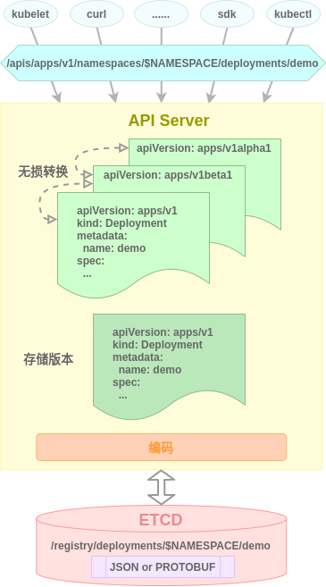

### 控制器

资源是数据, 而处理资源的逻辑就是控制器, Kubernetes是基于控制器模式设计的, 所有资源的生命周期由apiserver管理, 而资源所代表的实际含义则是由对应的控制器完成解释的. 系统组件kube-controller-manager中内置了大量的控制器用于对各种原生资源类型的逻辑处理 , 如Pod控制器, Endpoint控制器, Namespace控制器, Serviceaccount控制器等.

每个控制器内部都包含两个核心组件: **Informer/SharedInformer**和**Workqueue**, Informer或SharedInformer负责监听Kubernetes中资源对象的状态变化并缓存资源, 同时将状态变化事件(create, update, delete)通过ResourceEventHandler发送到Workqueue中, 然后由控制器中的Worker从Workqueue中取出事件交由具体的处理逻辑进行处理.

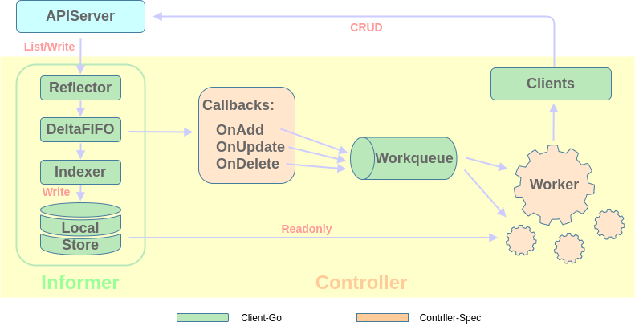

#### Informer

控制器监控资源状态需要向apiserver发送查询请求以获取相应资源全部对象的详细信息, 大量控制器对apiserver的频繁请求会对apiserver产生较大压力, 因此控制器普遍采用本地cache缓存机制实现对资源的监听和同步缓存, 具体流程如下:

1. **Reflector反射器**通过Liste/Watche机制获取监听资源的变化, 然后将变化的资源对象添加到**Delta FIFO队列**
2. **Informer通知器**从Delta FIFO队列中取出变化的对象, 将其传递到**Indexer索引器**
3. **Index索引器**为资源对象构建索引, 然后将资源数据存储到线程安全的**Key-Value本地存储**

> 当同一种资源被多个控制器监听时, 可以通过**SharedInformer**进行统一监听和缓存, 以节省监听和缓存开销.

#### Workqueue

控制器除了监听资源变化并缓存资源对象到本地之外, 还需要针对资源变化作出响应. 被监听资源对象的变化以**事件**的方式被存储到**Workqueue工作队列**中等待被处理,  事件是动作(create, update, delete)和资源对象key的组合.  具体流程如下:

1. **Informer通知器**将变化的资源传递到Indexer索引器的同时, 还会通过**ResourceEventHandler资源事件处理函数**将事件动作和资源对象key发送到**Workqueue工作队列**
2. **Worker**从Workqueue中取出事件, 根据资源对象key从**Key-Value本地存储**中获取资源对象详细数据, 然后根据事件中的动作决定对该资源对象具体的处理逻辑
3. **Worker**将处理结果通过**Client客户端**调用**APIServer**写入Kubernetes.

控制器的所有功能组件中, **Informer**(包含**Lister/Watcher**, **Reflector**, **Local Store**),**Workqueue**和**Client**都是Kubernetes的原生SDK**client-go**默认提供的, 仅**ResourceEventHandler**和**Worker**是需要开发者根据具体需求自行开发实现的.

关于client-go sdk的源码分析可参考[charlieroro博客文章](https://www.cnblogs.com/charlieroro/p/10330390.html).

## 自定义资源与控制器

除了内置的资源和控制器外, Kubernetes还原生支持自定义资源和控制器以扩展Kubernetes的功能. 

### 自定义资源

#### 自定义资源类型

Kubernetes内置了一种称为**CustomResourceDefinition**的资源类型, 通过自定义资源定义类型可以直接在Kubernetes中定义新的资源类型. 自定义的资源类型必须属于一个与已有群组不同的新群组, 新群组内可以有任意数量的自定义资源类型, 并且这些资源类型可以与其他群组中的资源类型重名. 自定义资源类型的生命周期和原生资源类型一样由apiserver管理, 二者地位相同, 在API访问, 数据持久化等各种管理方式上也是一样的.

自定义资源是通过CustomResourceDefinition资源清单的方式声明的, 典型的格式如下:

```yaml
# apps-crd.yaml
apiVersion: apiextensions.k8s.io/v1beta1
kind: CustomResourceDefinition
metadata:
  name: apps.demo.k8s.io
spec:
  group: demo.k8s.io
  versions: 
  - name: v1
    served: true
    storage: true
  scope: Namespaced
  names:
    kind: App
    plural: apps
```

各字段解释:

- apiVersion: 固定字段, 表示`CustomResourceDefinition`这一内建资源所在的群组及当前使用的api版本
- kind: 固定字段，表示是在声明自定义资源类型
- metadata.name: 自定义资源类型的全名，它由spec.group和spec.names.plural字段组合而成
- spec.group: 自定义资源类型所在群组
- spec.scope: 表示自定义资源对象的作用范围，Namespaced或Cluster. 自定义资源类型本身是Cluster的.
- spec.versions[].name: 自定义资源类型的群组版本
- spec.versions[].served: 自定义资源类型的该群组版本是否启用, 多个版本可以同时启用
- spec.versions[].storage: 自定义资源类型的该群组版本是否持久化到etcd(即存储版本), 仅一个版本可持久化
- spec.names.kind: 自定义资源的类型，惯例首字母大写
- spec.names.plural: 其值通常为kind的全小写复数，关系到自定义资源在REST API中的HTTP路径

spec.names中还有许多其他字段, 不指定则会由API Server在创建自定义资源类型时自动填充.

spec.versions字段可以指定资源的多个版本, 在每个版本中可以通过**OpenAPI V3**规范定义schema, 在schema中可以指定该资源类型的具体字段结构和描述信息. 但这不是强制的.

自定义资源类型声明完成后就可以通过`kubectl create -f apps-crd.yaml`或`kubectl apply -f apps-crd.yaml`命令进行创建了, 创建完成后可通过`kubectl get crd apps.demo.k8s.io -o yaml`命令进行查看.

自定义资源类型创建完成后, 其REST API的HTTP访问路径为`/apis/apiextensions.k8s.io/v1beta1/customresourcedefinitions/apps.demo.k8s.io`. 

> 可以通过kubectl的proxy命令开启本机到api server的反向代理(kubeconfig需要事先配置好), 方便测试.
>
> ```bash
> kubectl proxy --port 1111
> curl http://127.0.0.1:1111/apis/apiextensions.k8s.io/v1beta1/customresourcedefinitions/apps.demo.k8s.io
> ```

#### 自定义资源对象

自定义资源类型定义时只需要提供资源类型的元数据信息, 并不需要对资源的具体结构作出强制定义(当然也可以通过schema字段进行指定), 创建自定义资源的对象时可以随意指定其具体结构, 如:

```yaml
# app.yaml
apiVersion: demo.k8s.io/v1
kind: App
metadata:
  name: test
  namespace: default
spec:
  deploymentName: "webserver"
  appName: "nginx"
  replicas: 1
  image: "nginx:latest"
```

自定义资源spec下的字段只有在被特定控制器或应用按照约定的规范读取解析和处理后才具有实际意义.

自定义资源声明完成后就可以通过`kubectl create -f app.yaml`或`kubectl apply -f app.yaml`命令进行创建了, 创建完成后可通过`kubectl get apps.demo.k8s.io -o yaml`命令进行查看.

自定义资源创建完成后, 其REST API的HTTP访问路径为`/apis/demo.k8s.io/v1/namespaces/default/apps/test`(以default命名空间为例).

### 自定义控制器

自定义控制器与内置控制器的工作机制相同, 都可以通过对Kubernetes资源的监听并进行特定的逻辑处理完成对定制化需求的实现. 自定义控制器既能监听原生资源类型也能监听自定义资源类型. 与内置控制器不同的是, 自定义控制器通常是以单独容器的形式运行的. 自定义控制器能够极大丰富Kubernetes的功能特性.

自定义资源与控制器的组合可以认为是一种Kubernetes应用, 由于CoreOS推出的流行的Kubernetes应用开发框架的名称为**Operator Framework**, 因此自定义资源与控制器又被称为**Operator**. 自定义资源的声明和生命周期是由Kubernetes apiserver直接管理的, 因此Operator的开发实际上是自定义控制器的开发.

自定义控制器的开发主要包含以下内容:

- 初始化项目结构
- 定义自定义资源
- 编写自定义资源相关API
- 初始化自定义控制器
- 注册自定义资源
- 编写自定义控制器业务逻辑代码

其中只有**自定义资源定义**和**自定义控制器逻辑**代码是需要针对具体需求进行开发的(前者只是为了供后者调用).

**自定义资源相关API**通常是根据自定义资源定义和相关tag由Kubernetes官方提供的**code-generator**自动生成的, code-generator能够提供自定义资源的`deepcopy`, `clientset`, `informer`和`lister`的代码的自动生成.

**项目结构**, **自定义控制器初始化**和**自定义资源注册**由于是比较通用的结构和代码, 因此通常由一些脚手架工具自动生成. 典型的脚手架是CoreOS的**Operator Framwork**和Kubernetes兴趣小组的**Kubebuilder**. 当然这些脚手架工具还提供一些诸如自定义资源生命周期管理, Webhook集成等其他功能.

接下来我们会以手动构建, 脚手架和rancher server集成三种方式一步步介绍自定义资源和控制器的开发.

## 自定义资源与控制器开发

由于Kubernetes对自定义资源与控制器的支持是构建于**CustomResourceDefinition**的基础上的, 因此自定义资源与控制器开发除了可以称为Operator开发外, 还可被称为CRD开发, 后者更为官方.

CRD开发方式有很多, 但其核心原理是相同的, 本文将以手动构建, 脚手架和rancher server集成三种方式一步步介绍Kubernetes的CRD开发. 所有的开发方式都是基于golang的, 并且启用了module特性.

### 手动构建方式CRD开发

以手动构建的方式开发CRD虽然比较繁琐, 但相比其他方式能够更加直观深入地帮助我们理解CRD的项目结构和实现机制, 熟悉这些基本原理后在使用其他方式开发能够更加得心应手游刃有余.

手动构建方式开发CRD的基本原理和实现步骤与上文中关于控制器和自定义控制器的介绍基本上是一致的, 不再赘述.

假设我们需要自定义一个名为App的资源并为其开发自定义控制器, 该CRD的功能是根据自定义资源对象中指定的工作负载名, 镜像和副本数, 自动在Kubernetes集群中创建Deployment工作负载并维持该工作负载的副本数为期望状态. 以下是具体的开发过程.

#### 初始化go module

由于是基于go module的项目, 因此需要在项目根目录下进行初始化:

```bash
go mod init github.com/xshrim/democrd  # 项目根目录下执行, 初始化module名github.com/xshrim/democrd可随意指定
```

初始化后会自动在项目根目录下生成`go.mod`和`go.sum`文件, 其中`go.mod`文件首行为`module github.com/xshrim/democrd`, 后续项目根目录下的所有包的导入路径都需要以`github.com/xshrim/democrd`为前缀.

#### 初始化项目结构

项目结构并不是强制约束, 不同脚手架生成的结构也不尽相同, 假设当前开发的CRD的自定义资源组名为`demo.k8s.io`, 版本为`v1`, 自定义资源名为App, 这里我们提供一种比较典型的结构:

```bash
sample                           # 项目根目录
├── main.go                      # 程序入口
├── main_test.go                 # 代码功能测试
├── controller.go                # 自定义控制器业务逻辑
├── Makefile                     # make配置文件
├── Dockerfile                   # docker镜像构建文件
├── deployment.yaml              # 自定义控制器部署文件
├── go.mod                       # go module文件
├── go.sum                       # go module校验文件
├── hack                         # 自动代码生成工具目录
│   ├── boilerplate.go.txt       # 自动生成代码文件头内容
│   ├── tools.go                 # code-generator库引入
│   └── update-codegen.sh        # 自动生成代码执行脚本
├── manifest                     # 资源清单目录
│   ├── crd.yaml                 # 自定义资源类型声明文件
│   └── app.yaml                 # 自定义资源对象创建文件
└── pkg                          # 自定义资源代码目录
    ├── signals                  # 自定义控制器优雅中断代码目录
    |   ├── signal.go            # 中断信号Handler
    |   ├── signal_posix.go      # unix与类unix中断信号实现
    |   └── signal_windows.go    # windows中断信号实现
    └── apis                     # 自定义资源API代码目录
        └── demo                 # 自定义资源组目录
            ├── register.go      # 自定义资源组元数据文件
            └── v1               # 自定义资源版本目录
                ├── doc.go       # 自定义资源描述文件
                ├── types.go     # 自定义资源定义
                └── register.go  # 自定义资源注册文件
```

此项目结构中`manifest/foo.yaml`文件名需要自行指定(建议为自定义资源名), `pkg/apis/demo`目录名需要自行指定(建议为自定义资源组名), 其他目录和文件名均可以是固定的. 

#### 信号Handler编写

默认情况下当应用程序收到终止/中断信号后, 操作系统会根据信号的类型决定如何让应用退出. 在应用中加入信号Handler的作用是让应用捕获到信号并完成一些善后工作后再优雅退出. 信号Handler并不是必须的. 我们将信号handler相关代码放置在`pkg/signals`目录下.

##### signal.go

```go
package signals

import (
	"os"
	"os/signal"
)

var onlyOneSignalHandler = make(chan struct{})

// 监听SIGTERM终止和SIGINT中断信号并返回一个channel, 第一次发送这些信号将关闭channel, 第二次将直接退出
func SetupSignalHandler() (stopCh <-chan struct{}) {
	close(onlyOneSignalHandler) // panics when called twice

	stop := make(chan struct{})
	c := make(chan os.Signal, 2)
	signal.Notify(c, shutdownSignals...)
	go func() {
		<-c
		close(stop)
		<-c
		os.Exit(1) // 第二次街道终止或中断信号, 直接退出
	}()

	return stop
}
```

##### signal_posix.go

```go
// +build !windows

package signals

import (
	"os"
	"syscall"
)

var shutdownSignals = []os.Signal{os.Interrupt, syscall.SIGTERM}
```

##### signal_windows.go

```go
package signals

import (
	"os"
)

var shutdownSignals = []os.Signal{os.Interrupt}
```

#### API代码编写

依照上述项目结构创建`pkg/apis`目录下的相关目录和文件, 其中`demo`目录建议为自定义资源组名或组名的第一个字段. 各文件内容如下:

##### register.go

```go
package demo

const (
	GroupName = "demo.k8s.io"
	Version   = "v1"
)
```

##### v1/doc.go

```go
// +k8s:deepcopy-gen=package
// +groupName=demo.k8s.io
package v1
```

此文件中的两条注释是自动生成代码必须的.

##### v1/types.go

```go
package v1

import (
	metav1 "k8s.io/apimachinery/pkg/apis/meta/v1"
)

// +genclient
// +k8s:deepcopy-gen:interfaces=k8s.io/apimachinery/pkg/runtime.Object

type App struct {
	metav1.TypeMeta   `json:",inline"`
	metav1.ObjectMeta `json:"metadata,omitempty"`
	Spec      AppSpec `json:"spec"`
    Status  AppStatus `json:"status"`
}

type AppSpec struct {
	DeploymentName   string `json:"deploymentName"`   // 工作负载名
    AppName          string `json:"appName"`          // 应用名
	Replicas         int32  `json:"replicas"`         // 工作负载副本数
    Image            string `json:"image"`            // 应用镜像
}

type AppStatus struct {
	AvailableReplicas int32 `json:"availableReplicas"`
}

// +k8s:deepcopy-gen:interfaces=k8s.io/apimachinery/pkg/runtime.Object

type AppList struct {
	metav1.TypeMeta `json:",inline"`
	metav1.ListMeta `json:"metadata"`
	Items     []App `json:"items"`
}
```

自定义资源定义就是在此文件中完成的. 这里我们定义了一个名为`App`的自定义资源及其结构, 其中App结构体中的`metav1.TypeMeta`和`metav1.ObjectMeta`组合表示该自定义资源自动拥有Kubernetes资源类型的标准元数据字段. `Spec`字段名为Kubernetes资源类型的标准字段名, 但其值为为该自定义资源的特定数据结构. `AppList`为该自定义资源的数组结构.

此文件中的注释也是自动生成代码所需的.

##### v1/register.go

```go
package v1

import (
	"github.com/xshrim/democrd/pkg/apis/demo"

	metav1 "k8s.io/apimachinery/pkg/apis/meta/v1"
	"k8s.io/apimachinery/pkg/runtime"
	"k8s.io/apimachinery/pkg/runtime/schema"
)

var SchemeGroupVersion = schema.GroupVersion{
	Group:   demo.GroupName,
	Version: demo.Version,
}

var (
	SchemeBuilder = runtime.NewSchemeBuilder(addKnownTypes)
	AddToScheme   = SchemeBuilder.AddToScheme
)

func Resource(resource string) schema.GroupResource {
	return SchemeGroupVersion.WithResource(resource).GroupResource()
}

func Kind(kind string) schema.GroupKind {
	return SchemeGroupVersion.WithKind(kind).GroupKind()
}

func addKnownTypes(scheme *runtime.Scheme) error {
	scheme.AddKnownTypes(
		SchemeGroupVersion,
		&App{},
		&AppList{},
	)

	metav1.AddToGroupVersion(scheme, SchemeGroupVersion)
	return nil
}
```

此文件实现自定义资源的注册, 后续自动生成的API代码中的client代码会调用`AddToScheme`, `Resource`和`Kind`方法注册自定义资源, 实现GVK与Go types的相互映射. 如果缺失这些方法会导致编译失败. 

此段代码中大部分内容都是固定的, 仅`addKnownTypes`函数中需要添加自定义资源类型到Scheme.

#### API代码自动生成

完成上述API代码的编写后, 就可以使用Kubernetes的**code-generator**自动生成API相关的接口和方法. 该功能由hack目录下的代码完成.

##### boilerplate.go.txt

此文件中定义了自动生成的文件的文件头, 其中主要包括License和功能说明等

```txt
/*
Copyright The Kubernetes Authors.

Licensed under the Apache License, Version 2.0 (the "License");
you may not use this file except in compliance with the License.
You may obtain a copy of the License at

    http://www.apache.org/licenses/LICENSE-2.0

Unless required by applicable law or agreed to in writing, software
distributed under the License is distributed on an "AS IS" BASIS,
WITHOUT WARRANTIES OR CONDITIONS OF ANY KIND, either express or implied.
See the License for the specific language governing permissions and
limitations under the License.
*/
```

##### tools.go

此文件没有仅用于导入`code-generator`库到项目中, 文件中的`// +build tools`表示库导入后执行build操作, code-generator build后会在`$GOPATH/bin`目录下生成以下二进制文件, 这些二进制文件负责具体的代码的生成:

- deepcopy-gen: 为自定义资源生成深度拷贝方法以避免性能开销
- client-gen: 为自定义资源生成标准的操作方法(get,list,create,update,patch,delete,deleteCollection,watch)
- informer-gen: 为自定义资源生成informer以提供list/watch机制来监听相应kubernetes的event
- lister-gen: 为get和list方法提供只读缓存层

```go
// +build tools

// 导入code-generator库
package tools

import _ "k8s.io/code-generator"
```

##### update-codegen.sh

自动代码生成与更新的执行脚本.

```bash
#!/usr/bin/env bash

set -o errexit
set -o nounset
set -o pipefail

bash ../vendor/k8s.io/code-generator/generate-groups.sh \
  "deepcopy,client,informer,lister" \
  ../pkg/generated \
  ../pkg/apis \
  demo:v1 \
  --go-header-file $(pwd)/boilerplate.go.txt \
  --output-base $(pwd)/
```

脚本的主要工作是调用code-generator的`generate-groups.sh`脚本, 其语法为: `generate-groups.sh <generators> <output-package> <apis-package> <groups-versions> ...`.

脚本含义是为`pkg/apis`下的demo组的v1版自定义资源生成deepcopy, client, informer和lister代码, 生成的代码保存在$pwd目录下的`pkg/generated`目录下.

代码中唯一需要注意的是`demo:v1`需要与项目结构中的组名和版本匹配. 其他内容保持默认即可.

`update-codegen.sh`脚本中使用的`generate-groups.sh`脚本的路径是当前项目的vendor目录下, 因此需要先使用`go mod vendor`命令将code-generator库添加到项目下. 我们将导入库和生成代码的操作添加到`Makefile`中. (后续还可以将docker镜像构建已经自定义资源和控制器部署操作也添加到Makefile中)

```makefile
vendor:
	go mod vendor
	go mod tidy
gen: vendor
	cd hack && bash update-codegen.sh
```

随后执行`make gen`命令即可自动生成自定义资源API相关代码. 生成后的项目结构如下:

```bash
sample                           
├── main.go   
├── main_test.go   
├── controller.go                
├── Makefile                     
├── Dockerfile
├── deployment.yaml 
├── go.mod                       
├── go.sum                       
├── hack                         
│   ├── boilerplate.go.txt       
│   ├── tools.go                 
│   └── update-codegen.sh        
├── manifest                     
│   ├── crd.yaml                 
│   └── foo.yaml                 
├── pkg   
|   ├── signals
|   |   ├── signal.go
|   |   ├── signal_posix.go
|   |   └── signal_windows.go
│   ├── apis
│   │   └── demo
│   │       ├── register.go
│   │       └── v1
│   │           ├── doc.go
│   │           ├── register.go
│   │           ├── types.go
│   │           └── zz_generated.deepcopy.go          # 自定义资源的deepcopy方法
│   └── generated                                     # 自定义资源的client, informer, lister相关接口和方法
│       ├── clientset
│       │   └── versioned
│       │       ├── clientset.go
│       │       ├── doc.go
│       │       ├── fake
│       │       │   ├── clientset_generated.go
│       │       │   ├── doc.go
│       │       │   └── register.go
│       │       ├── scheme
│       │       │   ├── doc.go
│       │       │   └── register.go
│       │       └── typed
│       │           └── demo
│       │               └── v1
│       │                   ├── app.go
│       │                   ├── demo_client.go
│       │                   ├── doc.go
│       │                   ├── fake
│       │                   │   ├── doc.go
│       │                   │   ├── fake_app.go
│       │                   │   └── fake_demo_client.go
│       │                   └── generated_expansion.go
│       ├── informers
│       │   └── externalversions
│       │       ├── demo
│       │       │   ├── interface.go
│       │       │   └── v1
│       │       │       ├── app.go
│       │       │       └── interface.go
│       │       ├── factory.go
│       │       ├── generic.go
│       │       └── internalinterfaces
│       │           └── factory_interfaces.go
│       └── listers
│           └── demo
│               └── v1
│                   ├── app.go
│                   └── expansion_generated.go
└── vendor                                               # 导入依赖包, 具体内容忽略
```

#### 自定义资源对象部署

为了方便进行后续的CRD开发测试, 我们可以先将自定义资源的类型声明和对象创建清单文件应用到Kubernetes集群中, 清单文件格式规范在上文自定义资源部分已有介绍. 清单文件放置于`manifest`目录下.

##### crd.yaml

```yaml
apiVersion: apiextensions.k8s.io/v1beta1
kind: CustomResourceDefinition
metadata:
  name: apps.demo.k8s.io
spec:
  group: demo.k8s.io
  versions: 
  - name: v1
    served: true
    storage: true
  scope: Namespaced
  names:
    kind: App
    plural: apps
```

##### app.yaml

```yaml
apiVersion: demo.k8s.io/v1
kind: App
metadata:
  name: test
  namespace: default
spec:
  deploymentName: "webserver"
  appName: "nginx"
  replicas: 1
  image: "nginx:latest"
```

使用`kubectl apply -f manifest/crd.yaml manifest/app.yaml`命令将自定义资源类型和对象应用到集群中. 也可以添加到Makefile文件中:

```makefile
crd:
	kubectl apply -f manifest/crd.yaml manifest/app.yaml
```

#### 自动生成代码测试

自定义资源API相关代码生成后, 可以在`main_test.go`文件中编写测试用例对自动生成的代码进行功能测试.

```go
package main

import (
    "github.com/xshrim/democrd/pkg/generated/clientset/versioned"
	"github.com/xshrim/democrd/pkg/generated/clientset/versioned/typed/demo/v1"
	"github.com/xshrim/democrd/pkg/generated/informers/externalversions"
	"fmt"
	metav1 "k8s.io/apimachinery/pkg/apis/meta/v1"
	"k8s.io/client-go/tools/clientcmd"
	"testing"
	"time"
)

func TestClient(t *testing.T) {
    config, e := clientcmd.BuildConfigFromFlags()
	if e != nil {
		panic(e.Error())
	}
    //注意,这里使用的是v1这个包
	client, e := v1.NewForConfig(config)
	if e != nil {
		panic(e.Error())
	}
	appList, e := client.Apps("default").List(metav1.ListOptions{})
	fmt.Println(appList, e)

    //注意 这里的versioned包
	clientset, e := versioned.NewForConfig(config)
	factory := externalversions.NewSharedInformerFactory(clientset, 30*time.Second)
	app, e := factory.Demo().V1().Apps().Lister().Apps("default").Get("test")
	if e != nil {
		panic(e.Error())
	}
	fmt.Println(app, e)
}
```

此测试代码要求:

- 本地已经配置好Kubernetes集群连接配置文件
- 自定义资源类型声明已经应用到集群中
- 在集群的default命名空间下已经创建名为test的自定义资源对象

#### 自定义控制器编写

完成自定义资源的定义和API自动生成后, 开始编写针对该资源的自定义控制器实现业务逻辑.

如上文所述, 对于自定义控制器我们只需要开发Event Handler和Worker处理逻辑即可. 以下为示例代码:

```go
package main

import (
	"context"
	"fmt"
	"time"

	appsv1 "k8s.io/api/apps/v1"
	corev1 "k8s.io/api/core/v1"
	"k8s.io/apimachinery/pkg/api/errors"
	metav1 "k8s.io/apimachinery/pkg/apis/meta/v1"
	utilruntime "k8s.io/apimachinery/pkg/util/runtime"
	"k8s.io/apimachinery/pkg/util/wait"
	appsinformers "k8s.io/client-go/informers/apps/v1"
	"k8s.io/client-go/kubernetes"
	"k8s.io/client-go/kubernetes/scheme"
	typedcorev1 "k8s.io/client-go/kubernetes/typed/core/v1"
	appslisters "k8s.io/client-go/listers/apps/v1"
	"k8s.io/client-go/tools/cache"
	"k8s.io/client-go/tools/record"
	"k8s.io/client-go/util/workqueue"
	"k8s.io/klog/v2"

	demov1 "github.com/xshrim/democrd/pkg/apis/demo/v1"
	clientset "github.com/xshrim/democrd/pkg/generated/clientset/versioned"
	demoscheme "github.com/xshrim/democrd/pkg/generated/clientset/versioned/scheme"
	informers "github.com/xshrim/democrd/pkg/generated/informers/externalversions/demo/v1"
	listers "github.com/xshrim/democrd/pkg/generated/listers/demo/v1"
)

const controllerAgentName = "demo-controller"

const (
	SuccessSynced = "Synced"
	ErrResourceExists = "ErrResourceExists"
	MessageResourceExists = "Resource %q already exists and is not managed by App"
	MessageResourceSynced = "App synced successfully"
)

// App自定义资源的自定义控制器实现
type Controller struct {
	// kubeclientset是标准kubernetes客户端
	kubeclientset kubernetes.Interface
	// democlientset是自定义资源的客户端
	democlientset clientset.Interface

	deploymentsLister appslisters.DeploymentLister
	deploymentsSynced cache.InformerSynced
	appsLister        listers.AppLister
	appsSynced        cache.InformerSynced

    // workqueue是一个限速工作队列, 当资源发生变化时, 将事件加入队列而不是立刻处理, 这可以保证事件以固定的速率被处理且每个事件只会被一个worker处理.
	workqueue workqueue.RateLimitingInterface
	// recorder是一个将事件资源记录到api的事件记录器
	recorder record.EventRecorder
}

// NewController返回一个新的自定义资源控制器
func NewController(
	kubeclientset kubernetes.Interface,
	democlientset clientset.Interface,
	deploymentInformer appsinformers.DeploymentInformer,
	appInformer informers.AppInformer) *Controller {

	// 创建事件广播器并将demo组类型加入Kubernetes Scheme中以便事件资源对象可以被记录为该类型
	utilruntime.Must(demoscheme.AddToScheme(scheme.Scheme))
	klog.V(4).Info("Creating event broadcaster")
	eventBroadcaster := record.NewBroadcaster()
	eventBroadcaster.StartStructuredLogging(0)
	eventBroadcaster.StartRecordingToSink(&typedcorev1.EventSinkImpl{Interface: kubeclientset.CoreV1().Events("")})
	recorder := eventBroadcaster.NewRecorder(scheme.Scheme, corev1.EventSource{Component: controllerAgentName})

	controller := &Controller{
		kubeclientset:     kubeclientset,
		democlientset:     democlientset,
		deploymentsLister: deploymentInformer.Lister(),
		deploymentsSynced: deploymentInformer.Informer().HasSynced,
		appsLister:        appInformer.Lister(),
		appsSynced:        appInformer.Informer().HasSynced,
		workqueue:         workqueue.NewNamedRateLimitingQueue(workqueue.DefaultControllerRateLimiter(), "Apps"),
		recorder:          recorder,
	}

	klog.Info("Setting up event handlers")
	// 设置App资源对象发生变化时的事件处理函数
	appInformer.Informer().AddEventHandler(cache.ResourceEventHandlerFuncs{
		AddFunc: controller.enqueueApp,
		UpdateFunc: func(old, new interface{}) {
			controller.enqueueApp(new)
		},
	})

    // 设置当App资源对象创建的Deployment资源对象发生变化是的事件处理函数
	deploymentInformer.Informer().AddEventHandler(cache.ResourceEventHandlerFuncs{
		AddFunc: controller.handleObject,
		UpdateFunc: func(old, new interface{}) {
			newDepl := new.(*appsv1.Deployment)
			oldDepl := old.(*appsv1.Deployment)
			if newDepl.ResourceVersion == oldDepl.ResourceVersion {
				return
			}
			controller.handleObject(new)
		},
		DeleteFunc: controller.handleObject,
	})

	return controller
}

// Run函数为控制器关注的资源类型设置事件处理函数, 同步informer缓存并启动worker, 此函数会阻塞直到stopCh被关闭, 此时workqueue将被关闭, 程序将等待所有worker完成当前事件的处理
func (c *Controller) Run(threadiness int, stopCh <-chan struct{}) error {
	defer utilruntime.HandleCrash()
	defer c.workqueue.ShutDown()

	klog.Info("Starting App controller")

    // 启动worker前等待本地缓存完成同步
	klog.Info("Waiting for informer caches to sync")
	if ok := cache.WaitForCacheSync(stopCh, c.deploymentsSynced, c.appsSynced); !ok {
		return fmt.Errorf("failed to wait for caches to sync")
	}

	klog.Info("Starting workers")
	// 启动若干worker处理workqueue中的事件
	for i := 0; i < threadiness; i++ {
		go wait.Until(c.runWorker, time.Second, stopCh)
	}

	klog.Info("Started workers")
	<-stopCh
	klog.Info("Shutting down workers")

	return nil
}

// runWorker将持续消费workqueue中的事件
func (c *Controller) runWorker() {
	for c.processNextWorkItem() {
	}
}

// processNextWorkItem 将读取workqueue中的一个事件并调用syncHandler处理该事件
func (c *Controller) processNextWorkItem() bool {
	obj, shutdown := c.workqueue.Get()

	if shutdown {
		return false
	}

	// 将这段代码块封装为函数以便使用defer c.workqueue.Done
	err := func(obj interface{}) error {
        // 当workqueue中的某个事件被处理后, 需要调用Done函数告知workqueue事件已被处理, 此外如果不希望该事件再次进入workqueue, 还需要调用Forget函数
		defer c.workqueue.Done(obj)
		var key string
		var ok bool
		// key是namespace/name的格式
		if key, ok = obj.(string); !ok {
			c.workqueue.Forget(obj)
			utilruntime.HandleError(fmt.Errorf("expected string in workqueue but got %#v", obj))
			return nil
		}
		// 调用syncHandler函数处理指定的资源对象
		if err := c.syncHandler(key); err != nil {
			// 如果处理过程中发生错误, 将该资源再次入队
			c.workqueue.AddRateLimited(key)
			return fmt.Errorf("error syncing '%s': %s, requeuing", key, err.Error())
		}
		c.workqueue.Forget(obj)
		klog.Infof("Successfully synced '%s'", key)
		return nil
	}(obj)

	if err != nil {
		utilruntime.HandleError(err)
		return true
	}

	return true
}

// syncHandler函数比较资源对象的期望状态和实际状态并尝试统一二者, 然后更新资源对象的Status字段
func (c *Controller) syncHandler(key string) error {
	// 将namespace/name格式字符串转换为独立的namespace和name
	namespace, name, err := cache.SplitMetaNamespaceKey(key)
	if err != nil {
		utilruntime.HandleError(fmt.Errorf("invalid resource key: %s", key))
		return nil
	}

	// 获取对应资源对象
	app, err := c.appsLister.Apps(namespace).Get(name)
	if err != nil {
		// 资源对象不存在, 停止处理
		if errors.IsNotFound(err) {
			utilruntime.HandleError(fmt.Errorf("app '%s' in work queue no longer exists", key))
			return nil
		}
		return err
	}

	deploymentName := app.Spec.DeploymentName
	if deploymentName == "" {
		utilruntime.HandleError(fmt.Errorf("%s: deployment name must be specified", key))
		return nil
	}
    
    appName := app.Spec.AppName
	if appName == "" {
		utilruntime.HandleError(fmt.Errorf("%s: app name must be specified", key))
		return nil
	}
	
    image := app.Spec.Image
	if image == "" {
		utilruntime.HandleError(fmt.Errorf("%s: image must be specified", key))
		return nil
	}

	// 获取App资源对象中指定的Deployment资源
	deployment, err := c.deploymentsLister.Deployments(app.Namespace).Get(deploymentName)
	// 资源不存在则创建
	if errors.IsNotFound(err) {
		deployment, err = c.kubeclientset.AppsV1().Deployments(app.Namespace).Create(context.TODO(), newDeployment(app), metav1.CreateOptions{})
	}

    // 当获取或创建资源对象出错时, 返回错误, 该资源对象会重新入队, 后续还再次被处理
	if err != nil {
		return err
	}

	if !metav1.IsControlledBy(deployment, app) {
		msg := fmt.Sprintf(MessageResourceExists, deployment.Name)
		c.recorder.Event(app, corev1.EventTypeWarning, ErrResourceExists, msg)
		return fmt.Errorf(msg)
	}

	// 资源对象的副本数与期望不符, 调用Update自动调整为期望状态
	if app.Spec.Replicas != *deployment.Spec.Replicas {
		klog.V(4).Infof("App %s replicas: %d, deployment replicas: %d", name, app.Spec.Replicas, *deployment.Spec.Replicas)
		deployment, err = c.kubeclientset.AppsV1().Deployments(app.Namespace).Update(context.TODO(), newDeployment(app), metav1.UpdateOptions{})
	}

	// 当更新资源对象出错时, 返回错误, 该资源对象会重新入队, 后续还再次被处理
	if err != nil {
		return err
	}

	// 更新资源对象Status字段
	err = c.updateAppStatus(app, deployment)
	if err != nil {
		return err
	}

	c.recorder.Event(app, corev1.EventTypeNormal, SuccessSynced, MessageResourceSynced)
	return nil
}

func (c *Controller) updateAppStatus(app *demov1.App, deployment *appsv1.Deployment) error {
    // 不要试图从store中修改对象, 因为store作为本地缓存, 是只读的, 可以通过DeepCopy方法深度复制对象后再修改
	appCopy := app.DeepCopy()
	appCopy.Status.AvailableReplicas = deployment.Status.AvailableReplicas
	_, err := c.democlientset.SamplecontrollerV1alpha1().Apps(app.Namespace).Update(context.TODO(), appCopy, metav1.UpdateOptions{})
	return err
}

// 将App资源对象转换为namespace/name字符串并入队到workqueue
func (c *Controller) enqueueApp(obj interface{}) {
	var key string
	var err error
	if key, err = cache.MetaNamespaceKeyFunc(obj); err != nil {
		utilruntime.HandleError(err)
		return
	}
	c.workqueue.Add(key)
}

//handleObject根据资源对象的metadata.ownerReferences字段获取拥有该资源对象的App资源对象, 并调用enqueueApp将该App资源对象入队
func (c *Controller) handleObject(obj interface{}) {
	var object metav1.Object
	var ok bool
	if object, ok = obj.(metav1.Object); !ok {
		tombstone, ok := obj.(cache.DeletedFinalStateUnknown)
		if !ok {
			utilruntime.HandleError(fmt.Errorf("error decoding object, invalid type"))
			return
		}
		object, ok = tombstone.Obj.(metav1.Object)
		if !ok {
			utilruntime.HandleError(fmt.Errorf("error decoding object tombstone, invalid type"))
			return
		}
		klog.V(4).Infof("Recovered deleted object '%s' from tombstone", object.GetName())
	}
	klog.V(4).Infof("Processing object: %s", object.GetName())
	if ownerRef := metav1.GetControllerOf(object); ownerRef != nil {
		// 只处理由App资源对象创建的Deployment资源对象
		if ownerRef.Kind != "App" {
			return
		}

		app, err := c.appsLister.Apps(object.GetNamespace()).Get(ownerRef.Name)
		if err != nil {
			klog.V(4).Infof("ignoring orphaned object '%s' of app '%s'", object.GetSelfLink(), ownerRef.Name)
			return
		}

		c.enqueueApp(app)
		return
	}
}

// newDeployment为App资源对象创建一个新的Deployment资源对象并将拥有者设置为App资源对象
func newDeployment(app *demov1.App) *appsv1.Deployment {
	labels := map[string]string{
		"app":        app.Spec.AppName,
		"controller": app.Name,
	}
	return &appsv1.Deployment{
		ObjectMeta: metav1.ObjectMeta{
			Name:      app.Spec.DeploymentName,
			Namespace: app.Namespace,
			OwnerReferences: []metav1.OwnerReference{
				*metav1.NewControllerRef(app, demov1.SchemeGroupVersion.WithKind("App")),
			},
		},
		Spec: appsv1.DeploymentSpec{
			Replicas: &app.Spec.Replicas,
			Selector: &metav1.LabelSelector{
				MatchLabels: labels,
			},
			Template: corev1.PodTemplateSpec{
				ObjectMeta: metav1.ObjectMeta{
					Labels: labels,
				},
				Spec: corev1.PodSpec{
					Containers: []corev1.Container{
						{
							Name:  app.Spec.AppName,
							Image: app.Spec.Image,
						},
					},
				},
			},
		},
	}
}
```

以上自定义控制器代码完成的工作有:

- 创建自定义控制器结构体Controller, 由于我们开发的crd除了关注自定义的App资源, 还要涉及Deployment资源, 因此结构体中除了包含自定义资源的client外, 还加入了kubernetes的标准client. 此外该结构体中还包括了自定义资源和Deployment资源的Lister, workqueue和事件记录器
- 通过NewController生成自定义控制器实例, 同时通过**AddEventHandler**函数完成了对自定义的App资源和Deployment资源的事件处理器的添加, 其中App资源的Event Handler有`AddFunc`和`UpdateFunc`, 而Deployment资源的Event Handler有`AddFunc`, `UpdateFunc`和`DeleteFunc`, 各处理器均实现了相应的Handler函数. 这些Handler函数负责在必要时将监听到的事件发送到**workqueue**中.
- 在Run函数中启动了几个**Worker**协程, worker协程消费workqueue中的事件, 交由`syncHandler`处理, syncHandler通过对比App资源对象中指定的Deployment资源对象的期望状态和Kubernetes集群中实际的Deployment资源对象的状态, 决定如何处理以维持期望状态.

#### main函数编写

自定义控制器最终是以独立的应用程序运行的, 自定义资源API和控制器代码编写完成后, 就需要编写程序入口函数了.

```go
package main

import (
	"flag"
	"time"

	kubeinformers "k8s.io/client-go/informers"
	"k8s.io/client-go/kubernetes"
	"k8s.io/client-go/tools/clientcmd"
	"k8s.io/klog/v2"

	clientset "ithub.com/xshrim/democrd/pkg/generated/clientset/versioned"
	informers "ithub.com/xshrim/democrd/pkg/generated/informers/externalversions"
	"k8s.io/sample-controller/pkg/signals"
)

var (
	masterURL  string
	kubeconfig string
)

func main() {
	klog.InitFlags(nil)
	flag.Parse()

	// 启动信号处理器以便优雅响应第一次终止或中断信号
	stopCh := signals.SetupSignalHandler()

	cfg, err := clientcmd.BuildConfigFromFlags(masterURL, kubeconfig)
	if err != nil {
		klog.Fatalf("Error building kubeconfig: %s", err.Error())
	}

	kubeClient, err := kubernetes.NewForConfig(cfg)
	if err != nil {
		klog.Fatalf("Error building kubernetes clientset: %s", err.Error())
	}

	demoClient, err := clientset.NewForConfig(cfg)
	if err != nil {
		klog.Fatalf("Error building demo clientset: %s", err.Error())
	}

	kubeInformerFactory := kubeinformers.NewSharedInformerFactory(kubeClient, time.Second*30)
	demoInformerFactory := informers.NewSharedInformerFactory(demoClient, time.Second*30)

	controller := NewController(kubeClient, demoClient,
		kubeInformerFactory.Apps().V1().Deployments(),
		demoInformerFactory.Demo().V1().Apps())

    // Start方法本身是非阻塞的且每个informer均运行在独立的协程中, 因此这里不必开启单独的协程
	kubeInformerFactory.Start(stopCh)
	demoInformerFactory.Start(stopCh)

	if err = controller.Run(2, stopCh); err != nil {
		klog.Fatalf("Error running controller: %s", err.Error())
	}
}

func init() {
	flag.StringVar(&kubeconfig, "kubeconfig", "", "Path to a kubeconfig. Only required if out-of-cluster.")
	flag.StringVar(&masterURL, "master", "", "The address of the Kubernetes API server. Overrides any value in kubeconfig. Only required if out-of-cluster.")
}
```

main函数的主要工作是读取命令行配置参数, 实例化kubernetes标准client, 自定义资源client以及自定义控制器, 最后启动自定义控制器. main函数中的代码基本上都是固定代码.

#### 项目运行与部署

以上内容完成后就可以直接运行项目了, 此外也可以将其打包为docker镜像并部署到Kubernetes集群中. 我们把这些操作也添加到Makefile中.

```makefile
vendor:
	go mod vendor
gen: vendor
	cd hack && bash update-codegen.sh
crd:
	kubectl apply -f manifest/crd.yaml manifest/app.yaml
run: vendor
	go run -mod vendor .
build: vendor
	CGO_ENABLED=0 GOOS=linux go build -mod vendor -a -o demo-controller .
package: vendor
	docker build -t demo-controller:v1 .
deploy: crd
	kubectl apply -f deployment.yaml
```

##### Dockerfile

这里使用了docker的多阶段构建特性, 也可以选择先在本地生成二进制文件.

```dockerfile
FROM golang:alpine as builder
WORKDIR /root/
COPY ./ ./
RUN CGO_ENABLED=0 GOOS=linux go build -mod vendor -a -o demo-controller .

FROM alpine:latest
LABEL maintainer="xshrim@yeah.net"
WORKDIR /root/
COPY --from=builder /root/demo-controller .
CMD ["./demo-controller"]
```

##### deployment.yaml

```yaml
apiVersion: apps/v1
kind: Deployment
metadata:
  labels:
    app: demo-controller
  name: demo-controller
  namespace: default
spec:
  replicas: 1
  strategy:
    type: RollingUpdate
    rollingUpdate:
      maxUnavailable: 25%
      maxSurge: 1
  selector:
    matchLabels:
      app: demo-controller
  template:
    metadata:
      labels:
        app: demo-controller
    spec:
      containers:
        - image: demo-controller:v1
          name: demo-controller
          resources:
            limits:
              cpu: "1000m"
              memory: "1024Mi"
```

#### 其他

##### tag

在上述部分代码中存在一些特殊的注释, 如`// +k8s:deepcopy-gen=package`, `// +groupName=demo.k8s.io`等, 这些是code-generator的tag, 这些tag用于告诉code-generator如何自动生成代码.

code-generator tag的语法为:

```bash
// +tagname
or
// +tagname=value
```

code-generator tag分为两类:

- 全局tags: 全局的tag, 放在具体版本的doc.go文件中

  - `+groupName=xxxx`定义api组名称

  - `+k8s:deepcopy-gen=package`: 为包中的每一个类型自动创建deepcopy方法
  - `+k8s:deepcopy-gen=false`: 关闭自动创建deepcopy方法
  - `+k8s:deepcopy-gen=true`: 放在具体的结构体上为该结构体自动创建deepcopy方法

- 本地tags: 本地的tag, 放在types.go文件的具体struct上

  - `+k8s:deepcopy-gen:interfaces=k8s.io/apimachinery/pkg/runtime.Object`: 放在具体的结构体上表示为该结构体生成的deecopy方法需要实现指定的接口

  - `+genclient`: 放在具体的结构体上为该资源类型创建clientset, 支持多种参数:
    - `+genclient:nonNamespaced`: 集群级资源类型的clientset
    - `+genclient:noStatus`: 资源类型没有status字段
    - `+genclient:noVerbs`: clientset不生成增删改查等方法
    - `+genclient:onlyVerbs=create,delete`: clientset只生成指定的方法
    - ` +genclient:skipVerbs=get,list,create,update,patch,delete,deleteCollection,watch`: clientset不生成指定的方法
    - `+genclient:method=Create,verb=create,result=k8s.io/apimachinery/pkg/apis/meta/v1.Status`: clientset生成的方法返回指定类型

### 脚手架方式CRD开发

从上文介绍手动构建的开发方式不难看出, 即便是使用了code-generator进行部分代码的自动生成, 但过程依然很繁琐, 而且很多代码都是通用代码却只能手动编写. 为此诞生了一些脚手架工具, 在手动构建的基础上对通用代码进行了进一步的封装, 并提供一些额外的功能特性和工具集, 最大化程度低简化CRD的开发.

比较主流的脚手架工具是CoreOS的**Operator SDK**和Kubernetes兴趣小组的**KubeBuilder**. 二者实现方式有所不同, 但核心原理大同小异. 我们选择KubeBuilder作为代表进行介绍.

此外, 流行的Kubernetes多集群管理系统Rancher的开发商也开源了一套轻量级的Controller开发框架**Wrangler**, 该框架是作为Rancher Server中的Norman框架的替代者而开发的, 目前与Norman框架在Rancher Server源代码中并存, Wrangler框架对Rancher Server的自定义资源的开发具有更好的亲和性, 因此也会进行介绍.

#### KubeBuilder

KubeBuilder是在控制器运行时库和控制器工具库的基础上开发的, 它提供了一套强大的库和工具来简化从头开始构建和发布自定义资源和控制器的过程.

##### 框架

KubeBuilder主要包含四大核心组件:

- Manager: 负责运行所有的controller, 初始化共享cache并提供list/watch功能, 以及初始化与apiserver通信的client
- Cache: 负责在Controller进程中根据Scheme同步apiserver中所有该Controller关注的资源对象
- Client: 封装了资源读写方法的客户端, 客户端的查询操作是查询的本地Cache, 而写操作是直接访问apiserver 
- Controller: 自定义控制器, 控制器的调谐控制逻辑均在其中实现, KubeBuilder已经自动生成了自定义控制器的通用代码, 开发者只需要实现**Reconcile**方法即可

> Scheme用于提供GVK与Go结构体类型的相互映射关系
>
> Cache是对Reflector, Delta FIFO Queue, Indexer和LocalCache等一系列组件的封装

此外, KubeBuilder还提供了一组增强的功能组件:

- Index: 由于Controller经常要对Cache进行查询, KubeBuilder提供Index utility给Cache添加索引提升查询效率
- OwnerReference: Kubernetes GC在删除一个对象时, 任何OwnerReference是该对象的对象都会被清除, KubeBuilder支持所有对象的变更都会触发Owner对象controller的Reconcile方法
- Finalizer: KubeBuilder支持利用Kuberntes的Finalizer终止器特性获取被删除资源信息, 实现预删除钩子

KubeBuilder框架整体架构如下图所示:

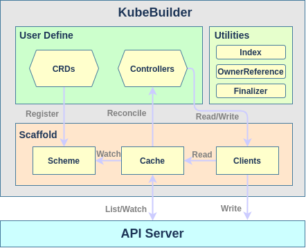

KubeBuilder整体工作流程如下图所示:

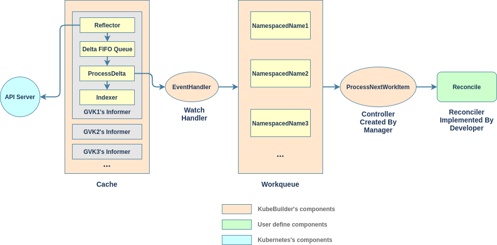

KubeBuilder将Scheme, Cache, Client, Workqueue等都封装到单独的controller-runtime库中, 多个自定义资源的Scheme, Cache, Client和Controller由一个Manager统一管理, Manager通过Scheme中的映射关系为自定义资源和该资源的Informer创建了InformersMap, 每一个自定义资源都拥有一个单独的Informer和Controller.

自定义资源的Informer通过Reflector监听API Server并将资源对象写入Delta FIFO Queue, ProcessDelta内部控制器取出资源对象并通过Indexer缓存到Cache的同时, 调用EventHandler发送资源Event(即资源对象的Namespace/Name字符串)到该资源对应的Workqueue, 该资源的Controller负责消费Workqueue中的Event, 将Event交由Reconciler进行处理.

KubeBuilder对自定义控制器进行了更为抽象的封装, 但核心原理还是一样的. 不难看出, 使用KubeBuilder进行CRD开发时, 开发人员需要做的仅仅是自定义资源的定义和controller中Reconcile方法的实现.

##### 开发

与手动构建方式应用, 我们仍然假设当前开发的CRD的自定义资源组名为`demo.k8s.io`, 版本为`v1`, 自定义资源名为App.

###### 安装

kubebuilder脚手架工具就是一个golang二进制文件, 此外其各种yaml的构造依赖kustomize.

```bash
os=$(go env GOOS)
arch=$(go env GOARCH)

# install kubebuilder
curl -sL https://go.kubebuilder.io/dl/latest/${os}/${arch} | tar -xz -C /tmp/
mv /tmp/kubebuilder_master_${os}_${arch} /usr/local/share/kubebuilder
export PATH=$PATH:/usr/local/share/kubebuilder/bin

# install kustomize
curl -s "https://raw.githubusercontent.com/kubernetes-sigs/kustomize/master/hack/install_kustomize.sh"|bash
mv kustomize /usr/local/share/kubebuilder/bin/
```

###### 初始化go module

```bash
go mod init github.com/xshrim/democrd  # 项目根目录下执行, 初始化module名github.com/xshrim/democrd可随意指定
```

###### 初始化项目

```bash
kubebuilder init --domain k8s.io    # 注意初始化项目时指定的domain相当于自定义资源API组的后缀
```

###### 创建API

```bash
kubebuilder create api --group demo --version v1 --kind App --controller --resource    # 同时创建resource和controller
```

这一步将生成自定义资源结构体定义和该资源的controller脚手架文件. 执行完成之后项目结构如下:

```bash
sample                                       # 项目根目录
├── main.go                                  # 程序入口
├── Makefile                                 # make配置文件
├── PROJECT                                  # 项目元数据文件
├── Dockerfile                               # docker镜像构建文件
├── go.mod                                   # go module文件
├── go.sum                                   # go module校验文件
├── hack                                     # 自动代码生成辅助文件目录
│   └── boilerplate.go.txt                   # 自动生成代码文件头内容
├── api                                      # 自定义资源API代码目录
│   └── v1                                   # 自定义资源版本目录
│       ├── app_types.go                     # 自定义资源定义
│       ├── groupversion_info.go             # 自定义资源描述文件
│       └── zz_generated.deepcopy.go         # 自定义资源深度复制代码
├── bin                                      # 二进制文件保存目录
│   └── manager                              # 生成的controller可执行文件
├── config                                   # 可能使用到的yaml文件
│   ├── certmanager                          # 提供证书管理支持的清单文件目录
│   │   ├── certificate.yaml
│   │   ├── kustomization.yaml
│   │   └── kustomizeconfig.yaml
│   ├── crd                                  # 部署crd的清单文件目录
│   │   ├── kustomization.yaml
│   │   ├── kustomizeconfig.yaml
│   │   └── patches
│   │       ├── cainjection_in_apps.yaml
│   │       └── webhook_in_apps.yaml
│   ├── default                             # 默认的清单文件目录
│   │   ├── kustomization.yaml
│   │   ├── manager_auth_proxy_patch.yaml
│   │   ├── manager_webhook_patch.yaml
│   │   └── webhookcainjection_patch.yaml
│   ├── manager                              # 部署controller的清单文件目录
│   │   ├── kustomization.yaml
│   │   └── manager.yaml
│   ├── prometheus                           # 部署监控servicemonitor的清单文件目录
│   │   ├── kustomization.yaml
│   │   └── monitor.yaml
│   ├── rbac                                 # 提供角色访问控制的清单文件目录
│   │   ├── auth_proxy_role_binding.yaml
│   │   ├── auth_proxy_role.yaml
│   │   ├── auth_proxy_service.yaml
│   │   ├── kustomization.yaml
│   │   ├── leader_election_role_binding.yaml
│   │   ├── leader_election_role.yaml
│   │   └── role_binding.yaml
│   ├── samples                              # 自定义资源对象示例清单文件目录
│   │   └── demo_v1_app.yaml
│   └── webhook                              # 提供准入控制的清单文件目录
│       ├── kustomization.yaml
│       ├── kustomizeconfig.yaml
│       └── service.yaml
└── controllers                              # 自定义控制器目录
    ├── app_controller.go                    # 自定义控制器业务逻辑
    └── suite_test.go                        # 自定义控制器功能测试
```

###### 编写API定义

自定义资源结构体位于`api/v1/app_types.go`文件中, 通常我们只需要自定义**AppSpec**结构体中的内容即可.

```go
// AppSpec defines the desired state of App
type AppSpec struct {
	// INSERT ADDITIONAL SPEC FIELDS - desired state of cluster
	// Important: Run "make" to regenerate code after modifying this file

	// Foo is an example field of App. Edit App_types.go to remove/update
	DeploymentName string `json:"deploymentName"` // 工作负载名
	AppName        string `json:"appName"`        // 应用名
	Replicas       int    `json:"replicas"`       // 工作负载副本数
	Image          string `json:"image"`          // 应用镜像
}
```

###### 重新生成代码

自定义资源结构体重新定义后, 需要重新生成相关代码, 包括该资源的控制器代码和crd资源清单. 由于KubeBuilder自动生成的Makefile中包含了大量常用操作的配置, 因此后续的操作均可以通过`make`命令完成.

```bash
make generate   # 更新自定义控制器代码
make manifests  # 更新crd资源清单(此target包含generate)
```

###### 编写自定义控制器

KubeBuilder已经自动在`controllers/app_controller.go`文件中生成了自定义控制器的脚手架代码, 我们只需要实现其中的**Reconcile**调谐方法即可. 

此方法传入的参数就是从Workqueue中获取到的Event(即资源的NamespacedName), 而其所属类型**AppReconciler**中包含的**Client**接口所实现的**Reader**, **Writer**和**StatusClient**能够分别完成Cache读, APIServer写和Status字段写操作. 因此在Reconcile方法中能够满足所有的自定义资源管理逻辑.

```go
// AppReconciler reconciles a App object
type AppReconciler struct {
	client.Client
	Log    logr.Logger
	Scheme *runtime.Scheme
}

// +kubebuilder:rbac:groups=demo.k8s.io,resources=apps,verbs=get;list;watch;create;update;patch;delete
// +kubebuilder:rbac:groups=demo.k8s.io,resources=apps/status,verbs=get;update;patch

func (r *AppReconciler) Reconcile(req ctrl.Request) (ctrl.Result, error) {
	_ = context.Background()
	_ = r.Log.WithValues("app", req.NamespacedName)

	// your logic here

	return ctrl.Result{}, nil
}
```

###### 项目运行与部署

项目测试, 运行和部署操作命令也都在Makefile文件中, 不再赘述.

```bash
make test           # 测试代码
make install        # 安装crd资源到Kubernetes集群
make manager        # 构建自定义控制器二进制文件
make run            # 运行自定义控制器
make deploy         # 部署自定义控制器到Kubernetes集群
make generate       # 自动生成代码
make docker-build   # 构建自定义控制器镜像
```

###### 其他

其他关于KubeBuilder的更多使用方法参考[KubeBuilder官方文档](https://book.kubebuilder.io/)

#### Wrangler

Wrangler框架作为Norman框架的替代者, 相比Norman具有更好的通用性和易用性, 方便实现与Rancher Server自定义控制器的解耦与集成. Wrangler的开发方式偏向于手动构建式开发, 它主要的工作是作了以下三个方面的封装, 从而让控制器业务逻辑的具体开发过程更加便捷:

- 在Kubernetes原生client-go API的基础上封装并提供了大量的工具函数
- 对Kubernetes内置的Controller API进一步封装以提供更加简单好用的接口
- 提供一个基于code-generatord控制器代码生成器用于为自定义资源生成统一风格的自定义Controller接口

目前Wrangler框架提供的方法和自定义Controller在Rancher Server主版本中有大量使用, 为了后续进行Rancher Server集成式自定义控制器的开发, 有必要对Wrangler框架作一些了解.

##### 框架

Wrangler框架是和Rancher开源的另一个更底层的控制器框架**Lasso**配合使用的(Lasso也是Norman框架的底层), Wrangler框架通过多层级的工厂类型最终生成相应资源的资源Controller(包括原生资源和自定义资源, 原生资源的资源Controller在Wrangler包中已经提供, 也可自行生成), 资源Controller中封装了资源的所有抽象方法和Handler注册方法, 以及其SharedController对象. 开发者只需要完成自定义资源的定义和**OnChange**, **OnRemove**事件的**Handler**即可.

资源Controller的SharedController对象则是由底层的Lasso框架生成的, 该对象主要包含三大组件:

- Cache: 包含Informer(Reflector, Delta FIFO Queue), Indexer, LocalCache及其相关接口的完整封装
- Client: 资源的读写客户端, 负责读取Cache中的资源对象并向API Server写入资源数据
- Controller: 包含控制器的EventHandler, Workqueue, Worker及其相关接口的完整封装

SharedController类型是对Controller的扩展, 一个SharedController中可以注册多个Handler. 

在Wrangler框架层, 用户通过调用资源Controller的事件注册函数将Handler传入Lass框架层的资源SharedController对象, 最终传入Controller的Worker处理逻辑中, 控制器的基本架构的所有组件的实现几乎都在Lasso层. 当资源状态发生变化时, Worker会调用从Wrangler层传入的Handler方法完成处理逻辑. 开发者在Handler方法中只需要调用Wrangler层封装的抽象方法(如Create, Delete, Update, Get, Watch, Patch等), 这些抽象方法最终都会调用Lasso层中对应的具体实现.

Wrangler框架的整体架构如下图所示:

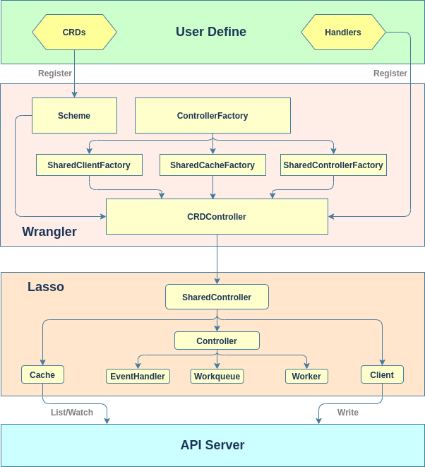

##### 开发

与上文示例应用一样, 我们仍然假设当前开发的CRD的自定义资源组名为`demo.k8s.io`, 版本为`v1`, 自定义资源名为App.

###### 初始化go module

```bash
go mod init github.com/xshrim/democrd  # 在项目根目录下执行, 初始化module名github.com/xshrim/democrd可随意指定
```

###### 初始化项目结构

```bash
sample                           # 项目根目录
├── main.go                      # 程序入口
├── main_test.go                 # 代码功能测试
├── controller.go                # 自定义控制器业务逻辑
├── Makefile                     # make配置文件
├── Dockerfile                   # docker镜像构建文件
├── deployment.yaml              # 自定义控制器部署文件
├── go.mod                       # go module文件
├── go.sum                       # go module校验文件
├── hack                         # 自动代码生成工具目录
│   └── boilerplate.go.txt       # 自动生成代码文件头内容
├── manifest                     # 资源清单目录
│   ├── crd.yaml                 # 自定义资源类型声明文件
│   └── app.yaml                 # 自定义资源对象创建文件
└── pkg                          # 自定义资源代码目录
    ├── codegen                  # 代码自动生成程序目录
    |   ├── main.go              # 代码自动生成程序入口
    |   └── cleanup.go           # 自动生成代码清理程序目录
    |       └── main.go          # 自动生成代码清理程序入口
    └── apis                     # 自定义资源API代码目录
        └── demo.k8s.io          # 自定义资源组目录
            └── v1               # 自定义资源版本目录
                └── types.go     # 自定义资源定义
```

###### API代码编写

自定义资源结构体位于`pkg/apis/demo.k8s.io/v1/types.go`文件中, 代码结构与手动构建方式相同, tag也是通用的. 需要注意的是, 这里的资源组目录最好填写组名全名以与后续自动生成的代码包路径保持一致 . 自定义资源结构体对应的List结构体(如AppList)会自动生成, 无需添加.

- types.go

```go
package v1

import (
	metav1 "k8s.io/apimachinery/pkg/apis/meta/v1"
)

// +genclient
// +k8s:deepcopy-gen:interfaces=k8s.io/apimachinery/pkg/runtime.Object

// App is a specification for a App resource
type App struct {
	metav1.TypeMeta   `json:",inline"`
	metav1.ObjectMeta `json:"metadata,omitempty"`

	Spec   AppSpec   `json:"spec"`
	Status AppStatus `json:"status"`
}

// AppSpec is the spec for a App resource
type AppSpec struct {
	DeploymentName   string `json:"deploymentName"`   // 工作负载名
    AppName          string `json:"appName"`          // 应用名
	Replicas         int32  `json:"replicas"`         // 工作负载副本数
    Image            string `json:"image"`            // 应用镜像
}

// AppStatus is the status for a App resource
type AppStatus struct {
	AvailableReplicas int32 `json:"availableReplicas"`
}
```

###### 代码自动生成工具编写

代码自动生成工具库是rancher基于code-generator编写的, 自定义资源的注册和API生成都是自动完成的, 我们只需要补全controller-gen的Run方法参数即可. 此外自动生成代码的清理工具代码无需修改.

- codegen/main.go

  这里需要根据实际项目结构填写**OutputPackage**, **Groups**参数, 注意资源的List结构体无需加入Types列表中. 另

  外如果自定义控制器中存在对Kubernetes原生资源的操作, 可以将相应资源组也加入列表中生成相应资源的API(core组组名可留空), 但通常这是不必要的, 我们支持导入wrangler框架的包即可, 这里作为演示保留.

```go
package main

import (
	demov1 "github.com/xshrim/democrd/pkg/apis/demo.k8s.io/v1"
	controllergen "github.com/rancher/wrangler/pkg/controller-gen"
	"github.com/rancher/wrangler/pkg/controller-gen/args"
	appsv1 "k8s.io/api/apps/v1"
)

func main() {
	controllergen.Run(args.Options{
		OutputPackage: "github.com/xshrim/democrd/pkg/generated",
		Boilerplate:   "hack/boilerplate.go.txt",
		Groups: map[string]args.Group{
			"demo.k8s.io": {
				Types: []interface{}{
					demov1.App{},
				},
				GenerateTypes: true,
			},
			// Optionally you can use wrangler-api project which
			// has a lot of common kubernetes APIs already generated.
			// In this controller we will use wrangler-api for apps api group
			"apps": {
				Types: []interface{}{
					appsv1.Deployment{},
				},
				InformersPackage: "k8s.io/client-go/informers",
				ClientSetPackage: "k8s.io/client-go/kubernetes",
				ListersPackage:   "k8s.io/client-go/listers",
			},
		},
	})
}
```

- codegen/clean/main.go

```go
package main

import (
	"os"
    "log"

	"github.com/rancher/wrangler/pkg/cleanup"
)

func main() {
	if err := cleanup.Cleanup("./pkg/apis"); err != nil {
		log.Fatal(err)
	}
	if err := os.RemoveAll("./pkg/generated"); err != nil {
		log.Fatal(err)
	}
}
```

###### API代码自动生成

使用命令`go run -mod vendor pkg/codegen/main.go`即可完成自定义资源API代码的自动生成. 方便起见我们仍然将操作添加到Makefile.

```makefile
vendor:
	go mod tidy
	go mod vendor

clean: vendor
	go run -mod vendor pkg/codegen/cleanup/main.go
	# rm -rf $GOPATH/src/当前module名

generate: clean
	go run -mod vendor pkg/codegen/main.go
```

```bash
make generate
```

生成后的项目结构如下:

```bash
sample                           
├── main.go                     
├── main_test.go                 
├── controller.go                
├── Makefile                     
├── Dockerfile                   
├── deployment.yaml              
├── go.mod                       
├── go.sum                       
├── hack                         
│   └── boilerplate.go.txt       
├── manifest                     
│   ├── crd.yaml                 
│   └── app.yaml                 
├── pkg                          
|   ├── codegen                  
|   |   ├── main.go              
|   |   └── cleanup.go           
|   |       └── main.go          
│   ├── apis                     
│   |   └── demo.k8s.io          
│   |       ├── v1
|   |       |   ├── doc.go                         # 自定义资源描述文件
│   |       |   ├── types.go       
|   |       |   ├── zz_generated_deepcopy.go       # 自定义资源的deepcopy方法
|   |       |   ├── zz_generated_list_types.go     # 自定义资源的list类型
|   |       |   └── zz_generated_register.go       # 自定义资源注册文件
|   |       └── zz_generated_register.go           # 自定义资源组元数据文件
|   └── generated                                  # 自定义资源API相关方法
|       └── controllers
|           ├── apps                               # kubernetes内置apps组资源API封装
|           │   ├── factory.go
|           │   ├── interface.go
|           │   └── v1
|           │       ├── deployment.go
|           │       └── interface.go
|           └── demo.k8s.io                        # 自定义资源组资源API封装
|               ├── factory.go
|               ├── interface.go
|               └── v1
|                   ├── app.go
|                   └── interface.go
└── vendor                                         # 导入依赖包, 具体内容忽略
```

###### 自定义资源对象部署

为了方便进行后续的CRD开发测试, 我们可以先将自定义资源的类型声明和对象创建清单文件应用到Kubernetes集群中, 清单文件格式规范在上文自定义资源部分已有介绍. 清单文件放置于`manifest`目录下.

- crd.yaml

```yaml
apiVersion: apiextensions.k8s.io/v1beta1
kind: CustomResourceDefinition
metadata:
  name: apps.demo.k8s.io
spec:
  group: demo.k8s.io
  versions: 
  - name: v1
    served: true
    storage: true
  scope: Namespaced
  names:
    kind: App
    plural: apps
```

- app.yaml

```yaml
apiVersion: demo.k8s.io/v1
kind: App
metadata:
  name: test
  namespace: default
spec:
  deploymentName: "webserver"
  appName: "nginx"
  replicas: 1
  image: "nginx:latest"
```

使用`kubectl apply -f manifest/crd.yaml manifest/app.yaml`命令将自定义资源类型和对象应用到集群中. 也可以添加到Makefile文件中:

```makefile
crd:
	kubectl apply -f manifest/crd.yaml manifest/app.yaml
```

###### 自动生成代码测试

###### 自定义控制器编写

完成自定义资源的定义和API自动生成后, 开始编写针对该资源的自定义控制器实现业务逻辑.

如上文所述, 对于自定义控制器我们只需要注册并编写Event Handler即可. Wrangler框架中的Event简化为两种: **OnChange**和**OnRemove**. 以下为示例代码:

```go
package main

import (
	"context"
	"fmt"

	v1 "github.com/rancher/wrangler/pkg/generated/controllers/apps/v1"
	demov1 "github.com/xshrim/democrd/pkg/apis/demo.k8s.io/v1"
	democontrollerv1 "github.com/xshrim/democrd/pkg/generated/controllers/demo.k8s.io/v1"
	appsv1 "k8s.io/api/apps/v1"
	corev1 "k8s.io/api/core/v1"
	"k8s.io/apimachinery/pkg/api/errors"
	metav1 "k8s.io/apimachinery/pkg/apis/meta/v1"
	"k8s.io/apimachinery/pkg/runtime/schema"
	utilruntime "k8s.io/apimachinery/pkg/util/runtime"
	"k8s.io/client-go/kubernetes/scheme"
	typedcorev1 "k8s.io/client-go/kubernetes/typed/core/v1"
	"k8s.io/client-go/tools/record"
	"k8s.io/klog/v2"
)

const controllerAgentName = "demo-controller"

const (
	ErrResourceExists = "ErrResourceExists"

	MessageResourceExists = "Resource %q already exists and is not managed by App"
)

// Handler是App自定义资源的自定义控制器实现, 通常包含自定义资源的Cache和Controller以及事件记录器, 如果涉及对其他资源的操作, 可增加相应资源的Cache和Controller
type Handler struct {
	deployments      v1.DeploymentClient
	deploymentsCache v1.DeploymentCache
	apps             democontrollerv1.AppController
	appsCache        democontrollerv1.AppCache
	recorder         record.EventRecorder
}

// 注册自定义资源控制器, 单独传入所有需要操作的资源的控制器, 而非通用的k8s实例化客户端
func Register(
	ctx context.Context,
	events typedcorev1.EventInterface,
	deployments v1.DeploymentController,
	apps democontrollerv1.AppController) {

	controller := &Handler{
		deployments:      deployments,
		deploymentsCache: deployments.Cache(),
		apps:             apps,
		appsCache:        apps.Cache(),
		recorder:         buildEventRecorder(events),
	}

	// 注册event handler
	deployments.OnChange(ctx, "app-handler", controller.OnDeploymentChanged)
	apps.OnChange(ctx, "app-handler", controller.OnAppChanged)
}

// 创建事件广播
// 将自定义资源控制器类型加入默认的Kubernetes Scheme中以便Kubernetes能够记录该控制器事件
func buildEventRecorder(events typedcorev1.EventInterface) record.EventRecorder {
	utilruntime.Must(demov1.AddToScheme(scheme.Scheme))
	klog.V(4).Info("Creating event broadcaster")
	eventBroadcaster := record.NewBroadcaster()
	eventBroadcaster.StartLogging(klog.Infof)
	eventBroadcaster.StartRecordingToSink(&typedcorev1.EventSinkImpl{Interface: events})
	return eventBroadcaster.NewRecorder(scheme.Scheme, corev1.EventSource{Component: controllerAgentName})
}

func (h *Handler) OnAppChanged(key string, app *demov1.App) (*demov1.App, error) {
	// app will be nil if key is deleted from cache
	if app == nil {
		return nil, nil
	}

	// 资源删除时首先会设置资源的DeletionTimestamp字段值为删除操作的时间, 这是一个Update事件
    // 通过DeletionTimestamp字段是否为空判断资源是否即将删除
    // 当资源关联的终止器均被执行后资源才会真正删除, 从而触发Delete事件
    // 因此删除资源触发OnChange时, 直接将其关联的终止器删除并直接返回(仅针对我们创建的自定义资源)
	if app.DeletionTimestamp != nil {
		finalizers := app.GetFinalizers()
		for i, finalizer := range finalizers {
			if finalizer == "wrangler.k8s.io/demo-controller" {
				finalizers = append(finalizers[:i], finalizers[i+1:]...)
				app = app.DeepCopy()
				app.SetFinalizers(finalizers)
				_, err := h.apps.Update(app)
				if err != nil {
					return nil, err
				}
				break
			}
		}
		return nil, nil
	}

	deploymentName := app.Spec.DeploymentName
	if deploymentName == "" {
		utilruntime.HandleError(fmt.Errorf("%s: deployment name must be specified", key))
		return nil, nil
	}
	appName := app.Spec.AppName
	if appName == "" {
		utilruntime.HandleError(fmt.Errorf("%s: app name must be specified", key))
		return nil, nil
	}

	image := app.Spec.Image
	if image == "" {
		utilruntime.HandleError(fmt.Errorf("%s: image must be specified", key))
		return nil, nil
	}

	deployment, err := h.deploymentsCache.Get(app.Namespace, deploymentName)
	// 资源不存在则创建
	if errors.IsNotFound(err) {
		deployment, err = h.deployments.Create(newDeployment(app))
	}

    // 获取或创建资源失败时, 直接返回错误, 资源将重新进入workqueue, 稍后再次尝试处理
	if err != nil {
		return nil, err
	}

    // 如果资源并非由我们的自定义资源控制器所管理(OwnerReference字段), 将发出事件记录告警并正常返回
	if !metav1.IsControlledBy(deployment, app) {
		msg := fmt.Sprintf(MessageResourceExists, deployment.Name)
		h.recorder.Event(app, corev1.EventTypeWarning, ErrResourceExists, msg)
		// 注意此情况不应返回错误, 否则会一直反复进入workqueue
		return nil, nil
	}

    // 对比资源的实际状态与期望状态, 进行调谐(这里对比的状态是副本数)
	if app.Spec.Replicas != *deployment.Spec.Replicas {
		klog.Infof("App %s replicas: %d, deployment replicas: %d", app.Name, app.Spec.Replicas, *deployment.Spec.Replicas)
		deployment, err = h.deployments.Update(newDeployment(app))
	}

	// 调谐失败返回错误, 资源将重新进入workqueue, 稍后再次尝试处理
	if err != nil {
		return nil, err
	}

	// 更新自定义资源的状态字段
	err = h.updateAppStatus(app, deployment)
	if err != nil {
		return nil, err
	}

	return nil, nil
}

func (h *Handler) updateAppStatus(app *demov1.App, deployment *appsv1.Deployment) error {
	// 注意不要试图修改从本地缓存中获取到的资源对象, 因为它是只读的
    // 应该通过DeepCopy获取该对象的副本然后进行修改和应用
	appCopy := app.DeepCopy()
	appCopy.Status.AvailableReplicas = deployment.Status.AvailableReplicas
	// which is ideal for ensuring nothing other than resource status has been updated.
    // 优先使用UpdateStatus方法更新自定义资源的Status字段, 因为该方法绝对不会修改其他字段
    // 但如果CustomResourceSubresources特性未开启的话, 就只能使用Update方法进行更新了
	_, err := h.apps.Update(appCopy)
	return err
}

func (h *Handler) OnDeploymentChanged(key string, deployment *appsv1.Deployment) (*appsv1.Deployment, error) {
	if deployment == nil {
		return nil, nil
	}

	if ownerRef := metav1.GetControllerOf(deployment); ownerRef != nil {
		// 如果资源对象不是依据我们的自定义资源创建的, 则忽略
		if ownerRef.Kind != "App" {
			return nil, nil
		}

		app, err := h.appsCache.Get(deployment.Namespace, ownerRef.Name)
		if err != nil {
			klog.Infof("ignoring orphaned object '%s' of app '%s'", deployment.GetSelfLink(), ownerRef.Name)
			return nil, nil
		}

		h.apps.Enqueue(app.Namespace, app.Name)
		return nil, nil
	}

	return nil, nil
}

// 根据自定义资源App中定义的对Deployment资源的要求, 进行Deployment资源清单数据的生成
// 这里要通过OwOwnerReferences字段指定App资源为其所有者, 以便与其他Deployment区分
func newDeployment(app *demov1.App) *appsv1.Deployment {
	labels := map[string]string{
		"app":        app.Spec.AppName,
		"controller": app.Name,
	}
	return &appsv1.Deployment{
		ObjectMeta: metav1.ObjectMeta{
			Name:      app.Spec.DeploymentName,
			Namespace: app.Namespace,
			OwnerReferences: []metav1.OwnerReference{
				*metav1.NewControllerRef(app, schema.GroupVersionKind{
					Group:   demov1.SchemeGroupVersion.Group,
					Version: demov1.SchemeGroupVersion.Version,
					Kind:    "App",
				}),
			},
		},
		Spec: appsv1.DeploymentSpec{
			Replicas: &app.Spec.Replicas,
			Selector: &metav1.LabelSelector{
				MatchLabels: labels,
			},
			Template: corev1.PodTemplateSpec{
				ObjectMeta: metav1.ObjectMeta{
					Labels: labels,
				},
				Spec: corev1.PodSpec{
					Containers: []corev1.Container{
						{
							Name:  app.Spec.AppName,
							Image: app.Spec.Image,
						},
					},
				},
			},
		},
	}
}
```

以上代码与手动创建方式中的自定义控制器代码的功能逻辑大致相同, 只是Wrangler对事件监听和入队出队代码进行了封装, 开发者只需要编写Event Handler即可. 不再赘述.

需要注意的是, Kubernetes中的资源删除操作是分两阶段进行的:

1. 为资源添加`DeletionTimestamp`字段(patch)并设置值为发起删除请求的时间戳
2. 等待资源的`Finalizers`字段指定的所有终止器完成善后工作, 然后删除资源

而第1阶段的行为会被认为是Update操作并触发OnUpdate事件(对应于Wrangler框架, 则会触发OnChange事件), 因此相应Handler中的逻辑会被执行. 之后待资源真正被删除时才会触发OnDelete事件(对应Wrangler框架的OnRemove事件). 

OnChange事件Handler通常响应Create和Update操作并执行相应处理逻辑, 因此为了避免OnChange事件Handler误将Delete操作当做Update进行响应, 需要在资源的OnChange事件Handler中进行相应判定和处理, 例如上文`if app.DeletionTimestamp != nil `代码段的处理逻辑: 清除资源上的Finalizer然后直接退出Handler函数.

###### main函数编写

```go
package main

import (
	"context"
	"flag"

	"github.com/rancher/wrangler/pkg/generated/controllers/apps"
	"github.com/rancher/wrangler/pkg/kubeconfig"
	"github.com/rancher/wrangler/pkg/signals"
	"github.com/rancher/wrangler/pkg/start"
	"k8s.io/client-go/kubernetes"
	"k8s.io/klog/v2"

	democontroller "github.com/xshrim/democrd/pkg/generated/controllers/demo.k8s.io"
)

var (
	masterURL      string
	kubeconfigFile string
)

func init() {
	flag.StringVar(&kubeconfigFile, "kubeconfig", "", "Path to a kubeconfig. Only required if out-of-cluster.")
	flag.StringVar(&masterURL, "master", "", "The address of the Kubernetes API server. Overrides any value in kubeconfig. Only required if out-of-cluster.")
	flag.Parse()
}

func main() {
	// 优雅处理终止信号
	klog.V(4).Infof("Starting %s ...", controllerAgentName)
	ctx := signals.SetupSignalHandler(context.Background())

    // 像kubectl一样加载kubeconfig文件(依次从指定文件, 默认文件位置和默认serviceaccount位置加载)
	cfg, err := kubeconfig.GetNonInteractiveClientConfig(kubeconfigFile).ClientConfig()
	if err != nil {
		klog.Fatalf("Error building kubeconfig: %s", err.Error())
	}

    // 实例化通用的k8s客户端(用于获取事件接口)
	kubeClient := kubernetes.NewForConfigOrDie(cfg)
	// 获取Kubernetes内置的apps组控制器工厂
	apps := apps.NewFactoryFromConfigOrDie(cfg)
	// 获取自定义资源App所在的demo组控制器工厂
	demo := democontroller.NewFactoryFromConfigOrDie(cfg)

    // 注册资源Handler(仅传递必须的资源控制器)
	Register(ctx, kubeClient.CoreV1().Events(""), apps.Apps().V1().Deployment(), demo.Demo().V1().App())

	// 启动所有控制器
	if err := start.All(ctx, 2, apps, demo); err != nil {
		klog.Fatalf("Error starting: %s", err.Error())
	}

	<-ctx.Done()
}
```

main函数的主要工作是读取命令行配置参数, 实例化kubernetes标准client和自定义资源client, 然后注册EventHandler, 最后启动自定义控制器. main函数中的代码基本上都是固定代码.

###### 项目运行与部署

以上内容完成后就可以直接运行项目了, 此外也可以将其打包为docker镜像并部署到Kubernetes集群中. 我们把这些操作也添加到Makefile中.

```makefile
vendor:
	go mod tidy
	go mod vendor

build: vendor generate
	CGO_ENABLED=0 GOOS=linux go go build -mod vendor -a -o demo-controller .

clean: vendor
	go run -mod vendor pkg/codegen/cleanup/main.go

generate: clean
	go run -mod vendor pkg/codegen/main.go

crd:
	kubectl apply -f manifest/crd.yaml manifest/app.yaml

run: vendor
	go run -mod vendor .

build: vendor
	CGO_ENABLED=0 GOOS=linux go build -mod vendor -a -o demo-controller .

package: vendor
	docker build -t demo-controller:v1 .

deploy: crd
	kubectl apply -f deployment.yaml
```

- Dockerfile

这里使用了docker的多阶段构建特性, 也可以选择先在本地生成二进制文件.

```dockerfile
FROM golang:alpine as builder
WORKDIR /root/
COPY ./ ./
RUN CGO_ENABLED=0 GOOS=linux go build -mod vendor -a -o demo-controller .

FROM alpine:latest
LABEL maintainer="xshrim@yeah.net"
WORKDIR /root/
COPY --from=builder /root/demo-controller .
CMD ["./demo-controller"]
```

- deployment.yaml

```yaml
apiVersion: apps/v1
kind: Deployment
metadata:
  labels:
    app: demo-controller
  name: demo-controller
  namespace: default
spec:
  replicas: 1
  strategy:
    type: RollingUpdate
    rollingUpdate:
      maxUnavailable: 25%
      maxSurge: 1
  selector:
    matchLabels:
      app: demo-controller
  template:
    metadata:
      labels:
        app: demo-controller
    spec:
      containers:
        - image: demo-controller:v1
          name: demo-controller
          resources:
            limits:
              cpu: "1000m"
              memory: "1024Mi"
```

###### 其他

Wrangler框架此示例代码导入的相关库版本如下:

```go
module github.com/xshrim/democrd

go 1.13

require (
	github.com/rancher/lasso v0.0.0-20200905045615-7fcb07d6a20b
	github.com/rancher/wrangler v0.7.2
	k8s.io/api v0.18.8
	k8s.io/apimachinery v0.18.8
	k8s.io/client-go v0.18.8
	k8s.io/klog/v2 v2.2.0
)
```

### Rancher集成方式CRD开发

上文中介绍的无论是手动构建方式还是脚手架方式的CRD开发都是独立运行的, 自定义资源控制器通常是以单独的pod的方式运行在Kubernetes集群中的(当然以二进制方式运行在集群外也可以), 这是扩展Kubernetes功能的推荐实现方式, 如Prometheus Operator, BIGIP-Controller等都是如此. 

事实上, 很多Kubernetes集群管理平台采用的以Kubernetes集群管理Kubernetes集群的理念本质上也是利用了自定义资源和控制器的扩展能力: 管理数据以自定义资源的形式存储在管理集群的Etcd数据库中, 管理逻辑以自定义控制器的形式作为Pod运行在管理集群上, 用一个全局管理集群纳管多个业务集群. 如流行的Rancher, OpenShift, Alauda容器云平台都是这样做的(OpenShift的管理集群即是业务集群). 其好处是:

- 保证整个平台是云原生自洽的, 无需引入额外的技术和中间件, 便于维护
- 最大限度复用Kuberenetes集群组件, 发挥Kuberenetes在高可用, 故障恢复, 弹性伸缩, 分布式和发布策略等方面的优势

#### Rancher CRD开发简介

Rancher是主流的Kubernetes多集群管理解决方案, Rancher Server是核心的管理服务, 它以Pod的方式运行在管理集群中, 其在管理集群中定义了大量的自定义资源以提供多集群管理功能和丰富的高级特性, 而相应的众多的自定义资源控制器则是以协程的方式运行在Rancher Server中.

如果希望在Rancher Server的基础上进行二次开发, 修改或增加Rancher功能特性, 运行独立的自定义控制器Pod显然是不合适的, 此外Rancher中的自定义资源控制器代码是深度集成在整个Server代码中的: 

- 对自定义资源控制器进行进一步封装以协调配合完成复杂的管理逻辑
- 批量注册自定义资源控制器并自动完成自定义资源类型的创建
- 管理自定义资源权限
- 自定义资源分为全局级和集群级
- 提供独立的原生和自定义资源API和API-UI
- 抽象化前后端资源操作并提供统一接口

因此, 上文介绍的手动和脚手架方式开发的CRD控制器代码并不能直接应用到Rancher Server源代码中. 需要进行一些额外的代码集成:

1. 生成自定义资源脚手架代码
2. 编写自定义控制器代码
3. 在RancherServer中注册自定义控制器
4. 封装Rancher风格API

当前Rancher Server(v2.5.0+)中使用了两种自定义资源集成方案: **[Norman](https://github.com/rancher/norman)**和**[Wrangler](https://github.com/rancher/wrangler)**. 其实二者所对应的职能并不相同, 也都不是完整的集成方案, 这里只是以二者作为两种方案的代称. 前者是一直沿用的, 后者是v2.4版开始实验性加入并在v2.5版正式引入的.

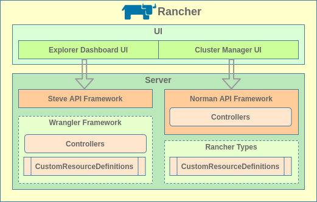

##### Norman

Norman其实只是一个用于为原生资源和自定义资源构建Rancher风格API的API框架, 包括自定义控制器和控制器注册. 而自定义资源脚手架代码是通过`rancher/types` 进行定义和自动生成的.

Norman框架在Rancher Server中有着非常重度的使用, 绝大部分的Rancher自定义资源都是以这种方式集成的. `rancher/types`生成的自定义资源部分接口和方法是为Norman而提供的特定实现, Norman本身也对原生Kubernetes API进行了封装,  以便适应前端展示的需求, 并提供单独交互的API-UI(View API功能). 这些特异性在提供良好体验的同时也存在一定的劣势:

- 扩展Rancher API非常复杂, 只有深入阅读Rancher代码或者接受了一定培训的开发人员才能做到

- Kubernetes API在不断演变, Rancher API去兼容多个版本的Kubernetes API变得越来越困难

- Rancher API屏蔽了一些高级API参数, 对于一些高级用户, 这非常不友好

- 采用其他方式开发的自定义资源和控制器难以与Norman框架集成, 在API-UI上不能显示, 也无法与传统前端进行交互

Norman框架已被标记为过时的.

##### Wrangler

Wrangler是一个SDK框架, 从上文的介绍不难看出, 它其实是让前三个步骤更加简单, 降低了自定义资源与Rancher Server的耦合性, 自定义资源和控制器的编写测试更加通用和方便. 而封装Rancher风格API的工作则是由另一个新引入的API框架**[Steve](https://github.com/rancher/steve)**与Wrangler配合完成的. Wrangler和Steve都是从V2.4实验性加入并服务于新的Dashboard前端页面(基于Vue开发)的.

###### Steve

Wrangler上文已有详细介绍, 这里重点介绍以下Steve.

Steve是Rancher开发的新的API框架, 相比与Norman, 二者提供的API风格并不相同, Norman风格API以`/v3`作为访问入口并且各种资源的path是层次递进的, 如Deployment的访问路径为`/v3/projects/<cluster-id>:<project-id>/deployments`, Steve风格API则以`v1`作为访问入口并且各种资源的path是直接在apiRoot下的, 如Deployments的访问路径:`v1/apps.deployments`. 

Steve框架的优势有:

- 完全沿用Rancher的API-UI模式, 不破坏用户的使用习惯

- 兼容Kubernetes 原生API, 包括原生资源和自定义资源, 最大程度保留其数据字段

- 扩展API非常简单, 只要向Kubernetes注册了CRD, steve通过内置controller来watch CRD资源变化, 将其热装载加入steve API中

在Rancher v2.5中提供的新的Dashboard UI就是依赖于Steve高度的兼容性才实现了对Kubernetes中所有资源的管理的. Wrangler与Steve框架的配合很明显能够让Rancher集成式CRD的开发变得更加简单. 但也存在一个问题, 这样开发的CRD难以与Rancher的传统前端进行交互(https://github.com/rancher/wrangler/issues/82).

**Steve框架本身是一个独立组件, 不需要依赖Rancher也能够独立运行. 它能够自动监听和动态发现任何Kuberenetes集群中的所有原生和自定义资源, 直接对Kubernetes集群API进行二次封装以提供更加友善的API服务.**

```bash
# 假设本地已配置好Kubeconfig, 没有Kubernetes环境的化请参考下文"独立CRD开发环境"章节运行Kubernetes集群
git clone https://github.com/rancher/steve.git
cd steve
CGO_ENABLED=0 go build -ldflags "-extldflags -static -s" -o steve
./steve 
# 然后就可以直接通过<https://127.0.0.1:9443/v1> 或 <http://127.0.0.1:9080/v1>进行API和API-UI的访问了
# 此外也可以直接使用源码中提供的Makefile生成Docker镜像通过容器的方式提供服务
# 更多启动参数参考源码
```

#### Rancher开发概述

综合以上简介内容, 关于Rancher的开发, 我们实际上需要做的就是API的集成和自定义控制器的集成. 事实上**API**和**Controller**正是Rancher Server的两大核心, API负责提供API访问服务并维护自定义资源在etcd中的持久化, Controller则负责监听自定义资源并完成相应的管理和控制逻辑. 

当然Rancher实现多集群管理并非单独依靠**Rancher Server**, 它还包括两种运行在业务集群上的Agent组件: **Cluster Agent**和**Node Agent**, Agent负责建立到Server的websocket会话连接并提供TCP代理服务, 所有的管理控制行为都是由Server的Controller完成和发起, Agent仅仅提供代理或者配置任务的执行工作.

在进行Rancher CRD集成开发之前, 有必要先了解一下Rancher的主要组件的职责及其工作模式.

##### Server

Server是Rancher容器云平台的核心, 其主要的功能包括:

1. 为用户/客户端/外部应用提供Rancher风格的API服务
2. 维护Rancher定义的自定义资源在集群Etcd中的持久化
3. 监听自定义资源并执行相应的控制逻辑
4. 向纳管集群部署资源和服务
5. 监控纳管集群并同步集群数据, 通过websocket调用Docker/Kubernetes API
6. 为平台所有集群提供统一的访问入口

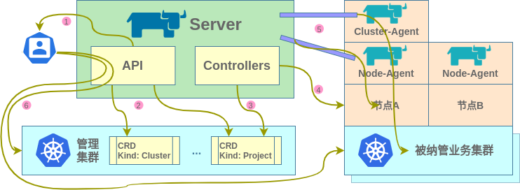

###### API

API是Rancher Server为外部提供的统一访问接口, 主要分为六大类:

- Management API: 与平台和集群管理控制相关的API, 它是Server中最重要的API, 其路径前缀为`/v3`

- Steve API: 由steve框架提供的为集群所有原生和自定义资源提供统一访问接口以及其他自定义接口的API, 主要为V2.4版以后提供的Dashboard UI提供访问, 其路径前缀为`/v1`

- Auth API: 与平台认证服务相关的API, 其路径前缀为`/v3-public`和`/v3/token`

- K8S Proxy API: Kubernetes原生API的代理, 其路径前缀为`/k8s/clusters`

- Dialer API: 为纳管集群中的Agent提供拨号连接的API, 其路径前缀为`/v3/connect`和`/v3/connect/register`

- RKE Node Config API: 从纳管集群中的Agent接收RKE节点配置数据的API, 其路径前缀为`v3/connect/config`

这些API中, 前四者是为用户和外部应用提供的, 后两者是为Rancher Agent提供的.

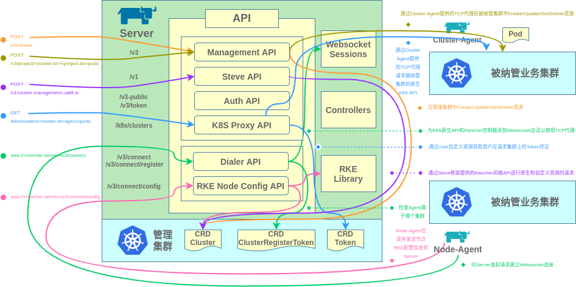

###### Controller

Controller这里指的是Rancher Server中的自定义控制器, 它们是平台管理的核心, 依功能主要分为四大类:

- API Controller:  API控制器, 监听与API服务配置(settings, dynamicschemas, nodedrivers等)相关的自定义资源并根据资源的变化配置API服务
- Management Controller: 管理控制器, 监听集群/节点相关的自定义资源并根据资源的变化进行集群的置备更新等操作, 集群置备完成后负责启动集群和工作负载相关的Controller
- Cluster Controller: 集群控制器, 又称为User Controller(被Rancher管理的下游集群相当于Rancher的用户), 监听管理集群上与纳管集群相关的自定义资源并在管理和纳管集群上进行相应自定义资源的创建和更新, 同时负责同步管理集群和纳管集群的资源信息
- Workload Controller: 工作负载控制器, 监听纳管集群上的资源并进行相应的处理, 此外根据需要创建和更新额外的资源, 主要用于扩展纳管集群本身的功能特性

每个控制器类别下都包括众多的负责具体工作的控制器, 这些控制器的触发时机是不同的, 其中API控制器和管理控制器是在Rancher Server运行时触发的, 而集群控制器和工作负载控制器是在检测到纳管集群时触发的.

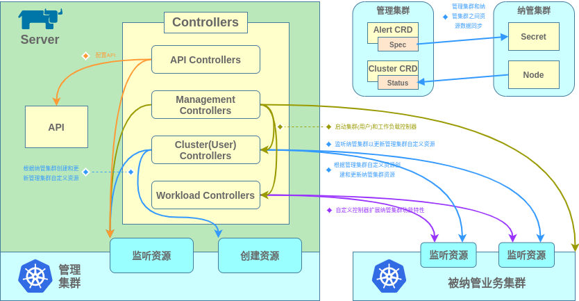

列举几种Rancher Server的自定义控制器实现:

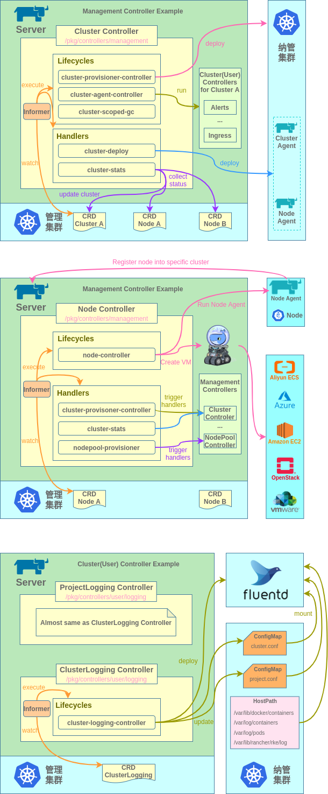

> Logging Controller中日志路径(HostPath)的说明:
>
> - /var/lib/docker/containers: docker默认的保存容器标准和错误输出的文件路径, 即日志文件路径
> - /var/log/pods: kubernetes为当前节点上的pod内的容器保存标准和错误输出的文件路径, 其中每个<container_name>目录是pod内容器的日志路径, 该路径内的日志文件是容器运行时的容器日志路径的软链接, 对于docker默认配置而言就是/var/lib/docker/containers目录下相应容器的日志文件的软链接
> - /var/log/containers: kubernetes为当前节点上的pod内的容器存标准和错误输出的文件路径, 其中每个日志文件就是/var/log/pods目录下相应<container_name>目录下日志文件的软链接
> - /var/lib/rancher/rke/log: rancher为rke组件保存容器标准和错误输出的文件路径, rke组件即kubernetes系统组件和其他的rke组件, 包括apiserver, etcd, controller-manager, kubelet, kube-proxy, nginx-proxy等

###### Context

上下文是Rancher中各种控制器的运行环境, 上下文中包括控制器, 平台管理接口, 项目管理接口, 原生资源接口, 访问控制接口, 客户端连接配置, 控制器工厂, REST映射, REST客户端等等配置信息, 服务接口和管理器. Rancher自定义控制器根据相应上下文环境的内容实现平台和集群的各种管理控制逻辑.

Rancher中的控制器运行于以下四种上下文中:

- WranglerContext: 全局上下文, Wrangler框架的自定义控制器将使用此上下文, 每一个rancher管理server上均有一个Wrangler上下文, 该上下文用于实例化steve server, dashboard控制器, 认证和审计等模块, 生成其他上下文以及rancher管理server的选主和选主后的事务性操作
- ScaledContext: 弹性上下文, ScaledContext也是在每个rancher管理server上均存在一个, 是2.5版本之前的全局上下文, 用于handler前端请求和生成managementContext和UserContext, 此外ScaledContext通常被当做APIContext用于处理API Request
- ManagementContext: 管理上下文, 管理控制器(处理任何平台全局变更的控制器)使用此上下文进行平台和rancher server master的管理, ManagementContext是具有唯一性的, 只有rancher管理server的master上会有一个管理上下文
- UserContext: 用户上下文, 用户上下文其实是集群上下文, 它存在于每一个下游集群(被平台管理的集群)上, 集群控制器(处理任何集群级别变更的控制器)使用此上下文进行集群管理

> - Rancher在 v2.5版以后代码架构发生了较大调整, 在v2.5版之前, Rancher启动时直接实例化ScaledContext和managementContext, 新集群加入后会实例化UserContext. 但v2.5版以后, Rancher启动时直接实例化WranglerContext, 在检测到features自定义资源发生变更并开启MultiClusterManager特性启用后才会根据WranglerContext实例化ScaledContext和ManagementContext.
> - Rancher Server是无状态的, 但是当多个Server并存时, 为了保证对平台管理资源的操作的一致性, 一些管理资源或者控制逻辑只能在一个Server上执行, 因此Rancher Server之间会进行选主. 选主行为在Kubernetes的系统组件之间同样存在. 选主机制是在etcd的基础上基于分布式锁实现的, 分布式锁选举是client-go封装的功能, 在Wrangler框架中作了二次封装, 它支持使用Endpoint, Configmap和Lease资源实现分布式锁, Rancher使用的是Configmap. 具体资源为kube-system命名空间下的cattle-controllers comfigmap. 目前官方推荐使用Lease资源实现分布式锁选举.
> - 除以上四种上下文外, 还有一个进程上下文context.Context, 用于管理server进程的中断和退出.

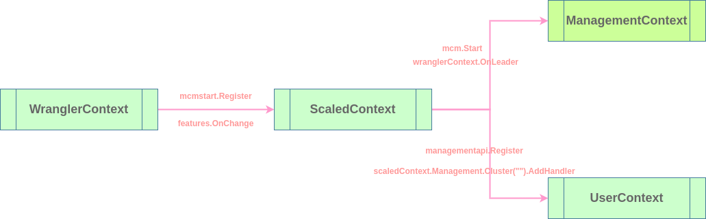

Rancher Server整体启动流程大致如下, 包括各上下文实例化, API Server服务启动, 自定义资源生成和自定义控制器启动, router路由生成等, 针对v2.5版以后, 后续源码整体架构可能还会有所变动, 仅供参考:

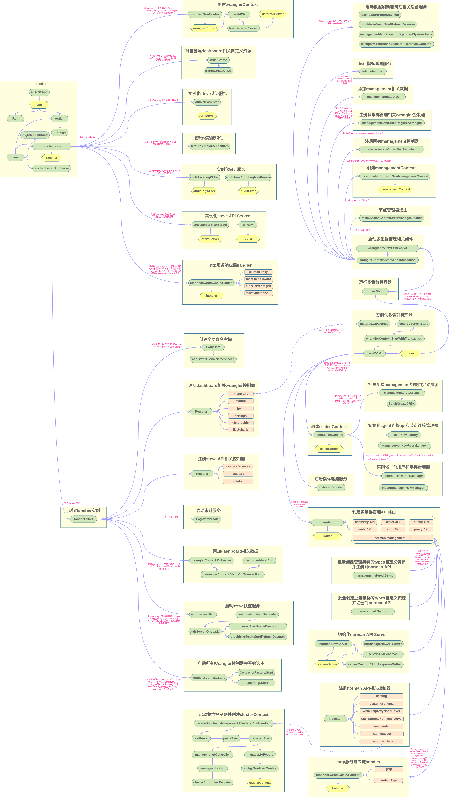

##### Agent

Rancher Agent是Rancher管理其他集群的桥梁和代理人, Agent在被纳管集群和集群节点上运行后, 会主动发起到Rancher Server的Websocket连接, 启动TCP代理服务, 同时定期收集集群和节点信息并发送到Server进行信息同步, Server通过Agent提供的Websocket连接和代理服务实现对纳管集群的API访问和集群节点控制.

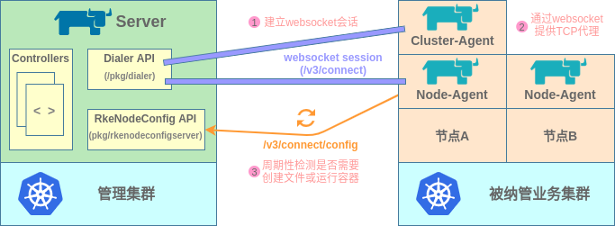

Agent分为Cluster Agent和Node Agent两种, 前者用于连接纳管集群API Server并为Rancher Server提供TCP代理调用, 以Deployment的方式运行, 默认仅运行一个实例, 后者用于在节点上执行Rancher Server发出的集群操作并周期性收集和发送集群和节点信息, 以DaemonSet的方式运行在纳管集群的每个节点上. 当Cluster Agent不可用时, Node Agent将作为后备选择用于Rancher Server到被纳管集群的API Server的连接.

##### API请求处理

Rancher Server中定义了大量的Handler用于处理HTTP请求, 有的用于与agent通信和建立websocket连接, 有的用于审计和认证, 有的用于处理对资源的请求, 有的作为Kubernetes原生API的代理等等. 这些Handler通过HTTP响应链能够对一个HTTP请求依次进行响应. Rancher同时使用了Norman和Steve两套API框架. 二者的路由和Handler关联方式会有所区别.

###### Norman API

Norman API路由是在`/pkg/multiclustermanager/routes.go`中定义的, 对于平台和集群中的资源, 包括Kubernetes内置资源和Rancher的自定义资源, Rancher会在实例化router时先进行资源的setup, 然后进行api path和handler的绑定. 资源setup主要完成两件事:

1. 自动批量创建自定义资源: 根据资源定义自动在管理集群中创建自定义资源
2. 资源handler关联: 为资源schema(资源类型+资源组版本)关联Norman API Request Handler

setup分为两种:

- managementstored.setup(): 平台管理相关的资源的setup, 这里面包括大量自定义资源在管理集群中的批量创建和handler关联
- userstored.setup(): 下游集群相关的资源的setup, 这里面包括一些主要的Kubernetes原生资源和Prometheus等附带组件的自定义资源的handler关联, 部分资源是直接通过`addProxyStore`进行代理关联, 部分资源则需要作额外处理

> 可以看到, 建立了Norman API框架的handler关联的所有资源都是写死到源码中的, 其他的所有Kubernetes原生资源或自定义资源都不支持通过Norman API进行请求.

资源handler关联后对资源的Norman API(norman api请求的前缀是/v3)请求将被路由到相应资源的Handler上, 请求会依次被**Validator**, **Store**和**Formatter**三种handler处理, 然后返回. 关联建立后会自动在Rancher前端页面和API-UI上体现, 可以通过API-UI进行开发调试.

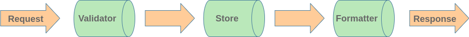

Validator, Store和Formatter用于处理API请求, 通过这三个组件可以实现校验请求, 返回错误, 转换请求, 数据持久化或编辑响应信息等操作.

- **Validator**: Validator通常用于在API请求发往Kubernetes之前检查请求的输入或者直接对请求进行拦截. Validtor仅对POST或PUT请求生效. 关联到某个资源的Validator Handler的具体逻辑代码通常放置在`/pkg/api/norman/customization/<资源名>`下.
- **Formatter**: Formatter通常用于修改或转换请求响应数据, 例如对敏感字段进行隐藏, 为响应数据转换格式等. 关联到某个资源的Formatter Handler的具体逻辑代码通常放置在`/pkg/api/norman/customization/<资源名>`下.
- **Store**: Store是对资源持久化的封装, 在Store Handler中资源会被发送到Kubernetes API Server进行持久化. 在此Handler中同样可以完成Validator和Formatter类似的功能, 但其主要作用还是通过定义增删改查方法实现资源的持久化. 关联到某个资源的Store Handler的具体逻辑代码通常放置在`/pkg/api/norman/store/<资源名>`下.

除此之外, 对于资源的API请求动作可能不仅限于create, update, delete, get, watch操作, 对某些资源可能还有诸如回滚, 升级等操作, 这些额外的操作可以通过为资源关联**ActionHandler**实现. 如果希望在资源的API-UI界面集成除增删改查外的其他link, 则可以通过为资源关联**LinkHandler**实现. 当然还可以关联诸如CollectionFormatter, InputFormatter, ListHandler, DeleteHandler等更多自定义handler, 具体可以查看`github.com/rancher/norman/types/types.go`下的Schema结构体. 这些自定义handler的具体逻辑代码通常也都放置在`/pkg/api/norman/customization/<资源名>`下.

以Rancher中的应用商店应用对应的自定义资源App为例:

```go
func App(schemas *types.Schemas, management *config.ScaledContext, kubeConfigGetter common.KubeConfigGetter) {
	schema := schemas.Schema(&projectschema.Version, projectclient.AppType)
	store := &appStore.Store{
		Store:                 schema.Store,
		Apps:                  management.Project.Apps("").Controller().Lister(),
		TemplateVersionLister: management.Management.CatalogTemplateVersions("").Controller().Lister(),
	}
	schema.Store = store
	wrapper := app.Wrapper{
		Clusters:              management.Management.Clusters(""),
		TemplateVersionClient: management.Management.CatalogTemplateVersions(""),
		TemplateVersionLister: management.Management.CatalogTemplateVersions("").Controller().Lister(),
		KubeConfigGetter:      kubeConfigGetter,
		AppGetter:             management.Project,
		UserLister:            management.Management.Users("").Controller().Lister(),
		UserManager:           management.UserManager,
	}
	schema.Formatter = app.Formatter
	schema.ActionHandler = wrapper.ActionHandler
	schema.LinkHandler = wrapper.LinkHandler
	schema.Validator = wrapper.Validator
}
```

###### Steve API

steve api框架原生提供了对集群所有原生和自定义资源的动态支持, 因此steve的API路由主要是将带`/k8s/clusters/<cluster_id>`前缀的API请求去掉前缀然后交由对应集群的steve server处理即可, 具体逻辑代码位于`pkg/api/steve/proxy/proxy.go`下.

此外steve支持通过AdditionalAPIs添加任意独立路由及其Handler. 具体逻辑代码位于`pkg/api/steve/additionalapi.go`下.

使用steve api的前提下为资源添加自定义的handler是通过将资源注册到steve时通过为steve的schema添加Template实现的, Template中指定了资源类型, 资源组和Formatter, Store等, 在Customize字段中可以添加诸如Formatter, CollectionFormatter, Action, List, Delete等各种自定义Handler. 如:

```go
func Register(ctx context.Context, server *steve.Server,
	helmop *helmop.Operations,
	contentManager *content.Manager) error {
	ops := newOperation(helmop)
	server.ClusterCache.OnAdd(ctx, ops.OnAdd)
	server.ClusterCache.OnChange(ctx, ops.OnChange)

	index := &contentDownload{
		contentManager: contentManager,
	}

	addSchemas(server, ops, index)
	return nil
}

func addSchemas(server *steve.Server, ops *operation, index http.Handler) {
	server.BaseSchemas.MustImportAndCustomize(types2.ChartUninstallAction{}, nil)
	server.BaseSchemas.MustImportAndCustomize(types2.ChartUpgradeAction{}, nil)
	server.BaseSchemas.MustImportAndCustomize(types2.ChartUpgrade{}, nil)
	server.BaseSchemas.MustImportAndCustomize(types2.ChartRollbackAction{}, nil)
	server.BaseSchemas.MustImportAndCustomize(types2.ChartInstallAction{}, nil)
	server.BaseSchemas.MustImportAndCustomize(types2.ChartInstall{}, nil)
	server.BaseSchemas.MustImportAndCustomize(types2.ChartActionOutput{}, nil)

	operationTemplate := schema2.Template{
		Group: catalog.GroupName,
		Kind:  "Operation",
		Customize: func(apiSchema *types.APISchema) {
			apiSchema.LinkHandlers = map[string]http.Handler{
				"logs": ops,
			}
			apiSchema.Formatter = func(request *types.APIRequest, resource *types.RawResource) {
				if !resource.APIObject.Data().Bool("status", "podCreated") {
					delete(resource.Links, "logs")
				}
			}
		},
	}
	releaseTemplate := schema2.Template{
		Group: catalog.GroupName,
		Kind:  "Release",
		Customize: func(apiSchema *types.APISchema) {
			apiSchema.ActionHandlers = map[string]http.Handler{
				"rollback":  ops,
				"uninstall": ops,
			}
			apiSchema.ResourceActions = map[string]schemas3.Action{
				"rollback": {
					Input:  "chartRollbackAction",
					Output: "chartActionOutput",
				},
				"uninstall": {
					Input:  "chartUninstallAction",
					Output: "chartActionOutput",
				},
			}
		},
	}
	repoTemplate := schema2.Template{
		Group: catalog.GroupName,
		Kind:  "Repo",
		Customize: func(apiSchema *types.APISchema) {
			apiSchema.ActionHandlers = map[string]http.Handler{
				"install": ops,
				"upgrade": ops,
			}
			apiSchema.ResourceActions = map[string]schemas3.Action{
				"install": {
					Input:  "chartInstallAction",
					Output: "chartActionOutput",
				},
				"upgrade": {
					Input:  "chartUpgradeAction",
					Output: "chartActionOutput",
				},
			}
			apiSchema.LinkHandlers = map[string]http.Handler{
				"index": index,
				"info":  index,
				"chart": index,
				"icon":  responsewriter.ContentType(index),
			}
		},
	}
	chartRepoTemplate := repoTemplate
	chartRepoTemplate.Kind = "ClusterRepo"

	server.SchemaFactory.AddTemplate(
		operationTemplate,
		releaseTemplate,
		repoTemplate,
		chartRepoTemplate)
}
```

##### 自定义资源与控制器


#### Norman集成开发

#### Wrangler集成开发

- iptables四表五链及顺序, iptables和netfilter的关系
- kvm主要有哪些组件, 分别是什么作用(kvm内核模块, qemu设备模拟), 与vmware的虚拟化有什么不同
- 描述公司的线上CICD自动发布的流程
- select, poll, epoll有什么区别
- 进程切换进行了哪些工作
- Linux五种IO模式(阻塞, 非阻塞, IO多路复用, 信号驱动IO, 异步IO)
- Kubernetes集群规模, 网络模式, 几种网络模式的区别, k8s相关问题

## 开发环境

### 独立CRD开发环境

独立CRD的开发相较普通的Golang项目开发, 需要一个Kubernetes集群环境来调试和验证代码. 如果没有云上集群可用, 则需要在本地搭建集群. Kubernetes集群搭建是相对麻烦而且资源消耗比较高的. 本地Kubernetes测试集群有几种可选方案, 如minikube, k3s等, 这里推荐Kubernetes兴趣小组的**[kind](https://github.com/kubernetes-sigs/kind)**项目, 即Kubernetes in Docker.

kind的最大特点是整个Kubernetes集群是运行在一个Docker容器中的, 整个集群的运行和管理只需要一个二进制文件和一个镜像文件, 部署和清理都非常方便. kind启动的集群中除了常规的Kubernetes组件外, 还部署好了网络插件和本地存储类插件, 能够覆盖大多数开发和测试需求.

此外, kind允许多节点集群部署, 还提供全平台支持, 具有很高的可定制性. 详情请查看[kind官方文档](https://kind.sigs.k8s.io/).

不同的kind版本支持的Kubernetes版本和所需kindest/node镜像也有所不同(通常镜像版本与Kubernetes版本一致), 具体查看[kind发行版页面](https://github.com/kubernetes-sigs/kind/releases), 以kind v0.9.0版为例, 其支持的Kubernetes版本包括v1.13-19的几个主要版本, 我们使用v1.17.11版, 下载镜像:

```bash
docker pull kindest/node:v1.17.11
```

kind的常用操作:

#### 创建集群

```bash
kind create cluster --name=test --config=kind.yaml  # name和config参数可省略
kind create cluster --name=test --image=kindest/node:v1.17.11 # 不指定镜像将使用最高版本kindest/node
```

#### 删除集群

```bash
kind delete cluster --name=test
```

#### 查看集群信息

```bash
kubectl cluster-info --context kind-test   # context参数可省略, kind会自动设置其启动的集群为默认上下文
```

#### 获取kind集群和节点列表

```bash
kind get clusters
kind get nodes
```

#### 管理集群节点内的镜像和容器

```bash
# kind启动的容器均是一个Kubernetes集群节点, 节点内各集群组件也是以容器的方式运行的
# 节点内容器和镜像管理使用crictl, crictl是CRI兼容的容器运行时命令行接口, 功能和使用方法与docker客户端基本相同.
docker exec -it $(kind get nodes|grep control-plane|sed -n '1p') crictl ps # 控制面节点内的容器管理
docker exec -it $(kind get nodes|grep control-plane|sed -n '1p') crictl exec -it etcd sh # 进入节点内容器交互式命令行
```

#### 复制镜像到集群节点

```bash
# kind允许直接将本地镜像复制到容器化的集群节点内供集群使用
kind load docker-image nginx:latest --name test
kind load image-archive nginx.tar --name test
# 镜像复制到节点内后会自动补全镜像名, 如nginx:latest在节点内的镜像名为docker.io/library/nginx:latest
```

#### SHELL自动完成

```bash
# bash
kind completion bash > ~/.kind-completion
source ~/.kind-completion
# zsh
kind completion zsh > /usr/local/share/zsh/site-functions/_kind
autoload -U compinit && compinit
# fish
kind completion fish > ~/.config/fish/completions/kind.fish
```

kind启动Kubernetes集群后会自动设置本地kubeconfig的默认上下文为该集群, 可以直接使用kubectl进行集群管理, client-go sdk中的client也可以自动连接集群.

### Rancher CRD开发环境

```bash
# https://lihaoquan.me/2020/3/8/k8s-crd-develop.html
# https://tangxusc.github.io/2019/05/code-generator%E4%BD%BF%E7%94%A8/

# https://developer.aliyun.com/article/719215
# https://qiankunli.github.io/2020/08/10/kubernetes_crd.html
# https://zhuanlan.zhihu.com/p/141203047
```

```makefile
go:
# embeded will run k3s server and need root privilage
	CATTLE_DEV_MODE=yes go run main.go --add-local=true --features=multi-cluster-management=true --k8s-mode=external --kubeconfig=/home/xshrim/.kube/config
#	go run -mod vendor main.go --debug --add-local=true --features=multi-cluster-management=true --k8s-mode=embedded
#	export http_proxy=http://127.0.0.1:38080
#	export https_proxy=http://127.0.0.1:38080
#	no_proxy=localhost,127.0.0.1
```