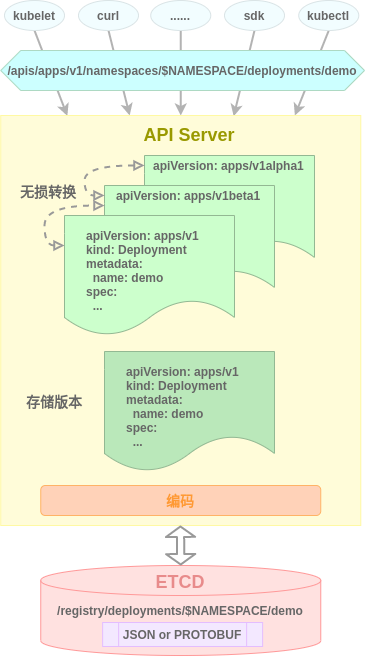

# 云原生系列 之 自定义控制器开发(一)

## 引言

Kubernetes能够成为容器编排领域的事实标准的一个非常重要的原因就是它具有极强的扩展性, 高度的可扩展性在丰富其功能特性的同时, 吸引了大量国内外厂商和个人围绕着Kubernetes的可扩展特性开发出极富创造性的云上产品, 各显其能, 各得其利, 人人都有机会从迅速做大的云原生蛋糕中分得一杯羹, 云原生生态也因之空前繁荣.

Kubernetes原生提供了两种扩展方式: **API Server聚合(API Aggregation)**和**自定义资源定义(CustomResourceDefinition)**, 其中前者是开发单独的API Server并通过内置的聚合层与原生API Server聚合形成统一的API视图, 这种方式灵活性极高, 但开发难度大. 后者则是直接通过API Server内置的自定义资源与控制器支持对API Server本身进行扩展, 在保证足够的灵活性的同时降低了开发运维难度. 

自定义资源定义(CRD)是业内普遍采用的扩展方式, 大至Rancher, OpenShift, ACP等容器云平台, 小到Prometheus-Operator, ElasticSearch-Operator等厂商产品集群的自动化管理服务; 从存储编排引擎Rook到虚拟机管理系统VM-Operator, CRD扩展方式在各个领域都有着丰富的应用.

CRD开发无疑是Kubernetes的一个重要主题, 从本篇开始, 我们将使用一个系列的篇幅对其进行深入介绍, 由于CRD开发的主要工作是自定义控制器的开发, 因此我们将本系列主题命名为<自定义控制器开发>. 在本主题中我们将首先介绍自定义资源与控制器的实现原理, 然后分别详细讲解手动和脚手架两种自定义控制器开发方式, 最后介绍流行的容器云平台Rancher的开发知识以及如何将自定义控制器集成到Rancher Server中.

本期我们主要介绍自定义资源与控制器.

## 资源与控制器

### 资源

在Kubernetes中, 所有可被管理的对象都被抽象为**资源**, 如节点, 存储, 网络策略, 工作负载, 配置信息, 命名空间, 事件, 用户角色, 网络出入口等等都是资源. 资源会按照用途或关联度被划分为不同的分组.

资源分为**集群**和**命名空间**两个级别, 集群级资源可以作用于所有命名空间. 所有资源的信息都是以json或yaml格式的资源清单的形式呈现的. 资源清单中描述的资源信息会由apiserver经转换后以json或protobuf的结构持久化存储到etcd数据库中.

所有资源都可以通过统一的REST API进行声明式管理, 即只要通过API将资源清单传递到apiserver, Kubernetes将自动维护该资源在清单中指定的状态. 

Kubernetes是以API Group的方式组织各种资源的API的, **API群组**是一组相关API对象的集合, 如Deployment, DaemonSet, StatefulSet等资源的API就属于apps组, Role, RoleBindings, ClusterRoleBindings等资源的API就属于rbac.authorization.k8s.io组. 此外由于最初并未考虑资源分组, 因此一些核心资源如node, pod, service等属于core组并可省略组名. API群组的概念使得API的管理和扩展变得更为方便.

每一个API群组都可以存在多个版本, 基于稳定性的差异, 每个版本又可以细分**Alpha**, **Beta**和**Stable**三个级别. 资源API的多版本是在群组层面统一定义的, 所有版本在一个Kubernetes集群中是可以通过apiserver的无损转换机制并存使用的.

对于API而言, 通过**GVR三元组(API Group, API  Version和Resource)**就可以唯一定位某个资源的API路径, 如: `/apis/rbac.authorization.k8s.io/v1beta1/clusterroles`. 而在我们熟悉的资源清单文件中, 则是对应通过**GVK三元组(API Group, API Version和Kind)**进行资源区分的. 如: `{"apiVersion": "apps/v1"，"kind": "Deployment"}`.



### 控制器

资源是数据, 而处理资源的逻辑就是控制器, Kubernetes是基于控制器模式设计的, 所有资源的生命周期由apiserver管理, 而资源所代表的实际含义则是由对应的控制器完成解释的. 系统组件kube-controller-manager中内置了大量的控制器用于对各种原生资源类型的逻辑处理 , 如Pod控制器, Endpoint控制器, Namespace控制器, Serviceaccount控制器等.

每个控制器内部都包含两个核心组件: **Informer/SharedInformer**和**Workqueue**, Informer或SharedInformer负责监听Kubernetes中资源对象的状态变化并缓存资源, 同时将状态变化事件(create, update, delete)通过ResourceEventHandler发送到Workqueue中, 然后由控制器中的Worker从Workqueue中取出事件交由具体的处理逻辑进行处理.


#### Informer

控制器监控资源状态需要向apiserver发送查询请求以获取相应资源全部对象的详细信息, 大量控制器对apiserver的频繁请求会对apiserver产生较大压力, 因此控制器普遍采用本地cache缓存机制实现对资源的监听和同步缓存, 具体流程如下:

1. **Reflector反射器**通过Liste/Watche机制获取监听资源的变化, 然后将变化的资源对象添加到**Delta FIFO队列**
2. **Informer通知器**从Delta FIFO队列中取出变化的对象, 将其传递到**Indexer索引器**
3. **Index索引器**为资源对象构建索引, 然后将资源数据存储到线程安全的**Key-Value本地存储**

> 当同一种资源被多个控制器监听时, 可以通过**SharedInformer**进行统一监听和缓存, 以节省监听和缓存开销.

#### Workqueue

控制器除了监听资源变化并缓存资源对象到本地之外, 还需要针对资源变化作出响应. 被监听资源对象的变化以**事件**的方式被存储到**Workqueue工作队列**中等待被处理,  事件是动作(create, update, delete)和资源对象key的组合.  具体流程如下:

1. **Informer通知器**将变化的资源传递到Indexer索引器的同时, 还会通过**ResourceEventHandler资源事件处理函数**将事件动作和资源对象key发送到**Workqueue工作队列**
2. **Worker**从Workqueue中取出事件, 根据资源对象key从**Key-Value本地存储**中获取资源对象详细数据, 然后根据事件中的动作决定对该资源对象具体的处理逻辑
3. **Worker**将处理结果通过**Client客户端**调用**APIServer**写入Kubernetes.

控制器的所有功能组件中, **Informer**(包含**Lister/Watcher**, **Reflector**, **Local Store**),**Workqueue**和**Client**都是Kubernetes的原生SDK**client-go**默认提供的, 仅**ResourceEventHandler**和**Worker**是需要开发者根据具体需求自行开发实现的.

关于client-go sdk的源码分析可参考[charlieroro博客文章](https://www.cnblogs.com/charlieroro/p/10330390.html).

## 自定义资源与控制器

除了内置的资源和控制器外, Kubernetes还原生支持自定义资源和控制器以扩展Kubernetes的功能. 

### 自定义资源

#### 自定义资源类型

Kubernetes内置了一种称为**CustomResourceDefinition**的资源类型, 通过自定义资源定义类型可以直接在Kubernetes中定义新的资源类型. 自定义的资源类型必须属于一个与已有群组不同的新群组, 新群组内可以有人员数量的自定义资源类型, 并且这些资源类型可以与其他群组中的资源类型重名. 自定义资源类型的生命周期和原生资源类型一样由apiserver管理, 二者地位相同, 在API访问, 数据持久化等各种管理方式上也是一样的.

自定义资源是通过CustomResourceDefinition资源清单的方式声明的, 典型的格式如下:

```yaml
# apps-crd.yaml
apiVersion: apiextensions.k8s.io/v1beta1
kind: CustomResourceDefinition
metadata:
  name: apps.demo.k8s.io
spec:
  group: demo.k8s.io
  versions: 
  - name: v1
    served: true
    storage: true
  scope: Namespaced
  names:
    kind: App
    plural: apps
```

各字段解释:

- apiVersion: 固定字段, 表示`CustomResourceDefinition`这一内建资源所在的群组及当前使用的api版本
- kind: 固定字段，表示是在声明自定义资源类型
- metadata.name: 自定义资源类型的全名，它由spec.group和spec.names.plural字段组合而成
- spec.group: 自定义资源类型所在群组
- spec.scope: 表示自定义资源对象的作用范围，Namespaced或Cluster. 自定义资源类型本身是Cluster的.
- spec.versions[].name: 自定义资源类型的群组版本
- spec.versions[].served: 自定义资源类型的该群组版本是否启用, 多个版本可以同时启用
- spec.versions[].storage: 自定义资源类型的该群组版本是否持久化到etcd(即存储版本), 仅一个版本可持久化
- spec.names.kind: 自定义资源的类型，惯例首字母大写
- spec.names.plural: 其值通常为kind的全小写复数，关系到自定义资源在REST API中的HTTP路径

spec.names中还有许多其他字段, 不指定则会由API Server在创建自定义资源类型时自动填充.

spec.versions字段可以指定资源的多个版本, 在每个版本中可以通过**OpenAPI V3**规范定义schema, 在schema中可以指定该资源类型的具体字段结构和描述信息. 但这不是强制的.

自定义资源类型声明完成后就可以通过`kubectl create -f apps-crd.yaml`或`kubectl apply -f apps-crd.yaml`命令进行创建了, 创建完成后可通过`kubectl get crd apps.demo.k8s.io -o yaml`命令进行查看.

自定义资源类型创建完成后, 其REST API的HTTP访问路径为`/apis/apiextensions.k8s.io/v1beta1/customresourcedefinitions/apps.demo.k8s.io`. 

> 可以通过kubectl的proxy命令开启本机到api server的反向代理(kubeconfig需要事先配置好), 方便测试.
>
> ```bash
> kubectl proxy --port 1111
> curl http://127.0.0.1:1111/apis/apiextensions.k8s.io/v1beta1/customresourcedefinitions/apps.demo.k8s.io
> ```

#### 自定义资源对象

自定义资源类型定义时只需要提供资源类型的元数据信息, 并不需要对资源的具体结构作出强制定义(当然也可以通过schema字段进行指定), 创建自定义资源的对象时可以随意指定其具体结构, 如:

```yaml
# app.yaml
apiVersion: demo.k8s.io/v1
kind: App
metadata:
  name: test
  namespace: default
spec:
  deploymentName: "webserver"
  appName: "nginx"
  replicas: 1
  image: "nginx:latest"
```

自定义资源spec下的字段只有在被特定控制器或应用按照约定的规范读取解析和处理后才具有实际意义.

自定义资源声明完成后就可以通过`kubectl create -f app.yaml`或`kubectl apply -f app.yaml`命令进行创建了, 创建完成后可通过`kubectl get apps.demo.k8s.io -o yaml`命令进行查看.

自定义资源创建完成后, 其REST API的HTTP访问路径为`/apis/demo.k8s.io/v1/namespaces/default/apps/test`(以default命名空间为例).

### 自定义控制器

自定义控制器与内置控制器的工作机制相同, 都可以通过对Kubernetes资源的监听并进行特定的逻辑处理完成对定制化需求的实现. 自定义控制器既能监听原生资源类型也能监听自定义资源类型. 与内置控制器不同的是, 自定义控制器通常是以单独容器的形式运行的. 自定义控制器能够极大丰富Kubernetes的功能特性.

自定义资源与控制器的组合可以认为是一种Kubernetes应用, 由于CoreOS推出的流行的Kubernetes应用开发框架的名称为**Operator Framework**, 因此自定义资源与控制器又被称为**Operator**. 自定义资源的声明和生命周期是由Kubernetes apiserver直接管理的, 因此Operator的开发实际上是自定义控制器的开发.

自定义控制器的开发主要包含以下内容:

- 初始化项目结构
- 定义自定义资源
- 编写自定义资源相关API
- 初始化自定义控制器
- 注册自定义资源
- 编写自定义控制器业务逻辑代码

其中只有**自定义资源定义**和**自定义控制器逻辑**代码是需要针对具体需求进行开发的(前者只是为了供后者调用).

**自定义资源相关API**通常是根据自定义资源定义和相关tag由Kubernetes官方提供的**code-generator**自动生成的, code-generator能够提供自定义资源的`deepcopy`, `clientset`, `informer`和`lister`的代码的自动生成.

**项目结构**, **自定义控制器初始化**和**自定义资源注册**由于是比较通用的结构和代码, 因此通常由一些脚手架工具自动生成. 典型的脚手架是CoreOS的**Operator Framwork**和Kubernetes兴趣小组的**Kubebuilder**. 当然这些脚手架工具还提供一些诸如自定义资源生命周期管理, Webhook集成等其他功能.

下期将详细介绍如何通过手动构建的方式进行自定义控制器的开发.